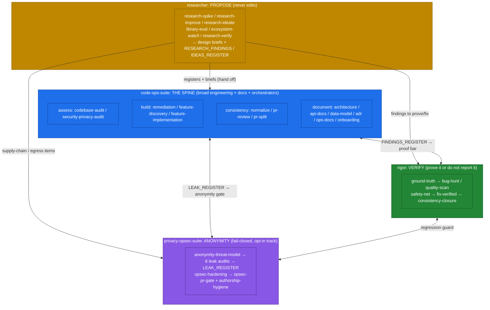
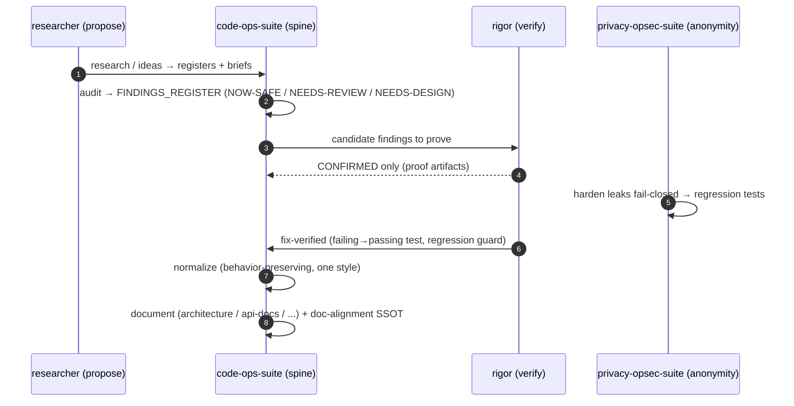

# The Four-Plugin Mental Model

> Part of the [code-ops handbook](README.md). See also [Getting started](01-getting-started.md) and [Orchestrators](03-orchestrators.md).

## Executive summary (stop here if you only need orientation)

The [code-ops marketplace](../../../.claude-plugin/marketplace.json) ships **four plugins**. They are separate installs with distinct methodologies, but they share one backbone and chain into one workflow. Learn them by their role:

| Plugin | Role word | One-line job | Edits code? |
|---|---|---|---|
| `code-ops-suite` | **the spine** | broad-breadth engineering for any repo, plus the reference-doc generators and the orchestrators | yes |
| `rigor` | **verify** | prove it or do not report it: proven bugs, validated tests, enforced quality | yes |
| `privacy-opsec-suite` | **anonymity** | keep your system's users unlinkable, find and fix leaks, fail closed | yes |
| `researcher` | **propose** | code-grounded research, proposing registers and design briefs, then handing off | **no** |

The spine does the broad work, and the other three compose **around** it. `rigor` raises the proof bar. `privacy-opsec-suite` adds the anonymity track, only when a project has anonymity needs. `researcher` feeds proposals in from external knowledge. The typical end-to-end flow is:

```
research / audit  →  prove  →  harden  →  fix  →  normalize  →  document
   (propose)        (verify)  (anonymity)         (spine)
```

All four obey the same shared backbone: **developer-in-the-loop**, **evidence at `file:line`**, **behavior preservation by default**, **registers as the single source of truth** (stamped `Verified-at <sha>`, kept fresh by `revalidate-register.mjs`), and the **gated, auto-safe, and auto-all** automation ladder with always-gated categories (security and auth, secrets, data migrations, public contracts, destructive operations).

One more rule joins that backbone at the point where a skill writes code. The **code-economy ladder** orders the objective (correctness and the safety floor, module boundaries, measured performance, readability, then size) and makes a change climb six rungs before new code is written. It is pinned byte-identically across the code-ops-suite, rigor, and privacy-opsec-suite conventions, so all three write code to one rule. Its mechanical floor is `co scan overbuild --git <range>`, which is advisory except on an unrecorded dependency.

If you read nothing else, read the diagram below and the [glossary](#glossary).

---

## The model in depth

### The spine: `code-ops-suite`

`code-ops-suite` ([README](../../../plugins/code-ops-suite/README.md)) is the broad-breadth engineering layer for any codebase. It is the spine because two other things hang off it: the **reference-doc generators** and the **orchestrators** that drive cross-plugin workflows. It carries **34 skills**, grouped by intent:

- **Assess**: `codebase-audit` (broad multi-lens review, writing `FINDINGS_REGISTER.md`) and `security-privacy-audit` (STRIDE and LINDDUN threat assessment, writing `THREAT_MODEL.md`).
- **Build**: `remediation` (implements the findings backlog), `feature-discovery` (finds and specs grounded features), `feature-implementation` (builds the smallest valuable slice behind flags).
- **Deep-dives**: `performance` (measure, optimize the proven-hot, prove with before-and-after numbers), `test-hardening` (meaningful, deterministic coverage), `dependency-upgrade` (safe, staged upgrades and CVE remediation).
- **Gate and consistency**: `pr-review` (rigorous pre-merge review), `normalize` (one consistent professional style repo-wide, behavior-preserving), `pr-split` (carve a big branch into a clean stack of small green PRs, composing `privacy-opsec-suite:authorship-hygiene`, fail-closed), `local-review-gate` (the opt-in local deep-review and opsec gate with exact-SHA receipts).
- **Docs and knowledge**: `adopt-standards` and `adopt-global-standards` (maintain repo and user contracts), `doc-alignment` (reconcile doc drift), `repo-docs` (refresh the manifest-owned hub), `onboarding` (verified orientation), `current-docs` (version-accurate dependency docs), `handoff` (capture or resume verifiable run state), `atlas` (durable judgment cache), `vault` (create, migrate, or check the documentation vault), and `conform` (assess and repair the complete standard).
- **Documentation generators** (Mode: DOCUMENT): `architecture`, `api-docs`, `data-model`, `adr`, `ops-docs`.
- **Meta and suite self-audit**: `calibration-run` (standardized real-scale calibration, one-way sanitized channel), `run-cost-audit` (audits a completed run's cost discipline), `provider-parity-audit` (audits the suite's own prose for provider-specific assumptions).
- **Orchestrators**: `full-sweep` (the whole suite end to end, intra-plugin), `everything` (the cross-plugin superset across all three engineering and anonymity plugins), `ship` (one change at full rigor), `debug` (symptom to proven root-cause fix).

It fans work out to two bundled subagents: `explorer` (read-only, parallel investigation) and `reviewer` (strong-tier, parallel review). Neither ever edits.

### The verification layer: `rigor`

`rigor` ([README](../../../plugins/rigor/README.md)) is the high-signal counterpart to `code-ops-suite` breadth. Its rule is **prove it or do not report it, measure it or do not claim it, close it so it cannot come back.** Where an audit *asserts* findings and samples, `rigor` trades breadth and speed for signal and proof. Its distinctive machinery is defined in [`rigor/CONVENTIONS.md`](../../../plugins/rigor/CONVENTIONS.md):

- **Evidence tiers and triangulation**: `CONFIRMED` (reproduced), `PROBABLE` (two or more independent static-evidence lines), `SPECULATIVE` (a lead). Only CONFIRMED drives an automated fix, and tier inflation is the cardinal sin.
- **Mandatory disconfirmation pass**: before reporting, actively try to *kill* each finding. Is it reachable? Is it handled elsewhere? Is it intentional? Is it already tested?
- **Ground truth first**: run the real toolchain (build and typecheck, lint, tests and coverage, static analysis) and treat the result as fact. Model findings reconcile against it.
- **Proof artifacts, not assertions**: a CONFIRMED bug ships a runnable repro, a fix ships a regression test that **fails before and passes after**, and an improvement shows a **before-and-after measurement**.
- **Closure with enforcement**: an inconsistency gets one canonical form, every site migrated, and a lint rule or test so the divergence cannot silently return.

It carries **11 skills**: `ground-truth`, `test-suite-audit`, `safety-net`, `bug-hunt` (the flagship), `regression-hunt`, `quality-scan`, `consistency-closure`, `improve-measured`, `fix-verified`, `deep-review`, and the `rigor-sweep` orchestrator. Its subagents are `tracer` (traces a path or derives invariants, never executes) and `verifier` (writes and runs a minimal repro to confirm or kill a candidate, which is the reason `CONFIRMED` means something).

The pairing is direct. `rigor:bug-hunt` is the proven-bug counterpart to `code-ops-suite:codebase-audit`. `rigor:deep-review` is the verification-bar counterpart to `code-ops-suite:pr-review`.

### The anonymity track: `privacy-opsec-suite`

`privacy-opsec-suite` ([README](../../../plugins/privacy-opsec-suite/README.md)) is the specialization for systems with **anonymity and opsec needs**. Not every project has them, which is exactly why it is a separate install. Its stance is defensive privacy engineering: protect your system's *own users'* anonymity, anonymous by default, and **fail closed**. Every skill treats the anonymity and opsec model ([`CONVENTIONS.md` §A](../../../plugins/privacy-opsec-suite/CONVENTIONS.md)) as the central, non-negotiable constraint.

The track has a clear shape: a keystone model, six parallel leak audits, a single backlog, the hardening pass, and the gates.

- **Keystone**: `anonymity-threat-model` maps how a user could be deanonymized (adversaries, assets, deanonymization paths, residual risk).
- **Six parallel leak audits**: `anon-session-audit`, `tor-egress-audit`, `metadata-leak-audit`, `fingerprint-resistance`, `traffic-analysis-resistance`, `supply-chain-trust`.
- **Backlog**: all of the above feed `LEAK_REGISTER.md`, with stable IDs such as `EGRESS-003`.
- **Harden**: `opsec-hardening` implements the fixes fail-closed, and each leak gets a regression test that fails if it returns.
- **Gates**: `opsec-pr-gate` blocks any change adding egress, logging, identifiers, fingerprint surface, correlation, or weakened defaults. `authorship-hygiene` removes AI and tooling trace before publish (bundled `scan-ai-tells.mjs`, fail-closed).

It carries **14 skills** in total, the above plus `privacy-feature-design`, `leak-incident-response`, `privacy-doc-alignment`, and the `full-sweep` orchestrator. Its subagents are `explorer` and `privacy-reviewer`, which flags anonymity regressions as blocking. It pairs with `code-ops-suite` for the broad work and supplies the anonymity specialization on top.

### The proposal layer: `researcher`

`researcher` ([README](../../../plugins/researcher/README.md)) brings **external** knowledge (best practices, library capabilities, prior art, pitfalls) and grounds it in *your* code. Its defining constraint: it **proposes, and it never edits source.** Its terminal output is always a register or a brief, concrete enough for the named implementer to act without re-researching.

It is local-first and honest about egress ([`CONVENTIONS.md` §A](../../../plugins/researcher/CONVENTIONS.md)). Default sources are local: the codebase, VCS history, installed-dependency docs, and materials you hand it. **Web retrieval is explicit opt-in per run**, with a checkpoint before any request. Every external request is recorded in `EGRESS_MANIFEST.md` via `research-manifest.mjs record`. The manifest is a **fail-closed gate**, because `research-manifest.mjs validate <artifact>` fails the build if a published artifact cites a web source not in the manifest, or an egress lacks a manifest entry. Every claim is cited and tiered.

It carries **7 skills**: `research-spike` (cited design brief), `research-improve` (writing `RESEARCH_FINDINGS.md`), `research-ideate` (writing `IDEAS_REGISTER.md`), `ecosystem-watch` (schedulable dependency, CVE, and deprecation watch), `research-verify` (adversarial claim-check that gates the others), `library-eval` (deciding whether to adopt something), and the `research-sweep` orchestrator. Its hand-offs go to the other three plugins, because it never builds.

---

## How the four compose



**Legend.** Blue is the spine (`code-ops-suite`). Green is verification (`rigor`). Purple is anonymity (`privacy-opsec-suite`). Gold is proposal (`researcher`). Solid arrows from `researcher` are one-way hand-offs, because it never edits. Double arrows are the register-mediated exchange between the spine and the layers that raise its bar.

### The typical flow, in order

The same flow the orchestrators drive (see [Orchestrators](03-orchestrators.md)) reads as a sequence of role hand-offs:



Read as words: **research or audit, then prove, then harden, then fix, then normalize, then document.** Proposal feeds the spine. The spine assesses. `rigor` proves, so only CONFIRMED items drive fixes. `privacy-opsec-suite` hardens anonymity fail-closed. The fix lands with a regression guard. `normalize` makes one consistent style without changing behavior. The doc generators plus `doc-alignment` leave a true single source of truth.

---

## Why four plugins, not one

Two reasons, both deliberate.

1. **Separable install.** Anonymity is a specialization most repos do not need, so `privacy-opsec-suite` is its own install rather than dead weight in every project. `researcher` adds an egress posture and a "never edits source" guarantee that not every team wants in the loop. `rigor` is the slower, more expensive, higher-signal path you reach for when you want *proven* bugs rather than a long list, so keeping it separate means you opt into that cost explicitly. You install only the layers your work calls for. The orchestrators state their requirements: `everything` requires `rigor` and `privacy-opsec-suite` installed, and `ship` and `debug` require `rigor`.

2. **Distinct methodologies.** Each plugin's `CONVENTIONS.md` encodes a different discipline. `code-ops-suite` optimizes for **breadth across lenses**. `rigor` optimizes for **proof and enforced closure**. `privacy-opsec-suite` optimizes for **fail-closed anonymity** as a non-negotiable constraint. `researcher` optimizes for **cited, local-first, disconfirmed proposals with disclosed egress**. Folding them into one plugin would blur four sharp rules into one fuzzy one. Keeping them separate lets each be opinionated.

What keeps four plugins from becoming four silos is the **shared backbone** every one of them obeys: developer-in-the-loop, evidence at `file:line`, behavior preservation by default, registers as the SSOT (stamped `Verified-at <sha>`, freshness-checked by `revalidate-register.mjs`), the gated, auto-safe, and auto-all automation ladder with the always-gated categories, and the code-economy ladder that governs every line any of them writes. Because the backbone is shared, a finding raised by one plugin is legible to the next, and the registers hand off cleanly across the flow.

---

## Glossary

Each term is defined once here and used consistently across the handbook.

- **Register**: a live backlog file with stable per-item IDs (for example `PERF-007`, `EGRESS-003`, `RSCH-007`, `IDEA-012`) that traces an item from discovery, to register, to commit or PR, to log. Examples are `FINDINGS_REGISTER.md`, `LEAK_REGISTER.md`, `RESEARCH_FINDINGS.md`, and `IDEAS_REGISTER.md`.
- **SSOT (single source of truth)**: the rule that registers and authoritative reference docs are the one place a fact lives. Discovery and audit skills write the register. Implementation skills update it as items ship, instead of duplicating status elsewhere.
- **Evidence tier**: the honesty label on a finding. **CONFIRMED** means reproduced by a failing test, runnable repro, or executed trace on the current code. **PROBABLE** means strong static evidence, two or more independent lines, not executed. **SPECULATIVE** means a single weak signal or lead. Only CONFIRMED items drive an automated fix, and when unsure between tiers, pick the lower one.
- **Disconfirmation (pass)**: the mandatory step of trying to *kill* a candidate before believing it. Is the path reachable, already handled by a caller, wrapper, framework, or type, intentional, or already tested, and is the `file:line` exactly right? Only survivors are reported. It is the primary defense against false positives.
- **Fail-closed**: on failure, stop rather than degrade. In `privacy-opsec-suite`, a proxy, route, or circuit failure must never fall back to clearnet or a less-anonymous path. In `researcher`, the egress manifest is a fail-closed gate, so an un-manifested external claim or an unrecorded egress fails the check.
- **NOW-SAFE, NEEDS-REVIEW, NEEDS-DESIGN**: the three finding and fix tracks. **NOW-SAFE** means self-contained, local, behavior-preserving, test-covered, and trivially revertible, so it is safe to apply per mode. **NEEDS-REVIEW** means real but behavior-changing, contract-changing, schema-changing, or risky, so document it with a recommendation and do not apply it unilaterally. **NEEDS-DESIGN** means architectural or cross-cutting, so document it as a proposal with options and trade-offs.
- **Verified-at**: the commit SHA an item was last confirmed against, stamped on every register entry. Re-validate before writing, carrying forward, or acting on an item. Anything that no longer holds is dropped or re-tiered, marked `OBSOLETE-AT <sha>`. The mechanical check is `node ${CLAUDE_PLUGIN_ROOT}/scripts/revalidate-register.mjs <register> --root <repo>`, which reports FRESH, MOVED, DRIFTED, GONE, AMBIGUOUS, or NO-REF. DRIFTED fires when a cited line no longer contains the item's delimited `Anchor:` substring. AMBIGUOUS fires when the literal path is gone but more than one file matches its name, or a ref escapes the root. See [Registers and freshness](04-registers-and-freshness.md).
- **Automation level**: set once at the start, governing every code-changing step. **`gated`** is the default and pauses for approval at each fix or closure batch. **`auto-safe`** is the recommended ceiling and auto-applies only NOW-SAFE items, each branched, test-backed, and revertible, pausing for the rest. **`auto-all`** is not recommended. **Always gated regardless of level:** security and auth changes, secret handling, data migrations or destructive operations, and public API and contract changes. Never auto-merge, because even auto-applied fixes land as commits or PRs for review. See [Choosing an automation level](../Techniques/choosing-an-automation-level.md).
- **Code-economy ladder**: the ordered objective (correctness and the safety floor, module boundaries, measured performance, readability, then size) and the six rungs a change climbs before new code is written. A deliberate simplification is marked `deferred(<ceiling>, <upgrade path>)` in a comment, and `co scan deferrals` collects those markers into `DEFERRALS_REGISTER.md`. See [12-context-and-code-economy.md](12-context-and-code-economy.md).

---

*Verified-at: b0ffede*
