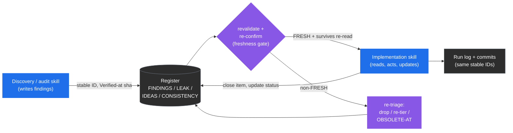
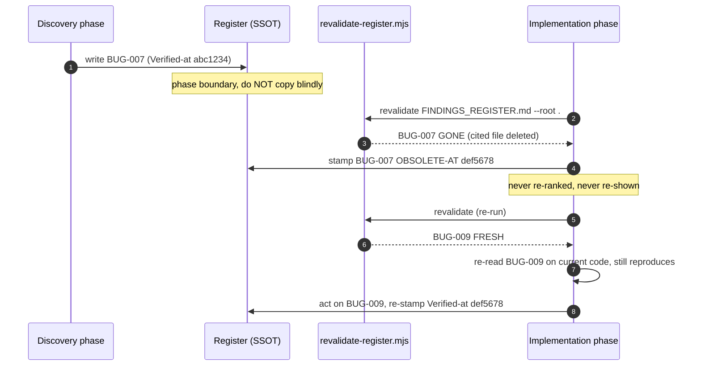

# Registers and Freshness

> Part of the [code-ops handbook](README.md). Companion technique: [reading-a-findings-register](../Techniques/reading-a-findings-register.md).

## Exec summary (stop here if you only need the shape)

A **register** is the single source of truth (SSOT) for a run. It is a live, plain-Markdown backlog of findings, leaks, ideas, or inconsistencies, with one stable ID per item, every item cited at `file:line`, and every item stamped with the commit it was last confirmed against. Skills write registers, later phases and later skills read them, and nothing acts on an item without re-confirming it first.

The whole apparatus exists to defeat one specific, proven failure mode: **a register re-listing an item that was already fixed in code.** A stale finding gets re-ranked, re-shown, and worked a second time, which wastes effort and erodes trust in the register. Three mechanisms prevent that failure:

1. **Stable IDs** (`BUG-007`, `SEC-003`, `FEAT-012`) so one item is traceable from discovery, to register, to commit, to log, and so two phases can talk about the same thing.
2. **`Verified-at: <sha>`** on every entry, naming the commit the item was last confirmed on. When it no longer equals `HEAD`, the item is suspect.
3. **`revalidate-register.mjs`**, a mechanical floor that re-greps every cited `file:line` against the *current* tree, re-checks each item's verbatim `Anchor:` substring when it carries one, and labels each item `FRESH`, `MOVED`, `DRIFTED`, `GONE`, `AMBIGUOUS`, or `NO-REF`. Anything non-`FRESH` is re-triaged, never silently re-shown.

The standard registers, one per plugin lens:

| Register | Plugin | Schema source | Holds |
| --- | --- | --- | --- |
| `FINDINGS_REGISTER.md` | code-ops-suite, rigor | [code-ops CONVENTIONS §7](../../../plugins/code-ops-suite/CONVENTIONS.md) and [rigor §6](../../../plugins/rigor/CONVENTIONS.md) | Audit, review, and bug findings |
| `CONSISTENCY_REGISTER.md` | rigor | [rigor CONVENTIONS §6, §9](../../../plugins/rigor/CONVENTIONS.md) | Variants of one concept to be closed to a canonical form |
| `LEAK_REGISTER.md` | privacy-opsec-suite | [privacy CONVENTIONS §6](../../../plugins/privacy-opsec-suite/CONVENTIONS.md) | Anonymity and leak findings |
| `RESEARCH_FINDINGS.md` | researcher | [researcher CONVENTIONS §6](../../../plugins/researcher/CONVENTIONS.md) | Code-grounded research claims (`RSCH-NNN`) |
| `IDEAS_REGISTER.md` | researcher | [researcher CONVENTIONS §6](../../../plugins/researcher/CONVENTIONS.md) | Proposed features and ideas (`IDEA-NNN`) |
| `DEFERRALS_REGISTER.md` | code-ops-suite | `scripts/harvest-deferrals.mjs` | Recorded deliberate simplifications (`DEF-nnnnnn`) |
| `EGRESS_MANIFEST.md` | researcher | [researcher CONVENTIONS §A](../../../plugins/researcher/CONVENTIONS.md) | Every disclosed external request (not a finding register, see below) |

Every actionable item also carries a **track**, either `NOW-SAFE`, `NEEDS-REVIEW`, or `NEEDS-DESIGN`, which tells the next skill what it may do with the item without asking.

If you read nothing else: **a register is only as trustworthy as its last revalidation.** Carry-forward is re-validation, not copy-paste.

---

## 1 · Register-as-SSOT, in practice

All four plugins share the same backbone, and their `CONVENTIONS.md` files state it nearly verbatim (code-ops §12, rigor §10, privacy §11, researcher §12):

- **Registers are live backlogs and the SSOT.** Discovery and audit skills *write* them. Implementation skills *update* them as items ship. There is no second copy of the truth, because the register *is* the work graph.
- **Stable IDs across the lifecycle.** An item keeps its ID from the moment it is discovered, through the register, the commit that fixes it, and the run log. `PERF-007` is the same thing everywhere it appears. That stability is what lets `full-sweep` hand a finding from its audit phase to its remediation phase, and lets a commit message reference exactly what it closed.
- **Registers live in a dated run folder** under the repo's docs location, `docs/<area>/<date>/` (for example `docs/rigor/<date>/` or `docs/privacy/<date>/`), or at repo root if the repo has no docs convention. In a repo that carries a `<repo>-docs/` Obsidian vault ([vault standard](../Techniques/vault-standard.md)), they go to the vault's `80 Runs/YYYY-MM-DD slug/` instead, keeping the same filenames. Authoritative reference docs (threat models, privacy promises, architecture docs) are SSOT in the repo's existing docs location and reconciled in place, while registers are run artifacts.
- **Registers stay fresh.** Before a finding is written, re-presented across a phase boundary, or consumed by an implementation skill, it is re-confirmed against the current tree. That rule is what the rest of this chapter operationalizes.



Legend: blue writes the register, purple is a gate or status change, and gray is a read or terminal node. The loop is the point, because every arrow into an implementation skill passes through the freshness gate.

---

## 2 · The Finding schema

A register entry is a structured block, not a paragraph. The canonical **Finding** schema (code-ops [CONVENTIONS §7](../../../plugins/code-ops-suite/CONVENTIONS.md)) is:

```
ID · Title · Lens · Scope · Severity · Confidence · Tier (CONFIRMED|PROBABLE|SPECULATIVE) ·
Location (file:line) · Anchor (a verbatim ≤~40-char substring copied from the cited line, backtick- or quote-delimited) ·
Verified-at (sha the item was last confirmed on) · Evidence (redacted) ·
Disconfirmation (what you ruled out) · Refutation (independent: survived, or the guard that killed it) ·
Impact · Recommendation · Track (NOW-SAFE|NEEDS-REVIEW|NEEDS-DESIGN) · Effort · Risk-if-fixed
```

Read the fields as three jobs:

- **Identity and routing**: `ID`, `Title`, `Lens` (which quality lens, code-ops §10), `Scope`, and `Track`. These say *what it is* and *who handles it next*.
- **Trust**: `Tier`, `Confidence`, `Anchor` (a verbatim, backtick-delimited or quote-delimited substring of the cited line, so the citation is mechanically checkable), `Verified-at`, `Evidence`, `Disconfirmation`, and `Refutation` (did an *independent* adversary fail to kill it?). These say *how much to believe it* and *what was ruled out*. Tiers are their own chapter: see [05-evidence-and-tiers](05-evidence-and-tiers.md).
- **Action**: `Severity`, `Location`, `Impact`, `Recommendation`, `Effort`, and `Risk-if-fixed`. These say *why it matters* and *what to do*.

The other plugins extend the same skeleton for their lens. The trust fields (`Tier`, `Verified-at`, `Disconfirmation`, `Location`) and the track are constant across all four:

- **rigor** ([§6](../../../plugins/rigor/CONVENTIONS.md)) adds `Proof` (a test name, repro steps, trace, or measurement), `Root-cause`, `Class/siblings`, `Reachability`, and `Enforcement` (how recurrence is prevented). Its `Verified-at` is the sha the proof last passed on.
- **privacy-opsec-suite** ([§6](../../../plugins/privacy-opsec-suite/CONVENTIONS.md)) adds `Adversary`, `Leak-class` (`linkability | observability | identification | metadata | egress | secret | correlation`), `Scenario` (how it deanonymizes, links, or leaks), and `Remediation`.
- **researcher** ([§6](../../../plugins/researcher/CONVENTIONS.md)) reshapes it for proposals: `ID (RSCH-NNN | IDEA-NNN)`, `Claim`, `Sources` (code `file:line`, installed-doc, or external plus manifest entry), `Grounding`, `Value/Impact`, `Smallest slice`, and `Hands-off-to` (the implementing skill).

### The three tracks, and what each means for action

The `Track` is the contract between the skill that found the item and the skill that will act on it. It is set once, per item, and governs whether the automation ladder may touch the item unattended (code-ops [§4](../../../plugins/code-ops-suite/CONVENTIONS.md), [§6](../../../plugins/code-ops-suite/CONVENTIONS.md)).

| Track | Meaning | What the next skill may do |
| --- | --- | --- |
| **NOW-SAFE** | Self-contained, local, small, behavior-preserving (or an unambiguous bug with an obvious fix), with no contract, API, or schema change, test-covered or quickly testable, and trivially revertible. | Under `auto-safe`, apply it unattended, on a branch, test-backed, and revertible. Under `gated`, it still pauses for approval. |
| **NEEDS-REVIEW** | Real and probably worth doing, but behavior-changing, contract-touching, API-touching, schema-touching, non-trivial, or risky. | Document it with a concrete recommendation and bring it to the developer. **Never applied unilaterally**, at any automation level. |
| **NEEDS-DESIGN** | Architectural or cross-cutting. | Document it as a proposal with options, trade-offs, and a recommendation. **Never auto-applied, even under `auto-all`.** |

Two rails sit *above* the track and cannot be overridden by it. **Always gated, regardless of automation level:** security and auth changes, secret handling, data migrations or destructive and irreversible operations, and public API and contract changes. And **never auto-merge**, because even an auto-applied `NOW-SAFE` fix lands as a commit or PR for human review. A `NOW-SAFE` item that happens to touch one of the always-gated categories is still gated. The track is a ceiling on autonomy, not a license.

> Track against Tier, defined once each. **Tier** (`CONFIRMED`, `PROBABLE`, `SPECULATIVE`) is *how sure you are the finding is real*. **Track** (`NOW-SAFE`, `NEEDS-REVIEW`, `NEEDS-DESIGN`) is *how much autonomy the fix earns*. A `CONFIRMED` bug can still be `NEEDS-DESIGN` if the fix is architectural. In rigor, the two interlock: only `CONFIRMED + NOW-SAFE` items are eligible for `auto-safe` application, and each must carry a failing-to-passing regression test ([rigor §4](../../../plugins/rigor/CONVENTIONS.md)).

---

## 3 · Carry-forward: why re-validation is the whole point

The dangerous moment is the **phase boundary**, when one phase or one skill hands a register to the next. Copying an item forward unchanged is a bug. The proven field failure, stated at the top of every `revalidate-register.mjs`, is exactly that: a register re-lists items already fixed in code, the stale findings get re-ranked and re-shown, and someone works them again.

So "carry forward" means "re-validate, then carry forward what survives." Concretely, before any phase consumes a finding (code-ops §12, and the orchestrators' own instructions in `full-sweep` and `everything`):

1. **Run the mechanical pre-filter**, `revalidate-register.mjs` (§4). It is fast and catches the cheap cases, such as a cited file deleted or a line number now out of range.
2. **Re-read the survivors.** The script is a *floor, not a proof*. `FRESH` means the cited location still exists, **not** that the original defect is still there. Confirm each survivor by reading it on the current code.
3. **Drop or re-tier what no longer holds.** An item fixed earlier in the run, or mis-diagnosed, is stamped **`OBSOLETE-AT <sha>`** and never re-ranked or re-shown again. An item whose evidence weakened is dropped to a lower tier.
4. **Re-stamp `Verified-at`** with the sha you re-confirmed it on.

That per-item discipline is why the IDs are stable and why `Verified-at` is per-item rather than per-file. The unit of freshness is the finding, and an item can be confirmed then obsoleted within a single run while its neighbors stay live.



---

## 4 · `revalidate-register.mjs`, the mechanical floor

One script, byte-identical across all four plugins (`plugins/<name>/scripts/revalidate-register.mjs`, with a copy at the repo root `scripts/`). Invoke it the same way everywhere:

```sh
node ${CLAUDE_PLUGIN_ROOT}/scripts/revalidate-register.mjs <register.md> [...more] [--root <repo>] [--report-only] \
  [--strict --profile <finding|finding-rigor|leak|research|idea>] [--refutation-log <log>] [--consumed <pre-run register>]
```

It scans the register for item IDs (`BUG-007`, `PERF-003`, skipping standards identifiers such as `RFC-2616`, `CVE-2021-44228`, and `UTF-8`), collects every `file:line` reference, the `Verified-at` sha, and any delimited `Anchor:` under each ID, then re-greps each reference against the current tree. Each item gets exactly one status:

| Status | Meaning | What to do |
| --- | --- | --- |
| **FRESH** | Every cited `file:line` still exists and is in range. | Re-read to confirm the defect still holds, because the script is a floor and not a proof, then act. |
| **MOVED** | The cited line is now out of range, either at the original path or at a relocated path found by name-search after the original was gone. The file need not still exist at its original path. | Re-locate the item on the current code, update the `Location`, and re-stamp. |
| **DRIFTED** | The cited line still exists but no longer contains the item's `Anchor:` substring, so the code under the citation changed. It is only checked when the item carries a backtick-delimited or quote-delimited `Anchor:`. | The citation is stale or hallucinated. Re-locate it on the current tree and re-tier, or drop it. |
| **GONE** | A cited file no longer exists anywhere in the tree. | It was likely resolved or relocated. Verify, then mark `OBSOLETE-AT` or re-point. |
| **AMBIGUOUS** | The literal path is gone but more than one file matches its bare name, or a reference escapes the repo root. | Verify by hand, because the script refuses to guess. |
| **NO-REF** | The item cites no `file:line` at all, so there is nothing to auto-check. | Add a citation or verify by hand, because an uncited finding is not yet a finding. |

There are also two non-gating **advisories**. When an item's `Verified-at` sha is present and differs from the repo's current `HEAD`, the report appends a `re-confirm` advisory naming both shas. When an item's `Anchor:` value is not backtick-delimited or quote-delimited, the report says so (`unparseable, DRIFTED check skipped`) rather than silently degrading to a plain line-existence check. Neither advisory changes the status, and both flag trust the item has not re-earned.

One anchor carve-out is deliberate. A secret-bearing line may never put any part of its value in the register, so when no safe substring of the line exists, the item carries the literal `Anchor: <REDACTED-LINE>`. The checker then verifies line existence only, skips the `DRIFTED` comparison, and says so in the report (it reports a redacted anchor and a line-existence check only). The anchor rule never forces a secret into the register.

**Exit behavior.** The script exits non-zero if any item is `MOVED`, `DRIFTED`, `GONE`, `AMBIGUOUS`, or `NO-REF`, so it can gate CI or a skill's phase boundary. The exception is `--report-only`, which prints the report and always exits zero. The `--root <repo>` flag points it at the tree to check against and defaults to the current directory. Paths that escape the root are reported `AMBIGUOUS` rather than stat-ed, by design.

Two properties are worth internalizing:

- **`FRESH` is a location check, not a defect check.** A finding can be `FRESH` and already fixed, because someone patched the logic without moving the line. That gap is exactly why step 2 of carry-forward, re-reading survivors, is mandatory. The script narrows the set you must re-read by hand. It does not replace the reading.
- **It resolves moved files by name.** If a finding cites `auth/session.ts:88` and that exact path is gone but a single `session.ts` exists elsewhere, the script reports against the relocated file rather than falsely declaring it `GONE`. More than one match becomes `AMBIGUOUS`, because guessing would be worse than asking.

### Strict mode and the consumed gate (opt-in)

Without these flags the default behavior above is unchanged. Both are fail-closed extensions for skills that gate on the checker.

- **`--strict --profile <finding|finding-rigor|leak|research|idea>`** adds a **schema gate** on top of the location checks. Every item block must carry its profile's labeled fields with non-empty values. For example, `finding` requires `Tier`, `Location`, `Anchor`, `Verified-at`, `Disconfirmation`, `Refutation`, and `Track`, and `finding-rigor` adds `Proof`. Under `finding-rigor`, a `Tier: CONFIRMED` item must also carry a `Proof:` that **resolves**, meaning a cited file that exists in the tree, a backticked runnable command, or a quoted test name found by grep. Otherwise the report says *attach a resolvable proof or downgrade to PROBABLE* and the run fails. Two rails ride along. First, a **Panel-exempt severity floor**: an item citing a sensitive path (auth, session, token, secret, crypto, migration, deletion, payment) or a security or privacy `Lens` whose `Severity` sits below high must carry an explicit `Panel-exempt: <reason>` line, because deflation may not silently dodge the refutation panel. Second, a **mangled-register check**: a file carrying schema labels but zero parseable item IDs fails under strict, because exiting 0 there would vacate every per-item gate, while a genuinely empty register passes with an explicit notice. A companion flag, `--refutation-log <REFUTATION_LOG.md>`, validates the refutation panel's receipt lines against the register. See [05-evidence-and-tiers](05-evidence-and-tiers.md).
- **`--consumed <pre-run copy>`** is the **terminal-state gate** for the register-consuming skills (`remediation`, `fix-verified`, `opsec-hardening`, `feature-implementation`). Every ID present before the run must still exist after it, and a missing one is reported **`VANISHED`**. A closure claim must use exactly one of the three pinned terminal forms, **`closed-with-proof <commit/PR>`**, **`deferred-with-reason <reason>`**, or **`OBSOLETE-AT <sha>`**, and anything else is reported **`UNTERMED`**. A consumed item ends in a pinned terminal state, and it never silently disappears.

### The same classifier checks the atlas

Register freshness and atlas freshness are now one mechanism. A claim in the atlas is a `path:line` citation in a section's prose, and `atlas-check.mjs stamp` records one entry per citation with the anchor copied verbatim from the cited line. `atlas-check.mjs check` then classifies every claim through `revalidate-register.mjs` over one temporary register it deletes when it ends, so the atlas and a findings register cannot disagree about what a drifted citation is. Add `--claims-gate` to exit 1 on any claim the classifier did not call FRESH, including one it could not classify. Run it as `co atlas check --atlas <dir> --claims-gate`, and read [../Techniques/atlas.md](../Techniques/atlas.md) for the trust doctrine that decides what a stale section means.

### The deferrals register

`co scan deferrals` collects every `deferred(<ceiling>, <upgrade path>)` marker from tracked comment lines into `DEFERRALS_REGISTER.md`, written in the same finding-register grammar `revalidate-register.mjs` re-greps. Each item carries a `File:` citation, a verbatim `Anchor:`, the ceiling, the upgrade path, and a `Verified-at` sha, and its `DEF-nnnnnn` id survives a line move. Pass `--check` to report drift instead of rewriting the file. A deliberate simplification is therefore not a lost note. It is a register item with a route back, on the same freshness machinery as every other register.

### A note on `EGRESS_MANIFEST.md`

The egress manifest is a register-shaped artifact with a different job, so it has its own script, `researcher/scripts/research-manifest.mjs`. It is **not** a findings backlog. It is the disclosure log behind researcher's local-first, disclosed-egress model ([researcher §A](../../../plugins/researcher/CONVENTIONS.md)). Every external request the researcher makes is appended with `record --tool <t> --url <u> --why <w>`, and before any artifact is published, `validate` fails closed if the artifact cites an `http(s)` host that has no matching manifest entry. So `revalidate-register.mjs` keeps findings honest about *code*, and `research-manifest.mjs` keeps research artifacts honest about *what left the machine*. A published researcher artifact must pass **both** ([researcher §12](../../../plugins/researcher/CONVENTIONS.md)).

---

## 5 · An annotated register snippet

A small, synthetic `FINDINGS_REGISTER.md` excerpt, on a neutral stack, with values redacted per the secrets rail. Annotations follow each block.

```markdown
# FINDINGS_REGISTER.md  ·  Verified-at: def5678

## BUG-007 · Cart total ignores per-item discount on re-add
- Lens: Correctness & intricate bugs   Scope: checkout/cart   Severity: high   Confidence: high
- Tier: CONFIRMED
- Location: src/checkout/cart.ts:142
- Verified-at: def5678
- Evidence: failing test `cart.spec.ts › re-adding a discounted item double-counts price`
- Disconfirmation: not a rounding artifact (reproduced with integer cents); not handled
  upstream (the discount map is read once, before the re-add path)
- Impact: overcharges any customer who removes then re-adds a sale item
- Recommendation: recompute line total from the discount map inside `addItem`, not at render
- Track: NOW-SAFE   Effort: S   Risk-if-fixed: low

## SEC-003 · Session cookie missing SameSite on the legacy login route
- Lens: Security   Scope: auth   Severity: high   Confidence: medium
- Tier: PROBABLE
- Location: src/auth/legacy-login.ts:64
- Verified-at: abc1234
- Evidence: two static lines. The cookie is set without `SameSite`, and the route is
  reachable from the public router (router.ts:30)
- Disconfirmation: no framework default observed setting it; not shadowed by a proxy header
- Impact: CSRF surface on the legacy login flow
- Recommendation: set SameSite=Lax and add a regression test; coordinate with the auth owner
- Track: NEEDS-REVIEW   Effort: S   Risk-if-fixed: medium (touches auth, always gated)

## PERF-011 · N+1 query loading order history
- Tier: SPECULATIVE
- Verified-at: abc1234
- Evidence: suspected from a slow-page report; no profile captured yet
- Track: NEEDS-DESIGN
- OBSOLETE-AT: def5678, superseded by the eager-load added in BUG-007's fix. Re-profile if it recurs
```

What the annotations show:

- **`BUG-007`** is the ideal entry. It is `CONFIRMED`, with a named failing test as its proof, `NOW-SAFE`, and it records a disconfirmation pass. Its `Verified-at: def5678` matches the register header sha, so `revalidate-register.mjs` reports it `FRESH` with no advisory, and a reader can act after one confirming re-read.
- **`SEC-003`** is `PROBABLE`, on two independent static lines with no executed repro, and `NEEDS-REVIEW` because it touches auth. Its `Verified-at: abc1234` is older than the header `def5678`, so the script appends the non-gating advisory naming the mismatch. Note that `Risk-if-fixed` flags the always-gated category explicitly, because auth changes never auto-apply even when small.
- **`PERF-011`** shows the lifecycle end. It was only ever `SPECULATIVE`, with no profile, and a later fix made it moot, so it is stamped **`OBSOLETE-AT: def5678`** with the reason inline. It stays in the file for traceability but is never re-ranked or re-shown, because the carry-forward step skips it.
- The whole file carries a top-line `Verified-at`, and each item carries its own. The per-item stamp is the authority, and the header is a convenience that names the run's anchor sha.

For a deeper walkthrough of how to read, prioritize, and act on a populated register, see [techniques/reading-a-findings-register](../Techniques/reading-a-findings-register.md).

---

## 6 · Recovery and edge cases

- **A register goes stale between runs.** Re-run `revalidate-register.mjs` first, triage the report, re-read every survivor, then proceed. Treat any pre-existing register as suspect until revalidated, because its `Verified-at` shas tell you how stale it is.
- **An item is `NO-REF`.** It cannot be auto-checked and is not yet actionable. Either add the `file:line` citation (code-ops §9 requires every finding to cite a location) or verify it by hand before relying on it.
- **An item is `AMBIGUOUS`.** The script deliberately will not guess. Resolve the real location by hand and update the `Location` field so the next run is unambiguous.
- **A fixed item keeps reappearing.** This is the failure mode the whole apparatus targets. The fix is discipline, not tooling: stamp it `OBSOLETE-AT <sha>` so it is permanently excluded from re-ranking, and confirm the implementation skill ran the revalidation pass at its phase boundary.
- **CI gating.** Drop `--report-only` to make the script's non-zero exit fail a pipeline when any item is non-`FRESH`, and keep it for an informational report. [08-ci-and-automation.md](08-ci-and-automation.md) covers wiring this check into the PR gates.

---

## Where to read next

- [05-evidence-and-tiers](05-evidence-and-tiers.md) for the disconfirmation pass as lived practice, with [techniques/disconfirmation-pass](../Techniques/disconfirmation-pass.md) for its step-by-step mechanics.
- [techniques/reading-a-findings-register](../Techniques/reading-a-findings-register.md) for how to read a populated register.
- [techniques/register-carry-forward](../Techniques/register-carry-forward.md) for the phase-boundary move this chapter's §3 describes.

*Verified-at: b0ffede*
