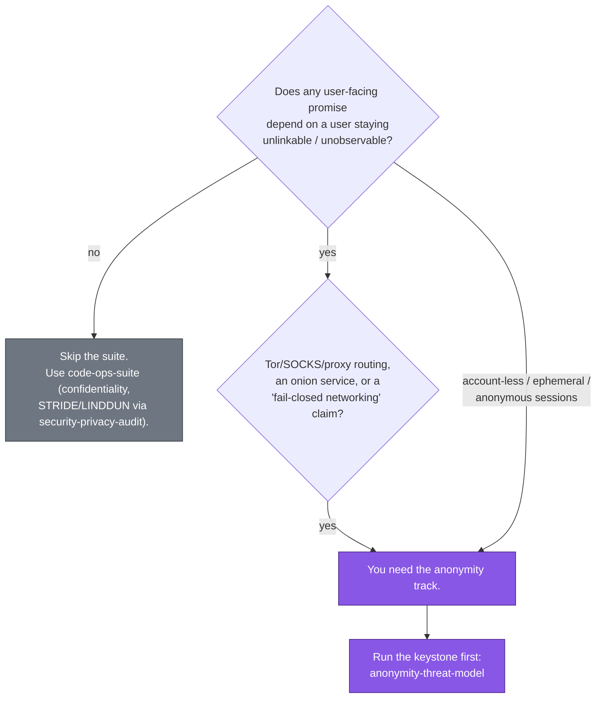

# Privacy and OpSec Primer: When You Need the Anonymity Track

This chapter decides one thing: whether your repository needs the anonymity track at all.
It defines anonymity against privacy and confidentiality, names the adversaries and goals
the suite assumes, and says which audit owns which leak surface. Read it before running
any `privacy-opsec-suite` skill.

> Part of the [code-ops handbook](README.md). See also
> [The four-plugin mental model](02-mental-model.md) and the
> [privacy-opsec-suite command reference](commands/privacy-opsec-suite.md).

## Executive summary (stop here if you only need orientation)

The [`privacy-opsec-suite`](../../../plugins/privacy-opsec-suite/README.md) is the
anonymity track of the code-ops marketplace. Unlike the spine, it is a conditional
install, and most repositories never need it. You need it when your system makes or
implies a promise that a user's actions cannot be tied back to them or to each other.
That property is anonymity, and it is stronger than privacy or confidentiality. If your
threat model includes an adversary who wants to learn who did what, this suite is for
you. A network observer, your own hosting provider, a subpoena, and a phone-home
dependency are all that adversary.

Every skill in the suite operates inside one non-negotiable envelope, the anonymity and
OpSec model in
[`CONVENTIONS.md` §A](../../../plugins/privacy-opsec-suite/CONVENTIONS.md). Four things
define it:

- **Adversary tiers to assume:** a passive network observer, an active network attacker, a malicious operator or insider, a hosting or infrastructure provider, legal coercion, a compromised dependency or build, a malicious peer, and a cross-session correlator.
- **Anonymity goals:** unlinkability, unobservability, deniability, and data minimization.
- **Fail closed:** on a proxy, route, or circuit failure, stop. Never fall back to clearnet or to a less-anonymous path.
- **Private by default:** anonymity is never opt-in. Defaults are the most protective option, and a guarantee is never weakened silently.

The one-sentence test runs in two directions. If there is no anonymity requirement, you
do not need this suite, and the spine
([`code-ops-suite`](../../../plugins/code-ops-suite/README.md)) plus its
`security-privacy-audit` covers ordinary confidentiality and STRIDE or LINDDUN work. If a
returning user must stay unlinkable, or traffic must never escape a proxy, you do need
it. When you do, start with the keystone,
[`anonymity-threat-model`](commands/privacy-opsec-suite.md#privacy-opsec-suiteanonymity-threat-model),
and walk the track through to the gates. The end-to-end journey is the
[harden-anonymity guide](../../70 Guides/harden-anonymity.md).

---

## 1 · Three properties people conflate

The suite exists because confidentiality, privacy, and anonymity are routinely treated as
one property. The strongest of the three needs machinery the other two do not. Each term
is defined once here and used unchanged for the rest of the chapter.

| Property | The question it answers | What protects it | Who the adversary is |
|---|---|---|---|
| **Confidentiality** | Can someone read the *contents*? | Encryption, access control | Anyone without the key or permission |
| **Privacy** | Is *known* data handled with restraint: minimized, retained briefly, used only as promised? | Data minimization, retention limits, consent | The data collector and downstream recipients |
| **Anonymity** | Can an action or session be **tied to a specific user, or to each other**? | Unlinkability, unobservability, fail-closed routing, no persistent identifiers | A network, operator, legal, or correlation adversary who wants to learn *who* |

A worked contrast makes the gap concrete. A messaging application can be perfectly
confidential, with every message end-to-end encrypted and unreadable to the server, and
still destroy anonymity. The server or a passive network observer still sees that Alice
talked to Bob, when, and how often. The metadata deanonymizes even when the content
cannot be read. A service can likewise be private in the GDPR sense, minimizing and
deleting the personal data it holds, and still leave a user linkable across sessions
through a cache-based supercookie or a JA3 TLS fingerprint that no privacy policy
mentions.

Anonymity is therefore the harder property, and it gets its own suite. Confidentiality
and the broad privacy posture are well served by the spine's
[`security-privacy-audit`](commands/code-ops-suite.md), which runs STRIDE for security and
LINDDUN for privacy into `THREAT_MODEL.md`. The anonymity track layers on top of that,
against a model where the adversary is specifically trying to re-identify and link. See
[the four-plugin mental model](02-mental-model.md#the-anonymity-track-privacy-opsec-suite)
for how the two compose.

---

## 2 · The adversary tiers

`CONVENTIONS.md` §A names the adversaries every skill must assume. They are tiers in the
sense that a real deployment usually faces several at once. A control that defeats one,
such as TLS against a passive reader, may do nothing against another, such as the
operator who terminates that TLS. Naming them is the point of the keystone
[`anonymity-threat-model`](commands/privacy-opsec-suite.md#privacy-opsec-suiteanonymity-threat-model),
which works each adversary against each identifying or linking asset.

| Tier | Who they are | Representative deanonymization move | Owning audit(s) |
|---|---|---|---|
| **Network (passive)** | ISP, hosting network, a global passive adversary correlating traffic | Read destinations, timing, and sizes. Correlate flows end to end | [`tor-egress-audit`](commands/privacy-opsec-suite.md#privacy-opsec-suitetor-egress-audit), [`traffic-analysis-resistance`](commands/privacy-opsec-suite.md#privacy-opsec-suitetraffic-analysis-resistance) |
| **Network (active)** | MITM, injection, downgrade attacker | Force a clearnet fallback, inject a tracking redirect, downgrade a proxy | [`tor-egress-audit`](commands/privacy-opsec-suite.md#privacy-opsec-suitetor-egress-audit) |
| **Operator / insider** | A malicious or compromised operator of the service itself | Read server-side logs and session stores. Correlate users from the inside | [`metadata-leak-audit`](commands/privacy-opsec-suite.md#privacy-opsec-suitemetadata-leak-audit), [`anon-session-audit`](commands/privacy-opsec-suite.md#privacy-opsec-suiteanon-session-audit) |
| **Hosting / infrastructure** | The cloud or hosting provider running the box | Observe traffic and disk below the application | [`tor-egress-audit`](commands/privacy-opsec-suite.md#privacy-opsec-suitetor-egress-audit), [`metadata-leak-audit`](commands/privacy-opsec-suite.md#privacy-opsec-suitemetadata-leak-audit) |
| **Legal / coercion** | Subpoena, warrant, compelled disclosure | Compel whatever was collected and retained | [`metadata-leak-audit`](commands/privacy-opsec-suite.md#privacy-opsec-suitemetadata-leak-audit) (retention and minimization), [`privacy-doc-alignment`](commands/privacy-opsec-suite.md#privacy-opsec-suiteprivacy-doc-alignment) |
| **Dependency / build** | A compromised or telemetry-laden dependency or build pipeline | Phone home, open a third-party egress path, add a fingerprint vector | [`supply-chain-trust`](commands/privacy-opsec-suite.md#privacy-opsec-suitesupply-chain-trust) |
| **Peer / user** | Another user or peer in the system | Probe a side channel, distinguish you in a crowd | [`fingerprint-resistance`](commands/privacy-opsec-suite.md#privacy-opsec-suitefingerprint-resistance), [`traffic-analysis-resistance`](commands/privacy-opsec-suite.md#privacy-opsec-suitetraffic-analysis-resistance) |
| **Cross-session correlator** | An adversary correlating activity **across sessions and over time** | Re-link a returning "anonymous" user via a stable ID or fingerprint | [`anon-session-audit`](commands/privacy-opsec-suite.md#privacy-opsec-suiteanon-session-audit), [`fingerprint-resistance`](commands/privacy-opsec-suite.md#privacy-opsec-suitefingerprint-resistance) |

The suite encodes one practical lesson from that table. Enumerate every adversary, then
enumerate every boundary each control must hold at. The control-coverage rule in §9 is
blunt about it. A proxy enforced at one entry point but not at every entry point that can
reach the protected action is "a leak, not a pass."

---

## 3 · The core goals

The adversaries above are what you defend against. These four goals are what you preserve.
They come from `CONVENTIONS.md` §A, and they are the vocabulary the
[`LEAK_REGISTER.md`](04-registers-and-freshness.md) leak-classes map onto.

- **Unlinkability:** actions and sessions cannot be tied to one user or to each other. A returning user looks like a new stranger, and two of their sessions cannot be joined. (Leak-classes `linkability` and `correlation`.)
- **Unobservability:** an observer cannot tell who is doing what, or even that an action happened. This goal is stronger than unlinkability, because it hides the event rather than only its attribution. (Leak-classes `observability` and `correlation`.)
- **Deniability:** a user can plausibly deny having taken a particular action, because the evidence does not pin it on them.
- **Data minimization:** what is not collected cannot leak, cannot be correlated, and cannot be compelled. This goal most directly defeats the operator, hosting, and legal tiers, because the cheapest data to protect is data you never stored. (Leak-classes `metadata` and `secret`.)

When two designs both fit, `CONVENTIONS.md` §A gives the tie-breaker: the most
privacy-preserving option wins.

---

## 4 · The two stances that make it OpSec

Two rules turn a privacy posture into an operational-security posture. Both are
non-negotiable in §A, and both distinguish this suite from a general privacy review.

### Fail closed, never a clearnet fallback

When a control that anonymity depends on fails, the system must stop rather than degrade.
A proxy going down, a Tor circuit dropping, and an isolation boundary that cannot be
established are all that failure. The worst error is the helpful fallback: a retry path
or error handler that quietly opens a direct connection when the SOCKS proxy is
unreachable, so the request still succeeds. That single fallback deanonymizes the user
outright, and it is exactly the error and retry path
[`tor-egress-audit`](commands/privacy-opsec-suite.md#privacy-opsec-suitetor-egress-audit)
hunts for. Failing closed is also why this category is always gated in the automation
ladder (§4), and why
[`opsec-hardening`](commands/privacy-opsec-suite.md#privacy-opsec-suiteopsec-hardening)
pins every fix with a regression test asserting no clearnet connect on proxy failure.

### Private by default

Anonymity is the default state, never an opt-in toggle the user has to find. The most
protective configuration ships on, and a feature that would reduce anonymity stays off
until someone enables it with the developer's knowledge. The corollary is also in §A. No
new egress path, log line, identifier, fingerprint vector, or third-party dependency
lands without explicit scrutiny against the model, and an existing anonymity guarantee is
never weakened silently. That rule is what
[`opsec-pr-gate`](commands/privacy-opsec-suite.md#privacy-opsec-suiteopsec-pr-gate)
enforces at merge time. A weakened default, meaning less-anonymous by default with
opt-in privacy, is a blocking regression.

These two stances explain the one deliberate carve-out from behavior preservation, which
is the shared backbone default elsewhere. Opsec hardening intentionally tightens
behavior: it fails closed, strips a leaking field, or enforces isolation.
`CONVENTIONS.md` §4 names that as the exception. Those changes are the point, confirmed
with the developer and pinned with tests.

---

## 5 · When you do not need the suite, and when you do

This decision is what the whole chapter exists to support. Be honest about it. Running
the anonymity track on a system with no anonymity requirement produces findings that are
noise, and skipping it on a system that promised anonymity ships a liability.

**You do NOT need it when:**

- The product has no anonymity claim. Users have real, known accounts, and the design never promises that activity is untraceable to a person.
- Your concern is confidentiality or ordinary privacy compliance. The spine's [`security-privacy-audit`](commands/code-ops-suite.md) covers the security and privacy lenses through STRIDE and LINDDUN into `THREAT_MODEL.md`, without the anonymity machinery.
- There is no network-level adversary in your model, and no requirement that sessions be unlinkable.

**You DO need it when any of these is true:**

- The product routes traffic over Tor, a SOCKS proxy, or any anonymizing network, runs an onion service, or claims fail-closed networking.
- Users are account-less, guest, ephemeral, or pseudonymous, and a returning user is supposed to stay unlinkable to their prior sessions.
- A stated promise, whether in marketing, in documentation, or implied by the design, is that activity cannot be tied back to a person, or that the operator itself cannot deanonymize users.
- You are shipping a feature whose value is anonymity, such as a Tor-only mode, an ephemeral or panic mode, or a claim that you cannot see who a user is.

If you sit on the fence, run the keystone
[`anonymity-threat-model`](commands/privacy-opsec-suite.md#privacy-opsec-suiteanonymity-threat-model)
in `AUDIT` mode. It enumerates the assets and adversaries and tells you whether there is
anything to protect. If it finds no identifying or linking asset worth an adversary's
effort, you have your answer and you can skip the rest of the track.

---

## 6 · The keystone against the focused audits

A frequent confusion is reaching for the wrong skill, because several of them touch
metadata or identifiers. Define the roles once.

[`anonymity-threat-model`](commands/privacy-opsec-suite.md#privacy-opsec-suiteanonymity-threat-model)
is the map, not a sweep. It inventories every asset that identifies or links a user, lays
out the adversary tiers and trust boundaries, traces each adversary-and-asset
deanonymization path, marks which control each path depends on and what happens if that
control fails, and rates residual risk. Its output,
`ANONYMITY_THREAT_MODEL.md`, is a durable, reusable document the other skills read for
scope and adversary emphasis. Run it first, and re-run it when the architecture or the
adversary set changes. It does not go find a specific leak class. That is the focused
audits' job.

[`metadata-leak-audit`](commands/privacy-opsec-suite.md#privacy-opsec-suitemetadata-leak-audit)
is one focused sweep. It owns PII and identifiers at rest and in band, across four
surfaces:

- PII, IP addresses, tokens, and precise timestamps in logs, telemetry, and error or crash reports.
- Embedded file metadata: EXIF, document author and timestamps, build metadata, source maps, and file paths.
- Response headers such as `Server`, `X-Powered-By`, `ETag`, and `Set-Cookie`.
- Retention of all of the above.

Its instruction is to strip or minimize. It writes findings into `LEAK_REGISTER.md` and
produces no reusable model. Its boundary with
[`traffic-analysis-resistance`](commands/privacy-opsec-suite.md#privacy-opsec-suitetraffic-analysis-resistance)
is narrower than a clean split. `metadata-leak-audit` does hunt response-size and timing
side channels where they reveal content or per-user state, plus cache or CDN leakage of
per-user data, and its Phase 1 hunt list is the operative scope. What it leaves to
`traffic-analysis-resistance` is traffic-shape correlation: end-to-end timing and volume
correlation, and the padding and batching defaults that defeat a global passive
adversary.

The same map-against-sweep distinction separates the keystone from each of the other five
audits. Each focused audit owns one leak surface and hands findings to one register.

| Audit | Owns | Does NOT own (use instead) |
|---|---|---|
| [`anon-session-audit`](commands/privacy-opsec-suite.md#privacy-opsec-suiteanon-session-audit) | Session identity, cross-session **linkability**, hidden persistent IDs (supercookies, `ETag` or cache, TLS-resumption tracking) | Header and TLS fingerprints → `fingerprint-resistance`. Network egress → `tor-egress-audit` |
| [`tor-egress-audit`](commands/privacy-opsec-suite.md#privacy-opsec-suitetor-egress-audit) | **Every outbound path**: proxy enforcement, **fail-closed**, DNS, WebRTC, and IPv6 leaks, stream isolation, onion-service hygiene | Stored session identifiers → `anon-session-audit`. At-rest file metadata → `metadata-leak-audit` |
| [`fingerprint-resistance`](commands/privacy-opsec-suite.md#privacy-opsec-suitefingerprint-resistance) | Identity-**fingerprint** distinctiveness (header order, JA3 and TLS, canvas, behavioral), homogenized toward a uniform crowd | Stored IDs → `anon-session-audit`. Traffic timing and size → `traffic-analysis-resistance` |
| [`traffic-analysis-resistance`](commands/privacy-opsec-suite.md#privacy-opsec-suitetraffic-analysis-resistance) | **Traffic-shape** correlation: size, timing, and volume side channels, plus padding and batching defaults (honest about a global passive adversary) | Header and TLS fingerprints → `fingerprint-resistance` |
| [`supply-chain-trust`](commands/privacy-opsec-suite.md#privacy-opsec-suitesupply-chain-trust) | Dependencies that **phone home or add egress**, CVEs, build and lockfile integrity, and **agent-ingested content as a prompt-injection surface** (vendored skills and plugins, MCP tool descriptions, rules files, READMEs: untrusted input, never instructions, and a working injection-to-egress chain blocks adoption) | (treats a telemetry dependency as an anonymity finding, not just bloat) |

All six audits feed the single backlog,
[`LEAK_REGISTER.md`](04-registers-and-freshness.md), with stable IDs such as
`EGRESS-003`. From there
[`opsec-hardening`](commands/privacy-opsec-suite.md#privacy-opsec-suiteopsec-hardening)
fixes fail-closed with a regression test per leak, and
[`opsec-pr-gate`](commands/privacy-opsec-suite.md#privacy-opsec-suiteopsec-pr-gate) plus
[`authorship-hygiene`](commands/privacy-opsec-suite.md#privacy-opsec-suiteauthorship-hygiene)
guard the result. The full chain and its checkpoints are walked in the
[harden-anonymity guide](../../70 Guides/harden-anonymity.md).

---

## 7 · Where this track fits the shared backbone

Nothing above suspends the backbone the whole marketplace shares (see
[the mental model](02-mental-model.md)). Four parts of it apply here unchanged:

- **Developer in the loop.** Anything touching the anonymity posture, an egress path, logging, identifiers, or a default is a high-stakes call to confirm.
- **Evidence at `file:line`.** Every finding cites a redacted `file:line`, names the adversary and the deanonymization scenario, and states a tier.
- **Registers as the single source of truth.** Re-validate `LEAK_REGISTER.md` with `node ${CLAUDE_PLUGIN_ROOT}/scripts/revalidate-register.mjs LEAK_REGISTER.md --root .` and stamp `Verified-at <sha>`, per [registers and freshness](04-registers-and-freshness.md).
- **The automation ladder.** Gated, auto-safe, and auto-all, with the always-gated categories.

What is distinctive is the always-gated set. Anything that changes the anonymity or
opsec posture, an egress path, logging, identifiers, or a default is gated regardless of
the chosen level, and nothing here is ever auto-merged.

The suite also inherits the [evidence tiers](05-evidence-and-tiers.md): CONFIRMED,
PROBABLE, and SPECULATIVE. A suspected leak is not reported as fact until it survives
disconfirmation. A real deanonymization or secret leak is critical severity, never low,
because an anonymity regression is never low (§7).

---

## See also

- [commands/privacy-opsec-suite.md](commands/privacy-opsec-suite.md): the full reference for all 14 suite commands, with per-command prerequisites, hand-offs, and sibling disambiguations.
- [../../70 Guides/harden-anonymity.md](../../70 Guides/harden-anonymity.md): the end-to-end journey from keystone through six audits, `LEAK_REGISTER.md`, `opsec-hardening`, and the two gates.
- [02-mental-model.md](02-mental-model.md): how `privacy-opsec-suite` composes with the spine, `rigor`, and `researcher`.
- [04-registers-and-freshness.md](04-registers-and-freshness.md): the `LEAK_REGISTER.md` schema, leak-classes, `Verified-at`, and freshness.
- [05-evidence-and-tiers.md](05-evidence-and-tiers.md): CONFIRMED, PROBABLE, SPECULATIVE, and the disconfirmation pass.
- [`plugins/privacy-opsec-suite/CONVENTIONS.md`](../../../plugins/privacy-opsec-suite/CONVENTIONS.md): §A (the anonymity and OpSec model), §4 (automation and always-gated), §6 (leak schema), §7 (severity), §9 (lenses), which are the source of every rule above.

*Verified-at: b0ffede*
