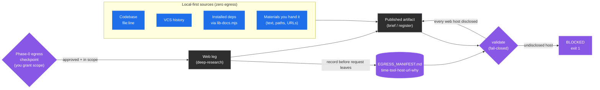
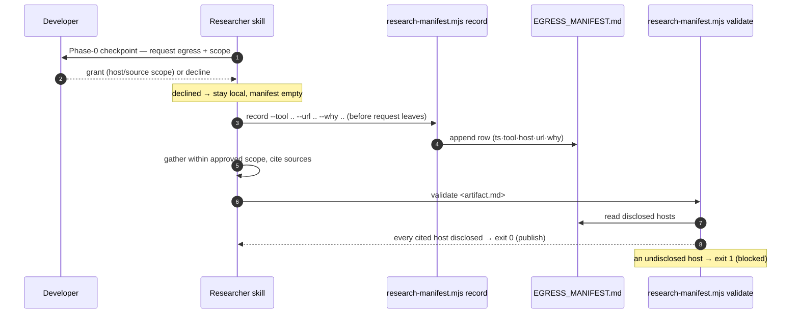

# Researcher Egress: Local-First, Disclosed, Fail-Closed

This chapter decides when a research run may touch the network and what it must record
when it does. It covers the local-first default, the Phase-0 checkpoint, the egress
manifest, and the fail-closed publication gate. Read it before granting web egress to any
`researcher` skill.

> Part of the [code-ops handbook](README.md). Plugin overview:
> [commands/researcher.md](commands/researcher.md). Companion guide:
> [the library-choice walkthrough](../../70 Guides/research-a-library-choice.md).

## Orientation (stop here if you only need the gist)

The `researcher` plugin brings the outside world into your repository: best practices,
library capabilities, prior art, CVEs. That is the operation the rest of the suite spends
its energy preventing, namely a network request that leaves your machine. So the
researcher treats every external request as a first-class, disclosed event under one
non-negotiable model
([`plugins/researcher/CONVENTIONS.md`](../../../plugins/researcher/CONVENTIONS.md) §A):

- **Local-first by default.** The default sources are local and produce zero network traffic: your codebase, version-control history, the documentation of your installed dependencies (through `lib-docs.mjs`), and the materials you hand it. Reading a library's documentation reads the copy already in `node_modules`, and no query goes out.
- **Disclosed, opt-in egress.** Web retrieval is explicit opt-in per run. Before any request leaves the machine, you grant scope at a Phase-0 egress checkpoint. Nothing egresses silently.
- **Recorded, every time.** Each external request is appended to `EGRESS_MANIFEST.md` (time, tool, host, url, why) through `research-manifest.mjs record`, and the manifest is surfaced at every checkpoint.
- **Fail-closed publication gate.** Before any artifact is published, `research-manifest.mjs validate` blocks it if it cites a web host with no matching manifest entry. An undisclosed external source fails the build.

The shape to remember: the private path is the default and passes trivially, and egress
is something you have to ask for. Once asked for, it is logged and checked. The rest of
this chapter explains why the egress surface is itself a leak, how the checkpoint
decision works in practice, what each manifest row records, and how the fail-closed gate
is enforced.

---

## 1 · Why egress is the controversial operation

Every other plugin in the suite is defensive about the network. `privacy-opsec-suite`
exists to audit and shut down leak surfaces, and the shared automation ladder keeps any
new egress path permanently gated. The researcher is the one plugin whose job is to reach
outside the repository, which makes it the plugin most able to undermine the suite's
posture.

The risk is not only the content of a response coming back. The request itself is a
metadata-leak surface. When a research query goes out, the destination host learns three
things:

- **What.** The query string, the package name, the CVE identifier, and the framing of the problem tell the host that this machine is researching this topic.
- **When.** The timestamp can be correlated with other activity.
- **From where.** The source IP address, the TLS fingerprint, and any headers the tool attaches identify the origin.

For an ordinary project that is unremarkable. For a project with anonymity or opsec
needs, which is exactly the project `privacy-opsec-suite` is built for, an undisclosed
lookup about fingerprinting Tor exit nodes, or a query embedding an internal package
name, is a real leak that the developer never saw happen. That is why §A is worded as
"never silently egress", and why the researcher's `CONVENTIONS.md` §4 lists that phrase
as a top-line safety rail beside "no source edits" and "secrets are radioactive".

The design response is not to forbid the network, because research sometimes genuinely
needs it. The response is to make egress deliberate, visible, and auditable: opt-in per
run, recorded per request, and enforced at publication. The default stays local, so the
common case never touches the network at all.



Legend: blue is local and zero-egress, purple is a gate or disclosure step, and gray is
the external leg and its output. Every path that touches the network passes through the
checkpoint and the validate gate.

---

## 2 · Local-first by default

The default research path produces no network traffic, and that is deliberate. §A names
the local sources explicitly: the codebase, version-control history, installed-dependency
documentation, and the materials the developer hands you, meaning pasted text, file
paths, and URLs explicitly provided. None of them egress.

The load-bearing piece is dependency documentation. The naive way to learn a library's
API is to search the web for its documentation, which egresses the package name and your
question. The researcher's default is the opposite.
`${CLAUDE_PLUGIN_ROOT}/scripts/lib-docs.mjs`, or the `code-ops-docs` MCP `get-docs` tool
when `code-ops-suite` is installed, reads the documentation of the version installed in
your tree. It reads the README, the types, and the bundled documentation already in
`node_modules`, with zero query egress (§2). The default is also more accurate, because
it answers against the version you actually run rather than whatever version a web result
happens to describe. `research-verify` §2 makes the same point: check the installed
version, "not memory".

So the common research questions are answered entirely locally. What does this dependency
support? How is this used across our code? Why is this written this way? An artifact
built only from local sources cites no `http(s)` URL, so it passes the publication gate
trivially (see §5). The private path is the path of least resistance.

When local sources are not enough, because you need prior art from outside, a CVE
advisory, or an adjacent product's approach, you cross into egress. That is where the
checkpoint comes in.

---

## 3 · The Phase-0 egress checkpoint

Every researcher skill opens with Phase 0, and Phase 0 is a checkpoint. Alongside its
other framing work, which is restating the question, pinning success criteria, and
drafting a disconfirmation list, Phase 0 makes the egress decision explicit and up front,
before any gathering begins. The interaction protocol (§3) requires it. The researcher
must ASK whenever anything would cause network egress, confirming both the opt-in and the
scope, and it treats the decision as high-stakes.

The wording is consistent across the skills. Quoted verbatim from the Phase 0 checkpoint
of `research-spike` (`plugins/researcher/skills/research-spike/SKILL.md:14`):

> **CHECKPOINT:** present the restated question, success criteria, constraints, and directions. **Confirm whether web egress is permitted for this run** — and if so, the scope and which hosts (`§3`). Default is local-only. Proceed within the agreed scope.

Three properties make this a real gate rather than a rubber stamp:

- **Default-deny.** The default is local-only. If you say nothing, nothing egresses. Egress requires an affirmative grant.
- **Scoped, not blanket.** You grant this run, and you can constrain which hosts, what kind of source, and how deep. If a promising lead later needs a host outside the approved scope, the skill pauses and asks again rather than widening egress on its own (`research-spike` Phase 2, §3).
- **Per run, not per session.** The grant does not persist, and each run re-asks. A scheduled `ecosystem-watch` operates inside a pre-agreed scope and still stops at a checkpoint rather than widening egress unattended (see [commands/researcher.md](commands/researcher.md)).

### How to make the decision at the checkpoint

When the checkpoint surfaces, you are answering one question. Does answering this well
actually require the network, and if so, how narrowly? Work the decision in this order:

1. **Ask whether local sources answer it.** If the question is about your code, your dependencies' installed behavior, or materials you already have, decline egress. The local path is sufficient and private, and most improvement and grounding work lives there.
2. **Scope the web tightly when you need it.** Grant the narrowest useful scope: the specific kind of source, such as primary documentation or an advisory database, and the hosts where you can name them. Prefer primary sources over secondary commentary, because §7 and §10 reward primary-source triangulation anyway.
3. **Watch what the query itself discloses.** The query string is part of the leak. Avoid embedding internal package names, secret-shaped strings, or identifying framing in an outbound request. Redact secrets and PII before they could leave (§4).
4. **Decide deliberately for opsec-sensitive repositories.** For a project with anonymity needs, treat each host as a metadata leak and weigh whether the research value is worth the disclosure. When in doubt, stay local and tell the developer what you could not answer without egress.
5. **Approve the scope, then proceed within it.** Once granted, the skill gathers only within that scope and records every request (§4).

The checkpoint is also where the prior manifest is surfaced. §A and §3 require the
manifest to be shown at every phase boundary, so you always see what has already left the
machine before deciding what else may.

---

## 4 · `EGRESS_MANIFEST.md`, the disclosure log

Once egress is approved, every external request is disclosed by appending a row to
`EGRESS_MANIFEST.md` before the request leaves the machine, through the `record`
subcommand:

```sh
node ${CLAUDE_PLUGIN_ROOT}/scripts/research-manifest.mjs record \
  --tool <tool> --url <url> --why <reason> [--host <host>] [--manifest <path>]
```

The script ([`scripts/research-manifest.mjs`](../../../scripts/research-manifest.mjs),
byte-shared with the plugin copy) creates the manifest with its header on first use and
appends one Markdown table row per request. Each row records five fields:

| Column | What it records | Source |
| --- | --- | --- |
| `timestamp` | When the request was made (ISO-8601, UTC). | `new Date().toISOString()`, set by the script rather than the caller. |
| `tool` | Which tool made the request, such as the web-search or fetch leg. | `--tool` (defaults to `unknown` if omitted). |
| `host` | The hostname contacted, which is the unit the validate gate checks against. | `--host` if given, otherwise **derived from the URL** (`new URL(url).hostname`, lower-cased). |
| `url` | The full URL requested. | `--url` (required, and must be `http` or `https`). |
| `why` | The research need this request served. | `--why`. |

Four details matter in practice:

- **`--url` is mandatory and must be a real `http(s)` URL.** If it is missing or unparseable, `record` exits `2` with `x record needs --url (http/https); --host optional`. It will not log a malformed disclosure.
- **`host` is derived unless you override it.** You normally pass only `--tool`, `--url`, and `--why`, and the host comes from the URL. `--host` exists for the case where the contacted host differs from the literal URL, such as a request through a proxy.
- **Pipe characters and newlines are escaped**, so a URL or a reason cannot break the Markdown table.
- **It only appends.** The manifest is an append-only disclosure log. The recorded set of hosts is exactly what the publication gate later checks citations against.

A populated manifest looks like this. The example rows are synthetic, and the header is
written verbatim by the script:

```markdown
# Egress Manifest

Every external (web) request the researcher made, disclosed per CONVENTIONS §A.

| timestamp | tool | host | url | why |
| --- | --- | --- | --- | --- |
| 2026-06-23T14:02:11.318Z | deep-research | nodejs.org | https://nodejs.org/api/worker_threads.html | confirm worker_threads API for the spike's option B |
| 2026-06-23T14:09:44.071Z | deep-research | nvd.nist.gov | https://nvd.nist.gov/vuln/detail/CVE-2024-XXXXX | check affected range against our installed version |
```

`EGRESS_MANIFEST.md` is one of the researcher's standard run artifacts, written into the
dated run folder alongside the registers (§12). It is register-shaped, but it is not a
findings backlog and `revalidate-register.mjs` does not check it. It is the disclosure
log, with its own script and its own gate
([04-registers-and-freshness.md](04-registers-and-freshness.md) §4).

---

## 5 · The fail-closed publication gate

Recording is only half the contract. The other half is enforcement. A published artifact
may not cite a web source that is not in the manifest. Before any brief, register, or
summary is published, the skill runs `validate`:

```sh
node ${CLAUDE_PLUGIN_ROOT}/scripts/research-manifest.mjs validate <artifact.md> [...more] \
  [--manifest <path>] [--report-only]
```

The mechanism, read straight from the script:

1. It collects the set of disclosed hosts by scanning every `http(s)` URL already in `EGRESS_MANIFEST.md` and taking each one's hostname.
2. For each artifact, it extracts every `http(s)` URL the artifact cites and resolves each to a host.
3. For each cited host, it checks membership in the disclosed set. A cited host with no matching manifest entry is an undisclosed egress, and the script prints `!! undisclosed egress: <file> cites <url> (host <host>) with no EGRESS_MANIFEST entry`.
4. After all files, it prints a tally, `N external citation(s) checked, M undisclosed, K unreadable`, and exits `1` if any citation is undisclosed or any artifact is unreadable or missing, unless `--report-only` was passed.

That non-zero exit is what makes the gate fail-closed. A publication step, or a CI job,
that runs `validate` blocks when the disclosure is incomplete. The failure message is
explicit about the remedy: record the citation, remove it, or fix the path.

Two properties of the gate are worth internalizing:

- **The private path passes trivially.** An artifact built only from local sources cites no `http(s)` URL, so there is nothing to check and it passes with `0 external citation(s) checked, 0 undisclosed`. The script states the same default itself. Local-first work is never penalized by the gate.
- **It matches on host, not on exact URL.** Disclosure is at host granularity. Once you have recorded a request to `nodejs.org`, citing another `nodejs.org` page passes, because you disclosed that you contacted that host. Citing a different host you never recorded fails. Host granularity keeps the discipline practical, because you need not pre-register every deep link, while still catching the real failure.

The `validate` step is wired into every discovery skill's final checkpoint. Phase 4 of
`research-spike`, for example, runs `research-manifest.mjs validate <brief>` before
publishing and surfaces the manifest for sign-off. `research-improve`,
`research-ideate`, `ecosystem-watch`, and `library-eval` each validate their register or
brief the same way, and `research-sweep` validates every register, every brief, and the
executive summary at the end ([commands/researcher.md](commands/researcher.md)).
`research-verify` runs `validate` at intake too. If a draft artifact handed to it cites
an undisclosed host, that is recorded as a finding that fails the verification gate.

### The round-trip, deterministic and cheap

Together, `record` and `validate` form a deterministic backstop that needs no model to
run and is cheap in CI:



The egress posture is also guardable on every pull request. Any change to the egress
surface, whether a new outbound path, a weakened disclosure, or an un-manifested source,
is treated as blocking, and `privacy-opsec-suite:opsec-pr-gate` can gate it in CI
([commands/researcher.md](commands/researcher.md), Loops and automation).

---

## 6 · Where this sits, and what to read next

The egress model is the researcher's contribution to the suite's shared backbone. It is
how the PROPOSAL layer stays honest about the network while the ANONYMITY TRACK
(`privacy-opsec-suite`) stays honest about leaks. The two reinforce each other. The
researcher discloses what it sends, and the privacy track audits whether it should have.
A researcher artifact must pass both gates that protect a register.
`revalidate-register.mjs` keeps its findings honest about code, and
`research-manifest.mjs validate` keeps it honest about what left the machine
([04-registers-and-freshness.md](04-registers-and-freshness.md) §4, and
[researcher CONVENTIONS §12](../../../plugins/researcher/CONVENTIONS.md)).

- For each researcher command in depth, including which phase holds the egress checkpoint and which artifact each one validates, see [commands/researcher.md](commands/researcher.md).
- For an end-to-end journey that exercises the checkpoint, the manifest, and the gate on a real adoption decision, see [the library-choice walkthrough](../../70 Guides/research-a-library-choice.md).
- For how the registers the researcher produces stay fresh, and how the egress manifest differs from a findings register, see [04-registers-and-freshness.md](04-registers-and-freshness.md).
- For the evidence tiers and the disconfirmation pass the researcher applies to every claim it gathers, see [05-evidence-and-tiers.md](05-evidence-and-tiers.md).

*Verified-at: b0ffede*
