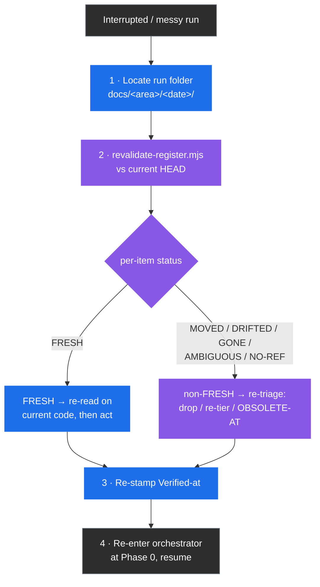

# Recovery and Troubleshooting

This chapter decides what to do when a run stops before it finished. It covers finding
the run folder, revalidating the registers, resuming or re-running a phase, what is safe
to delete, and the stacked-PR merge procedure. Read it when a run was cut off or a
register looks stale.

> Part of the [code-ops handbook](README.md). Companion chapter:
> [04-registers-and-freshness.md](04-registers-and-freshness.md). Companion technique:
> [register-carry-forward](../Techniques/register-carry-forward.md).

## Executive summary (stop here if you only need the checklist)

A run got cut off. A checkpoint was cancelled, the terminal closed mid-phase, an
orchestrator stopped between batches, or you came back to a half-finished
`docs/<area>/<date>/` folder from last week. Nothing is lost, because the run never held
state anywhere except on disk, in the registers. Recovery is therefore not an undo. It is
re-grounding against current code, then continuing.

The whole recovery model rests on one fact established in
[04-registers-and-freshness](04-registers-and-freshness.md): a register is only as
trustworthy as its last revalidation. An interrupted run leaves registers stamped against
a `Verified-at` sha that may no longer be `HEAD`, because you, a teammate, or a later
commit may have moved on. So before you resume anything, revalidate.

The four-step recovery, in order:

1. **Find the run folder.** Artifacts land in a dated folder under the repository's docs location, `docs/<area>/<date>/` (for example `docs/rigor/<date>/` or `docs/privacy/<date>/`), or at the repository root when the repository has no docs convention ([code-ops CONVENTIONS §12](../../../plugins/code-ops-suite/CONVENTIONS.md)). If the repository carries a `<repo>-docs/` Obsidian vault ([vault standard](../Techniques/vault-standard.md)), look in the vault's `80 Runs/YYYY-MM-DD slug/` instead. The standard filenames are `FINDINGS_REGISTER.md`, `LEAK_REGISTER.md`, and `EXECUTIVE_SUMMARY.md`, plus per-plugin registers and logs. A version 3 runtime run also has `HOST_CAPABILITIES.json` and `RUN_RUNTIME_RECEIPTS.jsonl`.
2. **Re-validate every carried register against current `HEAD`** with `node scripts/revalidate-register.mjs <register> --root <repo>`, before you re-run or resume anything.
3. **Re-triage every non-`FRESH` item** (`MOVED`, `DRIFTED`, `GONE`, `AMBIGUOUS`, `NO-REF`), then re-read the `FRESH` survivors. Anything already fixed gets stamped `OBSOLETE-AT <sha>` and is never re-shown.
4. **Resume from the last clean phase boundary.** Re-enter the orchestrator at Phase 0. It re-scopes, re-opens the master plan, and carries the revalidated registers forward.

If you read nothing else: registers are the only thing worth recovering, and you recover
them by revalidating, never by trusting them as they stand.



Legend: blue is a recovery action you take, purple is a gate or a status change, and gray
is the start and the end. Every path into resume passes through revalidation.

---

## 1 · Where the artifacts land

A run writes two kinds of file, and the distinction governs what you can safely delete
(§3).

- **Run artifacts** are the registers, logs, and executive summary for this run. They go in a dated folder under the repository's docs location, `docs/<area>/<date>/`, or at the repository root when the repository has no docs convention ([code-ops CONVENTIONS §12](../../../plugins/code-ops-suite/CONVENTIONS.md), and verbatim in each plugin's register section: [rigor §10](../../../plugins/rigor/CONVENTIONS.md), [privacy §11](../../../plugins/privacy-opsec-suite/CONVENTIONS.md), [researcher §12](../../../plugins/researcher/CONVENTIONS.md)). In a repository carrying a `<repo>-docs/` Obsidian vault ([vault standard](../Techniques/vault-standard.md)), they go to the vault's `80 Runs/YYYY-MM-DD slug/` instead, keeping the same filenames. The `<area>` is the lens, so `docs/rigor/<date>/` and `docs/privacy/<date>/` do not collide when two plugins run on the same repository on the same day.
- **Authoritative reference docs** are threat models, privacy promises, architecture docs, ADRs, and runbooks. They are the single source of truth in the repository's existing docs location and are reconciled in place, never duplicated into a run folder ([code-ops §11](../../../plugins/code-ops-suite/CONVENTIONS.md), [privacy §11](../../../plugins/privacy-opsec-suite/CONVENTIONS.md)).

The standard filenames a run produces, taken from the `CONVENTIONS.md` of each plugin:

| File | Produced by | Role |
| --- | --- | --- |
| `FINDINGS_REGISTER.md` | code-ops-suite, rigor | Audit, review, and bug findings (the spine register) |
| `LEAK_REGISTER.md` | privacy-opsec-suite | Anonymity and leak findings |
| `EXECUTIVE_SUMMARY.md` | every orchestrator | The running, cross-phase summary. It separates CONFIRMED from PROBABLE and SPECULATIVE at the end |
| `CONSISTENCY_REGISTER.md` | rigor | Variants to close to a canonical form |
| `RESEARCH_FINDINGS.md` / `IDEAS_REGISTER.md` | researcher | Code-grounded claims (`RSCH-NNN`) and proposals (`IDEA-NNN`) |
| `EGRESS_MANIFEST.md` | researcher | Disclosure log of every external request (validated by `research-manifest.mjs`, not `revalidate-register.mjs`) |
| `ANONYMITY_THREAT_MODEL.md`, `OPSEC_RUNBOOK.md` | privacy-opsec-suite | Authoritative docs, reconciled in place rather than run artifacts |
| `GROUND_TRUTH.md`, `TEST_SUITE_REPORT.md`, `REGRESSION_REPORT.md`, `IMPLEMENTATION_LOG.md`, `IMPROVEMENTS_LOG.md` | rigor | Phase logs ([rigor §10](../../../plugins/rigor/CONVENTIONS.md)) |

> The first move on any recovery is to identify the run folder and read its
> `EXECUTIVE_SUMMARY.md`. It is the running narrative across phases, and it tells you how
> far the run got and what the last go/no-go was.

---

## 2 · Resuming or re-running a cancelled orchestrator

Every orchestrator is checkpointed and developer-in-the-loop
([03-orchestrators](03-orchestrators.md)). You set scope, track, and automation level at
Phase 0, then approve or redirect at each phase boundary, and none of them auto-merge.
That design makes interruption cheap. Work happens on a branch, the registers are on
disk, and the executive summary records the last clean boundary.

The cardinal rule: re-validate the carried registers against current `HEAD` before you
resume. That rule is the orchestrators' own Phase 0 behavior, not an extra step you bolt
on. The Phase 0 instruction of `full-sweep` carries the registers forward fresh. Before
any phase consumes a finding it re-validates that finding against current `HEAD`, and a
finding fixed earlier in the run is marked `OBSOLETE-AT <sha>` and never re-shown
(`plugins/code-ops-suite/skills/full-sweep/SKILL.md:13`). The danger when resuming is
sharper than in a fresh run. Time has passed, commits may have landed, and the register's
`Verified-at` shas are now demonstrably behind.

### How to resume

For a bounded version 2 run, use the ordinary Phase 0 recovery below. For a multi-phase
or resumable version 3 run, verify its receipt chain before selecting the next phase:

```sh
node scripts/run-runtime.mjs verify --root <repo> --contract <run folder>/RUN_CONTRACT.json
```

The command verifies the receipt chain, the current runtime binding, and the latest
checkpoint references. Do not resume when it fails. Replan when the contract, the
snapshot, the declared host capabilities, or the stable prefix changed. Update the
contract to the next revision, prepare the affected bundles, then append
`run-runtime.mjs replan` with the current ledger and artifacts. When the binding is
unchanged, append `run-runtime.mjs resume` instead. Stable prefixes are usable only when
the host can inject the exact emitted payload. Cache activity is optional telemetry,
never evidence that the run state survived.

0. **Check for a dispatch ledger first.** If the run folder has a `DISPATCH_LEDGER.md`, read it before touching phase boundaries. A dangling row means a specific subagent dispatch died or hung, and that unit can often be resumed on its own without re-entering the whole phase. See "Per-unit resume via the dispatch ledger" below.
1. **Re-enter the orchestrator at Phase 0** with the same scope and track. Point it at the existing run folder, so it re-opens the master plan and the running `EXECUTIVE_SUMMARY.md` rather than starting a fresh folder. Phase 0 is a checkpoint by design. It re-scopes and re-confirms the automation level before any phase consumes anything.
2. **Let it revalidate first, or do it yourself.** The orchestrator carries the registers forward fresh. Every register it inherits runs through `revalidate-register.mjs`, and the non-`FRESH` items are re-triaged before any phase acts on them. If you are driving the recovery by hand, run the §4 revalidate command yourself before resuming a phase.
3. **Resume from the last clean phase boundary** named in the executive summary. Phases consume registers rather than in-memory state, so a phase that was mid-batch when cancelled is safe to re-run from its start. Both `remediation` and `fix-verified` re-validate the register and drop anything already fixed, so a half-applied fix batch is not double-applied ([full-sweep Phase 4](../../../plugins/code-ops-suite/skills/full-sweep/SKILL.md) for `remediation`, and the rigor [fix-verified Phase 0](../../../plugins/rigor/skills/fix-verified/SKILL.md) for `fix-verified`).

### Per-unit resume via the dispatch ledger

An orchestrated run keeps `DISPATCH_LEDGER.md` beside the register, one row per subagent
dispatch, written at dispatch time. The row is written atomically with the dispatch call
itself, never a turn earlier or later, so a hung or dead operative shows up as a dangling
`dispatched` row instead of vanishing, and a row that exists with no dispatch behind it
cannot be mistaken for one ([code-ops §12](../../../plugins/code-ops-suite/CONVENTIONS.md),
verbatim in [rigor §10](../../../plugins/rigor/CONVENTIONS.md) and
[privacy §11](../../../plugins/privacy-opsec-suite/CONVENTIONS.md)). Before falling back
to whole-phase re-entry, run:

```sh
node scripts/revalidate-register.mjs --dispatch-ledger DISPATCH_LEDGER.md --report-only
```

It prints an `advisory:` line for every row still `dispatched`, meaning never `reported`,
`failed`, or `redispatched`, and it never affects the exit code. It is a pointer, not a
gate. For each dangling row, re-dispatch that one unit with a tightened brief, or mark it
`failed` and hand it to the next checkpoint, per the operative-failure ladder. There is
no need to re-run the whole phase because one dispatch never reported back.

### Resume against re-run

| Situation | Do | Why |
| --- | --- | --- |
| Cancelled at a checkpoint, code unchanged since | **Resume** at the next phase after revalidating | The registers are still current to that sha, and revalidation confirms it cheaply |
| Cancelled mid code-changing phase (fix batch, hardening) | **Re-run that phase from its start** after revalidating | Fix phases re-validate and skip already-fixed items, so re-running is idempotent on the register |
| Days passed, or other commits landed | **Re-run from Phase 0**, full revalidation | The `Verified-at` shas are stale. Treat the whole register as suspect until revalidated |
| Scope or track was wrong | **Re-run from Phase 0** with corrected scope | Phase 0 is where scope, track, and automation level are set |

No orchestrator auto-merges, and every code change lands on a branch as a commit or a
pull request. So resuming never risks an unreviewed merge. The worst case of a bad resume
is a re-run phase, not a lost or duplicated landing.

### Recover a version 3 runtime lock

`run-runtime.mjs` creates `<receipt path>.lock` only while it appends a receipt. A lock
error does not prove that the prior writer failed. First inspect its `owner.json` and
confirm that the owner is gone. Then run `run-runtime.mjs verify` against the contract.
Remove the lock only after both checks pass. Re-run the intended command once. If
verification fails, preserve the lock and the receipt chain. Diagnose or replan from the
last valid boundary instead.

---

## 3 · Safe to delete against keep

The run-against-authoritative split from §1 maps almost exactly onto delete against keep.

**Keep, and do not delete:**

- **Any register with live items:** `FINDINGS_REGISTER.md`, `LEAK_REGISTER.md`, and the researcher registers. They are the single source of truth, and deleting one discards the work graph, not just a report.
- **Authoritative reference docs** reconciled in place: threat models, privacy promises, ADRs, and architecture or ops docs. They are never run artifacts, and they belong to the repository.
- **`EGRESS_MANIFEST.md`** for any researcher run whose artifacts you intend to keep or publish. `research-manifest.mjs validate` fails closed if a published artifact cites a host with no matching manifest entry ([04 §4](04-registers-and-freshness.md), [researcher §12](../../../plugins/researcher/CONVENTIONS.md)). Delete the manifest and you cannot re-validate the artifact.
- **`OBSOLETE-AT`-stamped items inside a register.** They are kept in the file for traceability and are skipped by carry-forward. Do not prune them ([04 §5](04-registers-and-freshness.md)).

**Safe to delete:**

- **A stale dated run folder you have superseded**, such as `docs/<area>/<old-date>/`, once a newer completed run exists and you have carried forward anything still live. The folder is a run artifact. The durable truth is the reconciled docs and the current register.
- **Phase logs** such as `GROUND_TRUTH.md`, `TEST_SUITE_REPORT.md`, and `IMPLEMENTATION_LOG.md`, once the run is complete and the executive summary captures the outcome. They are diagnostic, not the single source of truth.
- **A duplicate or accidental run folder** from a mistaken second invocation, once you have confirmed that no unique finding lives only there.

> When in doubt, keep the register and delete the surrounding folder's logs instead. A
> register is cheap to revalidate and expensive to recreate. These run-folder paths are
> local artifacts and may be git-ignored, so recovering one means reading what is on disk,
> not what is committed.

---

## 4 · Register drift and corruption

Drift is the normal, expected divergence between a register and the code it cites,
accumulated while the run was paused. Corruption is the rarer case of a register
hand-edited into a malformed state. The same tool diagnoses both.

### Run the revalidation pass

```sh
node scripts/revalidate-register.mjs <register> --root <repo>
```

Inside a skill the canonical invocation is
`node ${CLAUDE_PLUGIN_ROOT}/scripts/revalidate-register.mjs <register> --root <repo>`.
The script is byte-identical at the repository root `scripts/` and in each
`plugins/<name>/scripts/`. It scans the register for item IDs, collects every cited
`file:line`, the `Verified-at` sha, and any delimited `Anchor:` under each ID, re-greps
each reference against the current tree, and assigns each item exactly one status:

| Status | Meaning | Re-triage action |
| --- | --- | --- |
| **FRESH** | Every cited `file:line` still exists and is in range. | Re-read on current code to confirm the defect still holds (the script is a floor, not a proof), then act. |
| **MOVED** | The cited line is now out of range, at the original path or at a single relocated file found by name. | Re-locate on current code, update `Location`, and re-stamp `Verified-at`. |
| **DRIFTED** | The cited line still exists but no longer contains the item's `Anchor:` substring (checked only when the item carries a delimited `Anchor:`). | The citation is stale or hallucinated. Re-locate on the current tree and re-tier, or drop it. |
| **GONE** | A cited file no longer exists anywhere in the tree. | Likely fixed or relocated. Verify, then stamp `OBSOLETE-AT <sha>` or re-point. |
| **AMBIGUOUS** | The literal path is gone but more than one file matches its bare name, or a reference escapes the repository root. | Resolve by hand, because the script refuses to guess. Update `Location` so the next run is unambiguous. |
| **NO-REF** | The item cites no `file:line` at all, so there is nothing to auto-check. | Add a citation or verify by hand. An uncited finding is not yet actionable. |

There are also non-gating advisories, including an `Anchor:` value that is not
backtick-delimited or quote-delimited, which is unparseable, so its `DRIFTED` check is
skipped. The advisory that matters most here fires when an item's `Verified-at` sha
differs from the repository's current `HEAD`. The report then appends
`Verified-at <sha> != HEAD <sha> — re-confirm`. After an interruption this advisory fires
on nearly everything, and that is the signal rather than noise. The run paused, the
repository moved, and every carried item needs a re-confirming read.

**Exit behavior.** The script exits non-zero if any item is `MOVED`, `DRIFTED`, `GONE`,
`AMBIGUOUS`, or `NO-REF`, so it can gate a resume or a CI step. Passing `--report-only`
prints the report and always exits zero. Use the gating form when resuming, so you cannot
act on a drifted register by accident. Use `--report-only` for a read-only health check.

### Re-triage the non-`FRESH` items

For each non-`FRESH` item, decide its fate and record it in the register:

1. **Already fixed in code:** stamp `OBSOLETE-AT <sha>` with a one-line reason. It stays in the file for traceability and is permanently excluded from re-ranking and re-showing. This discipline defeats the proven failure mode, which is a register re-listing an item already fixed in code ([04 §3](04-registers-and-freshness.md)).
2. **Still real but relocated** (`MOVED` or `DRIFTED`, or a `GONE` or `AMBIGUOUS` resolved by hand to a real location): update `Location` and the `Anchor`, copied verbatim from the new line, to the current `file:line`, and re-stamp `Verified-at` with the sha you re-confirmed on.
3. **Uncited** (`NO-REF`): add the `file:line` citation ([code-ops §9](../../../plugins/code-ops-suite/CONVENTIONS.md) requires every finding to cite a location), or verify by hand before relying on it.

Then re-read every `FRESH` survivor on the current code. `FRESH` is a location check, not
a defect check. A finding can be `FRESH` and already fixed if someone patched the logic
without moving the line. The script narrows the set you must re-read. It does not replace
the reading.

```mermaid
sequenceDiagram
    autonumber
    participant Dev as You (recovering)
    participant Reg as Carried register
    participant Rev as revalidate-register.mjs
    participant Code as Current HEAD

    Dev->>Rev: revalidate FINDINGS_REGISTER.md --root .
    Rev->>Code: re-grep every cited file:line
    Rev-->>Dev: BUG-007 GONE; SEC-003 FRESH (Verified-at != HEAD); PERF-011 NO-REF
    Dev->>Reg: BUG-007 → OBSOLETE-AT <sha> (cited file deleted)
    Dev->>Code: re-read SEC-003 on current code
    Code-->>Dev: still reproduces
    Dev->>Reg: SEC-003 → re-stamp Verified-at <sha>
    Dev->>Reg: PERF-011 → add file:line citation, then re-tier
    Note over Dev,Reg: only now is the register safe to resume against
```

### When a register is genuinely corrupt

If the register was hand-edited into a malformed state, such as a truncated block, a
mangled ID, or a `Location` field that no longer parses, the symptoms are the script
reporting `NO-REF` for an item you know cites a file, or an ID silently dropped from the
report. Recover by repair, not by deletion:

- Compare against the schema in [04 §2](04-registers-and-freshness.md), which holds the canonical Finding fields, and the annotated snippet in [04 §5](04-registers-and-freshness.md). Restore the missing fields by re-reading the cited code.
- If a whole register is unrecoverable, reconstruct it from `git log` using the stable IDs. Items keep their ID from discovery through register, commit, and run log ([04 §1](04-registers-and-freshness.md)), so a commit message referencing `BUG-007` tells you what that ID closed.
- Do not delete a corrupt register and start clean until you have recovered every live ID. The IDs are the thread tying findings to the commits that touched them.

For the full carry-forward discipline that this chapter applies to recovery, see
[register-carry-forward](../Techniques/register-carry-forward.md) and the carry-forward
section of [04-registers-and-freshness §3](04-registers-and-freshness.md).

---

## 5 · Recovery quick reference

| Symptom | First move | Then |
| --- | --- | --- |
| Run cancelled at a checkpoint | Check `DISPATCH_LEDGER.md` for dangling `dispatched` rows | Re-dispatch that unit, or revalidate and re-enter at Phase 0 if there are none (§2) |
| Half-finished `docs/<area>/<date>/` from a past run | Identify which registers have live items | Revalidate against `HEAD`, and stamp OBSOLETE-AT what is fixed (§4) |
| Register re-lists something already fixed | This is the failure mode the discipline exists for | Stamp `OBSOLETE-AT <sha>`, and confirm the resume ran revalidation (§4) |
| `revalidate-register.mjs` exits non-zero | Read which IDs are non-`FRESH` | Re-triage each (§4). Do not resume until clean or knowingly waived |
| Item reports `AMBIGUOUS` | The script refused to guess | Resolve the real location by hand, and update `Location` (§4) |
| Unsure what to delete | Keep every register, and delete only logs or superseded folders | See the keep-against-delete split (§3) |
| Researcher artifact will not publish | Check that `EGRESS_MANIFEST.md` exists and is complete | Run `research-manifest.mjs validate`, which fails closed on un-manifested hosts ([04 §4](04-registers-and-freshness.md)) |

---

## 6 · Durable record-collection recovery

Use this procedure only for a manifest v2 record collection. Each admission is
irreversible, but the collection remains open. Preserve admitted paths and bytes. Restore
current authority through curation and canonical hub documents.

### Diagnose before intake

1. Stop when the repository is shallow, partial, promisor-backed, dirty, or missing required objects.
2. Restore full history, then run `verify-history --strict` before any authority mutation.
3. Run `records check` before planning new intake. Repair existing evidence failures first.
4. Run `classify`. Resolve every zero-match, ambiguous-owner, and forbidden-file result.
5. Treat `pending-admission` only as an intake signal after existing authority passes.

Evidence failures take precedence over new intake. Diagnose `evidence-lost`, immutable
drift, broken authority batches, or malformed curation before admitting another path.

### Choose the intake path

Use native `append` for a staged native record with no reachable exact-path history.
Restore its staged record and artifact snapshot before retrying a failed append.

Use reviewed incremental admission for a committed immutable path or a newly frozen
artifact. Run:

```sh
node scripts/records.mjs plan-adoption --collection <id> --incremental --out <repo-relative-ignored-path>
node scripts/records.mjs adopt --collection <id> --review <repo-relative-ignored-path>
```

Review every `review-required` candidate without changing its bindings. Regenerate the
plan after any change to `HEAD`, the manifest, content, history, generated authority, or
the batch head.

An empty incremental delta is a successful write-free no-op. Add `--require-delta` when a
scheduled recovery must prove that it found work. The first non-empty v2 mutation writes
the receipted v3 migration before admission.

Never regenerate genesis as a superset. Never hand-edit inventory, citations, authority
batches, curation, or indexes. Never move an admitted path into `_archive`. Freeze an
adopted `_archive` path in place.

### Recover concurrent work

All authority writers share one clone-wide lock beneath Git's common directory. A lock
held by a live or recent owner blocks. Recover only a dead owner that is at least ten
minutes old. Recovery binds the judged directory identity and refuses a replacement
lease.

Exit 3 means authority bytes may be durable but lock ownership was lost. Do not retry
automatically. Inspect the generated authority and the replacement lock, then run
`records check` before choosing a recovery action.

Optimistic bindings protect work from other clones. When a plan is stale, discard it and
plan again. Do not copy its disposition into a new receipt without reviewing the new
bindings.

Recover a curation conflict by rebasing the losing branch. Regenerate only its unmerged
curation tail. Never combine the authority-batch chain with the curation ledger.

### Run scheduled recovery safely

Scheduled recovery creates a unique branch in an isolated per-run worktree from the
intended base. It never switches the shared checkout.

1. Fetch and verify the intended base revision.
2. Create the unique branch and the isolated worktree.
3. Run strict history, collection checks, classification, and incremental planning there.
4. Review and apply only the bound receipt.
5. Run collection and repository gates, then commit and push the recovery branch.
6. Leave the shared checkout on its original branch for success and for failure.

Do not use `commit-tree` as the scheduled default. When worktrees are unavailable, assert
the shared branch before work. Restore it in guaranteed cleanup, and fail if restoration
cannot be proved.

### Roll out mixed collections

Adopt quiescent collections before a collection with recurring writers. Admit any
committed late arrivals incrementally before designing the mixed collection. Incremental
intake requires inventory v2 or v3. Inventory v1 remains readable but cannot enter the
authority-batch chain.

For the mixed collection, give each live writer an exact mutable scope. Let exact paths
outrank broad immutable selectors for quiescent evidence. Prove the recurring job can run
again without immutable drift.

Enable scheduled intake before adopting a root that receives new immutable paths. Run one
isolated recovery cycle and verify the next ordinary writer cycle. Only then adopt the
dynamic collection.

Do not use a current path as a historical fallback. Do not change a merged curation
event. Do not create a tombstone or a pointer through manifest sync. See
[the vault standard](../Techniques/vault-standard.md#durable-record-collections) for the
normative contract.

---

## 7 · Stacked-PR merge procedure

This repository squash-merges, so a stacked series of pull requests merges bottom-up, one
at a time, and each merge changes what the next pull request in the stack is based on.

### Retarget before you delete

After a parent pull request in the stack merges, retarget its child onto the new trunk
with `gh pr edit <n> --base main`, before deleting the parent's branch. GitHub does not
retarget a pull request when its base branch disappears. Deleting a base branch closes the
pull request, and a closed pull request can neither be reopened nor re-based while its
base branch is missing.

If the parent branch is already gone and the child pull request is closed, recover in
order:

1. Restore the branch at its old head with `git push origin <sha>:refs/heads/<name>`.
2. Reopen the pull request.
3. Retarget it with `gh pr edit <n> --base main`.
4. Only then delete the branch.

### A CONFLICTING tip PR is often a false alarm

Squash commits are never ancestors of the branches they were squashed from. So a tip pull
request can show CONFLICTING against `main` purely because a lower pull request in the
stack already squash-merged edits to the same files, such as version bumps, changelogs,
or vendored script copies. Its own edits may conflict with nothing. Before treating it as
a real conflict, check both of these:

- `git diff origin/main <mid-stack-head>` is empty, meaning the mid-stack branch's tree already matches `main`.
- `git merge-base --is-ancestor <mid-stack-head> <tip>` holds, meaning the tip branch already contains that history.

When both hold, the tip branch's own tree is already the correct merge result. Reconcile
without rewriting history:

```sh
git commit-tree '<tip>^{tree}' -p <tip> -p origin/main -m "Merge branch 'main' into <branch>"
git push origin <sha>:refs/heads/<branch>   # <sha> is the commit-tree output above
```

That pushes a synthetic merge commit as a plain fast-forward, not a rebase and not a
force-push. The tip branch's own history is preserved, and GitHub re-evaluates the
conflict check against the new head.

### Retargeting re-triggers CI

`gh pr edit --base` re-runs the pull request's CI on the same head SHA. Expect the checks
to restart, and wait for them before merging.

---

## Related chapters

Adjacent chapters carry the material this one assumes. The register schemas, the tracks,
and the full `revalidate-register.mjs` reference live in
[04-registers-and-freshness](04-registers-and-freshness.md). The orchestrators' phase
structure and checkpoints live in [03-orchestrators](03-orchestrators.md). Evidence tiers
and the disconfirmation pass behind re-reading a survivor live in
[05-evidence-and-tiers](05-evidence-and-tiers.md). The dedicated carry-forward technique
is [register-carry-forward](../Techniques/register-carry-forward.md).

*Verified-at: b0ffede*
