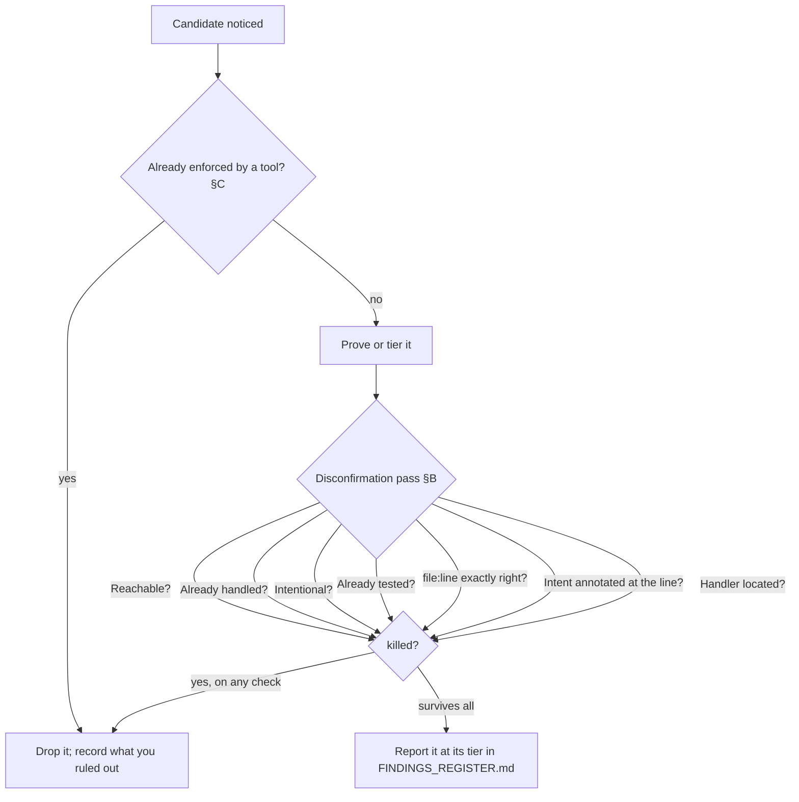

# The disconfirmation pass

The disconfirmation pass is one move in the rigor methodology: before you report a
candidate finding, actively try to kill it. Read this page before writing anything into a
findings register. It is the single highest-leverage filter against false positives.

## Exec summary (stop here if that is all you need)

You have a candidate, a place in the code that looks like a bug or a real quality defect.
Do not report it yet. Run it through seven checks, each of which tries to disprove the
finding:

1. **Reachable?** Is the triggering path actually reached, shown by demonstrated impact rather than theory?
2. **Already handled?** Does a caller, wrapper, middleware, framework, or the type system already neutralize it?
3. **Intentional?** Is this a deliberate choice, documented, commented, or contractually fine?
4. **Already tested?** Does an existing test already cover this exact behavior?
5. **Is the `file:line` exactly right?** Does the cited location still point at this code on the current tree?
6. **Is intent annotated at the line?** Do the cited line's neighbors, or a referenced ticket or finding id, carry a by-design, accepted-deferred, or KNOWN annotation?
7. **Where is the handler?** If the severity rests on "nothing else guards this", have you located the would-be handler and reported that search?

If the candidate dies on any check, drop it and record what you ruled out. If it survives
all seven, report it. The tier it survives at (`CONFIRMED`, `PROBABLE`, or `SPECULATIVE`)
follows from how it survived.

Before any of this, one rule from §C (ground truth first) gates the whole pass: never
re-flag what a deterministic tool already enforces. Run the linter, type-checker, test
suite, and any SAST first, and treat their output as fact. If a tool already owns the
class, the candidate adds zero signal. That is not one of the §B checks. It is the prior
reconciliation step every candidate clears before the pass begins.

The pass is mandatory in rigor. The checks are codified in
[`plugins/rigor/CONVENTIONS.md`](../../../plugins/rigor/CONVENTIONS.md) §B, the
ground-truth rule in §C. Every hunting skill runs them before anything reaches the
`FINDINGS_REGISTER.md`: `/rigor:bug-hunt`, `/rigor:quality-scan`, and
`/rigor:deep-review`. The rest of this page is the depth: each check, why it kills false
positives, and two fully worked candidates, one killed and one surviving to `CONFIRMED`.

---

## Where the pass sits in a run

The disconfirmation pass is the gate between noticing something and reporting it. In the
flagship hunt it is its own phase. `/rigor:bug-hunt` calls Phase 3, "Prove, then
disconfirm", the differentiator. The order matters. You prove a candidate, or tier it down
if you cannot, and then you try to kill it. Proving tells you how strong the evidence is.
Disconfirming tells you whether the finding is real at all.

It is deliberately adversarial. A fire-hose audit asserts findings. Rigor attacks its own
candidates first and keeps only what stands. The cost is that you report fewer things. The
payoff is that the things you report are real.



---

## The seven checks in depth

Each check is a way the candidate can be a false positive. Run all seven. A candidate can
survive six and die on the last.

### 1. Is it reachable, by demonstrated impact rather than theory?

A bug on a path nothing reaches is not a bug. Ask under what preconditions control
actually arrives here, and whether you can show those preconditions occur. Rank by
demonstrated blast radius, not theoretical severity
([CONVENTIONS](../../../plugins/rigor/CONVENTIONS.md) §D). A `CONFIRMED` crash on a hot
path outranks a `PROBABLE` edge case behind three feature flags, and a defect on genuinely
dead code is downgraded or dropped. "It could happen if a caller passed `null`" is theory.
Show a caller that does, or one that realistically can.

### 2. Is it already handled by a caller, wrapper, framework, or type?

The defect may be real in isolation and neutralized one layer out. Before reporting, look
outward. Does a caller validate the input first? Does a wrapper or middleware catch the
error? Does the framework guarantee the precondition? Does the type system make the bad
state unrepresentable? If any of those already defends the code, the finding dies. This is
the most common reason a plausible candidate is a false positive.

### 3. Is it intentional?

Not every surprising thing is a bug. A documented edge case, a commented trade-off, or a
contract that explicitly allows the behavior is a decision, not a defect. Read the
surrounding comments, the docstring, the linked spec, and the tests that pin the behavior.
If the code does exactly what it is documented to do, you have a design question to raise
as such, not a bug to report.

### 4. Is it already tested?

If an existing test already exercises and asserts this exact behavior, the finding is
either known and accepted, or it would already be failing. A green test over the behavior
is evidence against your candidate, so reconcile with it rather than reporting around it.
A weak test, one that executes the code but asserts nothing meaningful, is a separate
test-integrity finding. It is not a reason to silently re-report the original.

### 5. Is the `file:line` exactly right on the current code?

A finding that points at the wrong location is not actionable, and often is not real.
Re-resolve the cited `file:line` against the current tree. Has the line drifted since you
first noticed it? Has the function moved or been refactored? Does the snippet you are
describing still live exactly there? If you cannot point at the defect on the current
code, you have not found it ([CONVENTIONS](../../../plugins/rigor/CONVENTIONS.md) §E). A
stale or approximate location is a self-disconfirmation. Fix the coordinate before
reporting, or drop the candidate.

Every finding also carries an Anchor: a short verbatim substring copied from the cited
line, at most about 40 characters, delimited by backticks or quotes so the checker can
parse it. Run `co register revalidate <register> --root <repo>` to check the coordinate
mechanically. A cited line that no longer contains its anchor comes back `DRIFTED`, which
turns "no invented locations" into a deterministic gate rather than a promise. For a
secret-bearing line, use a non-secret substring, or the `<REDACTED-LINE>` sentinel when no
safe substring exists.

### 6. Is intent annotated at the line?

Before reporting, read the cited line's immediate neighbors, and any ticket or finding id
they reference, for an explicit by-design, accepted-deferred, or KNOWN annotation. A
docstring or comment that matches the observed behavior counts too. If the intent is
documented at the line, the behavior is not a defect. Downgrade it to informational.

Check 6 differs from check 3 in where it looks. Check 3 asks whether the design sanctions
the behavior. Check 6 asks whether somebody already wrote that down next to the code, which
is the cheapest possible refutation and the one most often skipped.

### 7. Where is the handler you say does not exist?

A finding whose severity rests on "nothing else handles, guards, or catches this" must
actively locate the would-be handler, and report that search. Look for the caller, the
wrapper, the middleware, the second gate, a sole-caller invariant, or a separate CI or test
enforcement. Never assert the absence of a handler without looking for it. The search trail
belongs in the finding, because a reviewer cannot distinguish "I looked and found nothing"
from "I did not look" once the finding is written.

---

## The prior step: ground truth first (§C)

Before the seven checks run at all, one rule from
[CONVENTIONS](../../../plugins/rigor/CONVENTIONS.md) §C gates every candidate: never
re-flag what a deterministic tool already enforces. Ground truth comes first. Run the
linter, type-checker, test suite, and any SAST, and treat the results as fact. If the
type-checker would already reject this, or the linter rule already bans it, the model adds
zero signal by repeating it. Padding the register with tool-owned findings is exactly the
noise rigor exists to eliminate. Reconcile every candidate against the tools: agree,
contradict, or extend. Never contradict a green tool without a repro that proves it wrong.
That is a §C reconciliation rather than the §B pass, and it kills candidates before they
reach the seven checks, so it belongs here.

---

## How disconfirmation feeds the evidence tier

Surviving the pass is necessary and not sufficient. Survival tells you the finding is
real. The tier tells you how sure you are. See
[`evidence-and-tiers`](../Handbook/05-evidence-and-tiers.md) and
[CONVENTIONS](../../../plugins/rigor/CONVENTIONS.md) §A:

- **CONFIRMED**: you reproduced it on the current code, with a failing test, a runnable repro, or an executed trace, and it survived disconfirmation. Only `CONFIRMED` items may drive an automated fix.
- **PROBABLE**: it survived disconfirmation on two independent lines of static evidence and you have not executed a repro. It needs a repro or human confirmation before fixing.
- **SPECULATIVE**: a single weak signal that you could not kill outright and could not strengthen either. Explicitly low-confidence, and never presented as fact.

When unsure between tiers, pick the lower one. Labeling a guess `CONFIRMED` is the cardinal
sin.

---

## The independent complement (§I)

The pass above is run by the agent that found the candidate. So it reliably catches the
guard in the same function, and reliably misses the one the finder already reasoned past:
a clamp in another file, a cap in the caller, a second gate at a different boundary, or a
dominating type or invariant.

So one class of finding gets a second pass by an independent adversary that did not find
it: a finding that will drive a fix or block a change, and whose confidence rests on
static reachability rather than an executed repro. The adversary is a `tracer` or
`reviewer` in refutation mode (see [subagent trade-offs](subagent-trade-offs.md)). Its sole
task is to kill the finding by locating that dominating guard in a different function,
file, or boundary. It defaults to REFUTED when it finds one, and cites its `file:line`.

For a high-severity finding, spawn a small odd panel, three by default. Majority-REFUTED
drops the finding, or downgrades it to SPECULATIVE with the cited guard. A `CONFIRMED`
item already backed by an executed repro needs no panel, because the repro is the proof and
refutation cannot overturn a demonstrated failure. This is
[CONVENTIONS](../../../plugins/rigor/CONVENTIONS.md) §I in rigor, and §7 in
code-ops-suite. Self-disconfirmation is necessary, and an independent kill attempt is what
makes a high-severity static finding trustworthy.

---

## Worked example A: a candidate that gets killed

**Candidate:** in `src/cart/discount.ts:42`, `applyCoupon(code)` indexes `COUPONS[code]`
and then reads `.percentOff` without a null check. If `code` is an unknown coupon,
`COUPONS[code]` is `undefined` and reading `.percentOff` throws, crashing checkout.

Run the pass:

| Check | Finding |
| --- | --- |
| **Reachable?** | The checkout route does call `applyCoupon`. So far, alive. |
| **Already handled?** | The route handler one layer out validates `code` against `Object.keys(COUPONS)` and returns a 400 *before* calling `applyCoupon`. An unknown code never reaches line 42. |
| Intentional? | (not reached) |
| Already tested? | (not reached) |
| `file:line` exactly right? | (not reached) |
| Intent annotated at the line? | (not reached) |
| Handler located? | (not reached) |

**Verdict: killed on check 2.** The defect is neutralized by the caller's validation, and
the unreachable branch has no demonstrated impact (§D). It is not reported. The register
records the disconfirmation, *"ruled out: caller validates `code` against `COUPONS` keys
and 400s before `applyCoupon`, so line 42 is unreachable for unknown codes"*. The next hunter
does not re-derive and re-flag it.

---

## Worked example B: a candidate that survives to CONFIRMED

**Candidate:** in `src/billing/proration.ts:88`, `prorate(amount, days)` computes
`Math.floor(amount * days / period)`. When `period` is `0`, on a same-day plan change, the
expression divides by zero and returns `NaN`, which is then written to the invoice total.

Run the pass:

| Check | Finding |
| --- | --- |
| **Reachable?** | Same-day plan changes set `period = 0`; the upgrade flow calls `prorate` with that value. A trace from the upgrade endpoint reaches line 88 with `period === 0`. Alive. |
| **Already handled?** | No caller guards `period`; no wrapper sanitizes the result; the return type is `number`, which `NaN` satisfies, so the type system does not catch it. Alive. |
| **Intentional?** | No comment, docstring, or spec sanctions a `NaN` total. Same-day proration is a documented product feature, so a `NaN` is clearly a defect, not a choice. Alive. |
| **Already tested?** | The proration tests cover `period > 0` only; no test exercises `period === 0`. Alive. |
| **`file:line` exactly right?** | `prorate` still lives at `src/billing/proration.ts:88` on the current tree, and line 88 is the `Math.floor(amount * days / period)` expression. Anchor: `amount * days / period`. The citation resolves. Alive. |
| **Intent annotated at the line?** | Lines 84-92 carry no by-design, accepted-deferred, or KNOWN marker, and the docstring promises a finite result. Alive. |
| **Handler located?** | Searched the two callers, the invoice writer, and the CI schema check for a finite-total guard; none exists. Search trail recorded. Alive. |

Ground truth was cleared first per §C. The linter and type-checker are green and say
nothing about division by zero here, because `NaN` is a valid `number`, and no SAST rule
covers it. So there is no tool-owned finding to re-flag.

It survives all seven. Now strengthen it. Write a test that calls `prorate(1000, 0)` and
asserts a finite total. It fails on the current code, returning `NaN`. That failing repro
on the current tree makes it CONFIRMED (§A).

**Verdict: reported as `CONFIRMED`.** It lands in `FINDINGS_REGISTER.md` with the full
schema (§6): tier, the repro test name as proof, `file:line`, the anchor, root cause, a
sibling sweep for other unguarded divisors, reachability preconditions, demonstrated
impact, and the disconfirmation record above. Being `CONFIRMED`, it is eligible for the
fix-prove-guard loop (§8) under the chosen automation level.

---

## A reusable checklist

Copy this into your working notes for any candidate:

```
Candidate: <one line> @ <file:line>

§C gate first → already enforced by a tool? (linter/types/SAST): ______
  (if yes, stop — never re-flag a tool-owned finding)

§B seven checks:
[ ] Reachable?       preconditions: ______  demonstrated by: ______
[ ] Already handled? caller / wrapper / middleware / framework / type: ______
[ ] Intentional?     comment / docstring / spec / contract says: ______
[ ] Already tested?  covering test (and is it a strong assertion?): ______
[ ] file:line right? re-resolved on current tree; Anchor: ______
[ ] Intent annotated? neighbors / ticket id / KNOWN marker: ______
[ ] Handler located?  searched: ______  found: ______

Outcome: [ killed on check __ ]  /  [ survives ]
If survives → tier: CONFIRMED (repro: ______) / PROBABLE (2 evidence lines: ______) / SPECULATIVE
Ruled out (record even if killed): ______
```

Record the ruled-out reasoning even when the candidate dies. That note is what stops the
same false positive from being re-derived on the next pass.

---

## Related

- [`05-evidence-and-tiers.md`](../Handbook/05-evidence-and-tiers.md): the tier this pass assigns once a finding survives.
- [`reading-a-findings-register.md`](reading-a-findings-register.md): where survivors are recorded and how to read them.
- [`choosing-an-automation-level.md`](choosing-an-automation-level.md): what a `CONFIRMED` survivor is allowed to trigger automatically.
- [`plugins/rigor/CONVENTIONS.md`](../../../plugins/rigor/CONVENTIONS.md): §A tiers, §B the disconfirmation pass, §C ground truth, §D reachability, §E evidence standard and the Anchor, §I independent refutation, §6 finding schema, §8 the fix-prove-guard loop.
- Skills that run this pass: `/rigor:bug-hunt`, `/rigor:quality-scan`, `/rigor:deep-review`.

*Verified-at: b0ffede*
