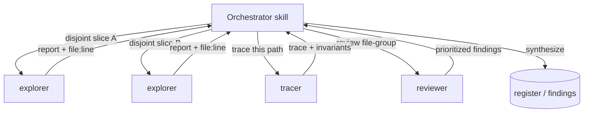

# Subagent trade-offs

This page is the routing table for subagent work: which agents exist, when a skill fans out to them, and what each dispatch costs. Read it before planning a fan-out, and before routing any dispatch to a tier or an effort level. It is the one page in this set that names concrete models, because a host needs the binding.

The skills in this suite rarely do their work in a single thread. A task with independent parts makes a skill *fan out*: it spawns scoped **subagents**, each with its own context window and its own narrow tools, and it synthesizes their reports. Independent parts are several areas to map, several diffs to review, or several claims to check.

## The short version

A subagent is a worker the orchestrator spawns with a precise question and a minimal toolset. It runs in an isolated context and hands back a tight, evidence-cited report. The orchestrator merges those reports. The suite ships eight subagents, and they split into two kinds:

| Kind | Agents | Tools | Fan-out rule |
| --- | --- | --- | --- |
| **Read-only** — investigate, never change anything | code-ops `explorer`, rigor `tracer`, privacy-opsec `explorer`, researcher `gatherer`, researcher `claim-checker`, code-ops `reviewer`, privacy-opsec `privacy-reviewer` | `Read, Grep, Glob` (the two reviewers add `Bash` for read-only checks) | Parallelize freely over disjoint areas. |
| **Write / execute** — produce artifacts or run code | rigor `verifier` | `Read, Grep, Glob, Bash, Write` | Used carefully, on disjoint files, and never editing the source under evaluation. |

One rule governs all of them, and it lives in code-ops-suite [`CONVENTIONS.md` §1](../../../plugins/code-ops-suite/CONVENTIONS.md). **Read-only analysis parallelizes freely. Anything that edits code runs in parallel only on disjoint file sets, and the orchestrator serializes work that touches shared files or dependency edges.** Every subagent grounds its report in `file:line` evidence ([§9](../../../plugins/code-ops-suite/CONVENTIONS.md)). The orchestrator keeps developer-in-the-loop control, so the subagents report and the orchestrator decides.

**How ambiguity routes to a tier.** Routing is quality-first and independent of the
lead's own tier. Judgment-bearing operative work runs at the **strong** tier, whether the
lead is frontier or strong. The rungs are provider-agnostic (frontier, then strong, then
mid), and `opus` is the strong rung in this suite's Claude models. The economics drive the
rule: a shallow or failed report costs a redispatch round-trip plus the lead's attention,
which is dearer than the strong tier's price premium. So the routing optimizes first-pass
quality rather than per-dispatch price. A tier below strong is for mechanical,
execution-only work whose brief leaves no ambiguity. Never route work below strong when a
verdict rests on its output, and never route below an agent's lint-enforced floor:

| Task shape | Route to | Effort | Why |
| --- | --- | --- | --- |
| Mechanical, low-ambiguity (structural mapping, transcription-style edits, leak-surface scans) | `haiku`-floor agents (`explorer`, `gatherer`, `mech`) — the one place the strong-tier default gives way, permitted only where a lint-enforced floor sets it | low (medium if the brief demands cross-file synthesis, and at least medium when the brief asks the operative to source or verify a name, because low effort answers from memory) | No judgment call to get wrong; cheapest tier that can do the read. |
| Moderate judgment (single-claim research, one candidate finding, execution-only work) | `sonnet`-floor agents (`claim-checker`, `verifier`, implementer) — the mid tier is the floor here, not the target: run them strong unless the brief leaves the operative nothing to decide | medium (ambiguity is resolved in the brief, not the dial); `claim-checker`/`tracer` go high on concurrency/aliasing/security flows | One bounded question with a clear kill/support test; `verifier` executes only, judgment stays with the lead. |
| High judgment, hard to reverse (bug-hunt tracing, diff review, execution-backed verdicts) | `opus`-floor agents (`tracer`, `reviewer`, `privacy-reviewer`, `verifier`) | `reviewer`/`privacy-reviewer` high | Wrong here poisons downstream consumers; the floor is deliberate, not a token-saving candidate — never below `AGENT_MODEL_FLOORS`. |
| Verdicts, tier assignment (CONFIRMED/PROBABLE/SPECULATIVE), acceptance of a subagent's report | The lead, at the highest tier present in the session | high; xhigh only for disputed verdicts and critical CONFIRMED calls | Subagents execute runs and cite evidence; only the lead closes the loop and is never down-tiered for this. |

Effort level names do not carry across model generations. When the lead model changes, re-run the effort sweep against the judgment evals before you trust the table above. Step a dispatch down only where quality held. Dispatch operatives in the background and continue independent work. Wait only when the next step depends on the result. On coding work, background dispatch lowers time to completion at similar quality and cost.

Three anti-patterns follow from the table:

- Never run the highest effort on a breadth sweep, because parallelism beats effort for coverage.
- Never run low effort on review.
- Never route a judgment-bearing dispatch below the strong tier on the argument that it is cheaper.

Effort and tier partially substitute, and the substitution is provider-agnostic: a stronger model at medium effort approximates a mid model at high effort. That substitution buys speed. It never licenses a down-tier for work whose output a verdict rests on.

### Which model satisfies a tier

The rungs above are provider-agnostic, so a host running a non-Anthropic model still needs to know which of its models clears a floor. `scripts/model-tiers.mjs` is the single source of truth for that binding. Both the lint gate and the opencode renderer read it, so the doctrine and the gate cannot describe different ladders. `light` names the mechanical, execution-only rung below `mid`, which the routing table always used and never named.

| Provider | `light` | `mid` | `strong` | `frontier` |
| --- | --- | --- | --- | --- |
| Anthropic (Claude) | `haiku` | `sonnet` | `opus` | `fable` |
| xAI (Grok) | `grok-4.6` | `grok-4.6` | `grok-4.6` | `grok-4.6` |
| OpenAI (GPT) | `gpt-5.6-luna` | `gpt-5.1` | `gpt-5.6-terra` | `gpt-5.6-sol` |
| Google (Gemini) | `gemini-3.1-flash-lite` | `gemini-3.6-flash` | `gemini-3.1-pro-preview` | `gemini-3.1-pro-preview` |
| Z.AI (GLM) | `glm-5` | `glm-5.1` | `glm-5.2` | `glm-5.2` |
| Moonshot AI (Kimi) | `kimi-k2.5` | `kimi-k2.7-code` | `kimi-k3` | `kimi-k3` |
| DeepSeek | `deepseek-v4-flash` | `deepseek-v4-flash` | `deepseek-v4-pro` | `deepseek-v4-pro` |
| Mistral | `magistral-small` | `mistral-medium-latest` | `magistral-medium-latest` | `magistral-medium-latest` |

The binding table is what makes the rest of the doctrine portable. The briefs, the fan-out rules, the disconfirmation pass, and the verification bar are identical on every provider. Only the bindings change. Adding a provider takes one `PROVIDER_TIERS` entry in `scripts/model-tiers.mjs` plus one `PROVIDER_SLUG_PATTERNS` line.

Where a provider repeats a model across rungs, its lineup carries no distinct model for the lower rung. The repeat is recorded rather than covered up with an invented tier. The xAI row is the exception, because it is flat by choice: `grok-4.6` never routes work below its floor, and running one model removes tier as a variable. The OpenAI split follows this repository's own calibration evidence rather than price, because runs R-007 and R-008 recorded `gpt-5-6-sol-xhigh` leading `gpt-5-6-terra-xhigh` operatives.

Effort remains variable on every provider, because the major providers expose the same low, medium, high, and xhigh scale.

Model ids are pinned, not fetched, so the renderer and the gate stay offline and deterministic. `REGISTRY_VERIFIED_AT` in `scripts/model-tiers.mjs` records when they were last checked. Re-verify them against the models.dev registry that opencode itself resolves through:

```bash
node scripts/check-model-registry.mjs --fetch
```

Agent frontmatter keeps declaring Anthropic aliases, because Claude Code reads that field directly. The canonical rung is what travels between hosts. The opencode renderer converts each agent's alias into a stated capability tier plus a per-provider binding table, because opencode resolves models per provider and a hardcoded alias would not bind.

The suite runs several read-only agents in parallel over disjoint areas, and it reserves the writing agent for careful, isolated use. [09 · Cost and scoping](../Handbook/09-cost-and-scoping.md) covers the cost of that parallelism.

---

## Reasons to fan out

Two reasons hold, and both are about a better answer for the same wall-clock time.

**Context isolation.** Each subagent gets a fresh, narrow context: one question, the files relevant to it, and nothing else. A `tracer` chasing a single data-flow path is not distracted by the twelve other files in the run, and its findings do not crowd the orchestrator's context with raw search output. The orchestrator sees only the report, dense and skimmable as every agent definition requires, rather than the hundred reads that produced it. Isolation is what keeps the synthesizing thread clear on large codebases.

**Parallel coverage.** Independent questions run at once. Mapping a 40-file subsystem is four explorers over four disjoint slices, not one explorer reading 40 files in series. Reviewing a large diff is several `reviewer`s over disjoint file-groups. The orchestrator runs an adaptive loop, *assess, plan units of work, fan out, collect, decide to deepen or broaden or converge, repeat* ([§1](../../../plugins/code-ops-suite/CONVENTIONS.md)), and fan-out is how each round covers breadth without going serial.

The trade-off is real. Every subagent is a fresh context that must be primed with its scope, so it adds token cost and some coordination overhead. Fan-out pays off when the parts are genuinely independent and each part is substantial enough to be worth a dedicated worker. For one small question, a direct read in the main thread is cheaper. See [09 · Cost and scoping](../Handbook/09-cost-and-scoping.md) for how the suite decides.

---

## The read-only agents

These seven never edit, and with the noted exception they never execute. Because they cannot change the tree, two of them touching the same file is harmless. So the orchestrator spawns as many as the work warrants, over whatever slices it likes, all at once.



**Mappers and tracers** (`Read, Grep, Glob`, no `Bash`):

- **code-ops `explorer`** (model: `haiku`): fast structural investigation. It maps structure, locates definitions and call-sites, traces flow, and gathers context. The definition says *"Use several in parallel to cover disjoint areas of a large codebase."*
- **rigor `tracer`** (model: `opus`): bug-hunting investigator. It traces one control-flow or data-flow path end to end, derives the invariants a piece of code must uphold, or finds every site of a concept. It separates what it verified by reading from what it infers. It also runs in a **refutation mode** ([rigor `§I`](../../../plugins/rigor/CONVENTIONS.md)): handed a peer's load-bearing finding, its sole task is to kill it by locating a dominating guard in a different function, file, or boundary, and it returns REFUTED with a `file:line` or SURVIVED.
- **privacy-opsec `explorer`** (model: `haiku`): leak-aware mapper. It finds egress paths, logging and telemetry, identifier and session handling, metadata sources, and proxy-bypass paths. It reports patterns rather than values, and it redacts identifiers and IP addresses.
- **researcher `gatherer`** (model: `haiku`): sources evidence from the codebase, the version-control history, and installed-dependency docs. It **never reaches the network**, because web sourcing is orchestrated at the skill level under the egress manifest. A gatherer that needs a web source hands the gap back rather than fetching it.

**Reviewers and checkers** stay read-only on the source while doing judgment work:

- **code-ops `reviewer`** (model: `opus`, tools add `Bash`): skeptical review of a specific diff, file, or file-group, returning findings grouped **Blocking / Should-fix / Nit**. Its `Bash` is for read-only verification only, such as running the existing tests or a linter. It never modifies and never commits. Like the `tracer`, it also runs in a **refutation mode** ([`§7`](../../../plugins/code-ops-suite/CONVENTIONS.md)): given a peer's Blocking candidate, it tries to kill it by finding the dominating guard elsewhere and returns REFUTED or SURVIVED. The [disconfirmation pass](disconfirmation-pass.md) describes that adversarial complement.
- **privacy-opsec `privacy-reviewer`** (model: `opus`, tools add `Bash`): the same shape against the anonymity and opsec model. It flags a new egress path, a new identifier vector, or a weakened default as **Blocking**. Its `Bash` is likewise read-only.
- **researcher `claim-checker`** (model: `sonnet`): adversarial verifier. Given one load-bearing claim, it tries to kill the claim against the actual code and the cited sources, then returns **SUPPORTED / PARTIAL / UNSUPPORTED** with an evidence tier. Use one per claim, in parallel.

Because none of these write, the orchestrator can run four code-ops `explorer`s and two `reviewer`s at once with no conflict risk. The reviewers' `Bash` is the only nuance. It runs read-only commands such as a test suite or a linter, so two reviewers running tests at once is a resource question rather than a correctness one.

---

## The writing agent

One agent in the suite can write files and run arbitrary commands: **rigor `verifier`** (model: `opus`, tools `Read, Grep, Glob, Bash, Write`). It exists so that **CONFIRMED** means something. Given one candidate finding, it writes the smallest repro that would fail if the bug is real, runs it, observes the actual output, and assigns the tier accordingly. [The disconfirmation pass](disconfirmation-pass.md) covers that loop.

The `opus` floor here is a deliberate decision, not a token-saving candidate. A wrong CONFIRMED poisons every downstream consumer of the register (`AGENT_MODEL_FLOORS` in `scripts/lint-plugins.mjs`), so nothing depends on this agent being cheap.

Hard rules in the agent definition fence its extra power:

- **It never edits the source under evaluation.** Repro and scratch files go to a temporary or test location, kept clearly separate. `Bash` and `Write` serve repros, tests, and benchmarks only, and the agent never commits.
- **It reports only what it actually ran:** the real command and the real output, never a claimed result. A candidate it could not reproduce is reported as PROBABLE or SPECULATIVE, never quietly upgraded.
- **It records every run.** Each repro, mutation, and benchmark runs through `node ${CLAUDE_PLUGIN_ROOT}/scripts/run-proof.mjs record -- <cmd>`, which leaves a replayable receipt in `RUN_RECEIPTS.md`. A claimed result with no receipt is narration, not proof.

So even the one writing agent is write-isolated from the code being judged. When a skill needs several verifiers, the fan-out rule from [§1](../../../plugins/code-ops-suite/CONVENTIONS.md) applies in full. Give each verifier a **disjoint** repro target so the artifacts cannot collide, and serialize anything that would touch a shared file.

---

## A typical fan-out

A typical pattern over a large area runs in four steps:

1. **Broaden, read-only.** Spawn several mappers in parallel over disjoint slices: code-ops `explorer`s for structure, a privacy-opsec `explorer` for leak surfaces, a rigor `tracer` for a suspect path. They run at once because none of them writes.
2. **Synthesize.** The orchestrator merges the reports into a candidate picture, with all evidence carrying `file:line` ([§9](../../../plugins/code-ops-suite/CONVENTIONS.md)).
3. **Deepen, carefully.** For each load-bearing candidate, dispatch the right judge: a `reviewer` or `privacy-reviewer` for a diff slice, a `claim-checker` for a research claim, or a `verifier` on a disjoint repro target to prove or kill it by execution.
4. **Decide.** The orchestrator, not the subagents, records the result and stays developer-in-the-loop.

The skill chooses how many agents and over what slices, based on the size and independence of the work. That choice is a cost-and-scoping judgment, not a fixed recipe.

## Related

- [09 · Cost and scoping](../Handbook/09-cost-and-scoping.md): the token cost of fan-out and how the suite decides how wide to go.
- [The disconfirmation pass](disconfirmation-pass.md): what the `verifier` and `claim-checker` do to earn or kill a tier.
- [05 · Evidence and tiers](../Handbook/05-evidence-and-tiers.md): the `file:line` evidence and CONFIRMED, PROBABLE, and SPECULATIVE tiers every subagent reports against.
- [03 · Orchestrators](../Handbook/03-orchestrators.md): the full-sweep skills that drive the fan-out loop.
- [Context hygiene](context-hygiene.md): batching follow-ups before a subagent's prompt cache expires, and using a fresh brief as the compaction.

*Verified-at: b0ffede*
