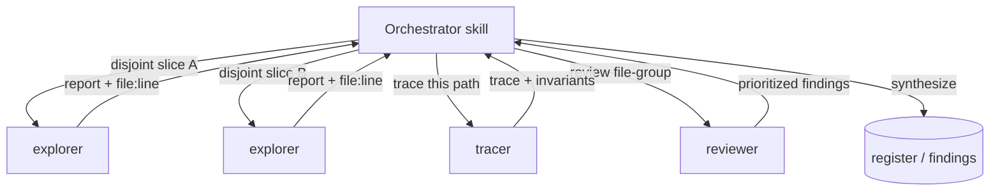

# Subagent trade-offs

The skills in this suite rarely do their work in a single thread. When a task has independent parts — several areas to map, several diffs to review, several claims to check — a skill *fans out*: it spawns scoped **subagents**, each with its own context window and its own narrow tools, and synthesizes their reports. This page is a short how-to: which subagents exist, when a skill fans out to them, and the trade-offs you are buying when it does.

## The short version

A subagent is a worker the orchestrator spawns with a precise question and a minimal toolset. It runs in an isolated context and hands back a tight, evidence-cited report; the orchestrator merges those reports. The suite ships eight of them, and they split cleanly into two kinds:

| Kind | Agents | Tools | Fan-out rule |
| --- | --- | --- | --- |
| **Read-only** — investigate, never change anything | code-ops `explorer`, rigor `tracer`, privacy-opsec `explorer`, researcher `gatherer`, researcher `claim-checker`, code-ops `reviewer`, privacy-opsec `privacy-reviewer` | `Read, Grep, Glob` (the two reviewers add `Bash` for read-only checks) | Parallelize freely over disjoint areas. |
| **Write / execute** — produce artifacts or run code | rigor `verifier` | `Read, Grep, Glob, Bash, Write` | Used carefully, on disjoint files, and never editing the source under evaluation. |

The single rule that governs all of them lives in code-ops-suite [`CONVENTIONS.md` §1](../../../plugins/code-ops-suite/CONVENTIONS.md): **read-only analysis parallelizes freely; anything that edits code runs in parallel only on disjoint file sets, and work touching shared files or dependency edges is serialized.** Every subagent grounds its report in `file:line` evidence ([§9](../../../plugins/code-ops-suite/CONVENTIONS.md)) and the orchestrator keeps developer-in-the-loop control — the subagents report, the orchestrator decides.

**How ambiguity routes to a tier:** routing is quality-first and independent of the
lead's own tier — judgment-bearing operative work runs at the **strong** tier
(provider-agnostic: frontier > strong > mid; `opus` in this suite's Claude models),
whether the lead is frontier or strong. The economics drive it: a shallow or failed
report costs a redispatch round-trip plus the lead's attention, which is dearer than
the strong tier's price premium, so the routing optimizes first-pass quality rather
than per-dispatch price. A tier below strong is for mechanical, execution-only work
whose brief leaves no ambiguity — never for anything whose output a verdict rests on,
and never below an agent's lint-enforced floor:

| Task shape | Route to | Effort | Why |
| --- | --- | --- | --- |
| Mechanical, low-ambiguity (structural mapping, transcription-style edits, leak-surface scans) | `haiku`-floor agents (`explorer`, `gatherer`, `mech`) — the one place the strong-tier default gives way, permitted only where a lint-enforced floor sets it | low (medium if the brief demands cross-file synthesis, and at least medium when the brief asks the operative to source or verify a name, because low effort answers from memory) | No judgment call to get wrong; cheapest tier that can do the read. |
| Moderate judgment (single-claim research, one candidate finding, execution-only work) | `sonnet`-floor agents (`claim-checker`, `verifier`, implementer) — the mid tier is the floor here, not the target: run them strong unless the brief leaves the operative nothing to decide | medium (ambiguity is resolved in the brief, not the dial); `claim-checker`/`tracer` go high on concurrency/aliasing/security flows | One bounded question with a clear kill/support test; `verifier` executes only, judgment stays with the lead. |
| High judgment, hard to reverse (bug-hunt tracing, diff review, execution-backed verdicts) | `opus`-floor agents (`tracer`, `reviewer`, `privacy-reviewer`, `verifier`) | `reviewer`/`privacy-reviewer` high | Wrong here poisons downstream consumers; the floor is deliberate, not a token-saving candidate — never below `AGENT_MODEL_FLOORS`. |
| Verdicts, tier assignment (CONFIRMED/PROBABLE/SPECULATIVE), acceptance of a subagent's report | The lead, at the highest tier present in the session | high; xhigh only for disputed verdicts and critical CONFIRMED calls | Subagents execute runs and cite evidence; only the lead closes the loop and is never down-tiered for this. |

Effort level names do not carry across model generations. When the lead model changes, re-run the effort sweep against the judgment evals before trusting this table, and step a dispatch down only where quality held. Dispatch operatives in the background and continue independent work. Wait only when the next step depends on the result. On coding work that lowers time to completion at similar quality and cost.

Anti-patterns: no xhigh/max on breadth sweeps — parallelism beats effort for coverage; no low on review; no judgment-bearing dispatch below the strong tier on the argument that it is cheaper. Effort and tier partially substitute (a stronger model at medium approximates a mid model at high, provider-agnostic), but the substitution buys speed, not a licence to down-tier work whose output a verdict rests on.

### Which model satisfies a tier

The rungs above are provider-agnostic, so a host running a non-Anthropic model still needs to know which of its models clears a floor. `scripts/model-tiers.mjs` is the single source of truth for that binding; both the lint gate and the opencode renderer read it, so the doctrine and the gate cannot describe different ladders. `light` names the rung this table always had but never named — the mechanical tier below `mid`.

| Provider | `light` | `mid` | `strong` | `frontier` |
| --- | --- | --- | --- | --- |
| Anthropic (Claude) | `haiku` | `sonnet` | `opus` | `fable` |
| xAI (Grok) | `grok-4.6` | `grok-4.6` | `grok-4.6` | `grok-4.6` |
| OpenAI (GPT) | `gpt-5.6-luna` | `gpt-5.1` | `gpt-5.6-terra` | `gpt-5.6-sol` |
| Google (Gemini) | `gemini-3.1-flash-lite` | `gemini-3.6-flash` | `gemini-3.1-pro-preview` | `gemini-3.1-pro-preview` |
| Z.AI (GLM) | `glm-5` | `glm-5.1` | `glm-5.2` | `glm-5.2` |
| Moonshot AI (Kimi) | `kimi-k2.5` | `kimi-k2.7-code` | `kimi-k3` | `kimi-k3` |
| DeepSeek | `deepseek-v4-flash` | `deepseek-v4-flash` | `deepseek-v4-pro` | `deepseek-v4-pro` |
| Mistral | `magistral-small` | `mistral-medium-latest` | `magistral-medium-latest` | `magistral-medium-latest` |

This table is what makes the rest of the doctrine portable. The briefs, the fan-out rules, the disconfirmation pass, and the verification bar are identical on every provider; only the bindings change. Adding a provider is one entry in `scripts/model-tiers.mjs`.

Where a provider repeats a model across rungs, its lineup has no distinct model for the lower one — recorded rather than papered over with an invented tier. The xAI row is the exception: it is flat by choice, since `grok-4.6` never routes work below its floor and removes tier as a variable. The OpenAI split follows this repo's own calibration evidence rather than price — runs R-007 and R-008 recorded `gpt-5-6-sol` leading `gpt-5-6-terra` operatives.

Effort stays the live dial everywhere, because the major providers expose the same low/medium/high/xhigh scale.

Model ids are pinned, not fetched, so the renderer and the gate stay offline and deterministic. Re-verify them against the models.dev registry that opencode itself resolves through:

```bash
node scripts/check-model-registry.mjs --fetch
```

Agent frontmatter keeps declaring Anthropic aliases, because Claude Code reads that field directly. The canonical rung is what travels: the opencode renderer converts each agent's alias into a stated capability tier plus a per-provider binding table, since opencode resolves models per provider and a hardcoded alias would not bind.

The suite uses *several* read-only agents in parallel over disjoint areas to move fast, and reserves the writing/executing agent for careful, isolated use. The cost it pays for that parallelism is covered in [09 · Cost and scoping](../Handbook/09-cost-and-scoping.md).

---

## Why fan out at all

Two reasons, both about getting a better answer for the same wall-clock time.

**Context isolation.** Each subagent gets a fresh, narrow context: one question, the files relevant to it, nothing else. A `tracer` chasing a single data-flow path is not distracted by the twelve other files in the run, and its findings do not crowd the orchestrator's context with raw search output. The orchestrator sees only the *report* — dense and skimmable, as every agent definition requires — not the hundred reads that produced it. That keeps the synthesizing thread clear-headed on large codebases.

**Parallel coverage.** Independent questions run at once. Mapping a 40-file subsystem is four explorers over four disjoint slices, not one explorer reading 40 files in series. Reviewing a large diff is several `reviewer`s over disjoint file-groups. The orchestrator runs an adaptive loop — *assess → plan units of work → fan out → collect → decide to deepen/broaden/converge → repeat* ([§1](../../../plugins/code-ops-suite/CONVENTIONS.md)) — and fan-out is how each round covers breadth without going serial.

The trade-off is real: every subagent is a fresh context that must be primed with its scope, so it adds token cost and a little coordination overhead. Fan-out pays off when the parts are genuinely independent and each is substantial enough to be worth a dedicated worker. For one small question, a direct read in the main thread is cheaper. See [09 · Cost and scoping](../Handbook/09-cost-and-scoping.md) for how the suite decides.

---

## The read-only agents — parallelize freely

These seven never edit and (with the noted exception) never execute. Because they cannot change the tree, two of them touching the same file is harmless — so the orchestrator spawns as many as the work warrants, over whatever slices it likes, all at once.



**Mappers and tracers** (`Read, Grep, Glob`, no `Bash`):

- **code-ops `explorer`** (model: `haiku`) — fast structural investigation: map structure, locate definitions and call-sites, trace flow, gather context. The definition explicitly says *"Use several in parallel to cover disjoint areas of a large codebase."*
- **rigor `tracer`** (model: `opus`) — bug-hunting investigator. Traces one control- or data-flow path end-to-end hop by hop, derives the invariants/contracts a piece of code must uphold, or finds every site of a concept. Distinguishes what it *verified by reading* from what it *infers*. Also runs in a **refutation mode** (`§I`): handed a peer's load-bearing finding, its sole task is to kill it by locating a dominating guard/handler in a *different* function/file/boundary, returning REFUTED (with `file:line`) or SURVIVED.
- **privacy-opsec `explorer`** (model: `haiku`) — leak-aware mapper. Finds egress paths, logging/telemetry, identifier/session handling, metadata sources, and proxy-bypass paths. Reports patterns, not values, and redacts identifiers/IPs.
- **researcher `gatherer`** (model: `haiku`) — sources evidence from the codebase, version-control history, and installed-dependency docs. It **never reaches the network** — web sourcing is orchestrated at the skill level under the egress manifest, so a gatherer that needs a web source hands the gap back rather than fetching it.

**Reviewers and checkers** — still read-only on the source, but doing judgment work:

- **code-ops `reviewer`** (model: `opus`, tools add `Bash`) — skeptical review of a specific diff/file/file-group, returning findings grouped **Blocking / Should-fix / Nit**. Its `Bash` is for *read-only verification only* (run the existing tests or a linter); it does not modify or commit. Like the `tracer`, it also runs in a **refutation mode** (`§7`): given a peer's Blocking candidate, it tries to kill it by finding the dominating guard elsewhere and returns REFUTED or SURVIVED — the adversarial complement described in the [disconfirmation pass](disconfirmation-pass.md).
- **privacy-opsec `privacy-reviewer`** (model: `opus`, tools add `Bash`) — the same shape, but against the anonymity & opsec model: a new egress path, a new identifier vector, a weakened default, and similar are flagged **Blocking**. `Bash` is likewise read-only.
- **researcher `claim-checker`** (model: `sonnet`) — adversarial verifier. Given one load-bearing claim, it tries to *kill* it against the actual code and the cited sources, then returns **SUPPORTED / PARTIAL / UNSUPPORTED** with an evidence tier. Used one per claim, in parallel.

Because none of these write, the orchestrator can run, say, four code-ops `explorer`s and two `reviewer`s concurrently with no conflict risk. The `reviewer`s' `Bash` is the only nuance: it runs read-only commands (a test suite, a linter), so two reviewers running tests at once is a resource question, not a correctness one.

---

## The write/execute agent — used carefully

One agent in the suite can write files and run arbitrary commands: **rigor `verifier`** (model: `opus`, tools `Read, Grep, Glob, Bash, Write`). It exists so that **CONFIRMED** means something — given one candidate finding, it writes the smallest repro/test that would fail if the bug is real, runs it, observes the actual output, and assigns the tier accordingly (covered in [the disconfirmation pass](disconfirmation-pass.md)).

The `opus` floor here is a deliberate decision, not a token-saving candidate: a wrong CONFIRMED poisons every downstream consumer of the register (`AGENT_MODEL_FLOORS` in `scripts/lint-plugins.mjs`) — nothing depends on this agent being cheap.

Its extra power is fenced by hard rules in the agent definition:

- **It never edits the source under evaluation.** Repro and scratch files go to a temp or test location, kept clearly separate. `Bash` and `Write` are *for repros, tests, and benchmarks only*, and it does not commit.
- **It reports only what it actually ran** — the real command and real output, never a claimed result. A candidate it could not reproduce is reported as PROBABLE/SPECULATIVE, not quietly upgraded.

So even the one writing agent is, in practice, write-isolated from the code being judged. When a skill needs *multiple* verifiers, the fan-out rule from [§1](../../../plugins/code-ops-suite/CONVENTIONS.md) applies in full: give each one a **disjoint** repro target so their artifacts cannot collide, and serialize anything that would touch a shared file.

---

## How a skill actually fans out

Putting it together, a typical pattern over a large area:

1. **Broaden, read-only.** Spawn several mappers in parallel over disjoint slices — code-ops `explorer`s for structure, a privacy-opsec `explorer` for leak surfaces, a rigor `tracer` for a suspect path. They run at once because none of them writes.
2. **Synthesize.** The orchestrator merges the reports into a candidate picture, all evidence carrying `file:line` ([§9](../../../plugins/code-ops-suite/CONVENTIONS.md)).
3. **Deepen, carefully.** For each load-bearing candidate, dispatch the right judge: `reviewer`/`privacy-reviewer` for a diff slice, `claim-checker` for a research claim, or a `verifier` to prove-or-kill by execution — the verifier on a disjoint repro target.
4. **Decide.** The orchestrator, not the subagents, records the result and stays developer-in-the-loop.

The skill chooses *how many* and *over what slices* based on the size and independence of the work — which is a cost-and-scoping judgment, not a fixed recipe.

## Related

- [09 · Cost and scoping](../Handbook/09-cost-and-scoping.md) — the token cost of fan-out and how the suite decides how wide to go.
- [The disconfirmation pass](disconfirmation-pass.md) — what the `verifier` and `claim-checker` do to earn (or kill) a tier.
- [05 · Evidence and tiers](../Handbook/05-evidence-and-tiers.md) — the `file:line` evidence and CONFIRMED/PROBABLE/SPECULATIVE tiers every subagent reports against.
- [03 · Orchestrators](../Handbook/03-orchestrators.md) — the full-sweep skills that drive the fan-out loop.
- [Context hygiene](context-hygiene.md) — batching follow-ups before a subagent's prompt cache expires, and using a fresh brief as the compaction.

*Verified-at: c2b37e9*
