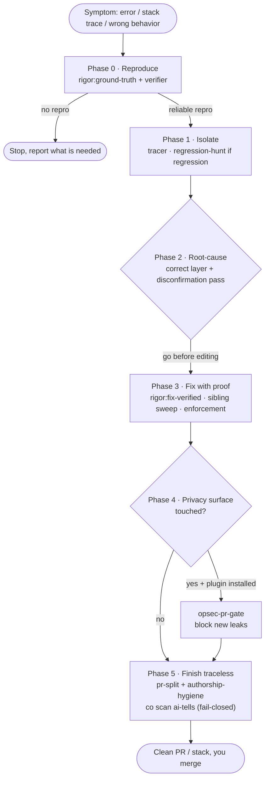
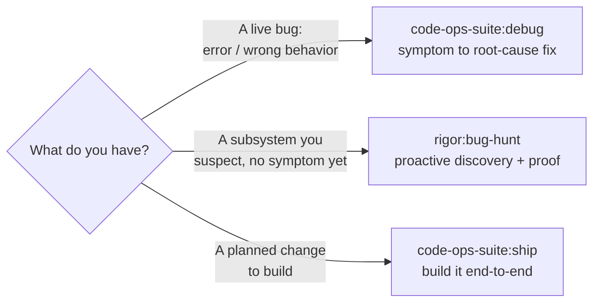

# Debug: symptom to root cause

This guide walks one live bug from a symptom to a proven root-cause fix with
[`/code-ops-suite:debug`](../40 Engineering/Handbook/commands/code-ops-suite.md).
Read it when you are on call, holding an error, a stack trace, or a wrong result, and you
want the cause fixed rather than the symptom patched. To build new capability, read
[Ship a verified fix](ship-a-verified-fix.md) instead.

## What debug is for

It is 02:00, an endpoint is throwing, and you have a stack trace. You want the bug reproduced,
isolated to its real cause, fixed at the right layer, and locked behind a regression test that
failed a moment ago and passes now.

`debug` is an orchestrator in the code-ops-suite plugin, the spine. It owns the sequencing and the
checkpoints. It does not invent its own verification. It composes the `rigor` layer (verifier,
tracer, `regression-hunt`, `fix-verified`) and, when the fix touches a privacy surface, the
`privacy-opsec-suite` anonymity track. It runs six phases and pauses at the two checkpoints that
carry a real decision:

| Phase | What happens | Composes | Checkpoint? |
|------|--------------|----------|-------------|
| 0 · Reproduce | Capture the symptom, take a baseline, build a reliable reproduction | [`rigor:ground-truth`](../40 Engineering/Handbook/commands/rigor.md) plus rigor's verifier | Yes |
| 1 · Isolate | Trace the control and data path, derive invariants, narrow the triggering path, bisect a regression | rigor's tracer plus [`rigor:regression-hunt`](../40 Engineering/Handbook/commands/rigor.md) | No |
| 2 · Root-cause | Name the real cause at the correct layer, cited `file:line`, after a disconfirmation pass | [disconfirmation pass](../40 Engineering/Techniques/disconfirmation-pass.md) | Yes (before any edit) |
| 3 · Fix with proof | Repro passes, suite green, regression guard holds, sibling sweep, enforcement added | [`rigor:fix-verified`](../40 Engineering/Handbook/commands/rigor.md) | No |
| 4 · Privacy gate | Block any new leak, egress, or identifier the fix introduced, fail-closed preserved | [`opsec-pr-gate`](../40 Engineering/Handbook/commands/privacy-opsec-suite.md) | Conditional |
| 5 · Finish traceless | Clean PR or stack, scrubbed of tool trace, scanner green | [`pr-split`](../40 Engineering/Handbook/commands/code-ops-suite.md) plus [`authorship-hygiene`](../40 Engineering/Handbook/commands/privacy-opsec-suite.md) | Yes (before push) |

Three hard rules govern the run:

1. `debug` requires `rigor`, which supplies the verifier, the tracer, `regression-hunt`, and `fix-verified`.
2. No reproduction, no fix. If the symptom cannot be reproduced, `debug` stops at Phase 0 and reports what it needs.
3. `debug` never auto-merges. At every automation level the fix lands as a commit or pull request for a person to merge.

The privacy phase is different. It runs only when `privacy-opsec-suite` is installed and the fix
touches a privacy surface.

## The walkthrough

Take a concrete symptom: `/api/export` returns 500 with `TypeError: cannot read length of
undefined` whenever the result set is empty. You have a stack trace and an error-tracker link.
Invoke:

```
/code-ops-suite:debug
```

and hand it the symptom. An error, a stack trace, or a description of wrong behavior all work,
because `debug` consumes a symptom.

### Phase 0 · Reproduction (checkpoint)

The first thing `debug` does is not propose a fix. It captures the symptom precisely and runs
[`/rigor:ground-truth`](../40 Engineering/Handbook/commands/rigor.md) for the factual baseline:
build, typecheck, lint, and the test suite with a coverage map, recorded as facts in
`GROUND_TRUTH.md`. Then it uses rigor's verifier to build a reliable reproduction, meaning a
failing test or a runnable repro that triggers the symptom on demand. For this bug that is a test
calling the export path with an empty result set and asserting on the 500.

This gate defines `debug`. If the bug cannot be reproduced, the orchestrator stops here and reports
exactly what is missing: the environment, the data, or the steps. A fix you cannot demonstrate
against a failing repro is a hope, not a fix. The reproduction is what later turns "I think it is
fixed" into "it failed before and passes now."

> **Checkpoint.** You decide the automation level (`CONVENTIONS §4`) for the whole run and confirm that the reproduction captures your symptom. If `debug` cannot reproduce, you supply what it asked for or accept that the bug is not yet actionable.

The automation level set here governs every code-changing step downstream:

- `gated` (default) pauses for approval at each fix or closure batch.
- `auto-safe` (recommended ceiling) auto-applies only NOW-SAFE items and still pauses for NEEDS-REVIEW, NEEDS-DESIGN, and the always-gated categories.
- `auto-all` is not recommended.

The always-gated categories hold at every level: security and auth changes, secret handling, data
migrations or destructive operations, and public API or contract changes. Nothing in those classes
auto-applies, and nothing ever auto-merges.

### Phase 1 · Isolation

With a reliable repro in hand, `debug` narrows the blast radius. It traces the control and data
path with rigor's tracer and derives the invariants the code is supposed to hold, here something
like "the pager always receives an array, never `undefined`." It then narrows to the smallest
triggering path, meaning the exact branch where an empty query result reaches code that assumes a
non-empty array.

Tracing is where a run wastes the most context, so use the symbol index instead of reading files
whole. `co context query find <symbol>` returns the definition as a `file:line` anchor,
`co context query callers <symbol>` returns every call site, and `co context query blast <symbol>`
returns the reachable surface. Read the outline of a large file with `co context skim <file>`,
then read only the range the outline names. The index refreshes after an edit through the
`CODE_OPS_INDEX` PostToolUse hook, which is on by default and switched off with `off`, `0`, or
`false` in the `env` block of a `.claude/settings.json`. The contract is in
[Contracts](../35 Contracts and Data/CONTRACTS.md) and the switches are in
[Infrastructure](../50 Platform/INFRASTRUCTURE.md).

If the symptom is a regression, meaning it used to work, `debug` runs
[`/rigor:regression-hunt`](../40 Engineering/Handbook/commands/rigor.md) to bisect version-control
history to the commit that introduced it. The report names the offending commit, what it changed,
and why it broke. That turns "when did this start?" into a cited fact.

Isolation is read-only. No production code changes yet.

### Phase 2 · Root cause (checkpoint before any edit)

Now `debug` identifies the real cause at the correct layer rather than the nearest place the error
surfaces. The `TypeError` surfaces in the pager, but the root cause may be a data-access function
that returns `undefined` instead of `[]` on an empty result. Fixing the pager would silence the
symptom and leave the contract violation in place to bite elsewhere. `debug` names the cause with a
cited `file:line`.

Before that cause is accepted, `debug` runs the
[disconfirmation pass](../40 Engineering/Techniques/disconfirmation-pass.md), the single
highest-leverage filter against a wrong diagnosis. Each candidate cause is attacked with four
questions. Is the path actually reachable? Is the case already handled by a caller, wrapper,
framework, or type? Is the behavior intentional? Is it already tested? Only a cause that survives
all four is reported. This is the same `§B` move `rigor` applies to every finding.

> **Checkpoint.** `debug` presents the root cause and the proposed fix, then gets your approval before editing. Here you confirm it is fixing the cause at the correct layer. For this bug: fix the data-access function to return `[]`, do not patch the pager.

### Phase 3 · Fix with proof

With the cause confirmed and approval in hand, `debug` runs the
[`/rigor:fix-verified`](../40 Engineering/Handbook/commands/rigor.md) fix-prove-guard loop. Four
things must hold to leave this phase:

1. The repro passes. The empty-result test that failed in Phase 0 is green after the minimal correct fix at the right layer.
2. The full suite is green, so the fix broke nothing visible.
3. The regression guard holds (`rigor §H`), re-running the whole accumulated proof set plus the suite.
4. Siblings are swept and an enforcement is added, so the class cannot recur unnoticed.

The fourth point separates `debug` from a one-off patch. It sweeps the codebase for other sites of
the same cause (`§G`), meaning every other call site that assumes the data-access function never
returns `undefined`, and fixes the whole class. Then it adds an enforcement: a kept regression test
plus a type, lint rule, or assertion. A bug fixed without its siblings pages you again next week
wearing a different stack trace.

Never weaken a proof to make the fix pass. A change that breaks a prior proof is rejected and
reworked.

If the sibling sweep turns into a cascade, meaning three or more fixes rejected by the regression
guard or spawning new CONFIRMED findings, the cascade circuit-breaker (`rigor §H` and code-ops
`§11`) stops the fix loop. It reclassifies the cluster as NEEDS-DESIGN. A cascade is an
architectural signal, not a bug collection.

The code-economy ladder bounds what the fix may add. Ask whether the code needs to exist, whether
it exists here, whether the standard library or an installed dependency does it, and whether it
fits inside the owning module. Mark a deliberate simplification with a
`deferred(<ceiling>, <upgrade path>)` comment. The mechanical floor is the over-build scanner:

```
node ${CLAUDE_PLUGIN_ROOT}/scripts/co.mjs scan overbuild --git <range>
```

It is advisory except for an unrecorded dependency, and `co scan deferrals` harvests every
`deferred(...)` marker into a register. Both verbs resolve only inside `code-ops-suite`.

### Phase 4 · Privacy gate (conditional)

This phase runs only when both conditions hold: `privacy-opsec-suite` is installed, and the fix
touches a privacy surface (egress, logging, identifiers, or a default). The empty-result fix
touches none of those, so `debug` skips it here.

Suppose instead the fix had added a diagnostic log line carrying the exporting user's ID, or a
retry that opened a new outbound request. Then `debug` runs the anonymity track's pre-merge gate,
[`/privacy-opsec-suite:opsec-pr-gate`](../40 Engineering/Handbook/commands/privacy-opsec-suite.md).
That gate treats six things as blocking: a new egress path or fail-closed bypass, a new log line
touching PII, identifiers, or IPs, a new identifier or fingerprint vector, a new correlation
surface, a phone-home dependency, and any weakened default. An anonymity regression introduced by a
bug fix is blocked, not waved through as an advisory note.

### Phase 5 · Traceless finish (checkpoint before push)

The bug is fixed and proven. Now it has to land, reading like you wrote it at the keyboard.

- If the fix is multi-part, because the sibling sweep touched several areas, `debug` runs [`/code-ops-suite:pr-split`](../40 Engineering/Handbook/commands/code-ops-suite.md) to carve the work into a stack of independently-green pull requests.
- Otherwise it ships a single pull request, scrubbed by [`/privacy-opsec-suite:authorship-hygiene`](../40 Engineering/Handbook/commands/privacy-opsec-suite.md) across attribution metadata, prose voice, and code idiom.

The mechanical floor under both is the bundled scanner, run fail-closed:

```
node ${CLAUDE_PLUGIN_ROOT}/scripts/co.mjs scan ai-tells <commit-range-or-pr-body-file>
```

The verb resolves to `scan-ai-tells.mjs`, which both `code-ops-suite` and `privacy-opsec-suite`
bundle. It flags attribution trailers, tool and assistant markers, emoji, em-dash density over a
threshold, assistant-prose tells, and `## Test plan` boilerplate. It exits non-zero on any hit, so
it can gate the push. The push aborts when the trace cannot be cleaned. If `privacy-opsec-suite` is
absent, `debug` runs the same scanner directly and the floor is identical.

> **Checkpoint.** Under `gated` the run pauses before the outward-facing push. Nothing is auto-merged either way. You get the summary and the pull request links, and you click merge.

## The flow at a glance



The two diamonds are the checkpoints with teeth: Phase 2 confirms the cause before any edit, and
Phase 4 decides the privacy gate. The stop branch out of Phase 0 is the rule that makes `debug`
trustworthy, because it halts and asks rather than guessing.

## Definition of done

From the skill's own *Done when*, the bug is closed when all of these hold:

- the symptom is reproduced, then resolved
- the fix lands at root cause, with a regression test that failed before and passes now
- siblings are handled and an enforcement is added so the class cannot recur
- the regression guard and the full suite are green
- privacy posture is intact, when the privacy phase applied
- the work ships as a clean, trace-free pull request, with nothing auto-merged

## Choosing debug over its siblings

`debug` is symptom-driven and singular: one known bug, driven to a proven fix. Two sibling skills
cover the adjacent jobs, and choosing right saves a wasted run.



`debug` against [`rigor:bug-hunt`](../40 Engineering/Handbook/commands/rigor.md): `debug` is
symptom-driven, so you already have a concrete failure and want it fixed. `bug-hunt` is proactive
discovery. Point it at your riskiest subsystem with no symptom in hand, and it derives invariants,
traces flow, and proves each candidate with a runnable repro before flagging it. `debug`'s Phase 3
uses the same `fix-verified` loop that consumes `bug-hunt`'s CONFIRMED findings, so the two compose
cleanly.

`debug` against [`ship`](ship-a-verified-fix.md): `ship` builds one new change end to end with
proof and a traceless finish. `debug` starts from a symptom and adds the reproduce, isolate, and
root-cause arc that `ship` does not need. Use `ship` to add capability. Use `debug` when capability
that should already work is broken.

If you cannot yet produce a reproduction, `debug` stops and asks for what it needs. That is the
correct behavior, not a failure.

## Place in the four-plugin model

- code-ops-suite, the spine, owns `debug` itself and its phase sequencing.
- rigor, the verification layer, supplies the verifier, the tracer, `regression-hunt`, and `fix-verified`. `debug` requires it.
- privacy-opsec-suite, the anonymity track, supplies the leak gate and `authorship-hygiene`.

The shared backbone runs through all of it: developer-in-the-loop checkpoints, evidence at
`file:line`, behavior preservation, registers as the single source of truth, and the automation
ladder with its always-gated categories.

## See also

- [code-ops-suite command reference](../40 Engineering/Handbook/commands/code-ops-suite.md) for the full `debug` entry.
- [rigor command reference](../40 Engineering/Handbook/commands/rigor.md) for `ground-truth`, `regression-hunt`, and `fix-verified` at depth.
- [The disconfirmation pass](../40 Engineering/Techniques/disconfirmation-pass.md) for the questions that kill a wrong diagnosis.
- [Ship a verified fix](ship-a-verified-fix.md) for the build-a-change counterpart.
- [Orchestrators](../40 Engineering/Handbook/03-orchestrators.md) for choosing between `debug`, `ship`, and `everything`.
- [Evidence and tiers](../40 Engineering/Handbook/05-evidence-and-tiers.md) for CONFIRMED, PROBABLE, and SPECULATIVE.

*Verified-at: b0ffede*
