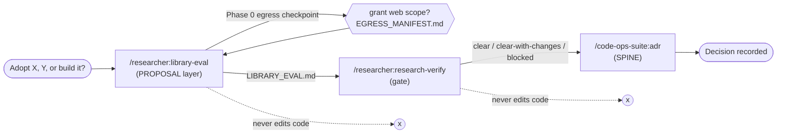
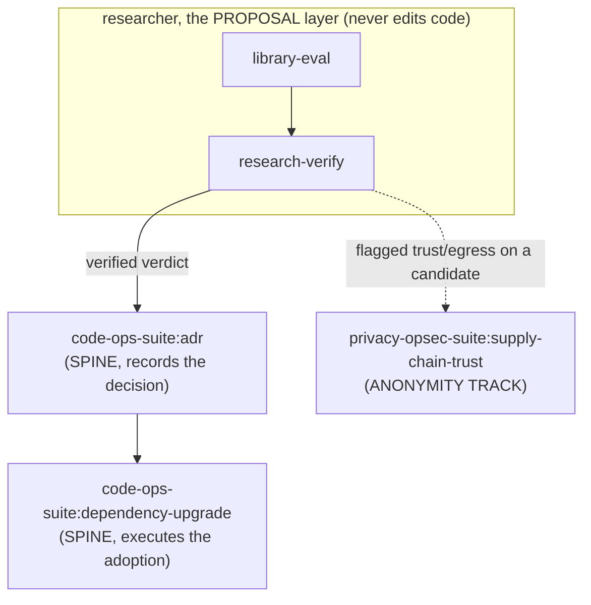

# Research a library choice

This guide walks one adoption decision from an A-versus-B-versus-build question to a
recorded architecture decision. Read it when you are the tech lead who must prove a
library choice before anyone writes code. The `researcher` plugin is the proposal layer,
so it researches, proposes, and hands off, and it never edits code.

Three commands carry the decision:
[`/researcher:library-eval`](../40 Engineering/Handbook/commands/researcher.md) produces the
grounded recommendation,
[`/researcher:research-verify`](../40 Engineering/Handbook/commands/researcher.md) gates it, and
[`/code-ops-suite:adr`](../40 Engineering/Handbook/commands/code-ops-suite.md) records it.

## Orientation

You need to pick a library. The wrong call is expensive, through migration cost, lock-in, and a new
outbound path you did not want. So "I read a blog post and it looked good" is not enough. The
researcher answers the question as a verdict a senior engineer can act on: each candidate's real
capabilities verified against the installed version rather than memory, how each fits your code,
the migration cost, and a tiered recommendation with the smallest adoption slice.

Three moves, in order:

| Step | Command | What you get | Edits code? |
|------|---------|--------------|-------------|
| 1 · Evaluate | [`/researcher:library-eval`](../40 Engineering/Handbook/commands/researcher.md) | `LIBRARY_EVAL.md` with an A-vs-B-vs-build recommendation, comparison table, migration cost, smallest slice, plus `EGRESS_MANIFEST.md` if any web source was used | No |
| 2 · Verify | [`/researcher:research-verify`](../40 Engineering/Handbook/commands/researcher.md) | A per-claim verdict report (SUPPORTED, PARTIAL, UNSUPPORTED) that gates the recommendation | No |
| 3 · Record | [`/code-ops-suite:adr`](../40 Engineering/Handbook/commands/code-ops-suite.md) | A decision record in context, options, decision, consequences form | Writes the ADR doc, not the integration |

Four rules carry the whole journey:

1. **The researcher proposes and never mutates source.** Its terminal output is a brief and a verdict, never a diff. The adoption is a separate hand-off ([`plugins/researcher/CONVENTIONS.md`](../../plugins/researcher/CONVENTIONS.md) §4, §11).
2. **Local-first, disclosed egress, and the web is opt-in per run.** Default sources are your codebase, version-control history, and installed-dependency docs. Nothing leaves the machine without a checkpoint, and every external request is recorded in `EGRESS_MANIFEST.md` (§A). See [`07-researcher-egress.md`](../40 Engineering/Handbook/07-researcher-egress.md).
3. **Grounded in your code.** Every requirement, constraint, and fit judgment is cited at `file:line` against the repository rather than the generic case. An ungrounded criterion is SPECULATIVE ([`library-eval/SKILL.md`](../../plugins/researcher/skills/library-eval/SKILL.md) Phase 1).
4. **Fail-closed before publishing.** `research-manifest.mjs validate LIBRARY_EVAL.md` enforces that no published artifact cites a web source absent from the manifest. An undisclosed egress fails the check (§A).

All three commands can be called directly, or the model can route to them per the
standard-operating-mode routing card. The egress checkpoints still gate every run.



---

## The walkthrough

Take a concrete decision. Our hand-rolled retry and backoff logic is scattered across four call
sites and keeps drifting. Should we adopt library A, library B, or build a single shared helper
ourselves? The question is real and recurring, with named candidates and a real status quo.

You invoke:

```
/researcher:library-eval
```

and hand it that question.

### Step 1 · `/researcher:library-eval`

**Mode:** REVIEW. **Produces:** `LIBRARY_EVAL.md` to the
[`CONVENTIONS.md`](../../plugins/researcher/CONVENTIONS.md) §13 documentation standard, plus
`EGRESS_MANIFEST.md` if any web source was used. **Edits code:** never
([`library-eval/SKILL.md`](../../plugins/researcher/skills/library-eval/SKILL.md)).

Five phases, numbered 0 through 4, with one egress checkpoint. The first thing `library-eval` does
is not reach for the web. It frames the decision and grounds in your code.

#### Phase 0 · Framing the decision (checkpoint, egress is opt-in)

The skill pins down what is actually being decided
([`library-eval/SKILL.md`](../../plugins/researcher/skills/library-eval/SKILL.md) Phase 0):

- the **need**, meaning the capability the candidate would serve, here one shared and tested retry with backoff and jitter
- the **full candidate set**, meaning A, B, and, named honestly as options, build-it-ourselves and keep the status quo
- the **decision criteria** that matter here, drafted from the question and the stack it can already see locally, not a generic checklist

It establishes the local grounding sources first: the codebase, version-control history, and
installed-dependency docs through `lib-docs.mjs`, reachable as `co docs lib` or through the
`code-ops-docs` MCP `get-docs` tool when `code-ops-suite` is installed. It then sorts candidates
into installed, meaning evaluable locally at zero egress, and web-only, meaning they would require
network retrieval. Suppose library A is already a transitive dependency you can read on disk, while
library B is not installed.

Then the checkpoint, which is the privacy gate that defines the suite:

> **CHECKPOINT:** present the framed decision, meaning the need, the full candidate set including build and status-quo, the weighted criteria, and which candidates can be assessed locally against which need the web. Confirm scope. Then, before any network egress, name each external host and URL you would fetch and why, and get explicit opt-in.

So the tool surfaces something like:

> Local-only so far. To evaluate **library B** I would need the web. I propose fetching:
> - `github.com/<org>/<libB>` for release cadence, open-issue signal, license, and maintainer provenance
> - `<libB>.dev/docs` for the project's own primary docs on the capability claims
>
> Nothing else. Grant this scope?

**What you decide here:** the criteria and weights, the candidate set, and, the high-stakes one,
whether any query leaves the machine, to exactly which hosts, and why
([`CONVENTIONS.md`](../../plugins/researcher/CONVENTIONS.md) §3). Suppose you grant the two hosts
above. You could equally say local-only. Then B is evaluated from what is locally knowable and
marked `UNVERIFIED` where it cannot be confirmed against the actual version, rather than guessed
(§4).

Every approved request is recorded as the run proceeds:

```bash
node ${CLAUDE_PLUGIN_ROOT}/scripts/research-manifest.mjs record \
  --tool deep-research --url https://github.com/<org>/<libB> \
  --why "libB maintenance health + license + provenance"
```

This command appends one disclosed row of time, tool, host, url, and reason to
`EGRESS_MANIFEST.md`, creating the file with its header on first use. The skill proceeds with local
grounding while the egress decision is pending, so momentum on the local work never waits on the
network decision. For the full egress model, see
[`07-researcher-egress.md`](../40 Engineering/Handbook/07-researcher-egress.md).

#### Phase 1 · Grounding in our code

Before judging any candidate, `library-eval` derives your truth from the code, citing `file:line`
and tiering each claim
([`library-eval/SKILL.md`](../../plugins/researcher/skills/library-eval/SKILL.md) Phase 1). This
grounded requirements set is the rubric every candidate is scored against, and an ungrounded
criterion is SPECULATIVE.

For the retry decision that means reading the real call sites and asking three things:

- **Concrete requirements.** The four call sites, the data shapes and error types they retry on, the hot paths, and the contracts a helper would have to honor. For example `payments/charge.ts:88` retries only on a specific transient error, and the export job at `jobs/export.ts:140` must not retry on a 4xx.
- **Constraints that bound the choice.** Runtime, language, and version, existing peer dependencies and their version bounds, the build and packaging story, performance budgets, the deployment target, and, critically for this suite, the privacy and egress posture. Does a candidate phone home, bundle telemetry, or open a new outbound path?
- **The incumbent and its seam.** The scattered ad-hoc retries are what a candidate would replace, and the skill captures how deeply they are wired in, because that seam is where any migration lands.

Finding four scattered call sites is the expensive part of this phase, so use the tooling rather
than reading each file whole. `co context skim <file>` returns an outline and
`co context skim <file> --range A,B` returns only the lines the outline named. Both resolve inside
the `researcher` plugin, which bundles `skim.mjs`. When `code-ops-suite` is also installed,
`co context query find|callers|callees|blast <symbol>` answers with `file:line` anchors instead of
a grep dump, and its index refreshes after an edit through the `CODE_OPS_INDEX` PostToolUse hook,
which is on by default and switches off with `off`, `0`, or `false` in the `env` block of a
`.claude/settings.json`. See [Contracts](../35 Contracts and Data/CONTRACTS.md) for the contract
and [Infrastructure](../50 Platform/INFRASTRUCTURE.md) for the switch.

The status quo is now a documented, cited baseline rather than an impression.

#### Phase 2 · Gathering each candidate's real capabilities

For each candidate the skill establishes what it actually does, never asserting from training
memory ([`library-eval/SKILL.md`](../../plugins/researcher/skills/library-eval/SKILL.md) Phase 2):

- **Library A, installed.** Read the installed version's docs, types, and source through `lib-docs.mjs`, which is primary, zero-egress, and version-accurate. It cites the installed version, not "latest".
- **Library B, web-only.** Only after the Phase 0 opt-in, it composes the `deep-research` skill to gather B's own primary docs, repository, release notes, and license, recording every external request in the manifest as it goes and triangulating. The project's own primary docs beat a secondary write-up, and two independent secondaries beat one. Note that `deep-research` is not bundled in this repository. It is an external capability the researcher composes for the opt-in web leg when one is connected, and it is skipped otherwise ([`README.md`](../../plugins/researcher/README.md) line 7, [`CONVENTIONS.md`](../../plugins/researcher/CONVENTIONS.md) §2).
- **Build-it-ourselves.** It scopes the minimal home-grown helper against the Phase 1 requirements, meaning what you would own, test, and maintain.

Each capability claim is pinned to its source, whether an installed-doc reference or an external
source plus its manifest entry, and tiered. Anything it cannot verify against the actual version is
marked `UNVERIFIED` rather than guessed.

#### Phase 3 · Scoring and disconfirmation

The skill scores every candidate against the Phase 1 criteria, then runs the disconfirmation pass
so the recommendation survives scrutiny
([`CONVENTIONS.md`](../../plugins/researcher/CONVENTIONS.md) §A, weighting by value times reach
divided by effort and adjusted for confidence and grounding, §8). It covers the dimensions that
sink real adoptions, each cited and tiered
([`library-eval/SKILL.md`](../../plugins/researcher/skills/library-eval/SKILL.md) Phase 3):

- **Fit and coverage.** Does it meet our grounded requirements, or only the generic case? What glue would we still write?
- **Maintenance health.** Release cadence, open-issue and pull-request signal, bus factor, and last-release recency, taken from the candidate's own repository and recorded if external.
- **License.** Compatibility with ours and our distribution, with copyleft, attribution, and field-of-use terms flagged as a developer decision.
- **Supply-chain and egress trust.** Transitive-dependency weight, install scripts, maintainer and provenance signals, telemetry, and any new outbound path. Anything touching this suite's trust surface is handed to [`privacy-opsec-suite:supply-chain-trust`](../40 Engineering/Handbook/commands/privacy-opsec-suite.md) rather than asserted here.
- **Migration cost.** The concrete work to wire it into the Phase 1 seam: code churn at the four call sites, data and contract migration, test changes, and rollout with rollback. It states the smallest adoption slice, meaning one module behind a seam, before any wholesale switch.
- **Lock-in and reversibility.** How hard it is to back out later, including proprietary formats and one-way doors.

Any candidate or claim that does not survive is dropped or re-tiered, because it is already solved
by what you have, incompatible with a hard constraint, or superseded.

The code-economy ladder applies to the build-it-ourselves option in particular. Ask whether the
capability needs to exist, whether it exists here already, and whether the standard library or an
installed dependency does it, before scoping a home-grown helper. Where `code-ops-suite` is
installed, `co scan overbuild --git <range>` is the mechanical floor under that judgment once the
adoption ships, and it is advisory except for an unrecorded dependency.

#### Phase 4 · Recommendation, trade-offs, and smallest slice

`library-eval` synthesizes `LIBRARY_EVAL.md` to the §13 standard, recommendation first
([`library-eval/SKILL.md`](../../plugins/researcher/skills/library-eval/SKILL.md) Phase 4):

- the **recommendation in one paragraph**, naming which option, the decisive trade-off, and the overall tier
- a side-by-side **comparison table** of candidates against the weighted criteria
- the **grounded fit** to your code, the **migration cost**, and the **smallest adoption slice**, meaning the lowest-risk first step that proves the choice
- the **runner-up and why-not**, the **risks and trade-offs accepted**, and open questions

Every sentence is cited and tiered, honest about confidence, and freshness-stamped with the sha it
was evaluated against (§12). Before publishing, the skill runs the fail-closed validate so the brief
cannot cite an undisclosed source:

```bash
node ${CLAUDE_PLUGIN_ROOT}/scripts/research-manifest.mjs validate LIBRARY_EVAL.md
```

If `LIBRARY_EVAL.md` cites any `http` or `https` host absent from `EGRESS_MANIFEST.md`, the script
prints the offending citation and exits non-zero. Publishing is blocked until you either record the
request or remove the citation. A purely local evaluation with no web citations passes this check
trivially, and that is the default private path. The brief is done only when its reader could act
without re-researching ([`CONVENTIONS.md`](../../plugins/researcher/CONVENTIONS.md) §11).

> **A worked snippet of the recommendation head** (synthetic, to show the shape):
>
> ```markdown
> # LIBRARY_EVAL.md   (Verified-at: c2b37e9)
>
> ## Recommendation: adopt Library A   ·   Tier: PROBABLE
> Adopt **A** over B and over build-it-ourselves. A is already an installed
> transitive dependency (zero new outbound path, supply-chain surface unchanged),
> covers all four call-site error-type requirements (charge.ts:88, export.ts:140,
> …), and its jitter/backoff API maps onto our seam with the least glue. The
> decisive trade-off vs. *build*: A is battle-tested for the concurrency edge
> cases our hand-rolled sites get wrong, at the cost of one dependency we already
> ship. PROBABLE (not CONFIRMED) because B's maintenance-health edge was sourced
> from two secondaries. See CLAIM-3, handed to research-verify.
>
> ## Smallest adoption slice
> Wrap retries at payments/charge.ts:88 behind a single retry() seam. Leave the
> other three sites on the status quo until this proves out. Reversible in one revert.
>
> ## Hand-off
> Record the decision + rejected alternatives → code-ops-suite:adr
> Execute the adoption/migration + any version bump → code-ops-suite:dependency-upgrade
> Trust/egress concern flagged on B → privacy-opsec-suite:supply-chain-trust
> ```

### Step 2 · `/researcher:research-verify`, gating the recommendation

The brief is strong, but it carries at least one PROBABLE, partly-secondary claim about B's
maintenance health. Before you commit the organization to a decision, turn the rigor prove-it lens
on the research itself. You invoke:

```
/researcher:research-verify
```

and hand it `LIBRARY_EVAL.md`.

**Mode:** REVIEW. **Produces:** a per-claim verdict report that gates the recommendation before
hand-off. **Edits code:** never, and it edits neither the artifact nor the code
([`research-verify/SKILL.md`](../../plugins/researcher/skills/research-verify/SKILL.md)).

The five phases, applied to our brief:

- **Phase 0 · Framing the claims (checkpoint).** It restates each load-bearing claim as a single falsifiable sentence, splitting compound claims, because "A covers our cases and adds no outbound path" is two claims. It captures each claim's stated tier, sources, and the action it would unblock, and pins the sha. It also runs the manifest validator on the artifact right now:

  ```bash
  node ${CLAUDE_PLUGIN_ROOT}/scripts/research-manifest.mjs validate LIBRARY_EVAL.md
  ```

  Any external claim without a manifest entry, or any cited web host missing from
  `EGRESS_MANIFEST.md`, is undisclosed egress. It is recorded as a finding, and the artifact is
  treated as failing intake until resolved
  ([`research-verify/SKILL.md`](../../plugins/researcher/skills/research-verify/SKILL.md) Phase 0).
  The checkpoint also states which claims can be verified fully locally against which would need
  fresh web egress, and confirms opt-in and scope before Phase 2 touches the network, defaulting to
  local-only without your approval.

- **Phase 1 · Ground-check against our code.** For every claim it asks whether the claim actually holds for our code given our constraints. A recommendation that is already done, or incompatible with our stack, fails this phase however well-sourced it is. Here that means re-reading `charge.ts:88` and confirming A's API truly maps onto the real error types.

- **Phase 2 · Source-check, local-first and web only if approved.** It verifies each remaining claim against its sources rather than recollection, checking the installed version through `lib-docs.mjs` and separating primary from secondary to set the tier. CONFIRMED needs your code or a strong primary. PROBABLE needs two or more independent sources, or one strong primary. A single weak secondary is SPECULATIVE. A web source-check composes `deep-research` and records every request before relying on it.

- **Phase 3 · Adversarial disconfirmation.** It actively tries to break each surviving claim, looking for the counter-example, the configuration where it fails, and the benchmark that was never run. An unmeasured performance or security claim cannot exceed SPECULATIVE. Here, "A adds no outbound path" is checked against A's install scripts and transitive dependencies rather than assumed.

- **Phase 4 · Verdict per claim.** One verdict each, SUPPORTED, PARTIAL, or UNSUPPORTED, with a tier and the deciding evidence, every verdict stamped `Verified-at: <sha>`. The report leads with the gate decision of clear, clear-with-changes, or blocked, listing UNSUPPORTED and undisclosed-egress items first and mapping each actionable issue to a hand-off target. Corrections route back to `library-eval`. A code issue it uncovers goes to `code-ops-suite:remediation` or `rigor:fix-verified`. A measurement gap goes to `rigor:improve-measured`.

The likely outcome on our brief is clear-with-changes. The fit and no-new-egress claims are
SUPPORTED against your code, but B's maintenance-health claim is re-tiered to PARTIAL, because it
is true for the general repository while the specific cadence figure came from a single secondary.
The recommendation is adopt A and does not hinge on B's exact cadence, so the gate clears once that
one claim is re-tiered in `LIBRARY_EVAL.md`. Nothing hands off to an ADR while the verdict is
blocked.

### Step 3 · Hand-off to `/code-ops-suite:adr`

The verdict is clear and the recommendation is grounded, verified, and sha-stamped. Now the
decision gets recorded, and this is where the researcher's job ends and the spine's begins. You
invoke:

```
/code-ops-suite:adr
```

and hand it the verified `LIBRARY_EVAL.md`.

The `adr` skill captures the reasoning behind the decision in the standard context, options,
decision, and consequences form
([`plugins/code-ops-suite/skills/adr/SKILL.md`](../../plugins/code-ops-suite/skills/adr/SKILL.md)).
`library-eval` did the hard part for it:

- **Context** comes from the Phase 1 grounded need and constraints, meaning the four drifting call sites and the version and egress posture.
- **Options considered** comes from the candidate set, including the rejected alternatives of library B and build-it-ourselves, and the reasons against each, which an ADR specifically wants on the record.
- **Decision** comes from the recommendation paragraph: adopt A, the decisive trade-off, and the tier.
- **Consequences** comes from the accepted risks and trade-offs and the migration cost.

The ADR is a document, not the integration. The actual adoption, meaning wiring A into the seam and
any version bump, is a further hand-off to `code-ops-suite:dependency-upgrade`. The flagged trust
and egress concern on B routes to `privacy-opsec-suite:supply-chain-trust`
([`library-eval/SKILL.md`](../../plugins/researcher/skills/library-eval/SKILL.md) "Hand-off"). At
no point did `researcher` touch your source. It framed, grounded, evaluated, verified, and proposed.

---

## Definition of done

From the skills' own *Done when*, the decision has been researched when all of these hold:

- the decision is framed, and the full candidate set including build and status-quo plus the weighted criteria are confirmed
- requirements and constraints are grounded in your code with `file:line` citations
- each candidate's capabilities are verified against the installed or actual version rather than memory, every claim cited and tiered
- the egress checkpoint was honored, every external request recorded with `research-manifest.mjs`, and the brief passed `research-manifest.mjs validate` before publishing
- the disconfirmation pass ran across fit, maintenance, license, supply-chain, migration cost, and lock-in
- the brief leads with a tiered recommendation, a comparison, the smallest adoption slice, and explicit hand-off to `code-ops-suite:adr` and `code-ops-suite:dependency-upgrade`
- `research-verify` returned a non-blocked gate decision over the load-bearing claims
- no code changed

## Place in the four-plugin model



- **researcher, the proposal layer,** owns `library-eval` and `research-verify`. It is local-first with disclosed, fail-closed egress, and it proposes and hands off rather than editing.
- **code-ops-suite, the spine,** receives the verdict. `adr` records the decision and `dependency-upgrade` executes the adoption.
- **privacy-opsec-suite, the anonymity track,** receives any flagged supply-chain or egress concern about a candidate.

The shared backbone runs through all of it: developer-in-the-loop checkpoints, evidence at
`file:line`, artifacts stamped `Verified-at <sha>`, and the disconfirmation pass that underwrites
every tier.

## See also

- [The researcher egress model](../40 Engineering/Handbook/07-researcher-egress.md) for the Phase 0 checkpoint, `EGRESS_MANIFEST.md`, and the fail-closed validate gate in full.
- [Command reference, researcher](../40 Engineering/Handbook/commands/researcher.md) for every researcher skill, phase by phase.
- [Mental model](../40 Engineering/Handbook/02-mental-model.md) for where the proposal layer sits among the four plugins.
- [Evidence and tiers](../40 Engineering/Handbook/05-evidence-and-tiers.md) for CONFIRMED, PROBABLE, and SPECULATIVE.
- [Choosing an automation level](../40 Engineering/Techniques/choosing-an-automation-level.md) for the ladder the hand-off skills use.
- [Ship a verified fix](ship-a-verified-fix.md) for landing the adoption as a clean pull request.

*Verified-at: b0ffede*
