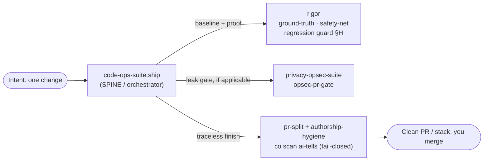

# Ship a verified fix

This guide walks one change from intent to a clean, proven, trace-free pull request with
[`/code-ops-suite:ship`](../40 Engineering/Handbook/commands/code-ops-suite.md).
Read it when you have exactly one feature or one-off to land and you want the whole
rigor path in view. For a whole-repo sweep read [the everything pass](the-everything-pass.md) instead.

## What ship is for

You have one change to make and you want it finished: design-checked, proven by a test that
failed before and passes after, privacy-clean, and landed as a pull request that reads like you
wrote it.

`ship` is an orchestrator in the code-ops-suite plugin, the spine. It does not invent its own
rigor. It composes the verification layer (`rigor`) and, when the change touches an anonymity
surface, the anonymity track (`privacy-opsec-suite`). It runs six phases and pauses at the
checkpoints that carry a decision:

| Phase | What happens | Composes | Checkpoint? |
|------|--------------|----------|-------------|
| 0 · Scope & design-check | Detect stack, take a baseline, size the change, set the automation level | [`rigor:ground-truth`](../40 Engineering/Handbook/commands/rigor.md) | Yes |
| 1 · Safety net | Pin current behavior where coverage is thin | [`rigor:safety-net`](../40 Engineering/Handbook/commands/rigor.md) | Conditional |
| 2 · Implement | The smallest correct change, matching repo conventions | implementation loop (`CONVENTIONS §11`) | No |
| 3 · Prove | Failing-then-passing test, suite and regression guard green | regression guard (`rigor §H`) | No |
| 4 · Privacy gate | Block any new leak, egress, or identifier, fail-closed preserved | [`privacy-opsec-suite:opsec-pr-gate`](../40 Engineering/Handbook/commands/privacy-opsec-suite.md) | Conditional |
| 5 · Finish traceless | Clean PR or stack, scrubbed of tool trace, scanner green | [`pr-split`](../40 Engineering/Handbook/commands/code-ops-suite.md) plus [`authorship-hygiene`](../40 Engineering/Handbook/commands/privacy-opsec-suite.md) | Yes (before push) |

Two hard rules govern the run:

1. `ship` requires `rigor`. Without it the orchestrator has no safety net, regression guard, or verification layer to compose.
2. `ship` never auto-merges. At every automation level the work lands as a commit or pull request for a person to merge.

The privacy phase is different. It runs only when `privacy-opsec-suite` is installed and the
change touches a privacy surface.

## The walkthrough

Take a concrete intent: the export endpoint drops the last row when the result set is an exact
multiple of the page size. The bug is real, narrow, and has a clear owner. Invoke:

```
/code-ops-suite:ship
```

and hand it that intent. A ticket, a request, or a one-line description all work, because `ship`
consumes an intent.

### Phase 0 · Scope and design check (checkpoint)

The first thing `ship` does is not write code. It establishes ground truth. It detects the stack,
then runs [`/rigor:ground-truth`](../40 Engineering/Handbook/commands/rigor.md) to capture the
factual baseline: build, typecheck, lint, the test suite with a coverage map, and any static
analysis. It records those facts in `GROUND_TRUTH.md` with a blind-spot list of modules that have
little or no coverage. Measuring the world before changing it is what later lets you prove what
your change did.

It then learns the repository's conventions so the change reads native, and it sizes the change.
Sizing is the fork in the road:

- A one-off, like the missing-row fix, proceeds, because it is small, local, and unambiguous.
- A feature does not proceed silently, because `ship` presents numbered options with a recommendation and a default, then waits.

Phase 0 also sets the automation level (`CONVENTIONS §4`) for the whole run and confirms which
composed plugins are installed:

- `gated` (default) pauses for approval at each change or closure batch.
- `auto-safe` (recommended ceiling) auto-applies only NOW-SAFE items and still pauses for NEEDS-REVIEW, NEEDS-DESIGN, and the always-gated categories.
- `auto-all` is not recommended.

The always-gated categories hold at every level: security and auth changes, secret handling, data
migrations or destructive operations, and public API or contract changes. They never auto-apply,
and nothing ever auto-merges.

> **Checkpoint.** You decide the automation level and, for a feature, the approach. For a one-off the only real gate is confirming that it is a one-off.

### Phase 1 · Safety net (conditional)

This phase fires only when the change touches code with thin coverage, and Phase 0's blind-spot
list is how `ship` knows. Suppose the export endpoint has happy-path tests but nothing exercising
the page-boundary math. That gap is a blind spot.

So `ship` runs [`/rigor:safety-net`](../40 Engineering/Handbook/commands/rigor.md). It writes
characterization tests that lock the current observable behavior of the target, quirks included,
because the job is to pin behavior rather than assert correctness. It runs them green against the
current code. If `safety-net` notices the very bug you are about to fix, it does not fix it. It
records the bug in `FINDINGS_REGISTER.md` as a candidate and leaves the fix to Phases 2 and 3. The
net gives the regression guard something concrete to protect.

If the target already had solid coverage, `ship` skips this phase. Scale every phase to the change.

### Phase 2 · Implementation

Now code gets written, through the shared implementation loop (`CONVENTIONS §11`). Re-validate the
item against current code, plan the smallest correct change, confirm anything ambiguous, then
implement while matching existing conventions and upholding the quality lenses (`§10`).

For this bug that means fixing the off-by-one at the page boundary, at its root, rather than
clamping the output downstream. For a feature it would mean shipping the smallest valuable slice
first, behind a flag when the slice is incomplete.

The code-economy ladder governs how much code the change is allowed to add. Ask in order whether
the code needs to exist, whether it exists here already, whether the standard library or an
installed dependency does it, and whether it fits inside the owning module. Extract a new file only
on evidence. Mark a deliberate simplification with a `deferred(<ceiling>, <upgrade path>)` comment.
The mechanical floor under the ladder is the over-build scanner:

```
node ${CLAUDE_PLUGIN_ROOT}/scripts/co.mjs scan overbuild --git <range>
```

It is advisory except for an unrecorded dependency. `co scan deferrals` collects every
`deferred(...)` marker into a register. Both verbs resolve only inside `code-ops-suite`, which
bundles `scan-overbuild.mjs` and `harvest-deferrals.mjs`.

### Phase 3 · Proof

This phase is what makes the change done rather than written. The rule from the skill is that a
change without a test that demonstrates it is not done.

Three things must be true to leave the phase:

1. A test fails before and passes after, encoding the exact defect at the page boundary.
2. The full suite is green, so the change broke nothing visible.
3. The regression guard is green (`rigor §H`).

The guard maintains a growing proof set of every repro, characterization, and regression test the
run produced. It re-runs all of that plus the suite after the change. A change that breaks a prior
proof or a previously-green test is rejected and reworked. Never weaken a proof to make a change
pass. The Phase 1 characterization tests sit in this proof set, which is how behavior preservation
gets enforced instead of claimed.

### Phase 4 · Privacy gate (conditional)

This phase runs only when both conditions hold: `privacy-opsec-suite` is installed, and the change
touches a privacy surface (egress, logging, identifiers, or a default). The row fix touches none of
those, so `ship` skips it here.

Suppose instead the fix had added a log line carrying the exporting user's ID, or a retry that
opened a new outbound request. Then `ship` runs the anonymity track's pre-merge gate,
[`/privacy-opsec-suite:opsec-pr-gate`](../40 Engineering/Handbook/commands/privacy-opsec-suite.md).
That gate treats six things as blocking: a new egress path or fail-closed bypass, a new log line
touching PII, identifiers, or IPs, a new identifier or fingerprint vector, a new correlation
surface, a phone-home dependency, and any weakened default. An anonymity regression is blocking
rather than advisory.

### Phase 5 · Traceless finish (checkpoint before push)

The change is correct and proven. Now it has to land, and land clean.

- If the work warrants a stack of small pull requests, `ship` runs [`/code-ops-suite:pr-split`](../40 Engineering/Handbook/commands/code-ops-suite.md) to carve the branch into independently-green pull requests.
- Otherwise it ships a single pull request, scrubbed by [`/privacy-opsec-suite:authorship-hygiene`](../40 Engineering/Handbook/commands/privacy-opsec-suite.md) across attribution metadata, prose voice, and code idiom.

The mechanical floor under both is the bundled scanner, run fail-closed:

```
node ${CLAUDE_PLUGIN_ROOT}/scripts/co.mjs scan ai-tells <commit-range-or-pr-body-file>
```

The verb resolves to `scan-ai-tells.mjs`, which both `code-ops-suite` and `privacy-opsec-suite`
bundle. It flags attribution trailers such as `Co-Authored-By:` and "Generated with", tool and
assistant markers, emoji, em-dash density over a threshold, assistant-prose tells, and the
`## Test plan` boilerplate. It exits non-zero on any hit, so it can gate a push. The push aborts
when the trace cannot be cleaned. If `privacy-opsec-suite` is absent, `ship` runs the same scanner
directly and the floor is unchanged.

> **Checkpoint.** Under `gated` the run pauses before the outward-facing push. Under `auto-safe` it proceeds after one abortable dry-run summary. Nothing is auto-merged either way.

## Context and code economy during the run

Every phase above reads code, and the suite compresses that reading at the source. Four mechanisms
carry it, each on by default and each switched off with `off`, `0`, or `false` in the `env` block
of a `.claude/settings.json`:

- `CODE_OPS_DIGEST` rewrites long Bash output into a digest plus a receipt naming the raw file, so a truncated result stays a pointer.
- `CODE_OPS_INDEX` refreshes the symbol index after an edit, so `co context query find|callers|callees|blast <symbol>` answers with `file:line` anchors instead of a map dump.
- `CODE_OPS_LADDER_CARD` prints the code-economy ladder to an implementing operative at dispatch.
- `CODE_OPS_RECEIPTS` writes session receipts to a home-directory ledger that never leaves the machine.

Prefer `co context skim <file>` over reading a large file whole, then read the range the outline
names. Prefer `co context query` over grepping for a definition or a call site. For the exact
contracts see [Contracts](../35 Contracts and Data/CONTRACTS.md), for the switches see
[Infrastructure](../50 Platform/INFRASTRUCTURE.md), and for the measured effect see
[Measurements](../55 Operations/MEASUREMENTS.md).

## Definition of done

From the skill's own *Done when*, a change has shipped when all of these hold:

- implemented at the smallest correct scope
- proven by a failing-then-passing test, with the full suite and the regression guard green
- behavior-preserving everywhere except where the change intended otherwise
- privacy posture intact, when the privacy phase applied
- docs updated so the change creates no drift
- shipped as a clean, trace-free pull request or stack with the scanner green, and nothing auto-merged

`ship` then presents a summary, the pull request links, and anything left for your decision.

## Place in the four-plugin model



- code-ops-suite, the spine, owns `ship` itself alongside broad engineering and the orchestrators.
- rigor, the verification layer, supplies the baseline, the safety net, and the regression guard. `ship` requires it.
- privacy-opsec-suite, the anonymity track, supplies the leak gate, used only when a privacy surface is touched.

The shared backbone runs through all of it: developer-in-the-loop checkpoints, evidence at
`file:line`, behavior preservation, registers as the single source of truth, and the automation
ladder with its always-gated categories.

## See also

- [Audit a risky subsystem](audit-a-risky-subsystem.md) for the `rigor` journey when you are investigating rather than shipping one known change.
- [The everything pass](the-everything-pass.md) for the whole-repo superset orchestrator, checkpoint by checkpoint.
- [Debug: symptom to root cause](debug-symptom-to-root-cause.md) for the path that starts from a live bug.
- [Orchestrators](../40 Engineering/Handbook/03-orchestrators.md) for choosing between `ship`, `everything`, and `debug`.
- [Evidence and tiers](../40 Engineering/Handbook/05-evidence-and-tiers.md) for CONFIRMED, PROBABLE, and SPECULATIVE.
- [Choosing an automation level](../40 Engineering/Techniques/choosing-an-automation-level.md) for picking `gated` against `auto-safe`.

*Verified-at: b0ffede*
