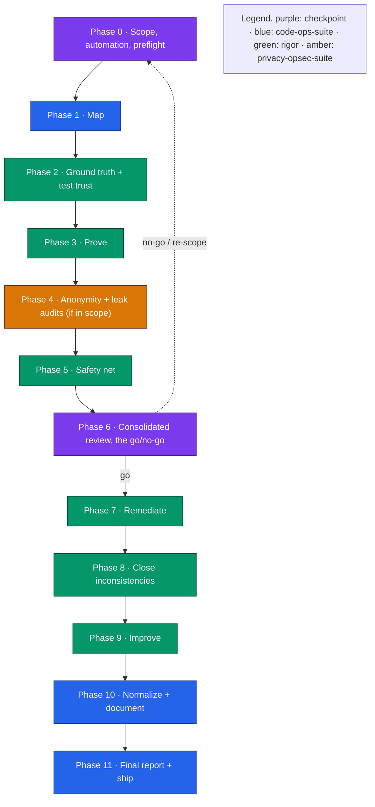

# The everything pass

This guide walks `/code-ops-suite:everything` phase by phase, naming what each phase does,
which register it touches, and what each checkpoint decides. Read it before committing a
whole repository to the most exhaustive and most token-expensive run in the suite. The
authoritative source is [`plugins/code-ops-suite/skills/everything/SKILL.md`](../../plugins/code-ops-suite/skills/everything/SKILL.md).

`everything` is the cross-plugin superset orchestrator. It runs every workflow across
`code-ops-suite`, `rigor`, and `privacy-opsec-suite` as one deduplicated, register-carrying
pipeline, pausing at phase boundaries for your decisions. It never auto-merges.

---

## Orientation

You invoke `/code-ops-suite:everything`. It does not replace the individual skills. It sequences
them in the right order, deduplicated, carrying every register and a growing proof set forward, and
checking in at phase boundaries.

- **Prerequisites.** All three plugins installed. If one is missing, the run cannot do its corresponding phases. The privacy phases are skippable, and Phase 0 asks. The others are not.
- **Shape.** Twelve phases, numbered Phase 0 through Phase 11. At Phase 0 you set scope, the privacy track, the remediation automation level, and how often the run checks in.
- **The arc.** Scope and preflight, map, ground truth and test trust, prove, leak audits when in scope, safety net, a consolidated go or no-go, remediate, close inconsistencies, improve, normalize and document, then final report and ship.
- **Two mandatory checkpoints.** Phase 0 (scope and automation) and Phase 6 (the consolidated review) fire regardless of check-in level. Every always-gated category also stops for you.
- **Safety floor.** The run always works on a branch. Always-gated categories stop for your approval no matter what level you chose: security and auth, secret handling, data migrations or destructive operations, public API or contract changes, and anything irreversible. Even fully-automatic fixes land as commits or pull requests for review.
- **Cost.** This is deliberately the most token-expensive workflow in the suite. Reach for it when you want exhaustive coverage of a whole repository, or its riskiest subsystems, and you are prepared to spend for it. For a single-plugin pass, use `code-ops-suite:full-sweep`. For one change, use `code-ops-suite:ship`.

---

## Prerequisites and the mental model

`everything` is the spine plugin (`code-ops-suite`) reaching across the verification layer
(`rigor`) and the anonymity track (`privacy-opsec-suite`) and running them as one pipeline. The
orchestrator itself lives in `code-ops-suite`, and it loads the methodology of all three:

- It reads `code-ops-suite`'s `CONVENTIONS.md` first, then loads the `CONVENTIONS.md` and the relevant skill files from `rigor` and `privacy-opsec-suite`.
- It applies rigor's verification-first rules throughout: evidence tiers, the disconfirmation pass, ground-truth-first, and the regression guard. See [`code-ops-docs/40 Engineering/Handbook/05-evidence-and-tiers.md`](../40 Engineering/Handbook/05-evidence-and-tiers.md) and [`code-ops-docs/40 Engineering/Techniques/disconfirmation-pass.md`](../40 Engineering/Techniques/disconfirmation-pass.md).

The shared backbone all three obey is what lets the orchestrator hand findings cleanly between
phases without re-deriving them: developer-in-the-loop, evidence at `file:line`, behavior
preservation, registers as single source of truth with `Verified-at <sha>` freshness, and the
automation ladder. For the registers and the freshness discipline this run leans on heavily, see
[`code-ops-docs/40 Engineering/Handbook/04-registers-and-freshness.md`](../40 Engineering/Handbook/04-registers-and-freshness.md).

### Context and code economy across the whole run

A twelve-phase run over a whole repository is the largest context spend the suite can produce, so
every phase leans on the compression mechanisms. Each is on by default and switches off with `off`,
`0`, or `false` in the `env` block of a `.claude/settings.json`:

- `CODE_OPS_DIGEST` rewrites long Bash output into a digest plus a receipt naming the raw file, which matters most in Phases 2, 3, and 11.
- `CODE_OPS_INDEX` keeps the symbol index current after an edit, so `co context query find|callers|callees|blast <symbol>` replaces a grep or a map read.
- `CODE_OPS_LADDER_CARD` gives every implementing operative the code-economy ladder at dispatch.
- `CODE_OPS_RECEIPTS` writes session receipts to a home-directory ledger that never leaves the machine, and `co context audit receipts --by-arm` groups them by which mechanisms were armed.

Prefer `co context skim <file>` over reading a large file whole. A PreCompact hook preserves the
run's durable state when the context fills. For the contracts see
[Contracts](../35 Contracts and Data/CONTRACTS.md), for the switches see
[Infrastructure](../50 Platform/INFRASTRUCTURE.md), and for the measured effect see
[Measurements](../55 Operations/MEASUREMENTS.md).

---

## Phase 0 · Scope, automation level, and preflight (checkpoint)

This is where you steer the entire run, and it is a mandatory checkpoint. The orchestrator detects
the stack and size, confirms all three plugins are available, and verifies library and framework
facts against the installed versions through the in-house docs lookup (`CONVENTIONS §2`) rather
than from memory. Then it confirms four things with you:

1. **Scope.** The whole repository, or the riskiest subsystems first. Subsystems-first is recommended for large repositories, because bug-hunting goes deep per subsystem and that depth is expensive.
2. **Privacy track.** Include the Phase 4 privacy-opsec phases or not. Include them when the project has anonymity or opsec requirements. Otherwise skip them and the leak register never opens.
3. **Remediation automation level.** The canonical ladder (`code-ops §4`), applied with rigor's tier gate (`rigor §4` and `§H`). It governs every code-changing phase. See [`code-ops-docs/40 Engineering/Techniques/choosing-an-automation-level.md`](../40 Engineering/Techniques/choosing-an-automation-level.md).
   - `gated` (default) pauses for your approval at each fix or closure batch.
   - `auto-safe` (recommended ceiling) applies CONFIRMED and NOW-SAFE fixes automatically, each on a branch, each carrying a failing-then-passing regression test, each passing the regression guard. It pauses for NEEDS-REVIEW, NEEDS-DESIGN, and the always-gated categories.
   - `auto-all` is not recommended. Even there the always-gated categories still stop, and NEEDS-DESIGN is never auto-applied.
   - Always gated regardless of level: security and auth changes, secret handling, data migrations or destructive operations, public API or contract changes, and anything irreversible.
4. **Check-in level.** `normal` pauses per phase. `minimal` pauses only at the consolidated review in Phase 6, plus any always-gated item.

**Registers opened.** The master registers, meaning `FINDINGS_REGISTER.md`,
`CONSISTENCY_REGISTER.md`, and `LEAK_REGISTER.md` when privacy is in scope, plus a running
`EXECUTIVE_SUMMARY.md`, a coverage map, and a growing proof set.

**What the checkpoint decides.** The blast radius and the spend of the whole run: how much code is
in play, whether the anonymity track runs, how much the orchestrator may change without asking, and
how chatty it is. It commits to working on a branch and to never auto-merging. Any CONFIRMED
critical finding surfaces immediately, even mid-phase. It also commits to keeping every register
fresh across phases, so a finding fixed earlier in the run is marked `OBSOLETE-AT <sha>` and never
re-ranked or re-shown.

---

## Phase 1 · Map (code-ops-suite)

**What runs.** `doc-alignment`, then `codebase-audit`, then `security-privacy-audit`.

This produces an accurate map plus a broad first-pass register. Findings are tiered and disconfirmed
(`§7`) and run through the multi-boundary control-coverage lens (`§10`). For any control, gate, or
invariant, the phase enumerates every entry point that can reach the protected action and verifies
the control at each.

The map itself is cheapest read through the tooling rather than by opening files. `co context map`
renders the repository map, `co context graph` renders the import graph, and `co atlas check`
reports which atlas sections are FRESH. Trust a FRESH atlas section without re-verifying it, and
treat a STALE section as a lead. See
[`code-ops-docs/40 Engineering/Techniques/atlas.md`](../40 Engineering/Techniques/atlas.md).

**Register touched.** `FINDINGS_REGISTER.md`, seeded with the broad first pass. `doc-alignment`
also reconciles docs and produces its drift artifacts. `security-privacy-audit` produces
`THREAT_MODEL.md` and feeds NEEDS-REVIEW and NEEDS-DESIGN items into the findings register.

**Checkpoint.** Under `normal` check-in, a phase-boundary pause confirms the map and the first-pass
findings before the run goes deep. Under `minimal` it proceeds, surfacing any CONFIRMED critical
immediately.

---

## Phase 2 · Ground truth and test trust (rigor)

**What runs.** `ground-truth`, then `test-suite-audit`.

`ground-truth` runs the real toolchain, meaning build, typecheck, lint, tests with coverage, and
static analysis, and captures the output as facts. Nothing downstream may contradict it.
`test-suite-audit` then establishes where green is trustworthy and where the coverage blind spots
are, executing the suite repeatedly and running mutation checks.

**Registers touched.** `GROUND_TRUTH.md` plus CONFIRMED items seeded into `FINDINGS_REGISTER.md`,
and `TEST_SUITE_REPORT.md` plus a trust map. The blind-spot map feeds Phase 5's safety net directly.

**Checkpoint.** Phase boundary under `normal`. This phase turns assumptions into facts, and
everything after it builds on the baseline.

---

## Phase 3 · Prove (rigor)

**What runs.** `bug-hunt`, deep per subsystem, with root cause plus a sibling sweep for the whole
class, and `quality-scan`, everything tiered and disconfirmed. `regression-hunt` bisects any
regression to the commit that introduced it.

This is the rigor heart of the run and, on a large repository scoped subsystem by subsystem, the
most expensive single phase. `bug-hunt` does not just flag. It executes repros, so a CONFIRMED bug
here is a reproduced bug rather than a static guess.

**Register touched.** Findings merge into `FINDINGS_REGISTER.md`, each entry stamped
`Verified-at <sha>`. Repro tests are saved into the proof set. `regression-hunt` produces
`REGRESSION_REPORT.md`.

**Checkpoint.** Phase boundary under `normal`. A CONFIRMED critical surfaces immediately regardless
of check-in level.

---

## Phase 4 · Anonymity and leak audits (privacy-opsec-suite, only if in scope)

**What runs**, and the phase is skipped entirely when you decline the privacy track at Phase 0. The
keystone runs first, then six parallel leak audits:

`anonymity-threat-model`, then `anon-session-audit`, `tor-egress-audit`, `metadata-leak-audit`,
`fingerprint-resistance`, `traffic-analysis-resistance`, and `supply-chain-trust`.

The threat model is the keystone the six audits build on. It maps the assets that identify or link
a user, the adversaries, and the deanonymization paths. The six audits then each look for concrete
leaks through their own lens.

**Registers touched.** `anonymity-threat-model` produces `ANONYMITY_THREAT_MODEL.md`, a durable
reusable artifact, and feeds concrete leaks into `LEAK_REGISTER.md`. Each of the six audits feeds
tiered, `Verified-at` findings into `LEAK_REGISTER.md`. A clearnet or DNS egress leak surfaces as
critical.

**Checkpoint.** Phase boundary under `normal`. The leak register becomes a first-class input to the
consolidated review in Phase 6 and is the backlog `opsec-hardening` consumes in Phase 7.

---

## Phase 5 · Safety net (rigor)

**What runs.** `safety-net`.

It writes characterization tests that pin current observable behavior on the coverage blind spots
from Phase 2 and on everything queued for change. It adds tests only and changes no production
code. The point is to make the fixes ahead provably behavior-preserving, because the regression
guard now has something concrete to protect.

**Artifact touched.** A characterization test suite added to the proof set, plus any
suspicious-behavior findings it turns up.

**Checkpoint.** Phase boundary under `normal`. This is the last phase before the main go or no-go.
After it, the run has a complete picture and a safety net under everything it intends to touch.

---

## Phase 6 · Consolidated review (checkpoint, the main go or no-go)

This is the mandatory decision point, and it fires regardless of your check-in level. Before
presenting anything, the orchestrator re-validates every carried register against current HEAD
(`§12`), running the freshness check so nothing already fixed earlier in the run is re-listed.

It then presents one prioritized, CONFIRMED-led picture across bugs, quality issues, leaks, and
inconsistencies, together with the remediation plan and the automation level in effect.

**Registers touched.** It reads `FINDINGS_REGISTER.md`, `CONSISTENCY_REGISTER.md`, and
`LEAK_REGISTER.md` when in scope, reconciles them against HEAD, and shows nothing past its
`OBSOLETE-AT`.

**What the checkpoint decides.** Go or no-go on remediation, and the shape of it: which findings to
fix, in what order, under which automation level. You can re-scope, defer items, or stop here with
a complete assessment and no code changed. Everything from Phase 7 onward depends on the approval
given here.

---

## Phase 7 · Remediate (rigor `fix-verified`, code-ops `remediation`, privacy-opsec `opsec-hardening`)

**What runs**, per the automation level you set:

- `rigor:fix-verified` fixes CONFIRMED bugs at root cause, each with a failing-then-passing regression test, the regression guard, a sibling sweep across the whole class, and an enforcement so the class cannot recur. A PROBABLE item must be reproduced before it is fixed.
- `code-ops-suite:remediation` works the NEEDS-REVIEW and NEEDS-DESIGN backlog safely, with tests.
- `privacy-opsec-suite:opsec-hardening` applies the privacy and anonymity fixes from the leak register, with fail-closed routing where relevant.

Each change is tested, behavior-preserving, atomic, and on the branch. The code-economy ladder
bounds what each fix may add, and `co scan overbuild --git <range>` is its mechanical floor,
advisory except for an unrecorded dependency.

**Registers touched.** `FINDINGS_REGISTER.md` and `LEAK_REGISTER.md` update as items ship, marked
closed-with-proof or deferred-with-reason. An `IMPLEMENTATION_LOG.md` records the change, its proof,
the root cause, the siblings handled, and behavior notes.

**Checkpoint behavior.** Under `gated`, every fix or closure batch pauses for approval. Under
`auto-safe`, CONFIRMED and NOW-SAFE fixes apply automatically, each branch-isolated, test-backed,
and guarded, and only NEEDS-REVIEW, NEEDS-DESIGN, and always-gated categories pause. The
always-gated categories stop for you at every level.

**Cascade circuit-breaker.** A whole-repository run is the most cascade-prone context there is, so
both `fix-verified` (`rigor §H`) and `remediation` (`§11`) carry the same brake. If three or more
fixes are rejected by the regression guard or spawn new CONFIRMED findings, the fix loop stops and
the cluster is reclassified NEEDS-DESIGN at a checkpoint rather than patched further. A cascade
means the run hit an architectural problem, not a bug collection.

---

## Phase 8 · Close inconsistencies (rigor `consistency-closure`)

**What runs.** `consistency-closure` picks one canonical form per concept, migrates every site to
it, and adds a mechanical enforcement so the divergence cannot silently return. You approve the
choice of canonical form unless the level is `auto-safe` or `auto-all` and the choice is clearly
mechanical.

**Register touched.** `CONSISTENCY_REGISTER.md`, plus migration diffs and the new enforcement.

**Checkpoint.** Per the automation level. The canonical-form decision is the gate, and the
mechanical migration that follows runs inside the approved unit.

---

## Phase 9 · Improve (rigor `improve-measured`, code-ops `performance` and `dependency-upgrade`)

**What runs.** Only changes with a measured before-and-after delta ship, and all are
behavior-preserving.

- `rigor:improve-measured` holds the rule that if you cannot measure the before, you cannot claim the after. It relies on the Phase 5 safety net to prove behavior preservation.
- `code-ops-suite:performance` runs profiling-led optimization of what is proven hot, and each commit carries before-and-after numbers.
- `code-ops-suite:dependency-upgrade` runs safe, staged upgrades and CVE remediation, never a bulk bump.

**Artifacts touched.** `IMPROVEMENTS_LOG.md`, `PERFORMANCE_REPORT.md`, `DEPENDENCY_REPORT.md`, and
an updated lockfile. Remaining opportunities feed back into `FINDINGS_REGISTER.md`.

**Checkpoint.** Per the automation level. Dependency major-version bumps and any contract-touching
change are always gated.

---

## Phase 10 · Normalize and document (code-ops `normalize` plus the doc generators)

**What runs.** `normalize` brings the codebase to one consistent style with an enforced linter and
formatter config, behavior-preserving. `doc-alignment` then reconciles the docs against the
now-changed code. Finally the run generates the reference docs for the now-accurate, now-hardened
system, each per the documentation quality standard (`§13`) and self-scoping: architecture,
data-model, api-docs, ops-docs, adr, and onboarding.

**Artifacts touched.** `STYLE_GUIDE.md` and the enforced config from `normalize`, the drift
artifacts from `doc-alignment`, and the generated reference docs in the repository's docs location,
each carrying its `Verified-at` freshness stamp.

**Checkpoint.** Phase boundary under `normal`. `normalize` is behavior-preserving and keeps tests
green at every step.

---

## Phase 11 · Final verification, report, and ship

**What runs.** The full suite plus the entire proof set must be green, and the regression guard
clean with no prior proof broken. The run then produces the master `EXECUTIVE_SUMMARY.md`, tying
together what was found, proven, fixed, closed, improved, and documented, with CONFIRMED separated
from PROBABLE and SPECULATIVE, alongside the coverage map and anything still awaiting a decision.
It notes the pull-request gates to wire in for ongoing protection: `rigor:deep-review` and
`privacy-opsec-suite:opsec-pr-gate`.

If you choose to ship, it carves the remediation diff into a clean, independently-green stack with
`pr-split`, which runs `privacy-opsec-suite:authorship-hygiene` fail-closed so the commits and pull
requests carry no tooling trace. The mechanical floor is `co scan ai-tells <range>`, which exits
non-zero on any hit. As everywhere else, the run never auto-merges. The stack is opened for review.

**Artifacts touched.** The master `EXECUTIVE_SUMMARY.md` and the `pr-split` stack of small,
independently-green pull requests.

**Checkpoint.** The ship decision is yours. The traceless stack is the hand-off, not a merge.

---

## Definition of done

The run is complete when every in-scope phase is done. CONFIRMED bugs are fixed at root cause with
regression proofs. Inconsistencies are closed and enforced. Improvements carry measured deltas.
Privacy leaks, when in scope, are closed and locked. The reference docs are generated where
applicable. Every register carried across phases is fresh, with no obsolete item re-shown. The proof
set and the suite are green. The master summary is delivered. Nothing in an always-gated category,
and under `gated` nothing code-changing, happened without your approval.

---

## Choosing everything over its alternatives

- **Use `everything`** when you want the most exhaustive pass across all three plugins on a whole repository or its riskiest subsystems, and you are prepared for the cost.
- **Use `code-ops-suite:full-sweep`** when you want the spine plugin's pipeline only, with no rigor verification layer and no privacy track. It is cheaper and narrower.
- **Use `code-ops-suite:ship`** for one change end to end at full rigor. See [`code-ops-docs/70 Guides/ship-a-verified-fix.md`](ship-a-verified-fix.md).
- **Use `code-ops-suite:debug`** to drive a single bug from symptom to a proven root-cause fix. See [`code-ops-docs/70 Guides/debug-symptom-to-root-cause.md`](debug-symptom-to-root-cause.md).

For the full task-to-command router and per-command detail, see
[`code-ops-docs/40 Engineering/Handbook/commands/README.md`](../40 Engineering/Handbook/commands/README.md).
For how the orchestrators compare on phases and relative cost, see
[`code-ops-docs/40 Engineering/Handbook/03-orchestrators.md`](../40 Engineering/Handbook/03-orchestrators.md).

---

*Verified-at: b0ffede*
