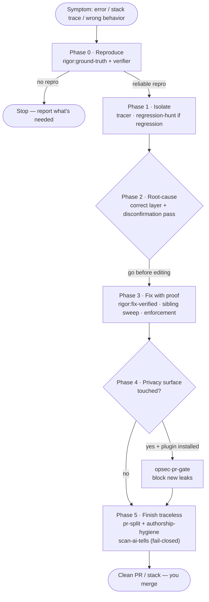
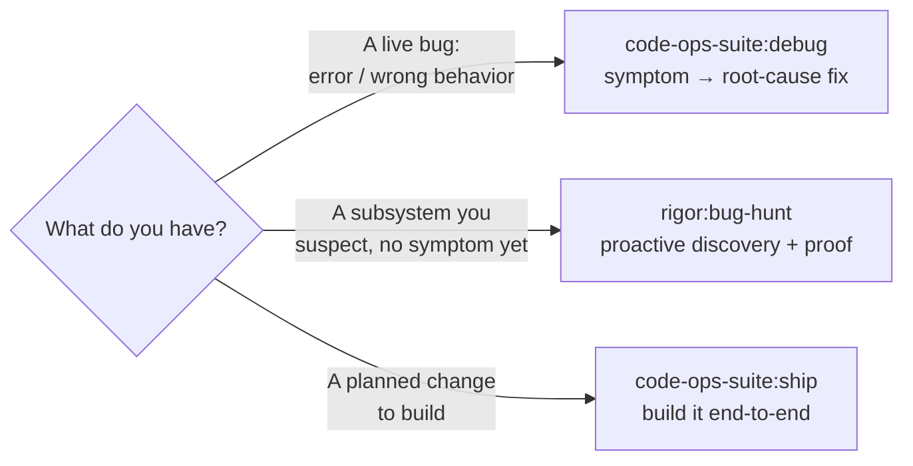

# Debug: Symptom to Root Cause

> A narrative walkthrough for the on-call engineer staring at a live bug — an error, a stack trace, a wrong result — who wants it driven to a **proven root-cause fix**, not a patch over the symptom. The driver is [`/code-ops-suite:debug`](../handbook/commands/code-ops-suite.md). Where [`ship`](ship-a-verified-fix.md) builds *new* capability and [`everything`](the-everything-pass.md) sweeps a whole repo, `debug` starts from a symptom and refuses to guess: reproduce first, fix at the cause, prove it stays fixed.

## Exec summary (stop here if you just want the shape)

It is 02:00, an endpoint is throwing, and you have a stack trace. You do **not** want a guess that "probably fixes it." You want the bug reproduced, isolated to its real cause, fixed at the right layer, and locked behind a regression test that failed a moment ago and passes now. That is what `debug` is for.

`debug` is an **orchestrator** in the code-ops-suite plugin (the SPINE). It owns the sequencing and the checkpoints; it does **not** invent its own verification — it **composes** the `rigor` layer (verifier, tracer, `regression-hunt`, `fix-verified`) and, when the fix touches a privacy surface, the `privacy-opsec-suite` anonymity track. It runs six phases, pausing at the two checkpoints that carry a real decision:

| Phase | What happens | Composes | Checkpoint? |
|------|--------------|----------|-------------|
| 0 · Reproduce | Capture the symptom; take a baseline; build a **reliable reproduction** (failing test/repro) | [`rigor:ground-truth`](../handbook/commands/rigor.md) + rigor's verifier | Yes |
| 1 · Isolate | Trace the control/data path; derive invariants; narrow to the smallest triggering path; bisect if it's a regression | rigor's tracer + [`rigor:regression-hunt`](../handbook/commands/rigor.md) | — |
| 2 · Root-cause | Identify the real cause at the correct layer, cited `file:line`, after a disconfirmation pass | [disconfirmation pass](../techniques/disconfirmation-pass.md) | Yes (before any edit) |
| 3 · Fix with proof | Repro passes, suite green, regression guard holds, **sibling sweep**, add an enforcement | [`rigor:fix-verified`](../handbook/commands/rigor.md) | — |
| 4 · Privacy gate | Block any new leak/egress/identifier the fix introduced; fail-closed preserved | [`opsec-pr-gate`](../handbook/commands/privacy-opsec-suite.md) | Conditional |
| 5 · Finish traceless | Clean PR or stack, scrubbed of tool trace, scanner green | [`pr-split`](../handbook/commands/code-ops-suite.md) + [`authorship-hygiene`](../handbook/commands/privacy-opsec-suite.md) | Yes (before push) |

Three hard rules before you read on:

1. **`debug` requires `rigor`.** The verifier (reproduction), the tracer (isolation), `regression-hunt` (bisect), and `fix-verified` (the fix-prove-guard loop) all live in the verification layer. Without `rigor` installed, `debug` has nothing to compose. The privacy phase, by contrast, runs *only* if `privacy-opsec-suite` is installed **and** the fix touches a privacy surface.
2. **No reproduction, no fix.** If the symptom cannot be reproduced, `debug` **stops at Phase 0** and reports exactly what it needs — environment, data, steps — rather than guessing a fix against a symptom it can't observe. This is the "ground-truth-first" rule of the shared backbone, applied to a live bug.
3. **`debug` never auto-merges.** Even on the most permissive automation level, the fix lands as a commit/PR for a human to merge. "Done" means *shippable*, not *shipped past you*.

Everything below is the same six phases at depth, told as one on-call engineer carrying one bug through them.

---

## The walkthrough

Take a concrete symptom: *"`/api/export` returns 500 with `TypeError: cannot read length of undefined` whenever the result set is empty."* You have a stack trace and a sentry link. You invoke:

```
/code-ops-suite:debug
```

and hand it the symptom — an error, a stack trace, or a description of wrong behavior all work (`debug` **consumes** a symptom, per its SKILL).

### Phase 0 — Reproduce *(checkpoint)*

The first thing `debug` does is **not** propose a fix. It captures the symptom precisely and runs [`/rigor:ground-truth`](../handbook/commands/rigor.md) for the factual baseline — build/typecheck, lint, the test suite with a coverage map, recorded as facts in `GROUND_TRUTH.md`. Then it uses `rigor`'s verifier to build a **reliable reproduction**: a failing test or a runnable repro that triggers the symptom on demand. For our bug, that is a test that calls the export path with an empty result set and asserts on the 500.

This is the gate that defines `debug`. **If the bug cannot be reproduced, the orchestrator stops here** and reports exactly what's missing — the env, the data, the steps — and never guesses a fix. A fix you cannot demonstrate against a failing repro is not a fix; it is a hope. The reproduction is what later turns "I think it's fixed" into "it failed before and passes now."

> **Checkpoint — what you decide here:** the automation level (`CONVENTIONS §4`) for the whole run, and confirmation that the reproduction genuinely captures *your* symptom. If `debug` can't reproduce, the decision is yours: supply what it asked for, or accept that the bug isn't yet actionable.

The automation level set here governs every code-changing step downstream:

- `gated` *(default)* — pause for approval at each fix/closure batch.
- `auto-safe` *(recommended ceiling)* — auto-apply only NOW-SAFE items (on a branch, test-backed, behavior-preserving, trivially revertible); still pause for NEEDS-REVIEW, NEEDS-DESIGN, and the **always-gated** categories.
- `auto-all` — *not recommended.*

The **always-gated** categories hold regardless of level: security/auth changes, secret handling, data migrations or destructive operations, and public API/contract changes. Nothing in those classes auto-applies, and nothing ever auto-merges.

### Phase 1 — Isolate

With a reliable repro in hand, `debug` narrows the blast radius. It traces the control and data path with `rigor`'s tracer and derives the **invariants** the code is supposed to hold — here, something like "the pager always receives an array, never `undefined`." It then narrows to the **smallest triggering path**: the exact branch where an empty query result is handed to code that assumes a non-empty array.

If the symptom is a **regression** — it used to work — `debug` runs [`/rigor:regression-hunt`](../handbook/commands/rigor.md) to bisect VCS history to the commit that introduced it, reporting the offending commit, what it changed, and why it caused the break. That turns "when did this start?" into a cited fact, and often points straight at the cause.

Isolation is read-only. No production code changes yet; the point is to know *exactly* where and why before touching anything.

### Phase 2 — Root-cause *(checkpoint — confirm before changing code)*

Now `debug` identifies the **real cause at the correct layer** — not the nearest place the error surfaces. The `TypeError` surfaces in the pager, but the root cause might be a data-access function that returns `undefined` instead of `[]` on an empty result. Fixing the pager would silence the symptom while leaving the contract violation in place to bite elsewhere. `debug` names the cause with a cited `file:line`.

Before that cause is accepted, it runs the [disconfirmation pass](../techniques/disconfirmation-pass.md) — the single highest-leverage filter against a wrong diagnosis. Each candidate cause is actively attacked with the questions: is this path actually **reachable**? Is the case already **handled** elsewhere (a caller, wrapper, framework, or type)? Is the behavior **intentional**? Is it **already tested**? Only a cause that survives all of them is reported. (This is the same `§B` move `rigor` applies to every finding; see the [Evidence and tiers](../handbook/05-evidence-and-tiers.md) page for how it underwrites "proven.")

> **Checkpoint — the decision that matters most:** `debug` presents the root cause *and* the proposed fix and **gets your go before editing.** This is where you confirm it's fixing the cause, not the symptom — and at the correct layer. For our bug: "fix the data-access function to return `[]`, not patch the pager." Approve, redirect, or ask for an alternative.

### Phase 3 — Fix with proof

With the cause confirmed and a go in hand, `debug` runs the [`/rigor:fix-verified`](../handbook/commands/rigor.md) fix-prove-guard loop. Four things must hold to leave this phase:

1. **The repro now passes.** The empty-result-set test that failed in Phase 0 is green after the minimal correct fix at the right layer. That failing→passing test is the durable proof the bug is gone, and it stays in the suite.
2. **The full suite is green** — the fix broke nothing visible.
3. **The regression guard holds** (`rigor §H`). The guard maintains a growing **proof set** — every repro, characterization, and regression test produced in the run — and re-runs *all of it* plus the suite. A change that breaks any prior proof is **rejected and reworked.** You **never weaken a proof to make the fix pass.**
4. **Siblings are swept and an enforcement is added.** This is what separates `debug` from a one-off patch. It sweeps the codebase for **other sites of the same cause** (`§G`) — every other call-site that assumes the data-access function never returns `undefined` — and fixes the whole class, not just the one that paged you. Then it adds an **enforcement** (a kept regression test plus a type/lint/assertion) so the class **cannot recur unnoticed**. A bug fixed without its siblings handled is a bug that pages you again next week wearing a different stack trace.

If the sibling sweep turns into a cascade — three or more fixes rejected by the regression guard or spawning new CONFIRMED findings — the **cascade circuit-breaker** (`rigor §H` / code-ops `§11`) stops the fix loop and reclassifies the cluster as **NEEDS-DESIGN** rather than continuing to patch. A cascade is an architectural signal, not a bug collection.

### Phase 4 — Privacy gate *(conditional)*

This phase runs only when **both** conditions hold: `privacy-opsec-suite` is installed, **and** the fix touches a **privacy surface** — egress, logging, identifiers, or a default. Our empty-result fix touches none of those, so `debug` skips it for this bug. But it is worth knowing what would happen if it didn't.

Suppose the fix had added a diagnostic log line including the exporting user's ID, or a retry that opened a new outbound request. Then `debug` runs the anonymity track's pre-merge gate, [`/privacy-opsec-suite:opsec-pr-gate`](../handbook/commands/privacy-opsec-suite.md), which treats as **BLOCKING** any new egress path or fail-closed bypass, any new log line touching PII/identifiers/IPs, any new identifier or fingerprint vector, any new correlation surface, any phone-home dependency, or any weakened (less-anonymous) default. The fail-closed posture is **preserved** — an anonymity regression introduced by a bug fix is blocked, not waved through as an advisory note. This is the ANONYMITY TRACK doing its one job: *no new leak ships, even in a hotfix.*

### Phase 5 — Finish traceless *(checkpoint before push)*

The bug is fixed and proven. Now it has to *land*, and land clean — reading like you wrote it at the keyboard, not like a tool generated it. `debug` finishes through the **traceless** path:

- If the fix is multi-part (the sibling sweep touched several areas), it runs [`/code-ops-suite:pr-split`](../handbook/commands/code-ops-suite.md) to carve the work into a clean stack of independently-green PRs.
- Otherwise it ships a single PR, scrubbed by [`/privacy-opsec-suite:authorship-hygiene`](../handbook/commands/privacy-opsec-suite.md) — three surfaces: **L1** attribution/tool metadata (mechanical), **L2** prose voice on commits and the PR description (matched to your history), and **L3** code-idiom blend-in (behavior-preserving).

The mechanical floor under both is the bundled scanner, run **fail-closed**:

```
node ${CLAUDE_PLUGIN_ROOT}/scripts/scan-ai-tells.mjs <commit-range-or-pr-body-file>
```

It flags attribution trailers (`Co-Authored-By:`, "Generated with/by …"), tool/assistant markers, emoji, em-dash density over a threshold, assistant-prose tells, and `## Test plan` boilerplate — and it **exits non-zero on any hit**, so it can gate the push. The push is aborted if the trace can't be cleaned. **If `privacy-opsec-suite` is not installed**, `debug` runs this same bundled script directly as the gate — the floor is identical either way.

> **Checkpoint — the last human gate:** under `gated` the run pauses before the outward-facing push. Either way, **nothing is auto-merged** — you get the summary and the PR link(s), and you click merge.

---

## The flow at a glance



The two diamonds are the checkpoints with teeth: Phase 2 (confirm the cause before any edit) and the privacy decision at Phase 4. The `stop` branch out of Phase 0 is the rule that makes `debug` trustworthy — it would rather halt and ask than guess.

## What "done" means

Straight from the skill's own *Done when* — the bug is closed when **all** of these hold:

- the symptom is **reproduced, then resolved**;
- fixed at **root cause**, with a **regression test that failed before and passes now**;
- **siblings handled** and an **enforcement added** so the class can't recur;
- the **regression guard + full suite green**;
- **privacy posture intact** (if the privacy phase applied);
- shipped as a **clean, trace-free** PR — with **nothing auto-merged.**

## When to reach for `debug` — and when not

`debug` is symptom-driven and singular: one known bug, driven to a proven fix. Two sibling skills cover the adjacent jobs, and choosing right saves you a wasted run.



- **`debug` vs [`rigor:bug-hunt`](../handbook/commands/rigor.md).** `debug` is *symptom-driven* — you already have a concrete failure and want it fixed. `bug-hunt` is *proactive discovery* — point it at your riskiest subsystem with **no symptom in hand**, and it derives invariants, traces flow, and proves each candidate with a runnable repro before flagging it. Reach for `debug` when something is broken *now*; reach for `bug-hunt` when you want to find the bugs *before* they page you. (`debug`'s Phase 3 uses the same `fix-verified` loop that consumes `bug-hunt`'s CONFIRMED findings — the two compose cleanly when a hunt turns up a bug you then want fixed.)
- **`debug` vs [`ship`](ship-a-verified-fix.md).** `ship` builds one *new* change — a feature or a one-off — end-to-end with proof and a traceless finish. `debug` starts from a *symptom* and adds the reproduce → isolate → root-cause arc that `ship` does not need. Use `ship` to *add capability*; use `debug` when capability that should already work is *broken*.

If you can't yet produce a reproduction, `debug` will stop and ask for what it needs — that is the correct behavior, not a failure.

## Where this sits in the four-plugin model

- **code-ops-suite (the SPINE)** owns `debug` itself — the orchestrator and its phase sequencing.
- **rigor (the VERIFICATION layer)** supplies the verifier (reproduction), the tracer (isolation), `regression-hunt` (bisect), and `fix-verified` (the fix-prove-guard loop and sibling sweep). `debug` *requires* it.
- **privacy-opsec-suite (the ANONYMITY TRACK)** supplies the leak gate, used only when the fix touches a privacy surface, plus `authorship-hygiene` for the traceless finish.
- The shared backbone runs through all of it: developer-in-the-loop checkpoints, evidence at `file:line`, behavior preservation, registers as the single source of truth, and the gated/auto-safe/auto-all ladder with its always-gated categories.

## See also

- [code-ops-suite command reference](../handbook/commands/code-ops-suite.md) — the full `debug` entry plus the `ship` / `feature-implementation` disambiguation.
- [rigor command reference](../handbook/commands/rigor.md) — `ground-truth`, `regression-hunt`, and `fix-verified` at depth.
- [The disconfirmation pass](../techniques/disconfirmation-pass.md) — the five questions that kill a wrong diagnosis before you act on it.
- [Ship a verified fix](ship-a-verified-fix.md) — the build-a-change counterpart to debugging one.
- [Orchestrators](../handbook/03-orchestrators.md) — when to reach for `debug` vs `ship` vs `everything`.
- [Evidence and tiers](../handbook/05-evidence-and-tiers.md) — CONFIRMED / PROBABLE / SPECULATIVE and the disconfirmation pass that underwrite "proven."

*Verified-at: c2b37e9*
