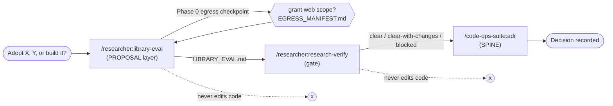
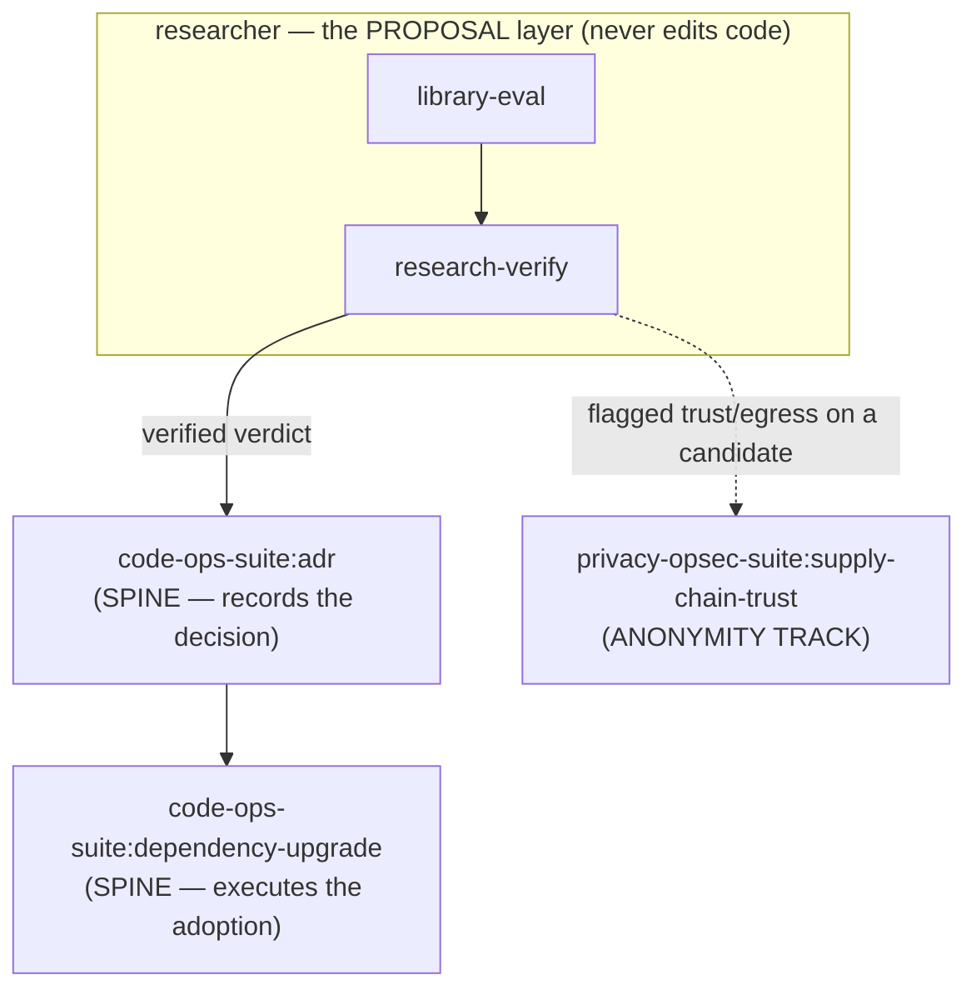

# Research a Library Choice

> A narrative walkthrough of deciding *which library to adopt* — and proving the decision before anyone writes code. You are a tech lead with an A-vs-B-vs-build question. You drive it through [`/researcher:library-eval`](../handbook/commands/researcher.md) to get a grounded recommendation, gate that recommendation with [`/researcher:research-verify`](../handbook/commands/researcher.md), then hand the verdict to [`/code-ops-suite:adr`](../handbook/commands/code-ops-suite.md) to record the decision. The `researcher` is the **proposal layer**: it researches, proposes, and hands off — it **never edits code**.

## Exec summary (stop here if you just want the shape)

You need to pick a library. The wrong call is expensive — migration cost, lock-in, a new outbound path you did not want — so "I read a blog post and it looked good" is not enough. The researcher answers the question as a **verdict a senior engineer can act on**: each candidate's real capabilities verified against the *installed* version (not memory), how each fits *your* code, the migration cost, and a tiered recommendation with the smallest adoption slice.

Three moves, in order:

| Step | Command | What you get | Edits code? |
|------|---------|--------------|-------------|
| 1 · Evaluate | [`/researcher:library-eval`](../handbook/commands/researcher.md) | `LIBRARY_EVAL.md` — A-vs-B-vs-build recommendation, comparison table, migration cost, smallest slice; plus `EGRESS_MANIFEST.md` if any web source was used | No |
| 2 · Verify | [`/researcher:research-verify`](../handbook/commands/researcher.md) | A per-claim verdict report (SUPPORTED / PARTIAL / UNSUPPORTED) that **gates** the recommendation before anyone acts | No |
| 3 · Record | [`/code-ops-suite:adr`](../handbook/commands/code-ops-suite.md) | A decision record in context/options/decision/consequences form | Writes the ADR doc, not the integration |

Four rules carry the whole journey:

1. **The researcher proposes; it never mutates source.** Its terminal output is a brief and a verdict — never a diff. The actual adoption is a separate hand-off ([`plugins/researcher/CONVENTIONS.md`](../../plugins/researcher/CONVENTIONS.md) §4, §11).
2. **Local-first, disclosed egress — the web is opt-in per run.** Default sources are your codebase, version-control history, and installed-dependency docs. Nothing leaves the machine without a checkpoint, and every external request is recorded in `EGRESS_MANIFEST.md` (§A). See [`07-researcher-egress.md`](../handbook/07-researcher-egress.md).
3. **Grounded in *your* code.** Every requirement, constraint, and fit judgment is cited at `file:line` against the repo — not the generic case. An ungrounded criterion is SPECULATIVE ([`library-eval/SKILL.md`](../../plugins/researcher/skills/library-eval/SKILL.md) Phase 1).
4. **Fail-closed before publishing.** `research-manifest.mjs validate LIBRARY_EVAL.md` enforces that no published artifact cites a web source absent from the manifest. An undisclosed egress fails the check (§A).

All three commands are **manual-invoke** (`disable-model-invocation: true`) — you call them; the model will not auto-fire them.



Everything below is the same three steps at depth, told as one tech lead carrying one decision through them.

---

## The walkthrough

Take a concrete decision: *"our hand-rolled retry/backoff logic is scattered across four call sites and keeps drifting — should we adopt library A, library B, or build a single shared helper ourselves?"* A real, recurring kind of question, with named candidates and a real status quo.

You invoke:

```
/researcher:library-eval
```

and hand it that question.

### Step 1 — `/researcher:library-eval`

**Mode:** REVIEW · **Produces:** `LIBRARY_EVAL.md` (the [`CONVENTIONS.md`](../../plugins/researcher/CONVENTIONS.md) §13 documentation standard), plus `EGRESS_MANIFEST.md` if any web source was used. **Edits code:** never ([`library-eval/SKILL.md`](../../plugins/researcher/skills/library-eval/SKILL.md)).

Five phases (0–4) with one egress checkpoint. The first thing `library-eval` does is **not** reach for the web — it frames the decision and grounds in your code.

#### Phase 0 — Frame the decision *(checkpoint — egress is opt-in)*

The skill pins down what is actually being decided ([`library-eval/SKILL.md`](../../plugins/researcher/skills/library-eval/SKILL.md) Phase 0):

- the **need** — the capability the candidate would serve (one shared, tested retry/backoff with jitter);
- the **full candidate set** — A vs. B and, *named honestly as options*, **build-it-ourselves** and **do-nothing / keep the status quo**;
- the **decision criteria** that matter *here* — not a generic checklist — drafted from the question and the stack it can already see locally.

It also establishes the local grounding sources first — the codebase, version-control history, and installed-dependency docs via `lib-docs.mjs` (or the `code-ops-docs` MCP `get-docs` when `code-ops-suite` is installed) — and sorts the candidates into **installed** (evaluable locally, zero egress) versus **web-only** (would require network retrieval). In our case suppose library A is already a transitive dependency you can read on disk, while library B is not installed.

Then the checkpoint. This is the privacy gate that defines the suite. From the skill, verbatim in spirit:

> **CHECKPOINT:** present the framed decision — need, the full candidate set (including build and status-quo), the weighted criteria, and which candidates can be assessed locally vs. need the web. Confirm scope. **Then, before any network egress:** name each external host/URL you would fetch and why, and get explicit opt-in.

So the tool surfaces something like:

> Local-only so far. To evaluate **library B** I would need the web. I propose fetching:
> - `github.com/<org>/<libB>` — primary repo: release cadence, open-issue signal, license, maintainer provenance
> - `<libB>.dev/docs` — the project's own primary docs for the capability claims
>
> Nothing else. Grant this scope?

**What you decide here:** the criteria and weights, the candidate set, and — the high-stakes one — *whether any query leaves the machine, and to exactly which hosts and why* ([`CONVENTIONS.md`](../../plugins/researcher/CONVENTIONS.md) §3). You grant the two hosts above. You could equally say *local-only* — and then B is evaluated only from what is locally knowable, marked `UNVERIFIED` where it cannot be confirmed against the actual version, rather than guessed (§4).

Every approved request is recorded as the run proceeds:

```bash
node ${CLAUDE_PLUGIN_ROOT}/scripts/research-manifest.mjs record \
  --tool deep-research --url https://github.com/<org>/<libB> \
  --why "libB maintenance health + license + provenance"
```

This appends one disclosed row (time · tool · host · url · why) to `EGRESS_MANIFEST.md`, creating the file with its header on first use. The skill proceeds with local grounding while the egress decision is pending — momentum on the local work never waits on the network decision. For the full egress model — what the checkpoint asks, how scope is granted, and how the manifest is recorded and validated — see [`07-researcher-egress.md`](../handbook/07-researcher-egress.md).

#### Phase 1 — Ground in *our* code (requirements & constraints)

Before judging any candidate, `library-eval` derives *your* truth from the code, citing `file:line` and tiering each claim ([`library-eval/SKILL.md`](../../plugins/researcher/skills/library-eval/SKILL.md) Phase 1). This grounded requirements set is the rubric every candidate is scored against — an ungrounded criterion is SPECULATIVE.

For our retry decision that means reading the real call sites and asking:

- **Concrete requirements** — the four call sites, the data shapes and error types they retry on, the hot paths, the contracts a helper would have to honor (e.g. `payments/charge.ts:88` retries only on a specific transient error; the export job at `jobs/export.ts:140` must *not* retry on a 4xx).
- **Constraints that bound the choice** — runtime/language/version, existing peer dependencies and their version bounds, the build/packaging story, performance budgets, deployment target, and — critically for this suite — the **privacy/egress posture**: does a candidate phone home, bundle telemetry, or open a new outbound path?
- **The incumbent and its seam** — the scattered ad-hoc retries are what a candidate would replace; the skill captures how deeply they are wired in, because that seam is where any migration lands.

The status quo is now a documented, cited baseline — not a vibe.

#### Phase 2 — Gather each candidate's real capabilities *(verify against the version, not memory)*

For each candidate the skill establishes what it *actually* does, never asserting from training memory ([`library-eval/SKILL.md`](../../plugins/researcher/skills/library-eval/SKILL.md) Phase 2):

- **Library A (installed):** read the *installed version's* docs/types/source via `lib-docs.mjs` — primary, zero-egress, version-accurate. It cites the installed version, not "latest."
- **Library B (web-only):** *only after the Phase 0 opt-in*, it composes the `deep-research` skill (fan-out search → fetch → adversarial verify) to gather B's own primary docs, repository, release notes, and license — recording **every** external request in the manifest as it goes, and triangulating (the project's own primary docs beat a secondary write-up; two independent secondaries beat one). Note: `deep-research` is **not** a skill bundled in this repo — it is an external Claude Code capability the researcher composes for the opt-in web leg when one is connected, and is skipped otherwise ([`README.md`](../../plugins/researcher/README.md) line 7, [`CONVENTIONS.md`](../../plugins/researcher/CONVENTIONS.md) §2); it is the only named skill in this walkthrough not defined under a `plugins/*/skills/` directory here.
- **Build-it-ourselves:** it scopes the minimal home-grown helper against the Phase 1 requirements — what you would own, test, and maintain.

Each capability claim is pinned to its source (installed-doc reference, or external source + its manifest entry) and tiered. Anything it cannot verify against the actual version is marked `UNVERIFIED` rather than guessed.

#### Phase 3 — Score against the criteria + disconfirm

The skill scores every candidate against the Phase 1 criteria, then runs the **disconfirmation pass** so the recommendation survives scrutiny ([`CONVENTIONS.md`](../../plugins/researcher/CONVENTIONS.md) §A; weighting by value × reach ÷ effort, adjusted for confidence/grounding, §8). It covers the dimensions that sink real adoptions — each cited and tiered ([`library-eval/SKILL.md`](../../plugins/researcher/skills/library-eval/SKILL.md) Phase 3):

- **Fit & coverage** — does it meet *our* grounded requirements, or only the generic case? What glue would we still write?
- **Maintenance health** — release cadence, open-issue/PR signal, bus factor, last-release recency (from the candidate's own repo, recorded if external).
- **License** — compatibility with ours and our distribution; copyleft/attribution/field-of-use flagged as a developer decision.
- **Supply-chain & egress trust** — transitive-dependency weight, install scripts, maintainer/provenance signals, telemetry or any new outbound path. Anything touching this suite's trust surface is **handed to** [`privacy-opsec-suite:supply-chain-trust`](../handbook/commands/privacy-opsec-suite.md) rather than asserted here.
- **Migration cost** — the concrete work to wire it into the Phase 1 seam: code churn at the four call sites, data/contract migration, test changes, rollout/rollback. It states the **smallest adoption slice** (one module behind a seam) before any wholesale switch.
- **Lock-in & reversibility** — how hard to back out later; proprietary formats, one-way doors.

Any candidate or claim that does not survive is dropped or re-tiered: already effectively solved by what you have, incompatible with a hard constraint, or superseded.

#### Phase 4 — Recommendation with trade-offs + smallest slice

`library-eval` synthesizes `LIBRARY_EVAL.md` to the §13 standard, **recommendation-first** ([`library-eval/SKILL.md`](../../plugins/researcher/skills/library-eval/SKILL.md) Phase 4):

- the **recommendation in one paragraph** — which option, the decisive trade-off, and the overall tier (CONFIRMED / PROBABLE / SPECULATIVE);
- a side-by-side **comparison table** of candidates against the weighted criteria;
- the **grounded fit** to your code, the **migration cost**, and the **smallest adoption slice** (the lowest-risk first step that proves the choice — e.g. *adopt A behind a single `retry()` wrapper at `payments/charge.ts:88` only, leave the other three sites untouched until it proves out*);
- the **runner-up and why-not**, the **risks/trade-offs accepted**, and open questions.

Every sentence is cited and tiered, honest about confidence, and freshness-stamped with the SHA it was evaluated against (§12). Before publishing, the skill runs the **fail-closed validate** so the brief cannot cite an undisclosed source:

```bash
node ${CLAUDE_PLUGIN_ROOT}/scripts/research-manifest.mjs validate LIBRARY_EVAL.md
```

If `LIBRARY_EVAL.md` cites any `http(s)` host that is not present in `EGRESS_MANIFEST.md`, the script prints the offending citation and **exits non-zero** — publishing is blocked until you either record the request or remove the citation. A purely local-only evaluation (no web citations at all) passes this check trivially — that is the default, private path. The brief is "done" only when its reader could act without re-researching ([`CONVENTIONS.md`](../../plugins/researcher/CONVENTIONS.md) §11).

> **A worked snippet of the recommendation head** (synthetic, to show the shape):
>
> ```markdown
> # LIBRARY_EVAL.md   (Verified-at: c2b37e9)
>
> ## Recommendation  — adopt Library A   ·   Tier: PROBABLE
> Adopt **A** over B and over build-it-ourselves. A is already an installed
> transitive dependency (zero new outbound path; supply-chain surface unchanged),
> covers all four call-site error-type requirements (charge.ts:88, export.ts:140,
> …), and its jitter/backoff API maps onto our seam with the least glue. The
> decisive trade-off vs. *build*: A is battle-tested for the concurrency edge
> cases our hand-rolled sites get wrong, at the cost of one dependency we already
> ship. PROBABLE (not CONFIRMED) because B's maintenance-health edge was sourced
> from two secondaries — see CLAIM-3, handed to research-verify.
>
> ## Smallest adoption slice
> Wrap retries at payments/charge.ts:88 behind a single retry() seam; leave the
> other three sites on the status quo until this proves out. Reversible in one revert.
>
> ## Hand-off
> Record the decision + rejected alternatives → code-ops-suite:adr
> Execute the adoption/migration + any version bump → code-ops-suite:dependency-upgrade
> Trust/egress concern flagged on B → privacy-opsec-suite:supply-chain-trust
> ```

### Step 2 — `/researcher:research-verify` (gate the recommendation)

The brief is strong, but it carries at least one PROBABLE, partly-secondary claim (B's maintenance health). Before you commit the org to a decision, you turn the rigor "prove-it-or-don't" lens on the research itself. You invoke:

```
/researcher:research-verify
```

and hand it `LIBRARY_EVAL.md`.

**Mode:** REVIEW · **Produces:** a per-claim verdict report that **gates** the recommendation before hand-off. **Edits code:** never; it edits neither the artifact nor the code ([`research-verify/SKILL.md`](../../plugins/researcher/skills/research-verify/SKILL.md)).

The five phases, applied to our brief:

- **Phase 0 — Frame the claims *(checkpoint)*.** It restates each load-bearing claim as a *single falsifiable sentence* (compound claims are split — "A covers our cases and adds no outbound path" is two claims), captures each one's stated tier, sources, and the action it would unblock, and pins the SHA. Crucially, **it runs the manifest validator on the artifact right now**:

  ```bash
  node ${CLAUDE_PLUGIN_ROOT}/scripts/research-manifest.mjs validate LIBRARY_EVAL.md
  ```

  Any external claim without a manifest entry — or any cited web host missing from `EGRESS_MANIFEST.md` — is **undisclosed egress**: it is recorded as a finding and the artifact is treated as *failing intake* until resolved ([`research-verify/SKILL.md`](../../plugins/researcher/skills/research-verify/SKILL.md) Phase 0). The checkpoint also states plainly which claims can be verified fully locally versus which would need fresh web egress, and confirms opt-in and scope before Phase 2 touches the network — defaulting to local-only if you do not approve.

- **Phase 1 — Ground-check against our code.** For every claim it asks the grounding question: *does this actually hold for our code, given our constraints?* A recommendation that is "already done" or "incompatible with our stack" fails this phase no matter how well-sourced. (Here: re-read `charge.ts:88` and confirm A's API truly maps onto the real error types — not a different error shape than the brief assumed.)

- **Phase 2 — Source-check *(local-first; web only if approved)*.** It verifies each remaining claim against its sources, not recollection — checking the **installed** version via `lib-docs.mjs` and separating primary from secondary, triangulating to set the tier. CONFIRMED needs your code or a strong primary; PROBABLE needs ≥2 independent sources or one strong primary; a single weak secondary is SPECULATIVE. A web source-check composes `deep-research` and records every request before relying on it.

- **Phase 3 — Adversarial disconfirmation.** It actively tries to *break* each surviving claim — the counter-example, the config where it fails, the benchmark that was never run. An unmeasured performance or security claim **cannot exceed SPECULATIVE**. (Here: "A adds no outbound path" is checked against A's install scripts and transitive deps, not assumed.)

- **Phase 4 — Verdict per claim.** One verdict each — **SUPPORTED / PARTIAL / UNSUPPORTED** — with a tier and the deciding evidence, every verdict stamped `Verified-at: <sha>`. The report **leads with the gate decision**: *clear / clear-with-changes / blocked*, with UNSUPPORTED and undisclosed-egress items listed first, and each actionable issue mapped to a hand-off target. Corrections route back to the originating skill (`library-eval`); a code issue it uncovers goes to `code-ops-suite:remediation` or `rigor:fix-verified`; a measurement gap goes to `rigor:improve-measured`.

The likely outcome on our brief: **clear-with-changes** — the fit and no-new-egress claims are SUPPORTED against your code, but B's maintenance-health claim is re-tiered to PARTIAL ("true for the general repo, but the specific cadence figure was a single secondary"). Since the recommendation is *adopt A* and does not hinge on B's exact cadence, the gate clears once that one claim is re-tiered in `LIBRARY_EVAL.md`. **This is the gate**: nothing should hand off to an ADR while the verdict is *blocked*.

### Step 3 — Hand off to `/code-ops-suite:adr`

The verdict is clear and the recommendation is grounded, verified, and SHA-stamped. Now the decision gets **recorded** — and this is where the researcher's job ends and the SPINE's begins. You invoke:

```
/code-ops-suite:adr
```

and hand it the verified `LIBRARY_EVAL.md`.

The `adr` skill captures the *why* behind the decision in the standard **context / options / decision / consequences** form ([`plugins/code-ops-suite/skills/adr/SKILL.md`](../../plugins/code-ops-suite/skills/adr/SKILL.md)). `library-eval` did the hard part for it:

- **Context** ← the Phase 1 grounded need and constraints (the four drifting call sites, the version/egress posture).
- **Options considered** ← the candidate set, including the *rejected alternatives* — library B and build-it-ourselves — and **why-not**, which an ADR specifically wants on the record.
- **Decision** ← the recommendation paragraph (adopt A, the decisive trade-off, the tier).
- **Consequences** ← the accepted risks/trade-offs and the migration cost.

The ADR is a **document**, not the integration. The actual adoption — wiring A into the seam and any version bump — is a *further* hand-off to `code-ops-suite:dependency-upgrade`, and the flagged trust/egress concern on B (if you ever revisit it) routes to `privacy-opsec-suite:supply-chain-trust` ([`library-eval/SKILL.md`](../../plugins/researcher/skills/library-eval/SKILL.md) "Hand-off"). At no point did `researcher` touch your source — it framed, grounded, evaluated, verified, and proposed.

---

## What "done" means

Straight from the skills' own *Done when* — the decision has been researched when **all** of these hold:

- the decision is **framed** and the full candidate set (including **build** and **status-quo**) and weighted criteria are confirmed;
- requirements and constraints are **grounded in your code** with `file:line` citations;
- each candidate's capabilities are **verified against the installed/actual version**, not memory — every claim cited and tiered;
- the **egress checkpoint was honored**, every external request recorded via `research-manifest.mjs`, and the brief passed `research-manifest.mjs validate` (no un-manifested web citation) before publishing;
- the **disconfirmation pass** ran across fit, maintenance, license, supply-chain, migration cost, and lock-in;
- the brief **leads with a tiered recommendation**, a comparison, the smallest adoption slice, and explicit hand-off to `code-ops-suite:adr` and `code-ops-suite:dependency-upgrade`;
- `research-verify` returned a **non-blocked** gate decision over the load-bearing claims;
- **no code changed.**

## Where this sits in the four-plugin model



- **researcher (the PROPOSAL layer)** owns `library-eval` and `research-verify`. It is local-first with disclosed, fail-closed egress, and it **proposes and hands off — never edits**.
- **code-ops-suite (the SPINE)** receives the verdict: `adr` records the decision, `dependency-upgrade` executes the adoption.
- **privacy-opsec-suite (the ANONYMITY TRACK)** receives any flagged supply-chain / egress concern about a candidate.
- The shared backbone runs through all of it: developer-in-the-loop checkpoints, evidence at `file:line`, registers/artifacts stamped `Verified-at <sha>`, and the disconfirmation pass that underwrites every tier.

## See also

- [The researcher egress model](../handbook/07-researcher-egress.md) — the Phase-0 checkpoint, `EGRESS_MANIFEST.md`, and the fail-closed `research-manifest.mjs validate` gate in full.
- [Command reference — researcher](../handbook/commands/researcher.md) — every researcher skill, phase by phase, with prerequisites and hand-offs.
- [Mental model](../handbook/02-mental-model.md) — where the PROPOSAL layer sits among the four plugins.
- [Evidence and tiers](../handbook/05-evidence-and-tiers.md) — CONFIRMED / PROBABLE / SPECULATIVE and the disconfirmation pass.
- [Choosing an automation level](../techniques/choosing-an-automation-level.md) — the gated / auto-safe / auto-all ladder for the hand-off skills.
- [Ship a verified fix](ship-a-verified-fix.md) — once the ADR is recorded and the adoption is built, this is how it lands as a clean PR.

*Verified-at: c2b37e9*
