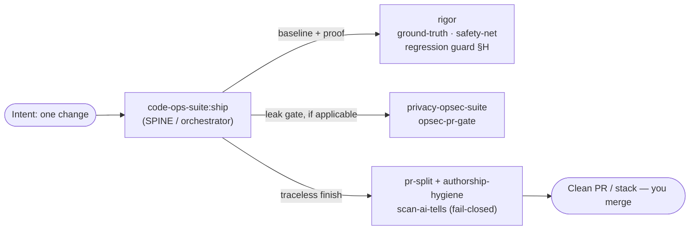

# Ship a Verified Fix

> A narrative walkthrough of taking **one** change — a feature or a one-off — from intent to a clean, proven, trace-free pull request with [`/code-ops-suite:ship`](../handbook/commands/code-ops-suite.md). This is the single-change counterpart to the broad orchestrators; where [`everything`](the-everything-pass.md) sweeps a whole repo, `ship` drives exactly one change end to end at full rigor.

## Exec summary (stop here if you just want the shape)

You have one change to make and you want it *done* — not "the code compiles," but design-checked, proven with a test that failed before and passes after, privacy-clean, and landed as a PR that reads like you wrote it. That is what `ship` is for.

`ship` is an **orchestrator** in the code-ops-suite plugin (the SPINE). It does not invent its own rigor; it **composes** the verification layer (`rigor`) and, when the change touches anonymity surfaces, the anonymity track (`privacy-opsec-suite`). It runs six phases, pausing at the checkpoints that carry a decision:

| Phase | What happens | Composes | Checkpoint? |
|------|--------------|----------|-------------|
| 0 · Scope & design-check | Detect stack, take a baseline, size the change, set the automation level | [`rigor:ground-truth`](../handbook/commands/rigor.md) | Yes |
| 1 · Safety net | Pin current behavior where coverage is thin | [`rigor:safety-net`](../handbook/commands/rigor.md) | Conditional |
| 2 · Implement | The smallest correct change, matching repo conventions | implementation loop (`CONVENTIONS §11`) | — |
| 3 · Prove | Failing→passing test; suite + regression guard green | regression guard (`rigor §H`) | — |
| 4 · Privacy gate | Block any new leak/egress/identifier; fail-closed preserved | [`privacy-opsec-suite:opsec-pr-gate`](../handbook/commands/privacy-opsec-suite.md) | Conditional |
| 5 · Finish traceless | Clean PR or stack, scrubbed of tool trace, scanner green | [`pr-split`](../handbook/commands/code-ops-suite.md) + [`authorship-hygiene`](../handbook/commands/privacy-opsec-suite.md) | Yes (before push) |

Two hard rules to remember before you read further:

1. **`ship` requires `rigor`.** The proof phases are not optional decoration — they are the point. Without `rigor` installed, the orchestrator has no safety-net, regression guard, or verification layer to compose. The privacy phase, by contrast, runs *only* if `privacy-opsec-suite` is installed **and** the change touches a privacy surface.
2. **`ship` never auto-merges.** Even on the most permissive automation level, the work lands as a commit/PR for a human to merge. "Done" means *shippable*, not *shipped past you*.

Everything below is the same six phases at depth, told as one developer carrying one change through them.

---

## The walkthrough

Take a concrete intent: *"the export endpoint drops the last row when the result set is an exact multiple of the page size."* A real bug, narrow, with a clear owner. We invoke:

```
/code-ops-suite:ship
```

and hand it that intent (a ticket, a request, or a one-line description all work — `ship` consumes an *intent*, per its SKILL).

### Phase 0 — Scope & design-check *(checkpoint)*

The first thing `ship` does is **not** write code. It establishes ground truth. It detects the stack, then runs [`/rigor:ground-truth`](../handbook/commands/rigor.md) to capture the factual baseline — build/typecheck, lint, the test suite with a coverage map, and any static analysis — recorded as facts in `GROUND_TRUTH.md`, with a **blind-spot list** of modules that have little or no coverage. This is the "ground-truth-first" rule of the shared backbone: you measure the world before you change it, so later you can prove *what your change did* rather than guessing.

It then learns the repo's own conventions (so the change reads native, not imposed) and **sizes the change**. This is the fork in the road:

- A **one-off** — our missing-row fix — proceeds. It is small, local, and the intent is unambiguous.
- A **feature** does not proceed silently. `ship` confirms the approach first: it presents numbered options with a recommendation and a default (the interaction protocol from `CONVENTIONS §3`), and waits. You don't discover the design after it's built.

Finally, Phase 0 sets the **automation level** (`CONVENTIONS §4`) for the whole run and confirms which composed plugins are actually installed (a preflight; it notes anything missing rather than failing late):

- `gated` *(default)* — pause for approval at each change/closure batch.
- `auto-safe` *(recommended ceiling)* — auto-apply only NOW-SAFE items (on a branch, test-backed, behavior-preserving, trivially revertible); still pause for NEEDS-REVIEW, NEEDS-DESIGN, and the **always-gated** categories.
- `auto-all` — *not recommended.*

The **always-gated** categories hold regardless of level: security/auth changes, secret handling, data migrations or destructive operations, and public API/contract changes. These are the backbone's non-negotiables — they never auto-apply, and nothing ever auto-merges.

> **Checkpoint — what you decide here:** the automation level, and (for a feature) the approach. For our one-off, the only real gate is "yes, this is a one-off; proceed at `gated`."

### Phase 1 — Safety net *(conditional)*

This phase fires only if the change touches code with **thin coverage** — and Phase 0's blind-spot list is exactly how `ship` knows. Our export endpoint, it turns out, has happy-path tests but nothing exercising the page-boundary math. That is a blind spot.

So `ship` runs [`/rigor:safety-net`](../handbook/commands/rigor.md), which writes **characterization tests** that lock the *current observable behavior* of the target — including its current quirks, because the job here is to pin behavior, not to assert correctness — and runs them **green against the current code**. Critically, if `safety-net` notices the very bug you're about to fix, it does **not** fix it; it records it in `FINDINGS_REGISTER.md` as a candidate and leaves the fix for Phase 2/3. The net's purpose is to give the regression guard (Phase 3) something concrete to protect, so your change can be proven *behavior-preserving everywhere except where you intended to change behavior.*

If the target already had solid coverage, `ship` skips this phase. Scale every phase to the change — a one-off in well-tested code is a light pass.

### Phase 2 — Implement

Now code gets written, through the shared **implementation loop** (`CONVENTIONS §11`): re-validate the item against current code, plan the smallest correct change, confirm if anything is ambiguous, implement while matching existing conventions and upholding the relevant quality lenses (`§10`), and *don't trade one issue for another.*

For our bug that means fixing the off-by-one at the page boundary — at its root, not by clamping the output downstream. For a feature it would mean shipping the **smallest valuable slice first**, behind a flag if the slice isn't yet complete. The discipline is the same either way: minimal, native, behavior-preserving except where the intent is to change behavior.

### Phase 3 — Prove

This is the phase that makes the change *done* rather than *written*. The rule, verbatim from the skill: **a change without a test that demonstrates it is not done.**

Three things must be true to leave this phase:

1. **A test that fails before and passes after.** It encodes the exact defect (the last row at an exact page multiple) and is the durable proof the bug is gone.
2. **The full suite is green** — your change broke nothing visible.
3. **The regression guard is green** (`rigor §H`). The guard maintains a growing **proof set** — every repro, characterization, and regression test produced during the run — and re-runs *all of it* plus the suite after the change. A change that breaks any prior proof or a previously-green test is **rejected and reworked.** You **never weaken a proof to make a change pass.** Those characterization tests from Phase 1 are in this proof set, which is how "behavior-preserving where intended" gets *enforced* rather than merely claimed.

### Phase 4 — Privacy gate *(conditional)*

This phase runs only when **both** conditions hold: `privacy-opsec-suite` is installed, **and** the change touches a privacy surface — egress, logging, identifiers, or a default. Our row-fix touches none of those, so for this particular change `ship` skips it. But it is worth knowing what would happen if it didn't.

Suppose the fix had added a log line including the exporting user's ID, or a retry that opened a new outbound request. Then `ship` runs the anonymity track's pre-merge gate ([`/privacy-opsec-suite:opsec-pr-gate`](../handbook/commands/privacy-opsec-suite.md)), which treats as **BLOCKING** any new egress path or fail-closed bypass, any new log line touching PII/identifiers/IPs, any new identifier or fingerprint vector, any new correlation surface, any phone-home dependency, or any weakened (less-anonymous) default. Any anonymity regression is surfaced as **blocking** — it does not become an advisory note you can wave through. This is the ANONYMITY TRACK doing its one job: *no new leak ships.*

### Phase 5 — Finish traceless *(checkpoint before push)*

The change is correct and proven. Now it has to *land*, and land clean. `ship` finishes through the **traceless** path:

- If the work warrants a stack of small PRs, it runs [`/code-ops-suite:pr-split`](../handbook/commands/code-ops-suite.md) to carve the branch into independently-green PRs.
- Otherwise it ships a single PR, scrubbed by [`/privacy-opsec-suite:authorship-hygiene`](../handbook/commands/privacy-opsec-suite.md) — three surfaces: **L1** attribution/tool metadata (mechanical), **L2** prose voice on commits and PR descriptions (matched to your history), and **L3** code-idiom blend-in (behavior-preserving).

The mechanical floor under both is the bundled scanner, run **fail-closed**:

```
node ${CLAUDE_PLUGIN_ROOT}/scripts/scan-ai-tells.mjs <commit-range-or-pr-body-file>
```

It flags attribution trailers (`Co-Authored-By:`, "Generated with/by …"), tool/assistant markers, emoji, em-dash density over a threshold, assistant-prose tells ("Notably,", "Importantly,", "Here's what I"/"Here's what we" — the regex requires a first-person pronoun after the phrase: `here's what (i|we)\b`, "In summary,"), and the `## Test plan` boilerplate — and it **exits non-zero on any hit**, so it can gate a push. The push is aborted if the trace can't be cleaned. (If `privacy-opsec-suite` isn't installed, `ship` runs this same bundled script directly as the gate — the floor is the same either way.)

> **Checkpoint — the last human gate:** under `gated` the run pauses before the outward-facing push; `auto-safe`/full-auto proceed after one abortable dry-run summary. Either way **nothing is auto-merged.** You get the summary and the PR link(s), and you click merge.

---

## What "done" means

Straight from the skill's own *Done when* — a change has shipped when **all** of these hold:

- implemented at the **smallest correct scope**;
- **proven** — a failing→passing test, with the full suite *and* the regression guard green;
- **behavior-preserving** everywhere except where the change intended otherwise;
- **privacy posture intact** (if the privacy phase applied);
- **docs updated** so the change creates no drift;
- shipped as a **clean, trace-free** PR or stack with the AI-tells scanner green — and **nothing auto-merged.**

`ship` then presents a summary, the PR link(s), and anything left for your decision.

## Where this sits in the four-plugin model



- **code-ops-suite (the SPINE)** owns `ship` itself — broad engineering plus the orchestrators.
- **rigor (the VERIFICATION layer)** supplies the baseline, the safety net, and the regression guard. `ship` *requires* it.
- **privacy-opsec-suite (the ANONYMITY TRACK)** supplies the leak gate, used only when a privacy surface is touched.
- The shared backbone runs through all of it: developer-in-the-loop checkpoints, evidence at `file:line`, behavior preservation, registers as the single source of truth, and the gated/auto-safe/auto-all ladder with its always-gated categories.

## See also

- [Audit a risky subsystem](audit-a-risky-subsystem.md) — the `rigor` journey when you're *investigating* rather than shipping one known change.
- [The everything pass](the-everything-pass.md) — the whole-repo superset orchestrator, checkpoint by checkpoint.
- [Orchestrators](../handbook/03-orchestrators.md) — when to reach for `ship` vs `everything` vs `debug`.
- [Evidence and tiers](../handbook/05-evidence-and-tiers.md) — CONFIRMED / PROBABLE / SPECULATIVE and the disconfirmation pass that underwrite "proven."
- [Choosing an automation level](../techniques/choosing-an-automation-level.md) — picking `gated` vs `auto-safe` for a run.

*Verified-at: c2b37e9*
