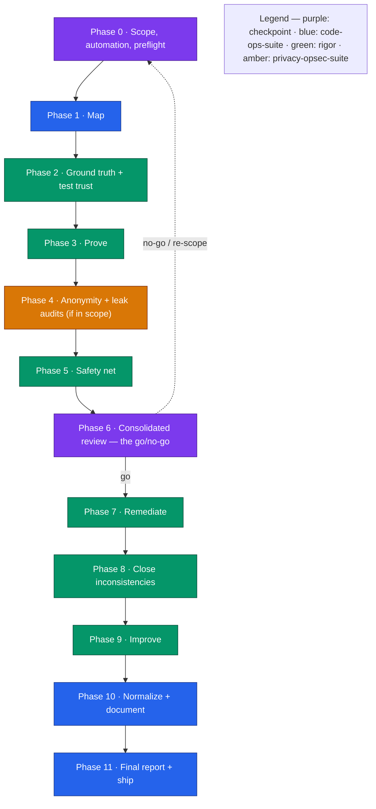

# The Everything Pass — `/code-ops-suite:everything`, Checkpoint by Checkpoint

`everything` is the cross-plugin superset orchestrator: it runs every workflow across all three engineering plugins — `code-ops-suite`, `rigor`, and `privacy-opsec-suite` — as one deduplicated, register-carrying pipeline, pausing at phase boundaries for your decisions. It is the most thorough and the most token-expensive option in the suite, and it **never auto-merges**.

This guide walks the run end to end so you know what each phase does, which register it touches, and what each checkpoint actually decides. The authoritative source is [`plugins/code-ops-suite/skills/everything/SKILL.md`](../../plugins/code-ops-suite/skills/everything/SKILL.md); this is the narrative companion to it.

---

## Exec summary (stop here if you only need orientation)

You invoke `/code-ops-suite:everything`. It does **not** replace the individual skills — it sequences them in the right order, deduplicated, carrying every register and a growing **proof set** forward, and checking in at phase boundaries.

- **Prerequisites.** All three plugins installed: `code-ops-suite`, `rigor`, and `privacy-opsec-suite`. If any is missing, the run cannot do its corresponding phases. The privacy phases are skippable (Phase 0 asks); the others are not.
- **Shape.** Twelve phases, numbered Phase 0 through Phase 11. It is **phased with checkpoints, not a blind firehose** — at Phase 0 you set scope, the privacy track, the remediation automation level, and how often it checks in.
- **The arc.** Scope and preflight → **map** → **ground truth + test trust** → **prove** → **leak audits** (if in scope) → **safety net** → a **consolidated go/no-go** → **remediate** → **close inconsistencies** → **improve** → **normalize and document** → **final report and ship**.
- **Two checkpoints are mandatory regardless of check-in level:** Phase 0 (scope and automation) and Phase 6 (the consolidated review — the main go/no-go). Plus every always-gated category always stops for you.
- **Safety floor.** Always works on a branch. Always-gated categories — security/auth, secret handling, data migrations or destructive operations, public API/contract changes, anything irreversible — stop for your approval no matter what level you chose. Even fully-auto fixes land as commits or PRs for review; **nothing is ever auto-merged.**
- **Cost.** Deliberately the most token-expensive workflow in the suite. Reach for it when you want exhaustive coverage of a whole repo (or its riskiest subsystems) and are prepared to spend for it. For a single-plugin pass, use `code-ops-suite:full-sweep` (intra-plugin); for one change end to end, use `code-ops-suite:ship`.

---

## Before you start: prerequisites and the mental model

`everything` is the **spine** plugin (`code-ops-suite`) reaching across the **verification** layer (`rigor`) and the **anonymity track** (`privacy-opsec-suite`) and running them as one pipeline. The orchestrator itself lives in `code-ops-suite`, but it loads and applies the methodology of all three:

- It first reads `code-ops-suite`'s `CONVENTIONS.md`, then also loads the `CONVENTIONS.md` and the relevant skill files from `rigor` and `privacy-opsec-suite`, so each phase applies its governing methodology.
- In particular it applies **rigor's verification-first rules** throughout: evidence tiers (CONFIRMED / PROBABLE / SPECULATIVE), the disconfirmation pass, ground-truth-first, and the regression guard. See [`docs/handbook/05-evidence-and-tiers.md`](../handbook/05-evidence-and-tiers.md) and [`docs/techniques/disconfirmation-pass.md`](../techniques/disconfirmation-pass.md).

The shared backbone all three obey — developer-in-the-loop, evidence at `file:line`, behavior preservation, registers as single source of truth with `Verified-at <sha>` freshness, and the gated / auto-safe / auto-all automation ladder — is what lets the orchestrator hand findings cleanly between phases without re-deriving them. For the registers and the freshness discipline this run leans on heavily, see [`docs/handbook/04-registers-and-freshness.md`](../handbook/04-registers-and-freshness.md).

---

## Phase 0 — Scope, automation level, and preflight  *(checkpoint)*

This is where you steer the entire run, and it is a mandatory checkpoint. The orchestrator detects the stack and size, confirms all three plugins are available, and verifies library/framework facts against the **installed versions** via the in-house docs lookup (`CONVENTIONS §2`) — never from memory. Then it confirms four things with you:

1. **Scope** — the whole repo, or the riskiest subsystems first. Subsystems-first is recommended for large repos, because bug-hunting goes deep per subsystem and that depth is expensive.
2. **Privacy track** — include the privacy-opsec phases (Phase 4) or not. Yes if the project has anonymity/opsec requirements; otherwise skip them and the leak register never opens.
3. **Remediation automation level** — the canonical ladder (`code-ops §4`), applied with rigor's tier gate (`rigor §4` / `§H`). This governs every code-changing phase. See [`docs/techniques/choosing-an-automation-level.md`](../techniques/choosing-an-automation-level.md).
   - `gated` *(default)* — pause for your approval at each fix/closure batch.
   - `auto-safe` *(recommended ceiling)* — automatically apply **CONFIRMED + NOW-SAFE** fixes (each on a branch, each carrying a failing→passing regression test, each passing the regression guard); pause only for NEEDS-REVIEW, NEEDS-DESIGN, and the always-gated categories.
   - `auto-all` — *not recommended*; even here the always-gated categories still stop, and NEEDS-DESIGN is never auto-applied.
   - **Always gated, regardless of level:** security/auth changes, secret handling, data migrations or destructive operations, public API/contract changes, and anything irreversible.
4. **Check-in level** — `normal` (pause per phase) or `minimal` (pause only at the consolidated review in Phase 6 plus any always-gated item).

**Registers opened.** The master registers — `FINDINGS_REGISTER.md`, `CONSISTENCY_REGISTER.md`, and `LEAK_REGISTER.md` if privacy is in scope — plus a running `EXECUTIVE_SUMMARY.md`, a coverage map, and a growing **proof set**.

**What the checkpoint decides.** The blast radius and the spend of the whole run: how much code is in play, whether the anonymity track runs, how much the orchestrator may change without asking, and how chatty it is. It commits to working on a branch and to **never auto-merging**. Any CONFIRMED critical finding is surfaced immediately, even mid-phase. And it commits to keeping every register fresh across phases: a finding fixed earlier in the run is marked `OBSOLETE-AT <sha>` and never re-ranked or re-shown.

---

## Phase 1 — Map  *(code-ops-suite)*

**What runs.** `doc-alignment` → `codebase-audit` → `security-privacy-audit`, in that order.

This produces an accurate map plus a broad first-pass register. Findings are **tiered and disconfirmed** (`§7`) and run through the **multi-boundary control-coverage** lens (`§10`) — for any control or gate or invariant, every entry point that can reach the protected action is enumerated and the control verified at each.

**Register touched.** `FINDINGS_REGISTER.md` (seeded with the broad first pass); `doc-alignment` also reconciles docs and produces its drift artifacts; `security-privacy-audit` produces `THREAT_MODEL.md` and feeds NEEDS-REVIEW / NEEDS-DESIGN items into the findings register.

**Checkpoint.** Under `normal` check-in, a phase-boundary pause to confirm the map and the first-pass findings before the run goes deep. Under `minimal`, it proceeds (surfacing any CONFIRMED critical immediately).

---

## Phase 2 — Ground truth and test trust  *(rigor)*

**What runs.** `ground-truth` → `test-suite-audit`.

`ground-truth` runs the real toolchain — build/typecheck, lint, tests plus coverage, static analysis — and captures it as facts; nothing downstream is allowed to contradict it. `test-suite-audit` then establishes where "green" is actually trustworthy and where the coverage blind spots are (it executes the suite repeatedly and runs mutation checks).

**Registers touched.** Produces `GROUND_TRUTH.md` and seeds CONFIRMED items into `FINDINGS_REGISTER.md`; produces `TEST_SUITE_REPORT.md` plus a trust map. The blind-spot map feeds Phase 5's safety net directly.

**Checkpoint.** Phase boundary under `normal`. This is the phase that turns assumptions into facts — everything after it builds on this baseline.

---

## Phase 3 — Prove  *(rigor)*

**What runs.** `bug-hunt` (deep per subsystem; root cause plus a sibling sweep for the whole class) and `quality-scan`, everything tiered and disconfirmed; `regression-hunt` to bisect any regression to the commit that introduced it.

This is the rigor heart of the run and, on a large repo scoped subsystem-by-subsystem, the most expensive single phase. `bug-hunt` does not just flag — it **executes repros**, so a CONFIRMED bug here is a reproduced bug, not a static guess.

**Register touched.** Findings merge into `FINDINGS_REGISTER.md`, each entry stamped `Verified-at <sha>`; repro tests are saved into the proof set. `regression-hunt` produces `REGRESSION_REPORT.md`.

**Checkpoint.** Phase boundary under `normal`. A CONFIRMED critical surfaces immediately regardless of check-in level.

---

## Phase 4 — Anonymity and leak audits  *(privacy-opsec-suite — only if in scope)*

**What runs** (skipped entirely if you declined the privacy track at Phase 0). The keystone first, then six parallel leak audits:

`anonymity-threat-model` → `anon-session-audit`, `tor-egress-audit`, `metadata-leak-audit`, `fingerprint-resistance`, `traffic-analysis-resistance`, `supply-chain-trust`.

The threat model is the keystone the six audits build on: it maps the assets that identify or link a user, the adversaries, and the deanonymization paths. The six audits then each look for concrete leaks through their lens.

**Registers touched.** `anonymity-threat-model` produces `ANONYMITY_THREAT_MODEL.md` (a durable, reusable artifact) and feeds concrete leaks into `LEAK_REGISTER.md`; each of the six audits feeds tiered, `Verified-at` findings into `LEAK_REGISTER.md`. A clearnet/DNS egress leak is surfaced as **critical**.

**Checkpoint.** Phase boundary under `normal`. The leak register becomes a first-class input to the consolidated review in Phase 6 and is the backlog `opsec-hardening` consumes in Phase 7.

---

## Phase 5 — Safety net  *(rigor)*

**What runs.** `safety-net`.

It writes **characterization tests** that pin current observable behavior on the coverage blind spots from Phase 2 and on everything queued for change. This adds tests only — it changes no production code. The point is to make the fixes ahead **provably behavior-preserving**: the regression guard now has something concrete to protect.

**Register/artifact touched.** A characterization test suite (added to the proof set) plus any suspicious-behavior findings it turns up.

**Checkpoint.** Phase boundary under `normal`. This is the last phase before the main go/no-go; after it, the run has a complete picture and a safety net under everything it intends to touch.

---

## Phase 6 — Consolidated review  *(checkpoint — the main go/no-go)*

This is the mandatory decision point, and it fires regardless of your check-in level. Before presenting anything, the orchestrator **re-validates every carried register against current HEAD** (`§12`) — running the freshness check so nothing already fixed earlier in the run is re-listed.

It then presents **one prioritized, CONFIRMED-led picture** across bugs, quality issues, leaks, and inconsistencies, together with the remediation plan and the automation level currently in effect.

**Registers touched.** Reads `FINDINGS_REGISTER.md`, `CONSISTENCY_REGISTER.md`, and `LEAK_REGISTER.md` (if in scope); reconciles them against HEAD; nothing past its `OBSOLETE-AT` is shown.

**What the checkpoint decides.** Go or no-go on remediation, and the shape of it: which findings to fix, in what order, under which automation level. You can re-scope, defer items, or stop here with a complete assessment and no code changed. Everything from Phase 7 onward depends on the green light given here.

---

## Phase 7 — Remediate  *(rigor `fix-verified` + code-ops `remediation` + privacy-opsec `opsec-hardening`)*

**What runs**, per the automation level you set:

- `rigor:fix-verified` fixes CONFIRMED bugs at **root cause**, each with a failing→passing regression test, the regression guard, a sibling sweep across the whole class, and an enforcement so the class can't recur. A PROBABLE item must be reproduced (promoted to CONFIRMED) before it is fixed.
- `code-ops-suite:remediation` works the NEEDS-REVIEW / NEEDS-DESIGN backlog safely, with tests.
- `privacy-opsec-suite:opsec-hardening` applies the privacy/anonymity fixes from the leak register with fail-closed routing where relevant.

Each change is tested, behavior-preserving, atomic, and on the branch.

**Registers touched.** `FINDINGS_REGISTER.md` and `LEAK_REGISTER.md` are updated as items ship (closed-with-proof / deferred-with-reason); an `IMPLEMENTATION_LOG.md` records change, proof, root cause, siblings handled, and behavior notes.

**Checkpoint behavior.** Under `gated`, every fix/closure batch pauses for approval. Under `auto-safe`, CONFIRMED + NOW-SAFE fixes apply automatically (each branch-isolated, test-backed, guarded) and only NEEDS-REVIEW, NEEDS-DESIGN, and always-gated categories pause. The always-gated categories — security/auth, secrets, data migrations, public contracts, irreversible ops — stop for you at **every** level.

---

## Phase 8 — Close inconsistencies  *(rigor `consistency-closure`)*

**What runs.** `consistency-closure`: pick the one canonical form per concept, migrate every site to it, and add a mechanical enforcement so the divergence cannot silently return. The choice of canonical form is approved by you unless the level is `auto-safe`/`auto-all` and the choice is clearly mechanical.

**Register touched.** `CONSISTENCY_REGISTER.md`, plus migration diffs and the new enforcement.

**Checkpoint.** Per the automation level — the canonical-form decision is the gate; the mechanical migration that follows runs inside the approved unit.

---

## Phase 9 — Improve  *(rigor `improve-measured` + code-ops `performance` + `dependency-upgrade`)*

**What runs.** Only changes with a **measured before→after delta** ship, and all are behavior-preserving.

- `rigor:improve-measured` — the rule is: if you can't measure the "before", you can't claim the "after". It relies on the Phase 5 safety net to prove behavior preservation.
- `code-ops-suite:performance` — profiling-led optimization of what is proven hot; each commit carries before/after numbers.
- `code-ops-suite:dependency-upgrade` — safe, staged upgrades and CVE remediation; never a bulk bump.

**Registers/artifacts touched.** `IMPROVEMENTS_LOG.md`, `PERFORMANCE_REPORT.md`, `DEPENDENCY_REPORT.md` and an updated lockfile; remaining opportunities feed back into `FINDINGS_REGISTER.md`.

**Checkpoint.** Per the automation level; dependency major-version bumps and any contract-touching change are always-gated.

---

## Phase 10 — Normalize and document  *(code-ops `normalize` + the doc generators)*

**What runs.** `normalize` brings the codebase to one consistent style with an enforced linter/formatter config (behavior-preserving). `doc-alignment` then reconciles the docs against the now-changed code. Finally the run **generates the reference docs** for the now-accurate, now-hardened system, each per the documentation quality standard (`§13`) and self-scoping:

**architecture** (C4 plus the critical flows just traced) · **data-model** · **api-docs** · **ops-docs** · **adr** (capturing the decisions this run surfaced) · **onboarding**.

**Registers/artifacts touched.** `STYLE_GUIDE.md` and the enforced config from `normalize`; the drift artifacts from `doc-alignment`; and the generated reference docs (`ARCHITECTURE.md` and the rest) in the repo's docs location, each carrying its `Verified-at` freshness stamp.

**Checkpoint.** Phase boundary under `normal`; normalize is behavior-preserving and keeps tests green at every step.

---

## Phase 11 — Final verification, report, and ship

**What runs.** The full suite plus the **entire proof set** must be green, and the regression guard clean — no prior proof broken. The run then produces the master `EXECUTIVE_SUMMARY.md` tying together what was found, proven, fixed, closed, improved, and documented — with **CONFIRMED separated from PROBABLE/SPECULATIVE** — alongside the coverage map and anything still awaiting a decision. It notes the PR gates to wire in for ongoing protection: `rigor:deep-review` and `privacy-opsec-suite:opsec-pr-gate`.

If you choose to ship, it carves the remediation diff into a clean, independently-green stack with **pr-split**, which runs `privacy-opsec-suite:authorship-hygiene` fail-closed so the commits and PRs carry no AI/tooling trace. As everywhere else, it **never auto-merges** — the stack is opened for review.

**Register/artifact touched.** The master `EXECUTIVE_SUMMARY.md`; the pr-split stack of small, independently-green PRs.

**Checkpoint.** The ship decision is yours; the traceless PR stack is the hand-off, not a merge.

---

## Done when

The run is complete when every in-scope phase is done; CONFIRMED bugs are fixed at root cause with regression proofs; inconsistencies are closed and enforced; improvements carry measured deltas; privacy leaks (if in scope) are closed and locked; the reference docs are generated where applicable; every register carried across phases is fresh (no obsolete item re-shown); the proof set and the suite are green; the master summary is delivered; and **nothing in an always-gated category — and, under `gated`, nothing code-changing — happened without your approval.**

---

## When to reach for `everything` (and when not to)

- **Use `everything`** when you want the most exhaustive, end-to-end pass across all three plugins on a whole repo or its riskiest subsystems, and you are prepared for the cost. It is the cross-plugin superset.
- **Use `code-ops-suite:full-sweep`** instead when you want the spine plugin's pipeline only — intra-plugin, no rigor verification layer or privacy track. Cheaper and narrower.
- **Use `code-ops-suite:ship`** for one change (a feature or a one-off) end to end at full rigor, rather than a whole-repo sweep. See [`docs/guides/ship-a-verified-fix.md`](ship-a-verified-fix.md).
- **Use `code-ops-suite:debug`** to drive a single bug from symptom to a proven root-cause fix.

For the full task→command router and per-command detail, see [`docs/handbook/commands/README.md`](../handbook/commands/README.md). For how the orchestrators compare on phases and relative cost, see [`docs/handbook/03-orchestrators.md`](../handbook/03-orchestrators.md).

---

*Verified-at: c2b37e9*
