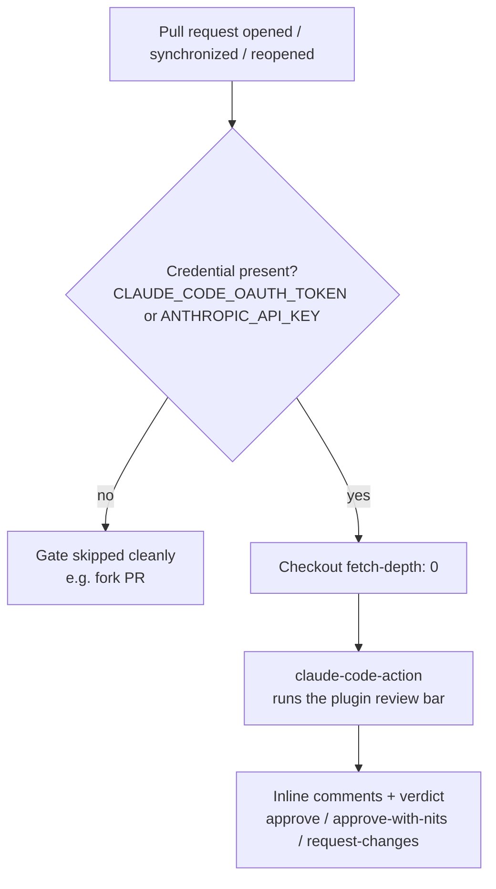
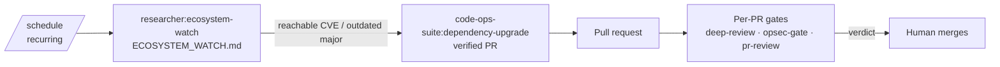

# Wire CI Gates

> A narrative walkthrough for a team standing up **continuous gates** on a repository: three per-PR review gates that hold every pull request to the suite's bars — engineering ([`code-ops-suite:pr-review`](../handbook/commands/code-ops-suite.md)), verification ([`rigor:deep-review`](../handbook/commands/rigor.md)), and anonymity ([`privacy-opsec-suite:opsec-pr-gate`](../handbook/commands/privacy-opsec-suite.md)) — plus recurring researcher runs on a schedule. This is the hands-on companion to the reference page [08-ci-and-automation.md](../handbook/08-ci-and-automation.md); read that for the full inventory, read this to actually wire it.

## Exec summary (stop here if you just want the shape)

You want every PR reviewed by the same bar your team would apply by hand, automatically, before a human looks. The suite ships three review gates and a way to schedule recurring research. The end state is:

| Gate | Workflow file (this repo) | What it enforces | Skill it runs |
|------|---------------------------|------------------|---------------|
| Engineering review | — (start from the example below) | Senior engineering bar: correctness, design, perf, security, privacy, tests, docs | [`code-ops-suite:pr-review`](../handbook/commands/code-ops-suite.md) |
| Deep review | [`.github/workflows/deep-review.yml`](../../.github/workflows/deep-review.yml) | Verification-first bar: evidence tiers + disconfirmation pass | [`rigor:deep-review`](../handbook/commands/rigor.md) |
| OpSec gate | [`.github/workflows/opsec-gate.yml`](../../.github/workflows/opsec-gate.yml) | Anonymity bar: no new egress/leak/identifier; fail-closed preserved | [`privacy-opsec-suite:opsec-pr-gate`](../handbook/commands/privacy-opsec-suite.md) |
| Structural lint | [`.github/workflows/validate.yml`](../../.github/workflows/validate.yml) | Deterministic checks (lint, zero-dep, evals) — no credential needed | `scripts/` + `evals/` |

The four moving parts you wire, in order:

1. **Install the GitHub App and the credential.** Run `/install-github-app` inside Claude Code once; it installs the app and sets up a Claude credential secret.
2. **Add the workflows.** Paste the review criteria from each plugin's example workflow into a `.github/workflows/*.yml` file (this repo already ships three you can copy verbatim).
3. **Set the right permissions and credential.** A Claude credential (`CLAUDE_CODE_OAUTH_TOKEN` **or** `ANTHROPIC_API_KEY`) plus `id-token: write` for the Pro/Max OAuth path. The gates **skip cleanly** when no credential is present, so fork PRs never fail on a missing secret.
4. **Make them required, and schedule the recurring work.** Mark the gates as required status checks in branch protection, and use `/schedule` for recurring [`researcher:ecosystem-watch`](../handbook/commands/researcher.md), [`code-ops-suite:dependency-upgrade`](../handbook/commands/code-ops-suite.md), and [`code-ops-suite:security-privacy-audit`](../handbook/commands/code-ops-suite.md).

Two rules to hold in mind before the depth section:

- **The credential gate is fail-open by design, the review bar is fail-closed.** A PR with *no* credential available skips the gate (so external contributors are never blocked); a PR *with* a credential gets a real review that can request changes. Don't confuse the two.
- **These gates review and comment — they never write code or merge.** Every workflow restricts tools to read-and-comment (`--allowed-tools Read,Grep,Glob` for the read-only gates, `+Bash` for deep-review so it can run the toolchain).

Everything below is those four steps at depth, with the exact YAML this repo runs.

---

## Step 1 — Install the GitHub App and the Claude credential

Run this once, from inside Claude Code, in the repo you want to gate:

```
/install-github-app
```

This is the canonical setup path. It installs the GitHub App on the repository, configures the credential secret, and generates a working starter workflow. As every example workflow header in the suite notes, the official action's exact input names evolve over time — `/install-github-app` is how you get a *current, correct* starter, into which you then paste the suite's review criteria (Step 2).

You can wire a credential by hand instead. The gates accept either of two secrets:

- **`CLAUDE_CODE_OAUTH_TOKEN`** — a Pro/Max subscription token, produced by running `claude setup-token`. This is the OAuth path.
- **`ANTHROPIC_API_KEY`** — a standard Anthropic API key.

Set whichever you have as a repository (or organization) secret. The workflows detect either one; you do not need both.

---

## Step 2 — Add the workflows and paste the criteria

Each plugin ships an **illustrative** example workflow under `plugins/<name>/examples/`. These are starting points, not drop-in guarantees — the value in them is the `prompt`, which encodes that plugin's review bar. This repo also ships three **live** gate workflows under `.github/workflows/` that already inline those prompts; if you are gating this repo, copy those. If you are gating your own repo, paste the example `prompt` into the starter `/install-github-app` produced.

The pattern is identical across all three. Each gate:

1. Triggers on `pull_request` for `opened`, `synchronize`, `reopened`.
2. Detects whether a credential is present, and skips cleanly if not.
3. Runs [`anthropics/claude-code-action`](../../.github/workflows/deep-review.yml) with the plugin's review criteria as the `prompt`.



### The engineering gate — `code-ops-suite:pr-review`

The example at [`plugins/code-ops-suite/examples/github-pr-review.yml`](../../plugins/code-ops-suite/examples/github-pr-review.yml) holds the PR to a senior engineering bar: correctness and intricate bugs, design and modularity, performance regressions, security introduced, privacy/data-handling (a privacy regression is **BLOCKING**), UI/accessibility, tests, docs, and convention fit. Its `prompt` says, when the plugin is available in CI:

```
/code-ops-suite:pr-review for this pull request
```

…and otherwise inlines the full criteria so the action is self-contained. It restricts tools with `claude_args: "--allowed-tools Read,Grep,Glob"` — read and comment only, no arbitrary writes.

### The verification gate — `rigor:deep-review`

The live workflow [`.github/workflows/deep-review.yml`](../../.github/workflows/deep-review.yml) (mirroring [`plugins/rigor/examples/github-deep-review.yml`](../../plugins/rigor/examples/github-deep-review.yml)) applies rigor's verification-first bar. Its prompt invokes `/rigor:deep-review` if the plugin is available, otherwise inlines the bar:

- **Ground truth first** — it runs `node scripts/lint-plugins.mjs`, `node scripts/check-no-deps.mjs`, and the `evals/` harnesses so the review starts from facts.
- **Evidence tiers** — every concern is tagged **CONFIRMED** (reproduced) / **PROBABLE** (strong static evidence) / **SPECULATIVE** (a low-confidence lead).
- **A disconfirmation pass** before reporting anything: is it reachable, already handled, intentional, or already tested? Drop what doesn't survive.
- A verdict and a do-not-inflate-tiers rule: never block on a SPECULATIVE, never wave through a CONFIRMED defect.

Because it runs the toolchain, this gate's tools are `claude_args: "--allowed-tools Read,Grep,Glob,Bash"` — the only one of the three that gets `Bash`. For the tiers and disconfirmation method itself, see [05-evidence-and-tiers.md](../handbook/05-evidence-and-tiers.md).

### The anonymity gate — `privacy-opsec-suite:opsec-pr-gate`

The live workflow [`.github/workflows/opsec-gate.yml`](../../.github/workflows/opsec-gate.yml) (mirroring [`plugins/privacy-opsec-suite/examples/github-opsec-gate.yml`](../../plugins/privacy-opsec-suite/examples/github-opsec-gate.yml)) is the pre-merge anonymity/opsec gate. Its prompt invokes `/privacy-opsec-suite:opsec-pr-gate` if the plugin is available, otherwise inlines the criteria. It treats as **BLOCKING regressions**: a new outbound network path (or re-enabling lib-docs' fetch by default / removing its https-and-public-host allowlist), a new third-party import (the suite is dependency-free), a weakened default or loosened authorship/freshness gate, and any new log line or output emitting secrets / identifiers / IPs or added telemetry — plus the standard checks (no new identifier/fingerprint/correlation surface, fail-closed preserved, metadata minimized). Tools are read-only: `claude_args: "--allowed-tools Read,Grep,Glob"`. It must never echo real identifiers, secrets, or IPs.

> This gate is the CI enforcement endpoint of the anonymity track. The earlier track — `anonymity-threat-model` → the six leak audits → `LEAK_REGISTER.md` → `opsec-hardening` — is what produces a clean baseline; the gate keeps PRs from regressing it. See [02-mental-model.md](../handbook/02-mental-model.md).

---

## Step 3 — Permissions, credential, and the skip-clean behavior

This is the part teams get wrong, so it is worth doing carefully. The two AI gates this repo ships ([`deep-review.yml`](../../.github/workflows/deep-review.yml) and [`opsec-gate.yml`](../../.github/workflows/opsec-gate.yml)) declare exactly these permissions:

```yaml
permissions:
  contents: read
  pull-requests: write
  id-token: write # claude-code-action mints an OIDC token for the Pro/Max OAuth path
```

- **`contents: read`** — read the repository to review it. Nothing more.
- **`pull-requests: write`** — post inline review comments and the verdict.
- **`id-token: write`** — **required for the Pro/Max OAuth path.** `claude-code-action` mints an OIDC token for the `CLAUDE_CODE_OAUTH_TOKEN` flow. If you wire the gate only with `ANTHROPIC_API_KEY`, you still want this present so the OAuth path works for whoever uses it; the live workflows declare it on both gates.

The simpler `validate.yml` workflow (structural lint, zero-dep guard, evals) needs only `contents: read` because it runs deterministic scripts and never calls the action or comments on the PR.

### Wiring the credential into the action

Both AI workflows pass *both* secret inputs to the action and let it use whichever is set:

```yaml
- name: Verification-first review
  if: steps.key.outputs.present == 'true'
  uses: anthropics/claude-code-action@30544b674398ee15c84819bd87caf8a87e8c7b55 # v1
  with:
    claude_code_oauth_token: ${{ secrets.CLAUDE_CODE_OAUTH_TOKEN }}
    anthropic_api_key: ${{ secrets.ANTHROPIC_API_KEY }}
    prompt: |
      ...the plugin review bar...
    claude_args: "--allowed-tools Read,Grep,Glob,Bash"
```

Note the action is **pinned to a commit SHA**, not a moving tag (`@30544b67…` with a trailing `# v1` comment that tracks the tag). That is the suite's own [`supply-chain-trust`](../handbook/commands/privacy-opsec-suite.md) discipline applied to CI: a moved tag cannot inject code into your pipeline. Bump it deliberately. The `actions/checkout` and `actions/setup-node` steps are pinned the same way.

### Skip-clean on fork PRs

A pull request from a fork cannot read the repository's secrets, so neither credential is present. Rather than fail the job (which would block every external contributor), each gate detects the credential first and skips cleanly:

```yaml
- name: Detect credential
  id: key
  run: echo "present=${{ secrets.CLAUDE_CODE_OAUTH_TOKEN != '' || secrets.ANTHROPIC_API_KEY != '' }}" >> "$GITHUB_OUTPUT"
```

Every subsequent step is guarded by `if: steps.key.outputs.present == 'true'`. When `present` is `false`, a final step runs instead:

```yaml
- name: Gate skipped
  if: steps.key.outputs.present != 'true'
  run: echo "No Claude credential set (CLAUDE_CODE_OAUTH_TOKEN or ANTHROPIC_API_KEY) — deep-review gate skipped (fork PR or unconfigured repo)."
```

The job **succeeds** in the skipped state. That is the intended behavior: a missing credential is "we can't review this here," not "this PR is bad." It means you can commit these workflows to a public repo today and they will simply no-op on forks until a credential is configured.

---

## Step 4 — Make them required, and schedule the recurring work

### Required status checks

Skip-clean has a consequence for branch protection: because the gate **passes** when it skips, marking it "required" does not block fork PRs (they pass-by-skip) but *does* block internal PRs that get a `request-changes` verdict — exactly the asymmetry you want. To enforce:

1. In **Settings → Branches → Branch protection rules** for your default branch, enable **Require status checks to pass before merging**.
2. Add the job names — `deep-review`, `opsec-gate`, and `structural-lint` (and your engineering-review job if you add one) — to the required set.
3. Optionally enable **Require branches to be up to date** so the gates always run against current HEAD.

A reviewer still merges; the gate is a wall, not an autopilot. None of these gates auto-merge.

### Recurring researcher runs with `/schedule`

The per-PR gates catch regressions in a *change*. The recurring runs catch drift in the *world* — new CVEs, deprecations, and newly-available capabilities in the stack you actually run. Use `/schedule` to set these on a cadence:

| Schedule this | Cadence idea | What it produces | Hands off to |
|---------------|--------------|------------------|--------------|
| [`researcher:ecosystem-watch`](../handbook/commands/researcher.md) | Weekly | `ECOSYSTEM_WATCH.md` — a tiered, cited register of actionable changes (each run a diff against the last) | `dependency-upgrade` / `supply-chain-trust` / `feature-*` / `adr` |
| [`code-ops-suite:dependency-upgrade`](../handbook/commands/code-ops-suite.md) | Monthly, or on a watch finding | Verified, staged upgrade PRs + `DEPENDENCY_REPORT.md` | — (it ships the PRs) |
| [`code-ops-suite:security-privacy-audit`](../handbook/commands/code-ops-suite.md) | Quarterly | `THREAT_MODEL.md` + `SECURITY_PRIVACY_FINDINGS.md`; feeds `FINDINGS_REGISTER.md` | `remediation` / the privacy track |

Two properties of `ecosystem-watch` make it the right thing to schedule, and they carry over to a scheduled run:

- **It is a diff, not a restart.** Each scheduled run re-grounds against the lockfile, gathers only changes since the prior run's `Verified-at` sha, drops entries that no longer apply (stamped `OBSOLETE-AT <sha>`), and surfaces only what is new and reachable against code you actually run.
- **It honors the egress contract on every run.** `ecosystem-watch` is discovery-only — it proposes and hands off, it **never edits source**. Gathering changes needs **opt-in web egress**; a scheduled run operates inside a pre-agreed egress scope, records every external request in `EGRESS_MANIFEST.md`, and **stops at a checkpoint rather than widening egress unattended**. The `research-manifest.mjs validate` step fails closed on any artifact that cites an un-manifested source. This is the [researcher proposal layer's](../handbook/02-mental-model.md) fail-closed discipline applied to a cron cadence.

Because the researcher proposes and hands off rather than editing, the natural pipeline is: **scheduled `ecosystem-watch` finds a reachable CVE → it hands off to `dependency-upgrade` → that ships a verified PR → your per-PR gates review the PR.** Continuous gates and scheduled research close the loop on each other.



---

## Where to go next

- The reference inventory of every gate and automation knob: [08-ci-and-automation.md](../handbook/08-ci-and-automation.md).
- The four-plugin roles these gates enforce: [02-mental-model.md](../handbook/02-mental-model.md).
- The evidence tiers and disconfirmation pass that `deep-review` applies: [05-evidence-and-tiers.md](../handbook/05-evidence-and-tiers.md).
- The registers `ecosystem-watch` and `security-privacy-audit` write, and their freshness rules: [04-registers-and-freshness.md](../handbook/04-registers-and-freshness.md).
- Per-plugin command catalogs: [code-ops-suite](../handbook/commands/code-ops-suite.md) · [rigor](../handbook/commands/rigor.md) · [privacy-opsec-suite](../handbook/commands/privacy-opsec-suite.md) · [researcher](../handbook/commands/researcher.md).

---

*Verified-at: c2b37e9*
