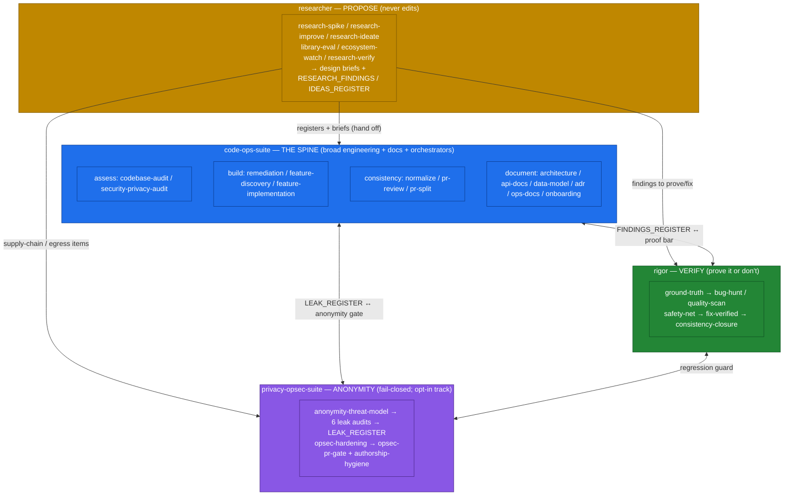
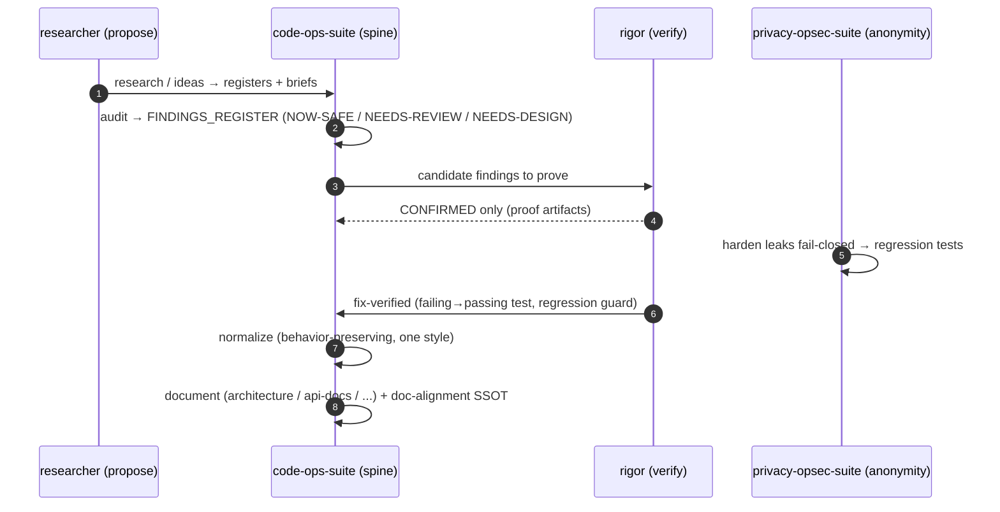

# The Four-Plugin Mental Model

> Part of the [code-ops handbook](README.md). See also [Getting started](01-getting-started.md) and [Orchestrators](03-orchestrators.md).

## Executive summary (stop here if you only need orientation)

The [code-ops marketplace](../../.claude-plugin/marketplace.json) ships **four plugins**. They are separate installs with distinct methodologies, but they share one backbone and chain into one workflow. Learn them by their role:

| Plugin | Role word | One-line job | Edits code? |
|---|---|---|---|
| `code-ops-suite` | **the spine** | broad-breadth engineering for any repo, plus the reference-doc generators and the orchestrators | yes |
| `rigor` | **verify** | prove-it-or-don't: proven bugs, validated tests, enforced quality | yes |
| `privacy-opsec-suite` | **anonymity** | keep your system's users unlinkable; find and fix leaks; fail closed | yes |
| `researcher` | **propose** | code-grounded research; proposes registers and design briefs, then hands off | **no** |

The spine does the broad work; the other three compose **around** it — `rigor` raises the proof bar, `privacy-opsec-suite` adds the anonymity track (only when a project has anonymity needs), and `researcher` feeds proposals in from external knowledge. The typical end-to-end flow is:

```
research / audit  →  prove  →  harden  →  fix  →  normalize  →  document
   (propose)        (verify)  (anonymity)         (spine)
```

All four obey the same shared backbone: **developer-in-the-loop**, **evidence at `file:line`**, **behavior-preservation by default**, **registers as the single source of truth** (stamped `Verified-at <sha>`, kept fresh by `revalidate-register.mjs`), and the **gated / auto-safe / auto-all** automation ladder with always-gated categories (security/auth, secrets, data migrations, public contracts, destructive ops).

If you read nothing else, read the diagram below and the [glossary](#glossary).

---

## The model in depth

### The spine: `code-ops-suite`

`code-ops-suite` ([README](../../plugins/code-ops-suite/README.md)) is the broad-breadth engineering layer for any codebase. It is the spine because two other things hang off it: the **reference-doc generators** and the **orchestrators** that drive cross-plugin workflows. It carries **23 skills**, grouped by intent:

- **Assess** — `codebase-audit` (broad multi-lens review → `FINDINGS_REGISTER.md`), `security-privacy-audit` (STRIDE + LINDDUN threat assessment → `THREAT_MODEL.md`).
- **Build** — `remediation` (implements the findings backlog), `feature-discovery` (finds and specs grounded features), `feature-implementation` (builds the smallest valuable slice behind flags).
- **Deep-dives** — `performance` (measure → optimize the proven-hot → prove with before/after numbers), `test-hardening` (meaningful, deterministic coverage), `dependency-upgrade` (safe, staged upgrades + CVE remediation).
- **Gate / consistency** — `pr-review` (rigorous pre-merge review), `normalize` (one consistent professional style repo-wide, behavior-preserving), `pr-split` (carve a big branch into a clean stack of small green PRs; composes `privacy-opsec-suite:authorship-hygiene`, fail-closed).
- **Docs / knowledge** — `doc-alignment` (reconcile doc drift, establish the SSOT), `onboarding` (verified orientation guide), `current-docs` (version-accurate dependency docs, local-first; also the `code-ops-docs` MCP server).
- **Documentation generators** (Mode: DOCUMENT) — `architecture`, `api-docs`, `data-model`, `adr`, `ops-docs`.
- **Orchestrators** — `full-sweep` (the whole suite end-to-end, intra-plugin), `everything` (the cross-plugin superset across all three engineering/anonymity plugins), `ship` (one change at full rigor), `debug` (symptom → proven root-cause fix).

It fans work out to two bundled subagents: `explorer` (read-only, parallel investigation) and `reviewer` (strong model, parallel review). Both never edit.

### The verification layer: `rigor`

`rigor` ([README](../../plugins/rigor/README.md)) is the high-signal counterpart to `code-ops-suite` breadth. Its rule is **prove it or don't report it; measure it or don't claim it; close it so it can't come back.** Where an audit *asserts* findings and samples, `rigor` trades breadth and speed for signal and proof. Its distinctive machinery (defined in [`rigor/CONVENTIONS.md`](../../plugins/rigor/CONVENTIONS.md)):

- **Evidence tiers + triangulation** — `CONFIRMED` (reproduced) / `PROBABLE` (≥2 independent static-evidence lines) / `SPECULATIVE` (a lead). Only CONFIRMED drives an automated fix; tier inflation is the cardinal sin.
- **Mandatory disconfirmation pass** — before reporting, actively try to *kill* each finding (reachable? handled elsewhere? intentional? already tested?).
- **Ground truth first** — run the real toolchain (build/typecheck, lint, tests + coverage, static analysis) and treat it as fact; model findings reconcile against it.
- **Proof artifacts, not assertions** — a CONFIRMED bug ships a runnable repro; a fix ships a regression test that **fails before and passes after**; an improvement shows a **before/after measurement**.
- **Closure with enforcement** — an inconsistency gets one canonical form, every site migrated, and a lint rule / test so the divergence can't silently return.

It carries **11 skills**: `ground-truth`, `test-suite-audit`, `safety-net`, `bug-hunt` (the flagship), `regression-hunt`, `quality-scan`, `consistency-closure`, `improve-measured`, `fix-verified`, `deep-review`, and the `rigor-sweep` orchestrator. Its subagents are `tracer` (traces a path or derives invariants, never executes) and `verifier` (writes and runs a minimal repro to confirm or kill a candidate — the reason `CONFIRMED` means something).

The pairing is direct: `rigor:bug-hunt` is the proven-bug counterpart to `code-ops-suite:codebase-audit`; `rigor:deep-review` is the verification-bar counterpart to `code-ops-suite:pr-review`.

### The anonymity track: `privacy-opsec-suite`

`privacy-opsec-suite` ([README](../../plugins/privacy-opsec-suite/README.md)) is the specialization for systems with **anonymity / OpSec needs** — not every project has them, which is exactly why it is a separate install. Its stance is defensive privacy engineering: protect your system's *own users'* anonymity, anonymous-by-default, **fail closed**. Every skill treats the anonymity & OpSec model ([`CONVENTIONS.md` §A](../../plugins/privacy-opsec-suite/CONVENTIONS.md)) as the central, non-negotiable constraint.

The track has a clear shape: a keystone model, six parallel leak audits, a single backlog, the hardening pass, and the gates.

- **Keystone** — `anonymity-threat-model` maps how a user could be deanonymized (adversaries, assets, deanonymization paths, residual risk).
- **Six parallel leak audits** — `anon-session-audit`, `tor-egress-audit`, `metadata-leak-audit`, `fingerprint-resistance`, `traffic-analysis-resistance`, `supply-chain-trust`.
- **Backlog** — all of the above feed `LEAK_REGISTER.md` (stable IDs such as `EGRESS-003`).
- **Harden** — `opsec-hardening` implements the fixes fail-closed; each leak gets a regression test that fails if it returns.
- **Gates** — `opsec-pr-gate` blocks any change adding egress, logging, identifiers, fingerprint surface, correlation, or weakened defaults; `authorship-hygiene` removes AI/tooling trace before publish (bundled `scan-ai-tells.mjs`, fail-closed).

It carries **14 skills** in total (the above plus `privacy-feature-design`, `leak-incident-response`, `privacy-doc-alignment`, and the `full-sweep` orchestrator), and the subagents `explorer` and `privacy-reviewer` (which flags anonymity regressions as blocking). It pairs with `code-ops-suite` for the broad work and supplies the anonymity specialization on top.

### The proposal layer: `researcher`

`researcher` ([README](../../plugins/researcher/README.md)) brings **external** knowledge — best practices, library capabilities, prior art, pitfalls — and grounds it in *your* code. Its defining constraint: it **proposes; it never edits source.** Its terminal output is always a register or a brief, concrete enough for the named implementer to act without re-researching.

It is local-first and honest about egress ([`CONVENTIONS.md` §A](../../plugins/researcher/CONVENTIONS.md)): default sources are local (the codebase, VCS history, installed-dependency docs, materials you hand it); **web retrieval is explicit opt-in per run** with a checkpoint before any request; every external request is recorded in `EGRESS_MANIFEST.md` via `research-manifest.mjs record`; and the manifest is a **fail-closed gate** — `research-manifest.mjs validate <artifact>` fails the build if a published artifact cites a web source not in the manifest, or an egress lacks a manifest entry. Every claim is cited and tiered.

It carries **7 skills**: `research-spike` (cited design brief), `research-improve` (→ `RESEARCH_FINDINGS.md`), `research-ideate` (→ `IDEAS_REGISTER.md`), `ecosystem-watch` (schedulable dependency/CVE/deprecation watch), `research-verify` (adversarial claim-check that gates the others), `library-eval` ("adopt X?"), and the `research-sweep` orchestrator. Its hand-offs go to the other three plugins — it never builds.

---

## How the four compose



**Legend.** Blue = the spine (`code-ops-suite`). Green = verification (`rigor`). Purple = anonymity (`privacy-opsec-suite`). Gold = proposal (`researcher`). Solid arrows from `researcher` are one-way hand-offs (it never edits); double arrows are the register-mediated exchange between the spine and the layers that raise its bar.

### The typical flow, in order

The same flow the orchestrators drive (see [Orchestrators](03-orchestrators.md)) reads as a sequence of role hand-offs:



Read as words: **research / audit → prove → harden → fix → normalize → document.** Proposal feeds the spine; the spine assesses; `rigor` proves so only CONFIRMED items drive fixes; `privacy-opsec-suite` hardens anonymity fail-closed; the fix lands with a regression guard; `normalize` makes one consistent style without changing behavior; and the doc generators plus `doc-alignment` leave a true single source of truth.

---

## Why four plugins, not one

Two reasons, both deliberate.

1. **Separable install.** Anonymity is a specialization most repos do not need, so `privacy-opsec-suite` is its own install rather than dead weight in every project. `researcher` adds an egress posture and a "never edits source" guarantee that not every team wants in the loop. `rigor` is the slower, more expensive, higher-signal path you reach for when you want *proven* bugs, not a long list — keeping it separate means you opt into that cost explicitly. You install only the layers your work calls for. The orchestrators state their requirements: `everything` requires `rigor` and `privacy-opsec-suite` installed; `ship` and `debug` require `rigor`.

2. **Distinct methodologies.** Each plugin's `CONVENTIONS.md` encodes a different discipline. `code-ops-suite` optimizes for **breadth across lenses**; `rigor` optimizes for **proof and enforced closure**; `privacy-opsec-suite` optimizes for **fail-closed anonymity** as a non-negotiable constraint; `researcher` optimizes for **cited, local-first, disconfirmed proposals with disclosed egress**. Folding them into one plugin would blur four sharp rules into one fuzzy one. Keeping them separate lets each be opinionated.

What keeps four plugins from becoming four silos is the **shared backbone** every one of them obeys: developer-in-the-loop, evidence at `file:line`, behavior-preservation by default, registers as the SSOT (stamped `Verified-at <sha>`, freshness-checked by `revalidate-register.mjs`), and the gated / auto-safe / auto-all automation ladder with the always-gated categories. Because the backbone is shared, a finding raised by one plugin is legible to the next, and the registers hand off cleanly across the flow.

---

## Glossary

Each term is defined once here and used consistently across the handbook.

- **Register** — a live backlog file with stable per-item IDs (for example `PERF-007`, `EGRESS-003`, `RSCH-007`, `IDEA-012`) that traces an item from discovery → register → commit/PR → log. Examples: `FINDINGS_REGISTER.md`, `LEAK_REGISTER.md`, `RESEARCH_FINDINGS.md`, `IDEAS_REGISTER.md`.
- **SSOT (single source of truth)** — the rule that registers and authoritative reference docs are the one place a fact lives. Discovery and audit skills write the register; implementation skills update it as items ship, instead of duplicating status elsewhere.
- **Evidence tier** — the honesty label on a finding: **CONFIRMED** (reproduced — a failing test, runnable repro, or executed trace on the current code), **PROBABLE** (strong static evidence, ≥2 independent lines, not executed), **SPECULATIVE** (a single weak signal or lead). Only CONFIRMED items drive an automated fix; when unsure between tiers, pick the lower one.
- **Disconfirmation (pass)** — the mandatory step of trying to *kill* a candidate before believing it: is the path reachable, already handled by a caller/wrapper/framework/type, intentional, or already tested, and is the `file:line` exactly right? Only survivors are reported. It is the primary defense against false positives.
- **Fail-closed** — on failure, stop rather than degrade. In `privacy-opsec-suite`, a proxy/route/circuit failure must never fall back to clearnet or a less-anonymous path. In `researcher`, the egress manifest is a fail-closed gate: an un-manifested external claim or an unrecorded egress fails the check.
- **NOW-SAFE / NEEDS-REVIEW / NEEDS-DESIGN** — the three finding/fix tracks. **NOW-SAFE**: self-contained, local, behavior-preserving, test-covered, trivially revertible → safe to apply per mode. **NEEDS-REVIEW**: real but behavior-/contract-/schema-changing or risky → document with a recommendation, do not apply unilaterally. **NEEDS-DESIGN**: architectural or cross-cutting → document as a proposal with options and trade-offs.
- **Verified-at** — the commit SHA an item was last confirmed against, stamped on every register entry. Re-validate before writing, carrying forward, or acting on an item; anything that no longer holds is dropped or re-tiered (marked `OBSOLETE-AT <sha>`). The mechanical check is `node ${CLAUDE_PLUGIN_ROOT}/scripts/revalidate-register.mjs <register> --root <repo>` (reports FRESH / MOVED / GONE / AMBIGUOUS / NO-REF, where AMBIGUOUS fires when the literal path is gone but more than one file matches its name, or a ref escapes the root). See [Registers and freshness](04-registers-and-freshness.md).
- **Automation level** — set once at the start, governing every code-changing step: **`gated`** (default — pause for approval at each fix/closure batch), **`auto-safe`** (recommended ceiling — auto-apply only NOW-SAFE items, each branched, test-backed, and revertible; pause for the rest), **`auto-all`** (not recommended). **Always gated regardless of level:** security/auth changes, secret handling, data migrations or destructive operations, and public API/contract changes. Never auto-merge — even auto-applied fixes land as commits/PRs for review. See [Choosing an automation level](../techniques/choosing-an-automation-level.md).

---

*Verified-at: c2b37e9*
