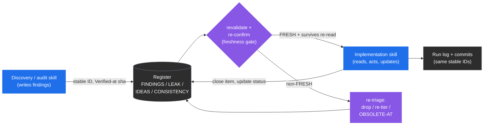
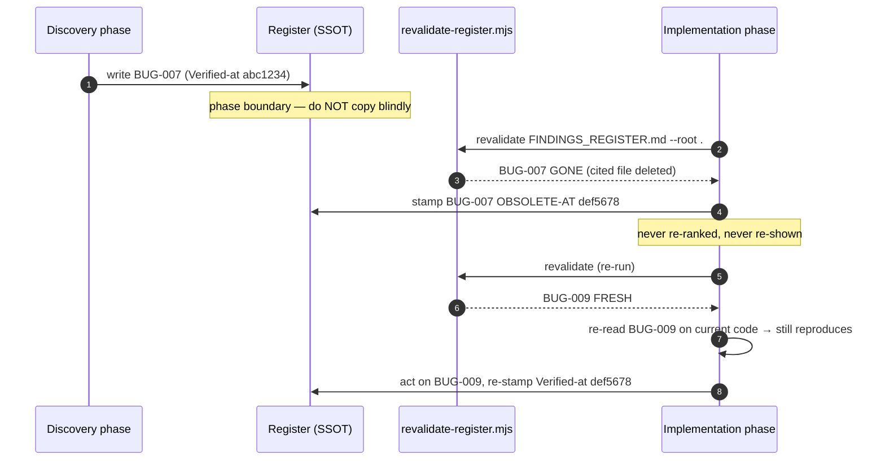

# Registers and Freshness

> Part of the [code-ops handbook](README.md). Companion technique: [reading-a-findings-register](../techniques/reading-a-findings-register.md).

## Exec summary (stop here if you only need the shape)

A **register** is the single source of truth (SSOT) for a run: a live, plain-Markdown backlog of findings, leaks, ideas, or inconsistencies — one stable ID per item, every item cited at `file:line`, every item stamped with the commit it was last confirmed against. Skills write registers; later phases and later skills read them; nothing acts on an item without re-confirming it first.

The whole apparatus exists to defeat one specific, proven failure mode: **a register re-listing an item that was already fixed in code.** A stale finding gets re-ranked, re-shown, and worked a second time — wasting effort and, worse, eroding trust in the register. Three mechanisms prevent that:

1. **Stable IDs** (`BUG-007`, `SEC-003`, `FEAT-012`) so one item is traceable from discovery to register to commit to log, and so two phases can talk about the same thing.
2. **`Verified-at: <sha>`** on every entry — the commit the item was last confirmed on. When it no longer equals `HEAD`, the item is suspect.
3. **`revalidate-register.mjs`**, a mechanical floor that re-greps every cited `file:line` against the *current* tree — and re-checks each item's verbatim `Anchor:` substring, when it carries one — and labels each item `FRESH` / `MOVED` / `DRIFTED` / `GONE` / `AMBIGUOUS` / `NO-REF`. Anything non-`FRESH` is re-triaged, never silently re-shown.

The standard registers, one per plugin lens:

| Register | Plugin | Schema source | Holds |
| --- | --- | --- | --- |
| `FINDINGS_REGISTER.md` | code-ops-suite, rigor | [code-ops CONVENTIONS §7](../../plugins/code-ops-suite/CONVENTIONS.md) / [rigor §6](../../plugins/rigor/CONVENTIONS.md) | Audit / review / bug findings |
| `CONSISTENCY_REGISTER.md` | rigor | [rigor CONVENTIONS §6, §9](../../plugins/rigor/CONVENTIONS.md) | Variants of one concept to be closed to a canonical form |
| `LEAK_REGISTER.md` | privacy-opsec-suite | [privacy CONVENTIONS §6](../../plugins/privacy-opsec-suite/CONVENTIONS.md) | Anonymity / leak findings |
| `RESEARCH_FINDINGS.md` | researcher | [researcher CONVENTIONS §6](../../plugins/researcher/CONVENTIONS.md) | Code-grounded research claims (`RSCH-NNN`) |
| `IDEAS_REGISTER.md` | researcher | [researcher CONVENTIONS §6](../../plugins/researcher/CONVENTIONS.md) | Proposed features / ideas (`IDEA-NNN`) |
| `EGRESS_MANIFEST.md` | researcher | [researcher CONVENTIONS §A](../../plugins/researcher/CONVENTIONS.md) | Every disclosed external request (not a finding register — see below) |

Every actionable item also carries a **track** — `NOW-SAFE`, `NEEDS-REVIEW`, or `NEEDS-DESIGN` — that tells the next skill what it is allowed to do with the item without asking.

If you read nothing else: **a register is only as trustworthy as its last revalidation.** Carry-forward is re-validation, not copy-paste.

---

## 1 · Register-as-SSOT, in practice

All four plugins share the same backbone (their `CONVENTIONS.md` files state it nearly verbatim — code-ops §12, rigor §10, privacy §11, researcher §12):

- **Registers are live backlogs / SSOT.** Discovery and audit skills *write* them; implementation skills *update* them as items ship. There is no second copy of the truth — the register *is* the work graph.
- **Stable IDs across the lifecycle.** An item keeps its ID from the moment it is discovered through the register, the commit that fixes it, and the run log: `PERF-007` is the same thing everywhere it appears. This is what lets `full-sweep` hand a finding from its audit phase to its remediation phase, or lets a commit message reference exactly what it closed.
- **Registers live in a dated run folder** under the repo's docs location — `docs/<area>/<date>/` (e.g. `docs/rigor/<date>/`, `docs/privacy/<date>/`) — or at repo root if the repo has no docs convention. Authoritative reference docs (threat models, privacy promises, architecture docs) are SSOT in the repo's existing docs location and reconciled in place; registers are run artifacts.
- **Registers stay fresh.** Before a finding is written, re-presented across a phase boundary, or consumed by an implementation skill, it is re-confirmed against the current tree. This is the rule the rest of this chapter operationalizes.



Legend: blue = writes the register, purple = a gate or status change, gray = read or terminal. The loop is the point — every arrow into an implementation skill passes through the freshness gate.

---

## 2 · The Finding schema

A register entry is a structured block, not a paragraph. The canonical **Finding** schema (code-ops [CONVENTIONS §7](../../plugins/code-ops-suite/CONVENTIONS.md)) is:

```
ID · Title · Lens · Scope · Severity · Confidence · Tier (CONFIRMED|PROBABLE|SPECULATIVE) ·
Location (file:line) · Anchor (a verbatim ≤~40-char substring copied from the cited line, backtick- or quote-delimited) ·
Verified-at (sha the item was last confirmed on) · Evidence (redacted) ·
Disconfirmation (what you ruled out) · Refutation (independent: survived, or the guard that killed it) ·
Impact · Recommendation · Track (NOW-SAFE|NEEDS-REVIEW|NEEDS-DESIGN) · Effort · Risk-if-fixed
```

Read the fields as three jobs:

- **Identity & routing** — `ID`, `Title`, `Lens` (which quality lens, code-ops §10), `Scope`, `Track`. These say *what it is* and *who handles it next*.
- **Trust** — `Tier`, `Confidence`, `Anchor` (a verbatim, backtick- or quote-delimited substring of the cited line, so the citation is mechanically checkable), `Verified-at`, `Evidence`, `Disconfirmation`, `Refutation` (did an *independent* adversary fail to kill it?). These say *how much to believe it* and *what was ruled out*. (Tiers are their own chapter: see [05-evidence-and-tiers](05-evidence-and-tiers.md).)
- **Action** — `Severity`, `Location`, `Impact`, `Recommendation`, `Effort`, `Risk-if-fixed`. These say *why it matters* and *what to do*.

The other plugins extend the same skeleton for their lens — the trust fields (`Tier`, `Verified-at`, `Disconfirmation`, `Location`) and the track are constant across all four:

- **rigor** ([§6](../../plugins/rigor/CONVENTIONS.md)) adds `Proof` (a test name, repro steps, trace, or measurement), `Root-cause`, `Class/siblings`, `Reachability`, and `Enforcement` (how recurrence is prevented). Its `Verified-at` is "the sha the proof last passed on."
- **privacy-opsec-suite** ([§6](../../plugins/privacy-opsec-suite/CONVENTIONS.md)) adds `Adversary`, `Leak-class` (`linkability | observability | identification | metadata | egress | secret | correlation`), `Scenario` (how it deanonymizes/links/leaks), and `Remediation`.
- **researcher** ([§6](../../plugins/researcher/CONVENTIONS.md)) reshapes it for proposals: `ID (RSCH-NNN | IDEA-NNN)`, `Claim`, `Sources` (code `file:line` | installed-doc | external + manifest entry), `Grounding`, `Value/Impact`, `Smallest slice`, and `Hands-off-to` (the implementing skill).

### The three tracks — what each means for action

The `Track` is the contract between the skill that found the item and the skill that will act on it. It is set once, per item, and governs whether the automation ladder may touch the item unattended (code-ops [§4](../../plugins/code-ops-suite/CONVENTIONS.md), [§6](../../plugins/code-ops-suite/CONVENTIONS.md)).

| Track | Meaning | What the next skill may do |
| --- | --- | --- |
| **NOW-SAFE** | Self-contained, local, small, behavior-preserving (or an unambiguous bug with an obvious fix), no contract/API/schema change, test-covered or quickly testable, trivially revertible. | Under `auto-safe`, apply it unattended — on a branch, test-backed, revertible. Under `gated`, still pauses for approval. |
| **NEEDS-REVIEW** | Real and probably worth doing, but behavior-changing, contract/API/schema-touching, non-trivial, or risky. | Document with a concrete recommendation; bring it to the developer. **Never applied unilaterally**, at any automation level. |
| **NEEDS-DESIGN** | Architectural or cross-cutting. | Document as a proposal with options, trade-offs, and a recommendation. **Never auto-applied, even under `auto-all`.** |

Two rails sit *above* the track and cannot be overridden by it. **Always gated, regardless of automation level:** security/auth changes, secret handling, data migrations or destructive/irreversible operations, and public API/contract changes. And **never auto-merge** — even an auto-applied `NOW-SAFE` fix lands as a commit/PR for human review. A `NOW-SAFE` item that happens to touch one of the always-gated categories is still gated; the track is a ceiling on autonomy, not a license.

> Track vs. Tier — define each once. **Tier** (`CONFIRMED`/`PROBABLE`/`SPECULATIVE`) is *how sure you are the finding is real*. **Track** (`NOW-SAFE`/`NEEDS-REVIEW`/`NEEDS-DESIGN`) is *how much autonomy the fix earns*. A `CONFIRMED` bug can still be `NEEDS-DESIGN` if the fix is architectural. In rigor, the two interlock: only `CONFIRMED + NOW-SAFE` items are eligible for `auto-safe` application, and each must carry a failing→passing regression test ([rigor §4](../../plugins/rigor/CONVENTIONS.md)).

---

## 3 · Carry-forward: why re-validation is the whole point

The dangerous moment is the **phase boundary** — when one phase (or one skill) hands a register to the next. Copying an item forward unchanged is a bug. The proven field failure (stated at the top of every `revalidate-register.mjs`) is exactly this: a register re-lists items already fixed in code, the stale findings get re-ranked and re-shown, and someone works them again.

So "carry forward" means "re-validate, then carry forward what survives." Concretely, before any phase consumes a finding (code-ops §12, and the orchestrators' own instructions in `full-sweep` and `everything`):

1. **Run the mechanical pre-filter** — `revalidate-register.mjs` (§4). It is fast and catches the cheap cases (a cited file deleted, a line number now out of range).
2. **Re-read the survivors.** The script is a *floor, not a proof*: `FRESH` means the cited location still exists, **not** that the original defect is still there. Confirm each survivor by reading it on the current code.
3. **Drop or re-tier what no longer holds.** An item fixed earlier in the run, or mis-diagnosed, is stamped **`OBSOLETE-AT <sha>`** and never re-ranked or re-shown again. An item whose evidence weakened is dropped to a lower tier.
4. **Re-stamp `Verified-at`** with the sha you re-confirmed it on.

This is why the IDs are stable and why `Verified-at` is per-item rather than per-file: the unit of freshness is the finding, and an item can be confirmed-then-obsoleted within a single run while its neighbors stay live.



---

## 4 · `revalidate-register.mjs` — the mechanical floor

One script, byte-identical across all four plugins (`plugins/<name>/scripts/revalidate-register.mjs`, with a copy at the repo root `scripts/`). Invoke it the same way everywhere:

```sh
node ${CLAUDE_PLUGIN_ROOT}/scripts/revalidate-register.mjs <register.md> [...more] [--root <repo>] [--report-only]
```

It scans the register for item IDs (`BUG-007`, `PERF-003` — skipping standards identifiers like `RFC-2616`, `CVE-2021-44228`, `UTF-8`), collects every `file:line` reference, the `Verified-at` sha, and any delimited `Anchor:` under each ID, and re-greps each reference against the current tree. Each item gets exactly one status:

| Status | Meaning | What to do |
| --- | --- | --- |
| **FRESH** | Every cited `file:line` still exists and is in range. | Re-read to confirm the defect still holds (the script is a floor, not a proof), then act. |
| **MOVED** | The cited line is now out of range — either at the original path, or at a relocated path found by name-search after the original was gone. The file need not still exist at its original path. | Re-locate the item on the current code; update the `Location` and re-stamp. |
| **DRIFTED** | The cited line still exists but no longer contains the item's `Anchor:` substring — the code under the citation changed. Only checked when the item carries a backtick- or quote-delimited `Anchor:`. | The citation is stale or hallucinated — re-locate it on the current tree and re-tier, or drop it. |
| **GONE** | A cited file no longer exists anywhere in the tree. | Likely resolved or relocated — verify, then `OBSOLETE-AT` or re-point. |
| **AMBIGUOUS** | The literal path is gone but more than one file matches its bare name, or a reference escapes the repo root. | Verify by hand; the script refuses to guess. |
| **NO-REF** | The item cites no `file:line` at all — nothing to auto-check. | Add a citation or verify by hand; an uncited finding is not yet a finding. |

There are also two non-gating **advisories**: when an item's `Verified-at` sha is present and differs from the repo's current `HEAD`, the report appends `Verified-at <sha> != HEAD <sha> — re-confirm`; and when an item's `Anchor:` value is not backtick- or quote-delimited, the report says so (`unparseable, DRIFTED check skipped`) rather than silently degrading to a plain line-existence check. Neither changes the status, but both flag trust the item hasn't re-earned.

**Exit behavior.** The script exits non-zero if any item is `MOVED`, `DRIFTED`, `GONE`, `AMBIGUOUS`, or `NO-REF` — so it can gate CI or a skill's phase boundary — **unless** `--report-only` is passed, which prints the report and always exits zero. The `--root <repo>` flag points it at the tree to check against (defaults to the current directory); paths that escape the root are reported `AMBIGUOUS` rather than stat-ed, by design.

Two properties worth internalizing:

- **`FRESH` is a location check, not a defect check.** A finding can be `FRESH` and already fixed (someone patched the logic without moving the line). This is exactly why step 2 of carry-forward — re-reading survivors — is mandatory and not optional. The script narrows the set you must re-read by hand; it does not replace the reading.
- **It resolves moved files by name.** If a finding cites `auth/session.ts:88` and that exact path is gone but a single `session.ts` exists elsewhere, the script reports against the relocated file rather than falsely declaring it `GONE`. More than one match → `AMBIGUOUS`, because guessing would be worse than asking.

### A note on `EGRESS_MANIFEST.md`

The egress manifest is a register-shaped artifact with a different job, so it has its own script: `researcher/scripts/research-manifest.mjs`. It is **not** a findings backlog — it is the disclosure log behind researcher's "local-first, disclosed egress" model ([researcher §A](../../plugins/researcher/CONVENTIONS.md)). Every external request the researcher makes is appended (`record --tool <t> --url <u> --why <w>`), and before any artifact is published, `validate` fails closed if the artifact cites an `http(s)` host that has no matching manifest entry. So `revalidate-register.mjs` keeps findings honest about *code*; `research-manifest.mjs` keeps research artifacts honest about *what left the machine*. A published researcher artifact must pass **both** ([researcher §12](../../plugins/researcher/CONVENTIONS.md)).

---

## 5 · An annotated register snippet

A small, synthetic `FINDINGS_REGISTER.md` excerpt (neutral stack; values redacted per the secrets rail). Annotations follow each block.

```markdown
# FINDINGS_REGISTER.md  ·  Verified-at: def5678

## BUG-007 · Cart total ignores per-item discount on re-add
- Lens: Correctness & intricate bugs   Scope: checkout/cart   Severity: high   Confidence: high
- Tier: CONFIRMED
- Location: src/checkout/cart.ts:142
- Verified-at: def5678
- Evidence: failing test `cart.spec.ts › re-adding a discounted item double-counts price`
- Disconfirmation: not a rounding artifact (reproduced with integer cents); not handled
  upstream (the discount map is read once, before the re-add path)
- Impact: overcharges any customer who removes then re-adds a sale item
- Recommendation: recompute line total from the discount map inside `addItem`, not at render
- Track: NOW-SAFE   Effort: S   Risk-if-fixed: low

## SEC-003 · Session cookie missing SameSite on the legacy login route
- Lens: Security   Scope: auth   Severity: high   Confidence: medium
- Tier: PROBABLE
- Location: src/auth/legacy-login.ts:64
- Verified-at: abc1234
- Evidence: two static lines — the cookie is set without `SameSite`, and the route is
  reachable from the public router (router.ts:30)
- Disconfirmation: no framework default observed setting it; not shadowed by a proxy header
- Impact: CSRF surface on the legacy login flow
- Recommendation: set SameSite=Lax and add a regression test; coordinate with the auth owner
- Track: NEEDS-REVIEW   Effort: S   Risk-if-fixed: medium (touches auth — always gated)

## PERF-011 · N+1 query loading order history
- Tier: SPECULATIVE
- Verified-at: abc1234
- Evidence: suspected from a slow-page report; no profile captured yet
- Track: NEEDS-DESIGN
- OBSOLETE-AT: def5678 — superseded by the eager-load added in BUG-007's fix; re-profile if it recurs
```

What the annotations are showing:

- **`BUG-007`** is the ideal entry: `CONFIRMED` (a named failing test is its proof), `NOW-SAFE`, with a disconfirmation pass recorded. Its `Verified-at: def5678` matches the register header sha — `revalidate-register.mjs` will report it `FRESH` with no advisory, and a reader can act after one confirming re-read.
- **`SEC-003`** is `PROBABLE` (two independent static lines, no executed repro) and `NEEDS-REVIEW` because it touches auth. Its `Verified-at: abc1234` is older than the header `def5678`, so the script appends the non-gating advisory `Verified-at abc1234 != HEAD def5678 — re-confirm`. Note the `Risk-if-fixed` flags the always-gated category explicitly: even though it is small, auth changes never auto-apply.
- **`PERF-011`** shows the lifecycle end. It was only ever `SPECULATIVE` (no profile), and a later fix made it moot, so it is stamped **`OBSOLETE-AT: def5678`** with the reason inline. It stays in the file for traceability but is never re-ranked or re-shown — the carry-forward step skips it.
- The whole file carries a top-line `Verified-at`, and each item carries its own. The per-item stamp is the authority; the header is a convenience that names the run's anchor sha.

For a deeper walkthrough of how to read, prioritize, and act on a populated register, see [techniques/reading-a-findings-register](../techniques/reading-a-findings-register.md).

---

## 6 · Recovery and edge cases

- **A register goes stale between runs.** Re-run `revalidate-register.mjs` first, triage the report, re-read every survivor, then proceed. Treat any pre-existing register as suspect until revalidated — its `Verified-at` shas tell you how stale.
- **An item is `NO-REF`.** It cannot be auto-checked and is not yet actionable. Either add the `file:line` citation (code-ops §9 requires every finding cite a location) or verify it by hand before relying on it.
- **An item is `AMBIGUOUS`.** The script deliberately will not guess. Resolve the real location by hand and update the `Location` field so the next run is unambiguous.
- **A fixed item keeps reappearing.** This is the failure mode the whole apparatus targets. The fix is discipline, not tooling: stamp it `OBSOLETE-AT <sha>` so it is permanently excluded from re-ranking, and confirm the implementation skill ran the revalidation pass at its phase boundary.
- **CI gating.** Drop `--report-only` to make the script's non-zero exit fail a pipeline when any item is non-`FRESH`; keep it for an informational report. The CI chapter (deferred) covers wiring this into PR gates.

---

## Coming next

Deeper register and freshness material lands in later first-slice files: the disconfirmation pass as lived practice in [05-evidence-and-tiers](05-evidence-and-tiers.md) and [techniques/disconfirmation-pass](../techniques/disconfirmation-pass.md); how to read a populated register in [techniques/reading-a-findings-register](../techniques/reading-a-findings-register.md). A register-carry-forward technique and a CI/automation chapter are planned but not yet authored.

*Verified-at: a181b36*
