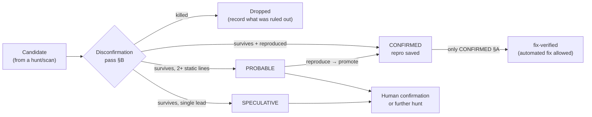

# Evidence Tiers and the Disconfirmation Pass

> **Orientation (stop here if you only need the gist).** Every finding the `rigor` plugin reports carries one of three evidence tiers — **CONFIRMED**, **PROBABLE**, or **SPECULATIVE** — and the tier is not a vibe, it is a claim about *what proof exists*. CONFIRMED means it was reproduced (a failing test, a runnable repro, an executed trace). PROBABLE means at least two independent lines of static evidence point the same way, but nothing ran. SPECULATIVE means a single weak lead worth a look. Two rules ride on top: **when unsure between tiers, pick the lower one**, and **only CONFIRMED may drive an automated fix.** Before any finding is reported at all, it must survive the **disconfirmation pass** — a deliberate attempt to *kill* the finding by asking whether the code is even reachable, already handled, intentional, already tested, or already enforced. This is the layer that turns a fire-hose of guesses into a short list of things that are actually true.

This file explains the tiers as a lived practice, not a taxonomy. It is grounded in the real methodology that ships with the plugin: [`plugins/rigor/CONVENTIONS.md`](../../plugins/rigor/CONVENTIONS.md) (the heart of `rigor`), §0 (core principle), §A (evidence tiers), §B (the disconfirmation pass), §C (ground truth first), §D (reachability), and §6 (the finding schema). Where this document quotes a rule, it quotes that file.

For the step-by-step mechanics of running a disconfirmation pass on a real candidate, see [techniques/disconfirmation-pass.md](../techniques/disconfirmation-pass.md). For how tiered findings live in a register, see [04-registers-and-freshness.md](04-registers-and-freshness.md).

---

## 1 · Why tiers exist at all

`rigor` exists to answer a specific failure of breadth-first audits: they *assert* findings, *sample* instead of cover, and *inflate* confidence (see [`plugins/rigor/README.md`](../../plugins/rigor/README.md)). A flat list of 80 "issues" where you cannot tell which three are real is worse than a list of three you can act on immediately. The tier is the signal that tells you which is which.

The governing principle, verbatim from [`CONVENTIONS.md`](../../plugins/rigor/CONVENTIONS.md) §0:

> **Prove it or don't report it. Measure it or don't claim it. Close it so it stays closed.**
> A confident guess is worse than silence.

A tier is therefore a *promise about evidence*. It tells a downstream reader — or a downstream skill like [`fix-verified`](../../plugins/rigor/skills/fix-verified/SKILL.md) — exactly how much they are allowed to trust the finding and what they are allowed to do with it.

---

## 2 · The three tiers

Every finding carries exactly one tier (`CONVENTIONS.md` §A). The definitions below are the real ones.

| Tier | What it means | Evidence required | What it may drive |
|------|---------------|-------------------|-------------------|
| **CONFIRMED** | Reproduced on the current code | A failing test, a runnable repro, or an executed trace that demonstrates it | An automated fix |
| **PROBABLE** | Strong static evidence, not executed | **At least two independent lines** of static evidence (e.g. a data-flow path *and* a contradicting contract, or two distinct call sites) | Nothing automated — needs a repro or human confirmation first |
| **SPECULATIVE** | A single weak signal or lead | One lead; explicitly low-confidence | Reported as something to investigate, never fixed |

### CONFIRMED — it was reproduced

CONFIRMED is the only tier backed by *execution*. Something ran and demonstrated the defect on the current tree: a test that fails, a minimal reproduction script, or a trace/query that was actually executed. In `rigor` this is the job of the bundled `verifier` subagent, which "writes and runs a minimal repro/test/benchmark to confirm or kill a candidate" ([`README.md`](../../plugins/rigor/README.md)). As the README puts it: this agent "is why `CONFIRMED` means something."

Per §E (evidence standard), anything *unexecuted* is PROBABLE or SPECULATIVE — **never** CONFIRMED. You cannot reason your way to CONFIRMED; you have to run something.

### PROBABLE — strong static evidence, two independent lines

PROBABLE is for findings you have not executed but for which the static case is strong. The bar is explicit and worth internalizing: **two independent lines of evidence.** §A gives the canonical examples — a data-flow path *and* a contradicting contract, or two distinct call sites that both exhibit the problem. One line of reasoning, however clean, is not PROBABLE; it is SPECULATIVE. PROBABLE findings need a repro (which promotes them to CONFIRMED) or human confirmation before anyone fixes them.

### SPECULATIVE — a single lead

SPECULATIVE is a single weak signal: a pattern that *might* be wrong, a smell, a name that suggests a contract that may not hold. It is explicitly low-confidence. §A is blunt about how it is presented: "Never presented as fact, never auto-fixed."

---

## 3 · The two rules that ride on the tiers

### Rule 1 — when unsure, pick the lower tier

§A ends with: "When unsure between tiers, pick the lower one." This is deliberate asymmetry. The cost of under-claiming (calling a real bug PROBABLE when it was actually reproducible) is a little extra verification work. The cost of over-claiming (calling a guess CONFIRMED) is that an automated fix may act on a non-bug. §A names the latter directly: "Labeling a guess CONFIRMED is the cardinal sin."

### Rule 2 — only CONFIRMED drives an automated fix

This is the rule the whole automation ladder rests on. From §A: "*Only CONFIRMED items may drive an automated fix.*" The implementing skill, [`fix-verified`](../../plugins/rigor/skills/fix-verified/SKILL.md), enforces it at the door: it "Fixes **CONFIRMED** items; a PROBABLE item must be reproduced (promoted to CONFIRMED) before it's fixed." There is no path by which a PROBABLE or SPECULATIVE item is silently patched.

This is also why the automation levels in §4 only ever auto-apply **CONFIRMED + NOW-SAFE** fixes (the `auto-safe` ceiling), and why security/auth, secrets, data migrations, and public-contract changes stay *always gated* regardless of tier. A high tier earns trust about *truth*; it does not by itself earn the right to change risky code unattended.

---

## 4 · Why a SPECULATIVE finding is reported but never fixed

This trips people up, so it is worth stating plainly: **a SPECULATIVE item is a lead to investigate, not a bug to patch.**

A SPECULATIVE finding has not cleared the bar that would justify changing code. By definition it rests on a single weak signal, and §C (ground truth first) demands that model findings reconcile against the deterministic toolchain — *agree, contradict, or extend* — before they carry weight. A lead that has not been reconciled or reproduced could just as easily be correct behavior. "Fixing" it means changing working code on a hunch, which is exactly the failure mode `rigor` is built to avoid.

So why report it at all? Because a lead is genuinely useful *to a human deciding where to look next*. It directs attention. The value of a SPECULATIVE entry is that it says "this corner smells off — someone who understands the intent should check it," not "apply this patch." Reporting it preserves the signal without spending it; fixing it would spend a signal that was never confirmed. The honest move is to surface the lead, tier it truthfully, and let a developer (or a deeper `bug-hunt` pass) either reproduce it into CONFIRMED or rule it out.

The same logic is what makes [`deep-review`](../../plugins/rigor/skills/deep-review/SKILL.md) trustworthy as a PR gate: it blocks **only** on CONFIRMED defects and regressions, groups PROBABLE and quality items as "Should-fix," and demotes single leads to nits — "don't block on a SPECULATIVE; don't wave through a CONFIRMED defect."

---

## 5 · The disconfirmation pass — a worked example

The disconfirmation pass is **mandatory before any finding is reported** (§B). It is not a final sanity check; it is an active attempt to *kill* the candidate. Only survivors are reported, and the agent records what it ruled out (that record lands in the `Disconfirmation` field of the finding schema, §6). [`bug-hunt`](../../plugins/rigor/skills/bug-hunt/SKILL.md) calls Phase 3 — "Prove, then disconfirm" — "the differentiator."

The questions §B asks, in order:

1. Is the triggering path actually **reachable**, and under what preconditions?
2. Is it already **handled elsewhere** — a caller, wrapper, middleware, the framework, or the type system?
3. Is it **intentional**?
4. Does an **existing test** already cover it?
5. Is the `file:line` exactly right on the **current** code?

To that, the broader methodology adds a sixth that matters in practice: is it **already enforced by a tool**? §C is explicit — "Never re-flag what a tool already enforces" — so a candidate the linter, type-checker, or SAST already catches is not a finding.

### The synthetic candidate

Suppose `bug-hunt` is scoped to a payments module and a static trace surfaces this:

```
src/payments/refund.ts:142
  const amount = parseAmount(req.body.amount);
  ledger.credit(account, amount);   // amount could be negative → credits become debits
```

The initial read: a negative `amount` flips a refund into a charge. That is a serious correctness bug on a hot path. The agent writes it down as a *candidate* — not yet a finding — and runs the disconfirmation pass.

| Disconfirmation question | What the agent checks | Outcome on this candidate |
|--------------------------|------------------------|---------------------------|
| **Reachable?** | Trace control flow from the route to `refund.ts:142`. Is this handler wired up, behind a flag, dead code? | Reachable — the `/refund` route is registered and exercised in production. Survives. |
| **Handled by a caller / framework / type?** | Look upstream. Does `parseAmount` clamp or reject negatives? Does a validation middleware run first? Does the type forbid it? | `parseAmount` returns a plain `number` (no branded positive type). **But** a Zod schema on the route already rejects `amount <= 0` with a 400 before the handler body runs. **Killed here** for the request path. |
| **Intentional?** | Could a negative amount be a deliberate internal adjustment path? | The route is customer-facing refunds only; negatives are never intended. Not a mitigating factor. |
| **Already tested?** | Search the suite for a test asserting the rejection. | `refund.test.ts` asserts a 400 on a negative amount — the guard is *covered*, so the rejection is real and pinned. Reinforces the kill. |
| **Already enforced by a tool?** | Does the type-checker or a lint rule flag the missing guard at `:142`? | No tool flags it — the guard lives one layer up, so there is nothing to re-flag. Neutral. |
| **`file:line` correct on current code?** | Confirm `:142` matches the current tree (registers go stale). | Correct as of the scoped SHA. |

**Verdict:** the request-path candidate is **killed** — the negative amount is already handled by the route schema and that handling is tested. It is not reported as a bug. What *is* recorded is the disconfirmation result: "ruled out — Zod route schema rejects `amount <= 0`; covered by `refund.test.ts`."

But disconfirmation often does not kill the whole idea — it sharpens it. The same pass exposes a real residual concern: **the guard lives in the route layer, not at `ledger.credit`.** Any *other* caller of `ledger.credit` — an internal job, an admin tool, a future endpoint — gets no protection. That is the §G ("root cause over symptom") and sibling-sweep instinct kicking in. So the agent re-scopes:

- It searches for other call sites of `ledger.credit`. It finds one in `src/jobs/reconcile.ts` that passes a computed delta with **no** upstream guard.
- It writes a failing test: feed `reconcile` an input that produces a negative delta, assert the ledger is corrupted. The test **fails on current code**.

That reproduction promotes the *real* finding to **CONFIRMED**: not "refund accepts negative amounts" (false — disconfirmed) but "`ledger.credit` has no invariant against negative amounts; the reconcile job is an unguarded caller" (true — reproduced). The root cause is the missing invariant at the ledger boundary; the refund route was merely the one caller that happened to be guarded.

This is the whole point of the pass. The naive candidate was *plausible and wrong*. Disconfirmation killed the wrong claim and, in doing so, surfaced the right one — at a higher tier, with a repro, traced to root cause, with the class swept. A breadth-first audit would have shipped the plausible-and-wrong version as an "issue" and missed the real one.

---

## 6 · How a tier flows through the run

The tier is not a label that gets discarded after reporting — it is a stable property that governs the finding's entire lifecycle, and it is one field in the finding schema (`CONVENTIONS.md` §6, which also carries `Proof`, `Location (file:line)`, `Verified-at`, `Root-cause`, `Disconfirmation`, and the rest).



Two consequences follow from this flow, both reinforced by [04-registers-and-freshness.md](04-registers-and-freshness.md):

- **Promotion is the only path up.** A PROBABLE item becomes CONFIRMED only by being reproduced. There is no "I'm now more sure" promotion — the bar is execution.
- **Tiers can decay.** A register is a live document; before a finding is acted on it is re-validated against the current tree. The fast pre-filter is `node ${CLAUDE_PLUGIN_ROOT}/scripts/revalidate-register.mjs <register> --root <repo>` (reporting FRESH / MOVED / DRIFTED / GONE / AMBIGUOUS / NO-REF; see [`plugins/rigor/scripts/revalidate-register.mjs`](../../plugins/rigor/scripts/revalidate-register.mjs)), and a CONFIRMED item whose repro no longer fails is re-tiered or marked `OBSOLETE-AT <sha>` — never silently re-shown.

---

## 7 · Glossary

- **CONFIRMED** — a finding reproduced on the current code by a failing test, runnable repro, or executed trace; the only tier that may drive an automated fix.
- **PROBABLE** — a finding supported by at least two independent lines of static evidence, not executed; must be reproduced or human-confirmed before it is fixed.
- **SPECULATIVE** — a single low-confidence lead; reported for a human to investigate, never auto-fixed.
- **Disconfirmation pass** — the mandatory attempt to *kill* a candidate (reachable? handled elsewhere? intentional? already tested? already enforced?) before it is reported; only survivors become findings.
- **Tier inflation** — claiming a higher tier than the evidence supports; labeling a guess CONFIRMED is "the cardinal sin" (§A).
- **Promotion** — moving a PROBABLE item to CONFIRMED by reproducing it; the only way the tier rises.
- **Proof artifact** — the concrete evidence a CONFIRMED finding carries: a failing test, repro steps, an executed trace, or a measured number (§E).

---

## See also

- [techniques/disconfirmation-pass.md](../techniques/disconfirmation-pass.md) — the disconfirmation pass as a step-by-step technique.
- [techniques/reading-a-findings-register.md](../techniques/reading-a-findings-register.md) — how to read a tiered register.
- [04-registers-and-freshness.md](04-registers-and-freshness.md) — registers as SSOT, `Verified-at`, and freshness/revalidation.
- [commands/rigor.md](commands/rigor.md) — the `rigor` command reference (`bug-hunt`, `fix-verified`, `deep-review`, and the rest).
- [`plugins/rigor/CONVENTIONS.md`](../../plugins/rigor/CONVENTIONS.md) — §0, §A, §B, §C, §D, §E, §6: the source of every rule above.

*Verified-at: a181b36*
