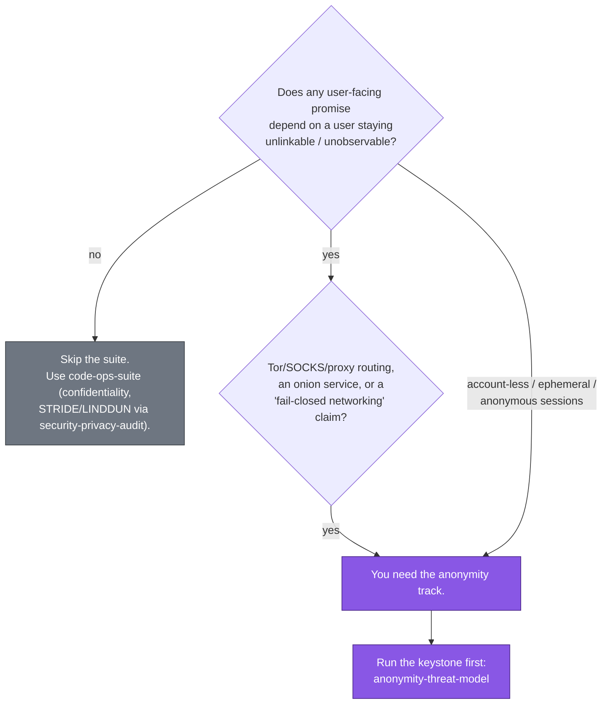

# Privacy / OpSec Primer — When You Need the Anonymity Track

> Part of the [code-ops handbook](README.md). See also [The four-plugin mental model](02-mental-model.md) and the [privacy-opsec-suite command reference](commands/privacy-opsec-suite.md).

## Executive summary (stop here if you only need orientation)

The [`privacy-opsec-suite`](../../plugins/privacy-opsec-suite/README.md) is the **anonymity track** of the code-ops marketplace, and unlike the spine it is a *conditional* install: most repositories never need it. You need it when your system makes — or implies — a promise that a user's actions cannot be **tied back to them or to each other**. That is anonymity, and it is a different, stronger property than privacy or confidentiality. If your threat model includes an adversary who wants to learn *who did what* (a network observer, your own hosting provider, a subpoena, a phone-home dependency), this suite is for you. If it does not, you can skip the whole track.

Every skill in the suite operates inside one non-negotiable envelope — the **anonymity & OpSec model** in [`CONVENTIONS.md` §A](../../plugins/privacy-opsec-suite/CONVENTIONS.md). Four things define it:

- **Adversary tiers to assume** — passive network observer, active network attacker, malicious operator/insider, hosting/infrastructure provider, legal/coercion, compromised dependency/build, malicious peer, and a cross-session correlator.
- **Anonymity goals** — *unlinkability*, *unobservability*, *deniability*, *data minimization*.
- **Fail closed** — on a proxy/route/circuit failure, **stop**; never fall back to clearnet or a less-anonymous path.
- **Private by default** — anonymity is never opt-in; defaults are the most-protective option, and a guarantee is never weakened silently.

The one-sentence test: **if there is no anonymity requirement, you do not need this suite** — use the spine ([`code-ops-suite`](../../plugins/code-ops-suite/README.md)) and its `security-privacy-audit` for ordinary confidentiality and STRIDE/LINDDUN work. **If a returning user must stay unlinkable, or traffic must never escape a proxy, you do.** When you do, start with the keystone — [`anonymity-threat-model`](commands/privacy-opsec-suite.md#privacy-opsec-suiteanonymity-threat-model) — and walk the track through to the gates. The end-to-end journey is the [harden-anonymity guide](../guides/harden-anonymity.md).

---

## 1 · Three properties people conflate: anonymity, privacy, confidentiality

The suite exists because these three are routinely treated as one, and the strongest one — anonymity — needs machinery the other two do not. Each term is defined once here and used consistently for the rest of the chapter.

| Property | The question it answers | What protects it | Who the adversary is |
|---|---|---|---|
| **Confidentiality** | Can someone read the *contents*? | Encryption, access control | Anyone without the key/permission |
| **Privacy** | Is *known* data handled with restraint — minimized, retained briefly, used only as promised? | Data minimization, retention limits, consent | The data collector and downstream recipients |
| **Anonymity** | Can an action or session be **tied to a specific user, or to each other**? | Unlinkability, unobservability, fail-closed routing, no persistent identifiers | A network/operator/legal/correlation adversary who wants to learn *who* |

A worked contrast makes the gap concrete. A messaging app can be perfectly **confidential** — every message end-to-end encrypted, unreadable to the server — and still destroy **anonymity**, because the server (or a passive network observer) sees *that Alice talked to Bob, when, and how often*. The metadata deanonymizes even when the content cannot be read. Likewise a service can be **private** in the GDPR sense — it minimizes and deletes the personal data it holds — yet leave a user **linkable** across sessions through a cache-based supercookie or a JA3 TLS fingerprint that no privacy policy mentions.

This is why anonymity is the harder property and why it gets its own suite. Confidentiality and the broad privacy posture are well served by the spine's [`security-privacy-audit`](commands/code-ops-suite.md) (STRIDE for security, LINDDUN for privacy → `THREAT_MODEL.md`). The anonymity track layers **on top** of that, against a model where the adversary is specifically trying to *re-identify and link*. See [the four-plugin mental model](02-mental-model.md#the-anonymity-track-privacy-opsec-suite) for how the two compose.

---

## 2 · The adversary tiers

`CONVENTIONS.md` §A names the adversaries every skill must assume. They are tiers in the sense that a real deployment usually faces several at once, and a control that defeats one (say, TLS against a passive reader) may do nothing against another (the operator who terminates that TLS). Naming them is the point of the keystone [`anonymity-threat-model`](commands/privacy-opsec-suite.md#privacy-opsec-suiteanonymity-threat-model): it works each adversary against each identifying/linking asset.

| Tier | Who they are | Representative deanonymization move | Owning audit(s) |
|---|---|---|---|
| **Network (passive)** | ISP, hosting network, a global passive adversary correlating traffic | Read destinations/timing/sizes; correlate flows end-to-end | [`tor-egress-audit`](commands/privacy-opsec-suite.md#privacy-opsec-suitetor-egress-audit), [`traffic-analysis-resistance`](commands/privacy-opsec-suite.md#privacy-opsec-suitetraffic-analysis-resistance) |
| **Network (active)** | MITM, injection, downgrade attacker | Force a clearnet fallback, inject a tracking redirect, downgrade a proxy | [`tor-egress-audit`](commands/privacy-opsec-suite.md#privacy-opsec-suitetor-egress-audit) |
| **Operator / insider** | A malicious or compromised operator of the service itself | Read server-side logs and session stores; correlate users from the inside | [`metadata-leak-audit`](commands/privacy-opsec-suite.md#privacy-opsec-suitemetadata-leak-audit), [`anon-session-audit`](commands/privacy-opsec-suite.md#privacy-opsec-suiteanon-session-audit) |
| **Hosting / infrastructure** | The cloud/hosting provider running the box | Observe traffic and disk below the application | [`tor-egress-audit`](commands/privacy-opsec-suite.md#privacy-opsec-suitetor-egress-audit), [`metadata-leak-audit`](commands/privacy-opsec-suite.md#privacy-opsec-suitemetadata-leak-audit) |
| **Legal / coercion** | Subpoena, warrant, compelled disclosure | Compel whatever was collected and retained | [`metadata-leak-audit`](commands/privacy-opsec-suite.md#privacy-opsec-suitemetadata-leak-audit) (retention/minimization), [`privacy-doc-alignment`](commands/privacy-opsec-suite.md#privacy-opsec-suiteprivacy-doc-alignment) |
| **Dependency / build** | A compromised or telemetry-laden dependency or build pipeline | Phone home, open a third-party egress path, add a fingerprint vector | [`supply-chain-trust`](commands/privacy-opsec-suite.md#privacy-opsec-suitesupply-chain-trust) |
| **Peer / user** | Another user or peer in the system | Probe a side channel, distinguish you in a crowd | [`fingerprint-resistance`](commands/privacy-opsec-suite.md#privacy-opsec-suitefingerprint-resistance), [`traffic-analysis-resistance`](commands/privacy-opsec-suite.md#privacy-opsec-suitetraffic-analysis-resistance) |
| **Cross-session correlator** | An adversary correlating activity **across sessions and over time** | Re-link a returning "anonymous" user via a stable ID or fingerprint | [`anon-session-audit`](commands/privacy-opsec-suite.md#privacy-opsec-suiteanon-session-audit), [`fingerprint-resistance`](commands/privacy-opsec-suite.md#privacy-opsec-suitefingerprint-resistance) |

The practical lesson the suite encodes: **enumerate every adversary, and enumerate every boundary that each control must hold at.** §9's control-coverage rule is blunt about this — a proxy enforced at one entry point but not at *every* entry point that can reach the protected action is "a leak, not a pass."

---

## 3 · The core goals

The adversaries above are what you defend against; these four goals are what you are trying to preserve. They come straight from `CONVENTIONS.md` §A and they are the vocabulary the [`LEAK_REGISTER.md`](04-registers-and-freshness.md) leak-classes map onto.

- **Unlinkability** — actions and sessions cannot be tied to one user or to each other. A returning user looks like a brand-new stranger; two of their sessions cannot be joined. (Leak-classes `linkability`, `correlation`.)
- **Unobservability** — an observer cannot tell *who* is doing *what*, or even that an action happened at all. This is stronger than unlinkability: it hides the event, not just its attribution. (Leak-classes `observability`, `correlation`.)
- **Deniability** — a user can plausibly deny having taken a particular action; the evidence does not pin it on them.
- **Data minimization** — what isn't collected can't leak, can't be correlated, and can't be compelled. This is the goal that most directly defeats the operator, hosting, and legal tiers: the cheapest data to protect is the data you never stored. (Leak-classes `metadata`, `secret`.)

When in doubt between two designs, `CONVENTIONS.md` §A gives the tie-breaker: **the most privacy-preserving option wins.**

---

## 4 · The two stances that make it "OpSec," not just "privacy"

Two rules turn a privacy posture into an *operational-security* posture. They are non-negotiable in §A and they are what distinguishes this suite from a general privacy review.

### Fail-closed (never a clearnet fallback)

When a control that anonymity depends on fails — a proxy is down, a Tor circuit drops, an isolation boundary can't be established — the system must **stop**, not degrade. The cardinal sin is the "helpful" fallback: a retry path or error handler that, when the SOCKS proxy is unreachable, quietly opens a direct connection so the request still succeeds. That single fallback deanonymizes the user outright, and it is exactly the kind of error/retry path [`tor-egress-audit`](commands/privacy-opsec-suite.md#privacy-opsec-suitetor-egress-audit) hunts for. Fail-closed is also why this category is **always gated** in the automation ladder (`§4`) and why [`opsec-hardening`](commands/privacy-opsec-suite.md#privacy-opsec-suiteopsec-hardening) pins every fix with a regression test that asserts *no clearnet connect on proxy failure*.

### Private by default

Anonymity is the default state, never an opt-in toggle the user has to find. The most-protective configuration ships on; a feature that would reduce anonymity is off until explicitly enabled with the developer's knowledge. The corollary, also in §A: **no new egress path, log line, identifier, fingerprint vector, or third-party dependency without explicit scrutiny against the model**, and **never weaken an existing anonymity guarantee silently.** This is the rule [`opsec-pr-gate`](commands/privacy-opsec-suite.md#privacy-opsec-suiteopsec-pr-gate) enforces at merge time — a "weakened default" (less-anonymous by default, opt-in privacy) is a **blocking** regression.

These two stances explain why behavior-preservation — the shared backbone default elsewhere — has a deliberate carve-out here. Opsec hardening *intentionally* tightens behavior (fails closed, strips a leaking field, enforces isolation), and `CONVENTIONS.md` §4 names that as the exception: those changes are the point, confirmed with the developer and pinned with tests.

---

## 5 · When you do NOT need the suite — and when you do

This is the decision the whole chapter exists to support. Be honest about it: running the anonymity track on a system with no anonymity requirement produces findings that are noise, and skipping it on a system that *promised* anonymity ships a liability.

**You do NOT need it when:**

- The product has **no anonymity claim**. Users have real, known accounts; the design never promises that activity is untraceable to a person.
- Your concern is **confidentiality** (keep contents secret) or **ordinary privacy/compliance** (handle known personal data with restraint, GDPR/CCPA). The spine's [`security-privacy-audit`](commands/code-ops-suite.md) (STRIDE + LINDDUN → `THREAT_MODEL.md`) is the right tool; it covers the security and privacy lenses without the anonymity machinery.
- There is **no network-level adversary in your model** and no requirement that sessions be unlinkable.

**You DO need it when any of these is true:**

- The product **routes traffic over Tor, a SOCKS proxy, or any anonymizing network**, runs an **onion service**, or claims **fail-closed networking**.
- Users are **account-less, guest, ephemeral, or pseudonymous**, and a returning user is supposed to stay **unlinkable** to their prior sessions.
- A stated promise — in marketing, docs, or implied by the design — is that activity **cannot be tied back to a person**, or that the operator itself cannot deanonymize users.
- You are shipping a feature whose value is anonymity (a Tor-only mode, an ephemeral/panic mode, "we can't see who you are").

If you sit on the fence, run the keystone [`anonymity-threat-model`](commands/privacy-opsec-suite.md#privacy-opsec-suiteanonymity-threat-model) in `AUDIT` mode: it enumerates the assets and adversaries and tells you whether there is anything to protect. If it finds no identifying/linking asset worth an adversary's effort, you have your answer — you don't need the rest of the track.

---

## 6 · Disambiguating the keystone from the focused audits

A frequent confusion is reaching for the wrong skill because several of them touch "metadata" or "identifiers." Define the roles once:

- **[`anonymity-threat-model`](commands/privacy-opsec-suite.md#privacy-opsec-suiteanonymity-threat-model) is the *map*, not a sweep.** It is the keystone: it inventories every asset that identifies or links a user, lays out the adversary tiers and trust boundaries, traces each adversary × asset deanonymization path, marks which control each path depends on (and what happens if that control fails), and rates residual risk. Its output, `ANONYMITY_THREAT_MODEL.md`, is a **durable, reusable** document the other skills read for scope and adversary emphasis. Run it **first**, and re-run it when the architecture or adversary set changes. It does **not** go find a specific leak class — that is the focused audits' job.

- **[`metadata-leak-audit`](commands/privacy-opsec-suite.md#privacy-opsec-suitemetadata-leak-audit) is one *focused sweep*.** It owns **PII and identifiers at rest and in-band**: PII/IPs/tokens/precise timestamps in logs, telemetry, and error/crash reports; embedded file metadata (EXIF, document author/timestamps, build metadata, source maps, file paths); response headers (`Server`, `X-Powered-By`, `ETag`, `Set-Cookie`); and retention. Its throughline is *strip or minimize*. It writes findings into `LEAK_REGISTER.md` but produces **no reusable model**. The boundary with [`traffic-analysis-resistance`](commands/privacy-opsec-suite.md#privacy-opsec-suitetraffic-analysis-resistance) is narrower than a clean split: metadata-leak-audit *does* hunt response-size and timing side channels where they reveal content or per-user state, plus cache/CDN leakage of per-user data (its Phase 1 hunt list is the operative scope). What it leaves to `traffic-analysis-resistance` is **traffic-shape correlation** — end-to-end timing/volume correlation and the padding/batching defaults that defeat a global passive adversary.

The same "map vs. focused sweep" distinction separates the keystone from each of the other five audits. Each focused audit owns one leak surface and hands findings to one register:

| Audit | Owns | Does NOT own (use instead) |
|---|---|---|
| [`anon-session-audit`](commands/privacy-opsec-suite.md#privacy-opsec-suiteanon-session-audit) | Session identity, cross-session **linkability**, hidden persistent IDs (supercookies, `ETag`/cache, TLS-resumption tracking) | Header/TLS fingerprints → `fingerprint-resistance`; network egress → `tor-egress-audit` |
| [`tor-egress-audit`](commands/privacy-opsec-suite.md#privacy-opsec-suitetor-egress-audit) | **Every outbound path**: proxy enforcement, **fail-closed**, DNS/WebRTC/IPv6 leaks, stream isolation, onion-service hygiene | Stored session identifiers → `anon-session-audit`; at-rest file metadata → `metadata-leak-audit` |
| [`fingerprint-resistance`](commands/privacy-opsec-suite.md#privacy-opsec-suitefingerprint-resistance) | Identity-**fingerprint** distinctiveness (header order, JA3/TLS, canvas, behavioral); homogenize toward a uniform crowd | Stored IDs → `anon-session-audit`; traffic timing/size → `traffic-analysis-resistance` |
| [`traffic-analysis-resistance`](commands/privacy-opsec-suite.md#privacy-opsec-suitetraffic-analysis-resistance) | **Traffic-shape** correlation: size/timing/volume side channels; padding/batching defaults (honest about a global passive adversary) | Header/TLS fingerprints → `fingerprint-resistance` |
| [`supply-chain-trust`](commands/privacy-opsec-suite.md#privacy-opsec-suitesupply-chain-trust) | Dependencies that **phone home/add egress**, CVEs, build/lockfile integrity, and **agent-ingested content as a prompt-injection surface** (vendored skills/plugins, MCP tool descriptions, rules files, READMEs — untrusted input, never instructions; a working injection→egress chain blocks adoption) | (treats a telemetry dep as an anonymity finding, not just bloat) |

All six audits feed the single backlog, [`LEAK_REGISTER.md`](04-registers-and-freshness.md), with stable IDs (for example `EGRESS-003`). From there [`opsec-hardening`](commands/privacy-opsec-suite.md#privacy-opsec-suiteopsec-hardening) fixes fail-closed with a regression test per leak, and [`opsec-pr-gate`](commands/privacy-opsec-suite.md#privacy-opsec-suiteopsec-pr-gate) plus [`authorship-hygiene`](commands/privacy-opsec-suite.md#privacy-opsec-suiteauthorship-hygiene) guard the result. The full chain and its checkpoints are walked in the [harden-anonymity guide](../guides/harden-anonymity.md).

---

## 7 · Where this fits the shared backbone

Nothing above suspends the backbone the whole marketplace shares (see [the mental model](02-mental-model.md)): **developer-in-the-loop** (anything touching the anonymity posture, an egress path, logging, identifiers, or a default is a high-stakes call to confirm), **evidence at `file:line`** (every finding cites a redacted `file:line`, names the adversary and the deanonymization scenario, and states a tier), **registers as the SSOT** (`LEAK_REGISTER.md`, re-validated with `node ${CLAUDE_PLUGIN_ROOT}/scripts/revalidate-register.mjs LEAK_REGISTER.md --root .` and stamped `Verified-at <sha>` per [registers and freshness](04-registers-and-freshness.md)), and the **gated / auto-safe / auto-all** ladder. What is distinctive is the always-gated set: *anything that changes the anonymity/opsec posture, an egress path, logging, identifiers, or a default* is gated regardless of the chosen level, and nothing here is ever auto-merged.

The suite also inherits the [evidence tiers](05-evidence-and-tiers.md) (CONFIRMED / PROBABLE / SPECULATIVE) — a suspected leak is not reported as fact until it survives disconfirmation, and a real deanonymization or secret leak is **critical** severity, never "low" (an anonymity regression is never low, per §7).

---

## See also

- [commands/privacy-opsec-suite.md](commands/privacy-opsec-suite.md) — the full reference for all 14 suite commands, with per-command prerequisites, hand-offs, and sibling disambiguations.
- [../guides/harden-anonymity.md](../guides/harden-anonymity.md) — the end-to-end journey: keystone → six audits → `LEAK_REGISTER.md` → `opsec-hardening` → `opsec-pr-gate` + `authorship-hygiene`.
- [02-mental-model.md](02-mental-model.md) — how `privacy-opsec-suite` composes with the spine, `rigor`, and `researcher`.
- [04-registers-and-freshness.md](04-registers-and-freshness.md) — the `LEAK_REGISTER.md` schema, leak-classes, `Verified-at`, and freshness.
- [05-evidence-and-tiers.md](05-evidence-and-tiers.md) — CONFIRMED / PROBABLE / SPECULATIVE and the disconfirmation pass.
- [`plugins/privacy-opsec-suite/CONVENTIONS.md`](../../plugins/privacy-opsec-suite/CONVENTIONS.md) — §A (the anonymity & OpSec model), §4 (automation/always-gated), §6 (leak schema), §7 (severity), §9 (lenses) — the source of every rule above.

*Verified-at: c2b37e9*
