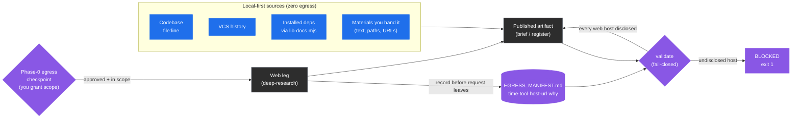
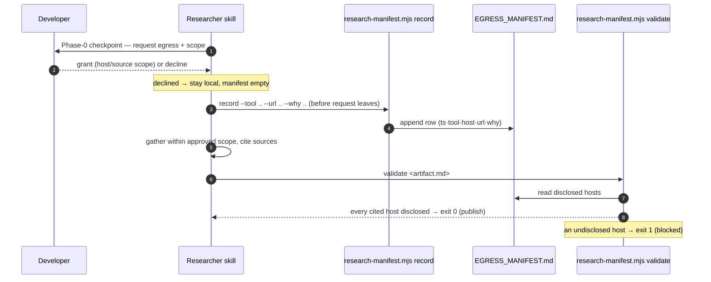

# Researcher Egress — Local-First, Disclosed, Fail-Closed

> Part of the [code-ops handbook](README.md). Plugin overview: [commands/researcher.md](commands/researcher.md). Companion guide: [the library-choice walkthrough](../guides/research-a-library-choice.md).

## Orientation (stop here if you only need the gist)

The `researcher` plugin brings the *outside world* into your repo — best practices, library capabilities, prior art, CVEs. That is exactly the operation the rest of the suite spends its energy *preventing*: a network request that leaves your machine. So the researcher treats every external request as a first-class, disclosed event under one non-negotiable model ([`plugins/researcher/CONVENTIONS.md`](../../plugins/researcher/CONVENTIONS.md) §A):

- **Local-first by default.** The default sources are local and produce *zero network traffic*: your codebase, version-control history, the docs of your **installed** dependencies (via `lib-docs.mjs`), and the materials you hand it. Reading a library's docs reads the copy already in `node_modules` — no query goes out.
- **Disclosed, opt-in egress.** Web retrieval is explicit opt-in *per run*. Before any request leaves the machine, you grant scope at a **Phase-0 egress checkpoint**. Nothing egresses silently.
- **Recorded, every time.** Each external request is appended to `EGRESS_MANIFEST.md` (time · tool · host · url · why) via `research-manifest.mjs record`, and the manifest is surfaced at every checkpoint.
- **Fail-closed publication gate.** Before any artifact is published, `research-manifest.mjs validate` blocks it if it cites a web host that has no matching manifest entry. An undisclosed external source fails the build.

The shape to remember: **the private path is the default and passes trivially; egress is something you have to ask for, and once asked for it is logged and checked.** The rest of this chapter explains why the egress surface is itself a leak, how the checkpoint decision works in practice, what each manifest row records, and how the fail-closed gate is enforced.

---

## 1 · Why egress is the controversial operation

Every other plugin in the suite is defensive about the network. `privacy-opsec-suite` exists to audit and shut down leak surfaces; the shared automation ladder keeps "any new egress path" permanently gated. The researcher is the one plugin whose *job* is to reach outside the repo — and that makes it the plugin most able to undermine the suite's posture.

The risk is not just the content of a response coming back. **The request itself is a metadata-leak surface.** When a research query goes out, the destination host learns:

- *that this machine is researching this topic* — the query string, the package name, the CVE id, the framing of the problem;
- *when* — a timestamp that can be correlated with other activity;
- *from where* — the source IP, TLS fingerprint, and any headers the tool attaches.

For an ordinary project that is unremarkable. For a project with anonymity or opsec needs — exactly the projects `privacy-opsec-suite` is built for — an undisclosed lookup of "how to fingerprint Tor exit nodes" or a query that embeds an internal package name is a real leak, and one the developer never saw happen. That is why §A is worded as "never silently egress" and why the researcher's `CONVENTIONS.md` §4 lists *"never silently egress"* as a top-line safety rail alongside "no source edits" and "secrets are radioactive."

The design response is not to forbid the network — research sometimes genuinely needs it — but to make egress **deliberate, visible, and auditable**: opt-in per run, recorded per request, and enforced at publication. The default stays local so the common case never touches the network at all.



Legend: blue = local, zero-egress; purple = a gate or disclosure step; gray = the external leg and its output. Every path that touches the network passes through the checkpoint *and* the validate gate.

---

## 2 · Local-first by default — the path that never touches the network

The default research path produces no network traffic, and that is deliberate, not incidental. §A names the local sources explicitly: the codebase, version-control history, installed-dependency docs, and the materials the developer hands you (pasted text, file paths, URLs explicitly provided). None of these egress.

The load-bearing piece is **dependency documentation**. The naive way to learn a library's API is to search the web for its docs — which egresses the package name and your question. The researcher's default is the opposite: `${CLAUDE_PLUGIN_ROOT}/scripts/lib-docs.mjs` (or the `code-ops-docs` MCP `get-docs` when `code-ops-suite` is installed) reads the docs of the version **installed in your tree** — the README, types, and bundled docs already in `node_modules` — with *zero query egress* (§2). This is not a privacy footnote; it is also more accurate, because it answers against the version you actually run rather than whatever version a web result happens to describe (`research-verify` §2 makes the same point: check the installed version, "not memory").

So the common research questions — "what does this dependency support?", "how is this used across our code?", "why is this written this way?" — are answered entirely locally. An artifact built only from local sources cites no `http(s)` URL, and therefore **passes the publication gate trivially** (see §5). The private path is the path of least resistance.

When local sources are not enough — you need prior art from outside, a CVE advisory, an adjacent product's approach — you cross into egress, and that is where the checkpoint comes in.

---

## 3 · The Phase-0 egress checkpoint — granting scope before anything leaves

Every researcher skill opens with **Phase 0**, and Phase 0 is a checkpoint. Among other framing work (restating the question, pinning success criteria, drafting a disconfirmation list), Phase 0 makes the egress decision *explicit and up front*, before any gathering begins. The interaction protocol (§3) requires it: the researcher must **ASK** whenever "anything would cause network egress," confirming opt-in *and* scope, and treats it as high-stakes.

The wording is consistent across the skills. From `research-spike`'s Phase 0 checkpoint:

> **CHECKPOINT:** present the restated question, the success criteria … the constraints, and the directions you'll explore. **Confirm whether web egress is permitted for this run** — and if so, the scope and which hosts (§3). Default is local-only. Proceed within the agreed scope.

Three properties make this a real gate rather than a rubber stamp:

- **Default-deny.** The default is local-only. If you say nothing, nothing egresses. Egress requires an affirmative grant.
- **Scoped, not blanket.** You grant *this run*, and you can constrain it — which hosts, what kind of source, how deep. If a promising lead later needs a host outside the approved scope, the skill **pauses and asks again** rather than widening egress on its own (`research-spike` Phase 2; §3).
- **Per run, not per session.** The grant does not persist. Each run re-asks. A scheduled `ecosystem-watch` operates inside a *pre-agreed* scope and still stops at a checkpoint rather than widening egress unattended (see [commands/researcher.md](commands/researcher.md), `ecosystem-watch`).

### How to make the decision at the checkpoint

When the checkpoint surfaces, you are answering one question: *does answering this well actually require the network, and if so, how narrowly?* A practical decision path:

1. **Can local sources answer it?** If the question is about your code, your dependencies' installed behavior, or materials you already have, decline egress — the local path is sufficient and private. Most improvement and grounding work lives here.
2. **If web is needed, scope it tight.** Grant the narrowest useful scope: the specific kind of source (primary docs, an advisory database) and, where you can, the hosts. Prefer primary sources (the library's own docs, the spec, the CVE record) over secondary commentary — §7 and §10 reward primary-source triangulation anyway.
3. **Watch what the query itself discloses.** The query string is part of the leak. Avoid embedding internal package names, secret-shaped strings, or identifying framing in an outbound request. Secrets and PII are radioactive (§4) — redact before they could leave.
4. **Decide deliberately for opsec-sensitive repos.** For a project with anonymity needs, treat each host as a metadata leak and weigh whether the research value is worth the disclosure. When in doubt, stay local and tell the developer what you could not answer without egress.
5. **Approve the scope, then proceed within it.** Once granted, the skill gathers only within that scope and records every request (§4).

The checkpoint is also where the *prior* manifest is surfaced. Because §A and §3 require the manifest be shown at every phase boundary, you always see what has already left the machine before deciding what else may.

---

## 4 · `EGRESS_MANIFEST.md` — recording every request

Once egress is approved, **every** external request is disclosed by appending a row to `EGRESS_MANIFEST.md` *before the request leaves the machine*, via the `record` subcommand of `research-manifest.mjs`:

```sh
node ${CLAUDE_PLUGIN_ROOT}/scripts/research-manifest.mjs record \
  --tool <tool> --url <url> --why <reason> [--host <host>] [--manifest <path>]
```

The script ([`scripts/research-manifest.mjs`](../../scripts/research-manifest.mjs), byte-shared with the plugin copy) creates the manifest with its header on first use and appends one Markdown table row per request. Each row records five fields:

| Column | What it records | Source |
| --- | --- | --- |
| `timestamp` | When the request was made (ISO-8601, UTC). | `new Date().toISOString()` — set by the script, not the caller. |
| `tool` | Which tool made the request (e.g. the web-search/fetch leg). | `--tool` (defaults to `unknown` if omitted). |
| `host` | The hostname contacted — the unit the validate gate checks against. | `--host` if given; otherwise **derived from the URL** (`new URL(url).hostname`, lower-cased). |
| `url` | The full URL requested. | `--url` (required; must be `http`/`https`). |
| `why` | The reason this request was justified — the research need it served. | `--why`. |

A few details that matter in practice:

- **`--url` is mandatory and must be a real `http(s)` URL.** If it is missing or unparseable, `record` exits `2` (`x record needs --url (http/https); --host optional`) — it will not log a malformed disclosure.
- **`host` is derived unless you override it.** You normally pass only `--tool`, `--url`, `--why`; the host comes from the URL. `--host` exists for the case where the contacted host differs from the literal URL (e.g. through a proxy).
- **Pipe characters and newlines are escaped** so a URL or reason cannot break the Markdown table.
- **It only appends.** The manifest is an append-only disclosure log. The recorded set of *hosts* is exactly what the publication gate will later check citations against.

A populated manifest looks like this (synthetic; the header is written verbatim by the script):

```markdown
# Egress Manifest

Every external (web) request the researcher made, disclosed per CONVENTIONS §A.

| timestamp | tool | host | url | why |
| --- | --- | --- | --- | --- |
| 2026-06-23T14:02:11.318Z | deep-research | nodejs.org | https://nodejs.org/api/worker_threads.html | confirm worker_threads API for the spike's option B |
| 2026-06-23T14:09:44.071Z | deep-research | nvd.nist.gov | https://nvd.nist.gov/vuln/detail/CVE-2024-XXXXX | check affected range against our installed version |
```

`EGRESS_MANIFEST.md` is one of the researcher's standard run artifacts, written into the dated run folder alongside the registers (§12). It is register-shaped but it is **not** a findings backlog and is not checked by `revalidate-register.mjs` — it is the disclosure log, with its own script and its own gate ([04-registers-and-freshness.md](04-registers-and-freshness.md) §4).

---

## 5 · The fail-closed publication gate — `validate`

Recording is only half the contract. The other half is enforcement: **a published artifact may not cite a web source that is not in the manifest.** Before any brief, register, or summary is published, the skill runs `validate`:

```sh
node ${CLAUDE_PLUGIN_ROOT}/scripts/research-manifest.mjs validate <artifact.md> [...more] \
  [--manifest <path>] [--report-only]
```

The mechanism, read straight from the script:

1. It collects the set of **disclosed hosts** by scanning every `http(s)` URL already in `EGRESS_MANIFEST.md` and taking each one's hostname.
2. For each artifact, it extracts every `http(s)` URL the artifact cites and resolves each to a host.
3. For each cited host, it checks membership in the disclosed set. A cited host **with no matching manifest entry** is an **undisclosed egress** — the script prints `!! undisclosed egress: <file> cites <url> (host <host>) with no EGRESS_MANIFEST entry`.
4. After all files, it prints a tally — `N external citation(s) checked, M undisclosed, K unreadable` — and **if any citation is undisclosed (or any artifact is unreadable / missing), it exits `1`** unless `--report-only` was passed.

That non-zero exit is what makes the gate **fail-closed**: a publication step (or a CI job) that runs `validate` blocks when the disclosure is incomplete. The failure message is explicit about the remedy — *record the citation, remove it, or fix the path*.

Two properties of the gate are worth internalizing:

- **The private path passes trivially.** An artifact built only from local sources cites no `http(s)` URL, so there is nothing to check and it passes (`0 external citation(s) checked, 0 undisclosed`). This is the script's own stated default — "an artifact that cites no web source (local-only research) passes trivially — that is the default, private path." Local-first work is never penalized by the gate.
- **It matches on host, not exact URL.** Disclosure is at host granularity. Once you have recorded a request to `nodejs.org`, citing another `nodejs.org` page in the artifact passes — you disclosed that you contacted that host. Citing a *different* host you never recorded fails. This keeps the discipline practical (you need not pre-register every deep link) while still catching the real failure: a source from a host that never appeared in the disclosure log.

The `validate` step is wired into every discovery skill's final checkpoint. `research-spike` Phase 4, for example, runs `research-manifest.mjs validate <brief>` before publishing and surfaces the manifest for sign-off; `research-improve`, `research-ideate`, `ecosystem-watch`, and `library-eval` each validate their register or brief the same way, and `research-sweep` validates *every* register, brief, and the executive summary at the end ([commands/researcher.md](commands/researcher.md)). `research-verify` runs `validate` at *intake* too: if a draft artifact handed to it cites an undisclosed host, that is recorded as a finding that fails the verification gate.

### The round-trip, deterministic and cheap

Together, `record` and `validate` form a deterministic backstop that does not need a model to run and is cheap in CI:



The egress posture is also guardable on every PR: any change to the egress surface — a new outbound path, a weakened disclosure, an un-manifested source — is treated as blocking, and `privacy-opsec-suite:opsec-pr-gate` can gate it in CI ([commands/researcher.md](commands/researcher.md), Loops & automation).

---

## 6 · Where this sits, and what to read next

The egress model is the researcher's contribution to the suite's shared backbone: it is how the **PROPOSAL layer** stays honest about the network while the **ANONYMITY TRACK** (`privacy-opsec-suite`) stays honest about leaks. The two reinforce each other — the researcher discloses what it sends; the privacy track audits whether it should have. A researcher artifact must pass *both* gates that protect a register: `revalidate-register.mjs` keeps its findings honest about *code*, and `research-manifest.mjs validate` keeps it honest about *what left the machine* ([04-registers-and-freshness.md](04-registers-and-freshness.md) §4; [researcher CONVENTIONS §12](../../plugins/researcher/CONVENTIONS.md)).

- For each researcher command in depth — including which phase holds the egress checkpoint and which artifact each one validates — see [commands/researcher.md](commands/researcher.md).
- For an end-to-end journey that exercises the checkpoint, the manifest, and the gate on a real "adopt X?" decision, see [the library-choice walkthrough](../guides/research-a-library-choice.md).
- For how the registers the researcher produces stay fresh, and how the egress manifest differs from a findings register, see [04-registers-and-freshness.md](04-registers-and-freshness.md).
- For the evidence tiers and disconfirmation pass the researcher applies to every claim it gathers, see [05-evidence-and-tiers.md](05-evidence-and-tiers.md).

*Verified-at: c2b37e9*
