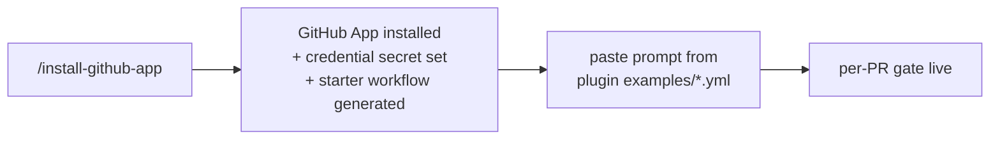

# 08 · CI and automation

The suite is built for a developer in the loop, but two kinds of work run unattended once you wire them up: **per-PR gates** that hold every merge to the suite's bars, and **recurring skills** that watch the ecosystem and keep registers fresh. This chapter shows how to wire both, what each gate actually blocks, and the one credential and permission they need.

## The short version

- **Canonical setup is `/install-github-app`.** Run it inside Claude Code. It installs the GitHub App, sets the Claude credential secret, and generates a correct, current starter workflow. Then paste in the criteria from each plugin's `examples/*.yml`. Do not hand-copy action input names — they evolve, and the generator tracks them.
- **Three PR gates, one per layer.** `code-ops-suite:pr-review` (breadth), `rigor:deep-review` (verification), `privacy-opsec-suite:opsec-pr-gate` (anonymity). Each posts inline comments at `file:line` and ends with a verdict; each blocks a different class of regression.
- **All three need a Claude credential** — `CLAUDE_CODE_OAUTH_TOKEN` (a Pro/Max subscription token) **or** `ANTHROPIC_API_KEY`. Without either, the gate **skips cleanly** instead of failing. The OAuth path needs `id-token: write`.
- **A fourth gate runs with no credential at all:** the structural `validate` workflow (`lint-plugins` + `check-no-deps` + the eval harnesses). It is pure Node, deterministic, and the real backstop on this repo.
- **Make the gates count:** mark them as required status checks in branch protection so a `request-changes` verdict actually blocks the merge.
- **Recurring work runs on `/schedule`:** put `researcher:ecosystem-watch`, `code-ops-suite:dependency-upgrade`, and `code-ops-suite:security-privacy-audit` on a cadence.

Two practical guides go deeper: [wiring the gates step by step](../guides/wire-ci-gates.md) and [choosing an automation level](../techniques/choosing-an-automation-level.md).

---

## Canonical setup: `/install-github-app`

Every example workflow in the suite opens with the same instruction, and it is the one to follow: run `/install-github-app` inside Claude Code. It installs the GitHub App on the repo, configures the credential secret, and **generates a working starter workflow** against the current `anthropics/claude-code-action` input names. The `examples/*.yml` files are illustrative starting points, not drop-in guarantees — the action's exact input names evolve, and only the generator is guaranteed current ([code-ops-suite `examples/github-pr-review.yml`](../../plugins/code-ops-suite/examples/github-pr-review.yml) header).

The workflow you adopt has two halves:

1. The **plumbing** — triggers, permissions, credential detection, checkout. Take this from the generated workflow (or the live workflows this repo already ships).
2. The **review criteria** — the `prompt:` block. Take this from the relevant plugin's `examples/*.yml` and tune it. If the plugin is installed in CI, the prompt can invoke the skill directly (`/rigor:deep-review for this pull request`); if not, the prompt **inlines the bar** so the gate is self-contained. The repo's own live workflows do exactly this: invoke the skill if present, else apply the bar inline.



---

## The three PR gates

The suite ships one PR gate per layer of the [4-plugin mental model](02-mental-model.md). They are independent jobs — wire one, two, or all three — and they stack cleanly because each blocks a different class of regression. The live versions in this repo are [`deep-review.yml`](../../.github/workflows/deep-review.yml) and [`opsec-gate.yml`](../../.github/workflows/opsec-gate.yml); the breadth gate ships as an example for you to adopt.

| Gate | Skill | Layer | Example / live workflow |
| --- | --- | --- | --- |
| Breadth review | `code-ops-suite:pr-review` | SPINE | [`github-pr-review.yml`](../../plugins/code-ops-suite/examples/github-pr-review.yml) |
| Verification review | `rigor:deep-review` | VERIFICATION | [`deep-review.yml`](../../.github/workflows/deep-review.yml) (example: [`github-deep-review.yml`](../../plugins/rigor/examples/github-deep-review.yml)) |
| Anonymity gate | `privacy-opsec-suite:opsec-pr-gate` | ANONYMITY | [`opsec-gate.yml`](../../.github/workflows/opsec-gate.yml) (example: [`github-opsec-gate.yml`](../../plugins/privacy-opsec-suite/examples/github-opsec-gate.yml)) |

All three trigger on `pull_request: [opened, synchronize, reopened]`, run least-privilege (`contents: read`, `pull-requests: write`), restrict tools, post inline comments labeled **Blocking / Should-fix / Nit**, and close with a verdict (`approve` / `approve-with-nits` / `request-changes`).

### `code-ops-suite:pr-review` — the breadth gate

A senior-engineering review of the diff **against the surrounding code, not in isolation**. It checks correctness and intricate bugs, design and modularity, performance regressions, security introduced (injection, authz, SSRF, IDOR), privacy/data-handling regressions, UI/accessibility for UI changes, tests, docs, and convention fit ([`github-pr-review.yml`](../../plugins/code-ops-suite/examples/github-pr-review.yml)). **Blocks:** a security or privacy regression — those it will not approve. Tools are restricted to `Read,Grep,Glob` (read + comment, no arbitrary writes). The deeper command reference is [`commands/code-ops-suite.md`](commands/code-ops-suite.md).

### `rigor:deep-review` — the verification gate

The same diff held to a **verification-first** bar: ground truth first, then review. The repo's live gate ([`deep-review.yml`](../../.github/workflows/deep-review.yml)) runs `node scripts/lint-plugins.mjs`, `node scripts/check-no-deps.mjs`, and the `evals/` harnesses so the review starts from facts. Every concern is assigned an evidence tier — **CONFIRMED** (reproduced) / **PROBABLE** (strong static evidence) / **SPECULATIVE** (a lead) — and run through a disconfirmation pass (is it reachable, already handled, intentional, already tested?) before it is reported. **Blocks:** a CONFIRMED defect or regression. The rule is explicit — *never block on a SPECULATIVE, never wave through a CONFIRMED defect.* For this repo it additionally treats as Blocking a bundled plugin copy that drifts from its canonical `scripts/` source, and any change that makes a lint or eval pass while the behavior it guards is broken. Tools are `Read,Grep,Glob,Bash` (Bash so it can actually run the ground-truth checks). See [`05-evidence-and-tiers.md`](05-evidence-and-tiers.md) and the [disconfirmation pass](../techniques/disconfirmation-pass.md).

### `privacy-opsec-suite:opsec-pr-gate` — the anonymity gate

A pre-merge **anonymity / OpSec** review for projects on the privacy track. The live gate ([`opsec-gate.yml`](../../.github/workflows/opsec-gate.yml)) treats four properties of this repo's own tooling as Blocking regressions that must not silently weaken:

- a new outbound network path, or re-enabling lib-docs' fetch by default / removing its https-and-public-host allowlist (egress stays opt-in and host-constrained);
- a new third-party import (the suite is dependency-free — `check-no-deps` must stay green);
- a weakened default or a loosened authorship/freshness gate (`scan-ai-tells`, `revalidate-register`): a fail-closed check turned fail-open, a removed validation, or coverage narrowed;
- a new log line or output emitting secrets / identifiers / IPs, or added telemetry.

Plus the standard anonymity checks: no new identifier / fingerprint / correlation surface, fail-closed preserved, metadata minimized. It **will not approve** any change that weakens an anonymity or fail-closed guarantee, and it never echoes real identifiers, secrets, or IPs. Tools are `Read,Grep,Glob`. This gate is the last link in the anonymity track — `anonymity-threat-model` → six leak audits → `LEAK_REGISTER.md` → `opsec-hardening` → **`opsec-pr-gate`** + `authorship-hygiene`; see [`commands/privacy-opsec-suite.md`](commands/privacy-opsec-suite.md).

### The credential, and skipping cleanly

All three model-backed gates need **one** Claude credential, set as a repo secret:

- `CLAUDE_CODE_OAUTH_TOKEN` — a Pro/Max subscription token, produced by `claude setup-token`; **or**
- `ANTHROPIC_API_KEY` — an Anthropic API key.

The workflow detects presence with a first step and gates every other step on it:

```yaml
- name: Detect credential
  id: key
  run: echo "present=${{ secrets.CLAUDE_CODE_OAUTH_TOKEN != '' || secrets.ANTHROPIC_API_KEY != '' }}" >> "$GITHUB_OUTPUT"
```

When neither secret is set — a fork PR, or a repo nobody has configured — the gate **skips cleanly** (it logs `gate skipped` and exits green) rather than failing on a missing secret ([`deep-review.yml`](../../.github/workflows/deep-review.yml) lines 22–24, 64–66). This is deliberate: a missing credential must not turn into a red X that blocks unrelated work or a contributor's fork.

#### The `id-token: write` permission

The Pro/Max OAuth path needs one extra permission beyond the example workflows' defaults. `claude-code-action` mints an **OIDC token** to exchange for the OAuth credential, which requires:

```yaml
permissions:
  contents: read
  pull-requests: write
  id-token: write   # claude-code-action mints an OIDC token for the Pro/Max OAuth path
```

Both live gates carry this ([`deep-review.yml`](../../.github/workflows/deep-review.yml) line 16, [`opsec-gate.yml`](../../.github/workflows/opsec-gate.yml) line 15). The `examples/*.yml` predate it and show only `contents: read` + `pull-requests: write`; if you use the OAuth token rather than an API key, add `id-token: write`. The actions are pinned to commit SHAs (per the suite's own `supply-chain-trust` skill) so a moved tag cannot inject code into CI; bump them deliberately and let the trailing `# v1` comment track the tag.

---

## The structural gate: `validate`

The fourth gate needs **no credential and no model**. [`validate.yml`](../../.github/workflows/validate.yml) runs on every push and PR with only `contents: read`, and it is the deterministic backstop the model-backed gates sit on top of. It runs, in order:

| Step | Command | What it guards |
| --- | --- | --- |
| Structural lint | `node scripts/lint-plugins.mjs` | Manifests parse and agree; README skill counts match the real `skills/` dirs; every `SKILL.md` has `description:`, a `## Done when` heading, and a `CONVENTIONS.md` reference; orchestrators only reference skills that exist; **bundled plugin scripts are byte-identical to canonical `scripts/`**; command-reference entries exist; every `§<id>` citation resolves to a real CONVENTIONS section and "the X subagent" prose names a bundled agent ([`scripts/lint-plugins.mjs`](../../scripts/lint-plugins.mjs) header). |
| Zero-dependency guard | `node scripts/check-no-deps.mjs` | Every import is a `node:` builtin or a local relative path — no third-party bare import (`SUPPLY-002`), which would open an npm dependency-confusion / transitive-CVE surface ([`scripts/check-no-deps.mjs`](../../scripts/check-no-deps.mjs) header). |
| Register-staleness eval | `node evals/register-staleness/run.mjs` | `revalidate-register.mjs` correctly classifies fresh / moved / already-fixed / no-reference items and fails closed on stale entries — the one behavior the field actually lost. |
| AI-trace scanner eval | `node evals/ai-tells/run.mjs` | `scan-ai-tells.mjs` flags a dirty PR body across every category and stays silent on a clean body with decoys. |
| lib-docs engine eval | `node evals/lib-docs/run.mjs` | `lib-docs.mjs` resolves versions, returns the matched README section, rejects traversal-shaped names, and makes **no** network call under `noFetch`. |
| MCP smoke test | `node evals/lib-docs/mcp-smoke.mjs` | `lib-docs-mcp.mjs` answers the stdio JSON-RPC handshake (initialize → tools/list → tools/call). |
| Researcher egress-manifest eval | `node evals/research-manifest/run.mjs` | The researcher's disclosed-egress manifest behavior. |
| Plugin validate (best-effort) | `claude plugin validate` if the CLI is present, else a no-op | A bonus when the CLI is on the runner; the comment is explicit that **structural-lint is the gate**, not this step. |

These are the [eval harnesses](../../evals/README.md) that keep the suite's "signal over noise" claim falsifiable. Because `validate` runs without any secret, it is the gate that protects the suite on fork PRs and in any clone — wire it first.

---

## Making gates required

A gate that posts a `request-changes` verdict still lets a merge through unless the check is **required**. To make a gate enforce:

1. In the repo's **Settings → Branches → branch protection rule** for your default branch, enable **Require status checks to pass before merging**.
2. Add the relevant job names — `structural-lint`, `deep-review`, `opsec-gate`, and/or the breadth review job — to the required list.

A nuance specific to these gates: because the model-backed jobs **skip cleanly** without a credential, decide whether a *skipped* run should count as passing. On a repo that has the secret set, a skip means something is misconfigured; on a public repo that takes fork PRs, skips are expected. The structural `validate` gate has no such caveat — it always runs — so requiring `structural-lint` is the safe floor for any repo.

---

## Recurring automation with `/schedule`

Some skills are built to run on a cadence rather than per-PR. Put them on a **Routine** with `/schedule`:

- **`researcher:ecosystem-watch`** — the flagship scheduled skill. Each run is a **diff against the last `ECOSYSTEM_WATCH.md`**: it re-grounds, gathers only changes since the prior run's `Verified-at` SHA within the standing egress opt-in and budget, drops entries that no longer apply, and surfaces only what is new and reachable. It researches and proposes — it **never edits source** — and hands off into `code-ops-suite:dependency-upgrade` and `privacy-opsec-suite:supply-chain-trust`. A scheduled run still honors the egress model: it stays inside the pre-agreed scope and **stops at a checkpoint rather than widening egress unattended** ([researcher `ecosystem-watch/SKILL.md`](../../plugins/researcher/skills/ecosystem-watch/SKILL.md)).
- **`code-ops-suite:dependency-upgrade`** — staged, verified upgrades on a cadence. It deliberately refuses a bulk bump-everything pass ([`commands/code-ops-suite.md`](commands/code-ops-suite.md)).
- **`code-ops-suite:security-privacy-audit`** — a recurring security/privacy sweep; good after security-relevant changes or whenever the system handles sensitive data.

The pattern is the same for all three: a scheduled run diffs against the last register's `Verified-at` SHA and acts only on what is new ([researcher `ecosystem-watch/SKILL.md`](../../plugins/researcher/skills/ecosystem-watch/SKILL.md), "Recurring schedule", line 33 — the diff-against-last-`Verified-at`-SHA model; the [researcher `README.md`](../../plugins/researcher/README.md) line 60 and [code-ops-suite `README.md`](../../plugins/code-ops-suite/README.md) line 64 cover putting these skills on a schedule). See [`04-registers-and-freshness.md`](04-registers-and-freshness.md) for how the SHA stamp and `revalidate-register.mjs` make that diff trustworthy.

---

## Recap: the automation-level ladder

CI and recurring runs use the same automation ladder as every code-changing run in the suite. It is one setting, chosen up front, governing how much the agent applies before it stops and asks:

| Level | What it does |
| --- | --- |
| `gated` *(default)* | Pauses for approval at every fix or closure batch. Nothing lands without a yes. |
| `auto-safe` *(recommended ceiling)* | Auto-applies only **NOW-SAFE** items — branched, behavior-preserving, test-backed, trivially revertible. Pauses for everything else. In the rigor layer, the item must also be **CONFIRMED**. |
| `auto-all` *(not recommended)* | Auto-applies beyond NOW-SAFE; the always-gated floor and NEEDS-DESIGN still hold. |

Two rules hold at every level: the **always-gated categories** (security/auth, secrets, data migrations and destructive ops, public API/contract changes) stop regardless of level, and **nothing ever auto-merges** — even auto-applied fixes land as commits or PRs for review. This matters for automation because a scheduled run is still bounded by it: a recurring `dependency-upgrade` at `auto-safe` lands only the mechanical bumps on a branch and stops for anything contract-touching. The PR gates are themselves read-only (their tools never include arbitrary writes), so they only ever *comment* — the ladder governs the code-changing skills they hand off to. The full treatment is in [choosing an automation level](../techniques/choosing-an-automation-level.md).

---

## Related

- [Wire the CI gates](../guides/wire-ci-gates.md) — the step-by-step end-to-end setup guide.
- [Choosing an automation level](../techniques/choosing-an-automation-level.md) — `gated` vs `auto-safe` vs `auto-all` and the always-gated floor.
- [03 · Orchestrators](03-orchestrators.md) — the skills the gates and schedules invoke.
- [04 · Registers and freshness](04-registers-and-freshness.md) — the `Verified-at` SHA and `revalidate-register.mjs` that make scheduled diffs trustworthy.
- [The evals directory](../../evals/README.md) — the harnesses the `validate` gate runs.

*Verified-at: c2b37e9*
