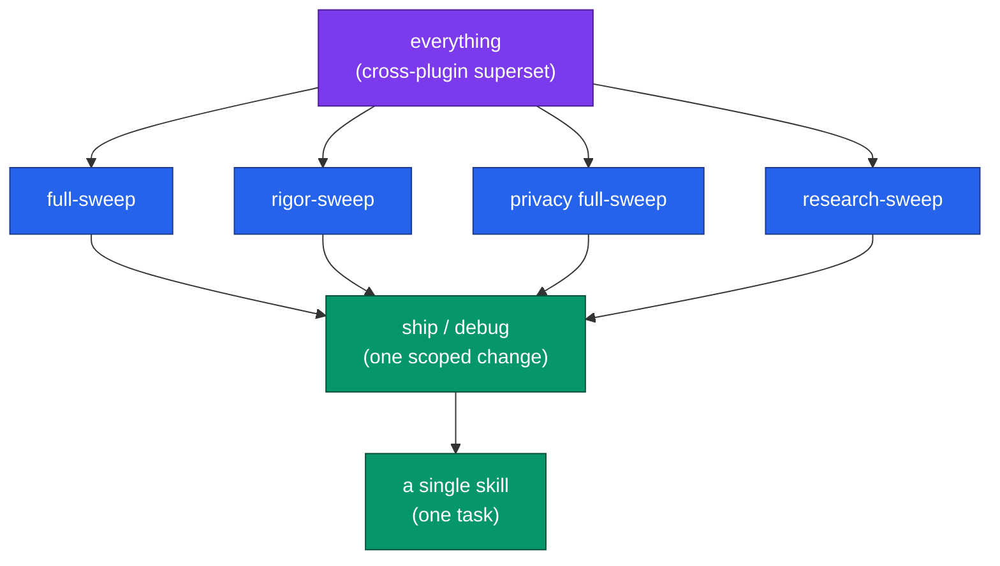
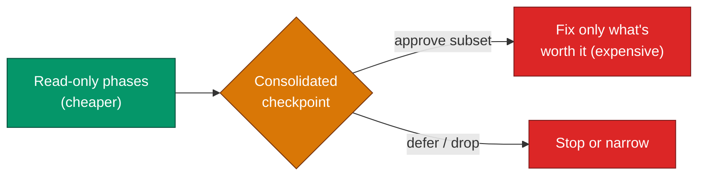

# Cost and Scoping — Fitting a Run to a Budget

> Part of the [code-ops handbook](README.md). Companion chapters: [03-orchestrators.md](03-orchestrators.md) (the seven orchestrators and their phases) and [techniques/subagent-trade-offs.md](../techniques/subagent-trade-offs.md) (when context isolation is worth the extra cost — *planned, see [Coming next](README.md#the-handbook-is-complete)*).

## Exec summary (stop here if you only need the gist)

Cost in code-ops is a **control you hold**, not a fixed price. You set it at **Phase 0** of any orchestrator — by choosing *which* orchestrator, *what scope*, *which track*, and *how often it checks in*. Two rules cover most of the decision:

1. **Pick the narrowest thing that covers your goal.** Relative cost, largest to smallest:

   ```
   everything  >  full-sweep ≈ rigor-sweep ≈ privacy full-sweep ≈ research-sweep  >  ship / debug  >  a single skill
   (all 3 plugins)              (one plugin, whole suite)                            (one scoped change)   (one task)
   ```

2. **Start read-only, scope to the riskiest subsystem, defer the optional deep-dives, then let the consolidated checkpoint tell you what is worth fixing.** A read-only assessment is far cheaper than a code-changing run and de-risks every downstream phase.

No absolute token numbers appear here on purpose — they age, and the real cost scales with repo size, scope, track, and check-in frequency, all of which you set per run. What is stable is the *ordering* and the *levers*. The rest of this chapter is the depth behind those two rules.

---

## 1 · The cost ladder

The orchestrators form a strict cost ladder. From [03-orchestrators.md § Relative cost and depth](03-orchestrators.md#relative-cost-and-depth):

| Tier | What runs | Relative cost |
| --- | --- | --- |
| `everything` | The cross-plugin superset — all three engineering plugins (code-ops-suite + rigor + privacy-opsec-suite), deduplicated, one consolidated go/no-go | **most expensive** |
| `full-sweep` · `rigor-sweep` · privacy `full-sweep` · `research-sweep` | One plugin's whole suite, end-to-end (intra-plugin) | a tier below `everything`; roughly comparable to one another |
| `ship` / `debug` | One scoped change or one symptom, run at full rigor | much cheaper than a sweep |
| A single skill | One task (`codebase-audit`, `bug-hunt`, `tor-egress-audit`, …) | **cheapest unit** |



The orchestrators do **not** replace the skills they chain — they sequence them. So the cheapest correct move is often to run one constituent skill directly. The orchestrators exist for when one skill is not enough; reach up the ladder only when the breadth is genuinely needed. When two tiers both fit, **prefer the narrowest**: a single skill over an intra-plugin sweep, an intra-plugin sweep over `everything`.

Why `everything` sits alone at the top: it is the only orchestrator that requires all three engineering plugins installed, and its own `SKILL.md` calls it *"deliberately the most thorough and most token-expensive option."* It runs the supersets of all three, so reach for it only on a critical repo.

---

## 2 · The four levers you set at Phase 0

Every orchestrator opens with a **scoping checkpoint** before any work starts. Four levers there determine cost. None of them require re-running anything — you set them once, up front.

### Lever 1 — Track: start read-only

Every sweep offers a read-only track that does no code changes — the single biggest cost (and risk) lever. The exact name differs by plugin but the shape is identical:

| Orchestrator | Read-only track | Full track |
| --- | --- | --- |
| `full-sweep` (code-ops-suite) | `assess-only` (read + document) | `full` (assess → safety net → fix → polish → document) |
| `rigor-sweep` | `assess-only` (facts + proven findings) | `full` (also fix / close / improve) |
| privacy `full-sweep` | `audit-only` (read + document) | `full` (audit → harden → docs/gate) |
| `research-sweep` | local-first, **never edits** by design | proposes + hands off (still never edits) |

A read-only pass is far cheaper than a code-changing one — it skips the safety-net, fix, close, and improve phases entirely — and it produces the register that lets you decide whether the expensive phases are worth running at all. **Always assess before you change.** Run the read-only track first; promote to `full` (or a custom subset) only for the parts the assessment proves are worth it.

`research-sweep` is the extreme case of read-only: the **proposal layer** never edits code under any track. It produces registers and design briefs and hands off to the other three plugins. Its cost lever is **egress**, not edits — see Lever 4.

### Lever 2 — Scope: the riskiest subsystem first

Cost scales with how much code each phase reads and reasons over. Narrowing scope is a near-linear cost cut.

`everything`'s Phase 0 makes the recommendation explicit: scope to *"the whole repo, or the riskiest subsystems first (recommended for large repos; bug-hunting goes deep per subsystem)."* The same applies to every sweep. On a large repo:

- Identify the one or two subsystems where a defect hurts most (auth, payments, the egress path, the data layer).
- Scope the run to those first.
- Expand only if the first pass surfaces reasons to.

This pairs naturally with Lever 1: a **read-only assessment scoped to the riskiest subsystem** is the cheapest high-signal starting move in the whole suite.

### Lever 3 — Defer the optional deep-dives

Some phases are explicitly optional and run only if you select them at Phase 0. The two most expensive optionals are **performance** and **dependency-upgrade**:

- In `full-sweep`, Phase 5 (*"Deep-dives (optional, as scoped)"*) runs *performance* and/or *dependency-upgrade* only if selected.
- In `rigor-sweep`, Phase 7 (`improve-measured`) is optional — *"only changes with a before/after metric ship."*
- In `everything`, the improve phase (`improve-measured` + `performance` + `dependency-upgrade`) ships measured deltas only.

Defer these on a first pass. They are valuable but rarely urgent, and each adds cost without changing your correctness or security verdict. Run them later, scoped, once the cheaper phases have told you where they would pay off.

### Lever 4 — Check-in level (and egress, for research)

`everything` sets a **check-in level** at Phase 0: *normal* (pause at every phase) or *minimal* (pause only at the consolidated review and always-gated items). *Minimal* reduces the round-trips you mediate but does **not** loosen the always-gated categories — security/auth, secrets, data migrations / destructive ops, and public contract changes still stop for approval regardless of level (code-ops-suite `CONVENTIONS.md §4`). It trades your attention, not safety.

For `research-sweep`, the equivalent lever is **egress**. It is local-first by default — documentation lookups read the *installed* version with no query egress. Web research is opt-in, granted only at Phase 0, gated behind a hard checkpoint before any network request, and every request is logged in `EGRESS_MANIFEST.md`. Leaving web egress off keeps a research run both cheaper and fully local.

---

## 3 · Let the consolidated checkpoint decide what to fix

The cheapest fix run is the one you scope *after* you have seen the findings — not before. Every orchestrator separates **finding** (read-only, cheap-ish) from **fixing** (code-changing, expensive) with a checkpoint in between.

`everything` makes this its centerpiece: **Phase 6 — Consolidated review** is the *main go/no-go*. By that point all the assessment and preparation phases have run — map (Phase 1), ground-truth/test-trust (Phase 2), prove (Phase 3), leak-audit (Phase 4), and safety-net (Phase 5, which writes characterization tests but changes no production code) — and produced one prioritized, CONFIRMED-led picture with every register re-validated against current `HEAD`. You approve a remediation **plan** and an automation level there, and only the approved items get the expensive fix phases (Phase 7 onward).



The practical workflow this enables:

1. Run the read-only track (Lever 1), scoped to the riskiest subsystem (Lever 2), deep-dives deferred (Lever 3).
2. Read the register at the consolidated checkpoint. Findings arrive ranked, CONFIRMED-led, each on a track — `NOW-SAFE` / `NEEDS-REVIEW` / `NEEDS-DESIGN` (see [04-registers-and-freshness.md](04-registers-and-freshness.md) and [05-evidence-and-tiers.md](05-evidence-and-tiers.md)).
3. Approve only the subset worth the spend. The fix phases then run against just that subset, per the automation level — so the most expensive phases are bounded by a decision you made with the evidence in hand.

This is also why the registers are kept fresh: a finding fixed earlier in a run is stamped `OBSOLETE-AT <sha>` and never re-shown, so you never pay to re-work something already closed.

---

## 4 · Subagents: cheaper context, not free

The orchestrators run an adaptive loop that **fans out parallel subagents** per unit of work (code-ops-suite `CONVENTIONS.md §1`; the same loop appears in rigor `§1`, privacy `§1`, researcher `§1`). Read-only analysis parallelizes freely; code edits are conflict-aware (parallel on disjoint file sets, serial on shared or dependent ones).

Subagents **isolate context** — each specialist works in its own window, so a deep investigation into one subsystem does not crowd out the rest of the run, and breadth sweeps can use a faster model while synthesis and review use a stronger one (rigor `§A`). That isolation is what makes deep, per-subsystem work tractable.

But isolation is **not free**: spinning up a subagent re-establishes its working context, so more agents means more total tokens even when each one is focused. The trade-off:

- **Isolation pays off** when the units of work are genuinely independent and each is large enough that keeping them separate avoids context thrash — e.g. `bug-hunt` going deep per subsystem, or the six privacy leak audits running in parallel.
- **Isolation costs more than it saves** when the work is small, tightly coupled, or could be one focused pass. Spawning many tiny agents multiplies setup cost for little independence gained.

So narrowing scope (Lever 2) is doubly economical: fewer subsystems means fewer subagents *and* less code per subagent. For the full decision framework on when context isolation is worth the cost, see [techniques/subagent-trade-offs.md](../techniques/subagent-trade-offs.md) *(planned)*.

---

## 5 · A budgeted run, end to end

Putting the levers together for a large, unfamiliar repo on a tight budget:

1. **Don't start with `everything`.** Start with the *one* plugin whose lens matches your goal — `rigor-sweep` for proven correctness, code-ops `full-sweep` for breadth hardening, privacy `full-sweep` only if the repo has anonymity/opsec needs.
2. **Take the read-only track** (`assess-only` / `audit-only`), **scoped to the riskiest subsystem**, with **deep-dives deferred** and web egress off (research only).
3. **Read the register at the checkpoint.** Approve only the subset worth fixing.
4. **Promote to `full` for that subset only.** Run the fix phases under `gated` (or `auto-safe` for NOW-SAFE items) — always-gated categories still stop for you.
5. **Run the deferred deep-dives later, scoped**, only where the assessment showed they would pay off.
6. **Reach for `everything` only when** you genuinely need all three plugins on a critical repo — and even then, narrow scope at Phase 0 and consider *minimal* check-ins to bound your own time, never the safety gates.

Every level above a single skill is checkpointed. You can dial depth and check-in frequency down at Phase 0 and stop at any phase boundary — which is why cost is a control you hold, not a fixed price.

---

*Verified-at: c2b37e9*
