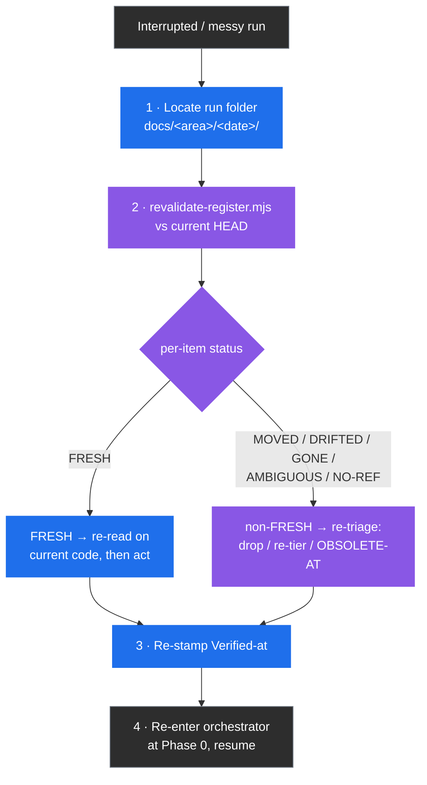

# Recovery and Troubleshooting

> Part of the [code-ops handbook](README.md). Companion chapter: [04-registers-and-freshness.md](04-registers-and-freshness.md). Companion technique: [register-carry-forward](../techniques/register-carry-forward.md).

## Exec summary (stop here if you only need the recovery checklist)

A run got cut off — a checkpoint was cancelled, the terminal closed mid-phase, an orchestrator stopped between batches, or you came back to a half-finished `docs/<area>/<date>/` folder from last week. Nothing is lost, because the run never held state anywhere except **on disk, in the registers**. Recovery is therefore not "undo": it is **re-grounding against current code, then continuing**.

The whole recovery model rests on one fact established in [04-registers-and-freshness](04-registers-and-freshness.md): **a register is only as trustworthy as its last revalidation.** An interrupted run leaves registers stamped against a `Verified-at` sha that may no longer be `HEAD` — you (or a teammate, or a later commit) may have moved on. So before you resume anything, you re-validate.

The four-step recovery, in order:

1. **Find the run folder.** Artifacts land in a dated folder under the repo's docs location — `docs/<area>/<date>/` (e.g. `docs/rigor/<date>/`, `docs/privacy/<date>/`), or repo root if the repo has no docs convention ([code-ops CONVENTIONS §12](../../plugins/code-ops-suite/CONVENTIONS.md)). The standard filenames are `FINDINGS_REGISTER.md`, `LEAK_REGISTER.md`, and `EXECUTIVE_SUMMARY.md`, plus per-plugin registers and logs.
2. **Re-validate every carried register against current `HEAD`** — `node scripts/revalidate-register.mjs <register> --root <repo>` — *before* you re-run or resume anything.
3. **Re-triage every non-`FRESH` item** (`MOVED` / `DRIFTED` / `GONE` / `AMBIGUOUS` / `NO-REF`), and re-read the `FRESH` survivors. Anything already fixed gets stamped `OBSOLETE-AT <sha>` and is never re-shown.
4. **Resume from the last clean phase boundary.** Re-enter the orchestrator at Phase 0; it re-scopes, re-opens the master plan, and carries the revalidated registers forward.

If you read nothing else: **registers are the only thing worth recovering, and you recover them by revalidating, never by trusting them as-is.**



Legend: blue = a recovery action you take, purple = a gate or status change, gray = start/end. Every path into "resume" passes through revalidation.

---

## 1 · Where the artifacts land

A run writes two kinds of files, and the distinction governs what you can safely delete (§3).

- **Run artifacts** — the registers, logs, and the executive summary for *this* run — go in a **dated folder under the repo's docs location**: `docs/<area>/<date>/`, or repo root if the repo has no docs convention ([code-ops CONVENTIONS §12](../../plugins/code-ops-suite/CONVENTIONS.md), and verbatim in each plugin's register section — [rigor §10](../../plugins/rigor/CONVENTIONS.md), [privacy §11](../../plugins/privacy-opsec-suite/CONVENTIONS.md), [researcher §12](../../plugins/researcher/CONVENTIONS.md)). The `<area>` is the lens — `docs/rigor/<date>/`, `docs/privacy/<date>/` — so two plugins running on the same repo on the same day do not collide.
- **Authoritative reference docs** — threat models, privacy promises, architecture docs, ADRs, runbooks — are **SSOT in the repo's existing docs location and reconciled in place**, never duplicated into a run folder ([code-ops §11](../../plugins/code-ops-suite/CONVENTIONS.md), [privacy §11](../../plugins/privacy-opsec-suite/CONVENTIONS.md)).

The standard filenames a run produces (exact, from the `CONVENTIONS.md` of each plugin):

| File | Produced by | Role |
| --- | --- | --- |
| `FINDINGS_REGISTER.md` | code-ops-suite, rigor | Audit / review / bug findings (the spine register) |
| `LEAK_REGISTER.md` | privacy-opsec-suite | Anonymity / leak findings |
| `EXECUTIVE_SUMMARY.md` | every orchestrator | The running, cross-phase summary; separates CONFIRMED from PROBABLE/SPECULATIVE at the end |
| `CONSISTENCY_REGISTER.md` | rigor | Variants to close to a canonical form |
| `RESEARCH_FINDINGS.md` / `IDEAS_REGISTER.md` | researcher | Code-grounded claims (`RSCH-NNN`) / proposals (`IDEA-NNN`) |
| `EGRESS_MANIFEST.md` | researcher | Disclosure log of every external request (validated by `research-manifest.mjs`, not `revalidate-register.mjs`) |
| `ANONYMITY_THREAT_MODEL.md`, `OPSEC_RUNBOOK.md` | privacy-opsec-suite | Authoritative docs (SSOT, reconciled in place — *not* run artifacts) |
| `GROUND_TRUTH.md`, `TEST_SUITE_REPORT.md`, `REGRESSION_REPORT.md`, `IMPLEMENTATION_LOG.md`, `IMPROVEMENTS_LOG.md` | rigor | Phase logs ([rigor §10](../../plugins/rigor/CONVENTIONS.md)) |

> The first thing to do on any recovery is identify the run folder and read its `EXECUTIVE_SUMMARY.md` — it is the running narrative across phases and tells you how far the run got and what the last go/no-go was.

---

## 2 · Resuming or re-running a cancelled orchestrator

Every orchestrator is **checkpointed and developer-in-the-loop** ([03-orchestrators](03-orchestrators.md)): you set scope, track, and automation level at Phase 0, then approve or redirect at each phase boundary, and **none of them auto-merge**. That design is what makes interruption cheap — work happens on a branch, the registers are on disk, and the executive summary records the last clean boundary.

**The cardinal rule: re-validate the carried registers against current `HEAD` *before* you resume.** This is the orchestrators' own Phase 0 behavior, not an extra step you bolt on — `full-sweep`'s Phase 0 instruction is "Carry the registers forward fresh — before any phase consumes a finding, re-validate it against current HEAD; a finding fixed earlier in the run is marked `OBSOLETE-AT <sha>`, never re-shown" ([full-sweep SKILL.md, Phase 0](../../plugins/code-ops-suite/skills/full-sweep/SKILL.md)). The danger when resuming is sharper than in a fresh run: time has passed, commits may have landed, and the register's `Verified-at` shas are now demonstrably behind.

### How to resume

0. **Check for a dispatch ledger first.** If the run folder has a `DISPATCH_LEDGER.md`, read it before touching phase boundaries — see "Per-unit resume via the dispatch ledger" below. A dangling row means a specific sub-agent dispatch died or hung; that unit can often be resumed on its own, without re-entering the whole phase.
1. **Re-enter the orchestrator at Phase 0** with the same scope and track. Point it at the existing run folder so it re-opens the master plan and the running `EXECUTIVE_SUMMARY.md` rather than starting a fresh folder. Phase 0 is a checkpoint by design — it re-scopes and re-confirms the automation level before any phase consumes anything.
2. **Let it (or you) revalidate first.** The orchestrator carries the registers forward *fresh* — every register it inherits is run through `revalidate-register.mjs` and the non-`FRESH` items are re-triaged before any phase acts on them. If you are driving the recovery by hand, run §3's revalidate command yourself before resuming a phase.
3. **Resume from the last clean phase boundary** named in the executive summary. Because phases consume registers and not in-memory state, a phase that was mid-batch when cancelled is safe to re-run from its start — `remediation` and `fix-verified` both re-validate the register and drop anything already fixed, so a half-applied fix batch is not double-applied ([full-sweep Phase 4](../../plugins/code-ops-suite/skills/full-sweep/SKILL.md) for `remediation`; the separate rigor [fix-verified Phase 0](../../plugins/rigor/skills/fix-verified/SKILL.md) for `fix-verified`).

### Per-unit resume via the dispatch ledger

An orchestrated run keeps `DISPATCH_LEDGER.md` beside the register, one row per sub-agent dispatch, written **at dispatch time** rather than when the report lands — so a hung or dead operative shows up as a dangling `dispatched` row instead of silently vanishing ([code-ops §12](../../plugins/code-ops-suite/CONVENTIONS.md), verbatim in [rigor §10](../../plugins/rigor/CONVENTIONS.md) and [privacy §11](../../plugins/privacy-opsec-suite/CONVENTIONS.md)). Before falling back to whole-phase re-entry, run:

```sh
node scripts/revalidate-register.mjs --dispatch-ledger DISPATCH_LEDGER.md --report-only
```

This prints an `advisory:` line for every row still `dispatched` (never `reported`, `failed`, or `redispatched`) and never affects the exit code — it is a pointer, not a gate. For each dangling row, re-dispatch that one unit with a tightened brief or mark it `failed` and hand it to the next checkpoint, per the operative-failure ladder; there is no need to re-run the whole phase just because one dispatch never reported back.


### Resume vs. re-run

| Situation | Do | Why |
| --- | --- | --- |
| Cancelled at a checkpoint, code unchanged since | **Resume** at the next phase after revalidating | The registers are still current to that sha; revalidation confirms it cheaply |
| Cancelled mid code-changing phase (fix batch, hardening) | **Re-run that phase from its start** after revalidating | Fix phases re-validate and skip already-fixed items, so re-running is idempotent on the register |
| Days passed, or other commits landed | **Re-run from Phase 0**, full revalidation | The `Verified-at` shas are stale; treat the whole register as suspect until revalidated |
| Scope or track was wrong | **Re-run from Phase 0** with corrected scope | Phase 0 is where scope, track, and automation level are set |

Because no orchestrator auto-merges and every code change lands on a branch as a commit/PR, resuming never risks an unreviewed merge — the worst case of a bad resume is a re-run phase, not a lost or duplicated landing.

---

## 3 · Safe to delete vs. keep

The run/authoritative split from §1 maps almost exactly onto delete/keep.

**Keep (do not delete):**

- **Any register with live items** — `FINDINGS_REGISTER.md`, `LEAK_REGISTER.md`, the researcher registers. These are the SSOT; deleting one discards the work graph, not just a report.
- **Authoritative reference docs** reconciled in place — threat models, privacy promises, ADRs, architecture/ops docs. These are never run artifacts; they belong to the repo.
- **`EGRESS_MANIFEST.md`** for any researcher run whose artifacts you intend to keep or publish — `research-manifest.mjs validate` fails closed if a published artifact cites a host with no matching manifest entry ([04 §4](04-registers-and-freshness.md), [researcher §12](../../plugins/researcher/CONVENTIONS.md)). Delete the manifest and you cannot re-validate the artifact.
- **`OBSOLETE-AT`-stamped items inside a register.** They are kept *in the file* for traceability and are simply skipped by carry-forward — do not prune them ([04 §5](04-registers-and-freshness.md)).

**Safe to delete:**

- **A stale dated run folder you have superseded** — e.g. `docs/<area>/<old-date>/` after a newer, completed run exists and you have carried forward anything still live. The folder is a run artifact; the durable truth is the reconciled docs and the current register.
- **Phase logs** (`GROUND_TRUTH.md`, `TEST_SUITE_REPORT.md`, `IMPLEMENTATION_LOG.md`, etc.) once the run is complete and the executive summary captures the outcome. They are diagnostic, not SSOT.
- **A duplicate or accidental run folder** from a mistaken second invocation, once you have confirmed no unique findings live only there.

> When in doubt, keep the register and delete the surrounding folder's *logs*, not the register itself. A register is cheap to revalidate and expensive to recreate. Note that these run-folder paths are local artifacts and may be git-ignored — recovering one means reading what is on disk, not what is committed.

---

## 4 · Register drift and corruption

"Drift" is the normal, expected divergence between a register and the code it cites, accumulated while the run was paused. "Corruption" is the rarer case of a register that has been hand-edited into a malformed state. The same tool diagnoses both.

### Run the revalidation pass

```sh
node scripts/revalidate-register.mjs <register> --root <repo>
```

(Inside a skill the canonical invocation is `node ${CLAUDE_PLUGIN_ROOT}/scripts/revalidate-register.mjs <register> --root <repo>`; the script is byte-identical at the repo root `scripts/` and in each `plugins/<name>/scripts/`.) It scans the register for item IDs, collects every cited `file:line`, the `Verified-at` sha, and any delimited `Anchor:` under each ID, re-greps each reference against the current tree, and assigns each item exactly one status:

| Status | Meaning | Re-triage action |
| --- | --- | --- |
| **FRESH** | Every cited `file:line` still exists and is in range. | Re-read on current code to confirm the defect still holds (the script is a *floor, not a proof*), then act. |
| **MOVED** | The cited line is now out of range — at the original path or at a single relocated file found by name. | Re-locate on current code; update `Location`; re-stamp `Verified-at`. |
| **DRIFTED** | The cited line still exists but no longer contains the item's `Anchor:` substring (checked only when the item carries a delimited `Anchor:`). | The citation is stale or hallucinated — re-locate on the current tree and re-tier, or drop. |
| **GONE** | A cited file no longer exists anywhere in the tree. | Likely fixed or relocated — verify, then `OBSOLETE-AT <sha>` or re-point. |
| **AMBIGUOUS** | The literal path is gone but more than one file matches its bare name, or a reference escapes the repo root. | Resolve by hand; the script refuses to guess. Update `Location` so the next run is unambiguous. |
| **NO-REF** | The item cites no `file:line` at all — nothing to auto-check. | Add a citation or verify by hand; an uncited finding is not yet actionable. |

There are also non-gating **advisories** (including an `Anchor:` value that is not backtick/quote-delimited — unparseable, so its `DRIFTED` check is skipped). The one that matters most here: when an item's `Verified-at` sha differs from the repo's current `HEAD`, the report appends `Verified-at <sha> != HEAD <sha> — re-confirm`. After an interruption this advisory fires on nearly everything — that is the signal, not noise: the run paused, the repo moved, every carried item needs a re-confirming read.

**Exit behavior.** The script exits **non-zero if any item is `MOVED`, `DRIFTED`, `GONE`, `AMBIGUOUS`, or `NO-REF`**, so it can gate a resume or a CI step — *unless* `--report-only` is passed, which prints the report and always exits zero. Use the gating form when resuming so you cannot accidentally act on a drifted register; use `--report-only` for a read-only health check.

### Re-triage the non-`FRESH` items

For each non-`FRESH` item, decide its fate and record it in the register:

1. **Already fixed in code** → stamp **`OBSOLETE-AT <sha>`** with a one-line reason. It stays in the file for traceability but is permanently excluded from re-ranking and re-showing. This is the discipline that defeats the proven failure mode — *a register re-listing an item already fixed in code* ([04 §3](04-registers-and-freshness.md)).
2. **Still real but relocated** (`MOVED` or `DRIFTED`, or `GONE`/`AMBIGUOUS` resolved by hand to a real location) → update `Location` (and the `Anchor`, copied verbatim from the new line) to the current `file:line` and re-stamp `Verified-at` with the sha you re-confirmed on.
3. **Uncited** (`NO-REF`) → add the `file:line` citation ([code-ops §9](../../plugins/code-ops-suite/CONVENTIONS.md) requires every finding cite a location) or verify by hand before relying on it.

Then **re-read every `FRESH` survivor** on the current code. `FRESH` is a location check, not a defect check — a finding can be `FRESH` and already fixed if someone patched the logic without moving the line. The script narrows the set you must re-read; it does not replace the reading.

```mermaid
sequenceDiagram
    autonumber
    participant Dev as You (recovering)
    participant Reg as Carried register
    participant Rev as revalidate-register.mjs
    participant Code as Current HEAD

    Dev->>Rev: revalidate FINDINGS_REGISTER.md --root .
    Rev->>Code: re-grep every cited file:line
    Rev-->>Dev: BUG-007 GONE; SEC-003 FRESH (Verified-at != HEAD); PERF-011 NO-REF
    Dev->>Reg: BUG-007 → OBSOLETE-AT <sha> (cited file deleted)
    Dev->>Code: re-read SEC-003 on current code
    Code-->>Dev: still reproduces
    Dev->>Reg: SEC-003 → re-stamp Verified-at <sha>
    Dev->>Reg: PERF-011 → add file:line citation, then re-tier
    Note over Dev,Reg: only now is the register safe to resume against
```

### When a register is genuinely corrupt

If the register was hand-edited into a malformed state — a truncated block, a mangled ID, a `Location` field that no longer parses — the symptoms are the script reporting `NO-REF` for an item you know cites a file, or an ID silently dropped from the report. Recover by repair, not by deletion:

- Compare against the schema in [04 §2](04-registers-and-freshness.md) (the canonical Finding fields) and the annotated snippet in [04 §5](04-registers-and-freshness.md); restore the missing fields by re-reading the cited code.
- If a whole register is unrecoverable, reconstruct it from `git log` using the **stable IDs** — items keep their ID from discovery through register, commit, and run log ([04 §1](04-registers-and-freshness.md)), so a commit message referencing `BUG-007` tells you what that ID closed.
- Do not delete a corrupt register and start clean unless you have first recovered every live ID; the IDs are the thread that ties findings to the commits that touched them.

For the full carry-forward discipline — the re-validate-then-carry-what-survives loop this chapter applies to recovery — see [techniques/register-carry-forward](../techniques/register-carry-forward.md) and the carry-forward section of [04-registers-and-freshness §3](04-registers-and-freshness.md).

---

## 5 · Recovery quick reference

| Symptom | First move | Then |
| --- | --- | --- |
| Run cancelled at a checkpoint | Check `DISPATCH_LEDGER.md` for dangling `dispatched` rows | Re-dispatch that unit, or revalidate and re-enter at Phase 0 if none (§2) |
| Half-finished `docs/<area>/<date>/` from a past run | Identify which registers have live items | Revalidate vs `HEAD`; OBSOLETE-AT what is fixed (§4) |
| Register re-lists something already fixed | This is *the* failure mode | Stamp `OBSOLETE-AT <sha>`; confirm the resume ran revalidation (§4) |
| `revalidate-register.mjs` exits non-zero | Read which IDs are non-`FRESH` | Re-triage each (§4); do not resume until clean or knowingly waived |
| Item reports `AMBIGUOUS` | The script refused to guess | Resolve the real location by hand; update `Location` (§4) |
| Unsure what to delete | Keep every register; delete only logs/superseded folders | See the keep/delete split (§3) |
| Researcher artifact won't publish | Check `EGRESS_MANIFEST.md` exists and is complete | `research-manifest.mjs validate` — fail-closed on un-manifested hosts ([04 §4](04-registers-and-freshness.md)) |

---

## 6 · Stacked-PR merge procedure

This repo squash-merges, so a stacked series of PRs merges **bottom-up**, one PR at a time, and each merge changes what the next PR in the stack is based on.

### Retarget before you delete

After a parent PR in the stack merges, retarget its child onto the new trunk — `gh pr edit <n> --base main` — **before** deleting the parent's branch. GitHub does not retarget a PR when its base branch disappears: deleting a PR's base branch **closes** the PR, and a closed PR can neither be reopened nor re-based while its base branch is missing.

If the parent branch is already gone and the child PR closed, recover in order:

1. Restore the branch at its old head — `git push origin <sha>:refs/heads/<name>`.
2. Reopen the PR.
3. Retarget it — `gh pr edit <n> --base main`.
4. Only then delete the branch.

### A CONFLICTING tip PR is often a false alarm

Squash commits are never ancestors of the branches they were squashed from, so a tip PR can show **CONFLICTING** against `main` purely because a lower PR in the stack already squash-merged edits to the same files (version bumps, changelogs, vendored script copies) — not because the tip's own edits actually conflict with anything. Before treating it as a real conflict, check both:

- `git diff origin/main <mid-stack-head>` is empty (the mid-stack branch's tree already matches `main`), and
- `git merge-base --is-ancestor <mid-stack-head> <tip>` holds (the tip branch already contains that history).

When both hold, the tip branch's own tree is already the correct merge result. Reconcile without rewriting history:

```sh
git commit-tree '<tip>^{tree}' -p <tip> -p origin/main -m "Merge branch 'main' into <branch>"
git push origin <sha>:refs/heads/<branch>   # <sha> is the commit-tree output above
```

This pushes a synthetic merge commit as a plain fast-forward — not a rebase, not a force-push — so the tip branch's own history is preserved and GitHub re-evaluates the conflict check against the new head.

### Retargeting re-triggers CI

`gh pr edit --base` re-runs the PR's CI on the **same head SHA** — expect the checks to restart, and wait for them before merging.

---

## Coming next

Related material lives in adjacent chapters: the register schemas, tracks, and the full `revalidate-register.mjs` reference in [04-registers-and-freshness](04-registers-and-freshness.md); the orchestrators' phase structure and checkpoints in [03-orchestrators](03-orchestrators.md); evidence tiers and the disconfirmation pass behind re-reading a survivor in [05-evidence-and-tiers](05-evidence-and-tiers.md). The dedicated carry-forward technique linked above is [techniques/register-carry-forward](../techniques/register-carry-forward.md).

*Verified-at: a181b36*
