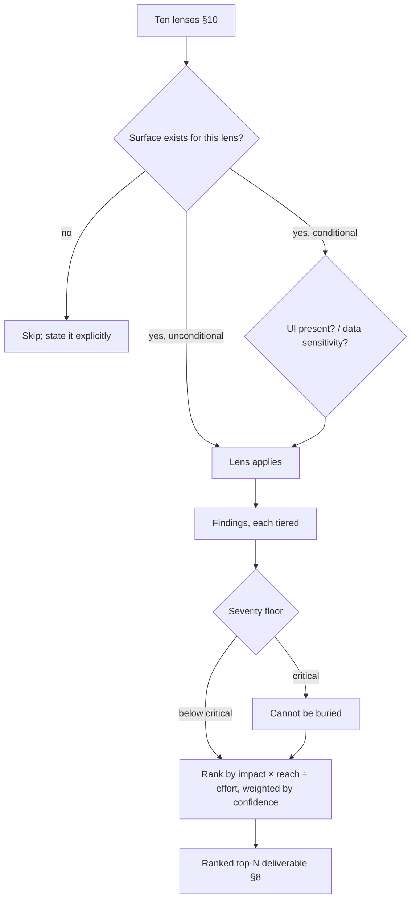

# Applying the quality lenses

> A reusable how-to for one habit the whole suite shares: treat the **quality lenses** as a *decision aid* for where to spend attention — not a checklist to tick top to bottom. The skill in this section is choosing **which lenses apply to your stack** and **how to weight them**, so a review goes deep where it matters instead of shallow everywhere.

## Exec summary (stop here if that is all you need)

The suite defines ten quality lenses in [code-ops-suite `CONVENTIONS.md` §10](../../plugins/code-ops-suite/CONVENTIONS.md). Skills reference them by name and apply "the ones relevant to the task and the project" — that phrase is the whole point. The lenses are a menu, not a mandatory pass.

Two moves turn the menu into a plan:

1. **Decide which lenses apply.** A lens applies when your stack has the surface it inspects. Two of the ten are explicitly conditional in §10 — **UI/UX, styling & accessibility** *(if the project has a UI)* and **Privacy & data handling** *(scaled to how much personal/sensitive data the system handles)*. The rest apply wherever their surface exists; drop the ones whose surface your code does not have, and say so.
2. **Decide how to weight the ones that apply.** Rank by the suite's priority formula — **impact × reach ÷ effort** (weighted by confidence), with **severity as a floor** ([§8](../../plugins/code-ops-suite/CONVENTIONS.md)). Severity sets a minimum; the formula orders everything above that floor.

One rule rides on top of the **Security** lens and applies to *any* control, gate, or invariant you review: the **multi-boundary control-coverage rule** — enumerate every entry point that can reach the protected action and verify the control at each. Verified at one boundary but not enumerated is a finding, not a pass ([§10](../../plugins/code-ops-suite/CONVENTIONS.md)).

To pick the command that applies the right lenses for your goal, use the [command router](../handbook/commands/README.md).

---

## The ten lenses

These are the shared definitions from [code-ops-suite `CONVENTIONS.md` §10](../../plugins/code-ops-suite/CONVENTIONS.md), quoted by name. Each lens is a *family of failure modes* — a way the code can be wrong — not a single check.

| Lens | What it inspects | Conditional? |
| --- | --- | --- |
| **Modularity & architecture** | Coupling/cohesion, dependency direction, leaky abstractions, circular deps, duplication, dead code, unclear boundaries, config sprawl. | No |
| **Performance** | Algorithmic complexity, N+1/over-fetching, blocking-on-async, missing/incorrect caching, allocations & leaks; for UIs, bundle size, render thrash, asset weight. | No |
| **Efficiency / resource use** | Redundant work, chatty I/O, hot-path logging, unpooled/unclosed resources, slow/redundant CI. | No |
| **Correctness & intricate bugs** | Races/TOCTOU, off-by-one/overflow/rounding, timezone/locale, null/coercion traps, swallowed errors, missing rollback/cleanup, non-idempotent retries, illegal states, contract/serialization mismatches. | No |
| **Security** | Injection, XSS/SSRF/CSRF, IDOR, authn/authz, session/cookies, crypto, secrets handling, input validation/output encoding, security headers, rate limiting. Carries the multi-boundary control-coverage rule (below). | No |
| **Privacy & data handling** | Data minimization, PII in logs/telemetry/errors, third-party data egress, identifiers/correlation/fingerprinting surface, metadata leakage, retention/deletion, anonymization quality, private-by-default posture. | **Scaled** to how much personal/sensitive data the system handles. |
| **UI/UX, styling & accessibility** | Design tokens vs. hardcoded values, theme parity, component reuse, state coverage (loading/empty/error/success), responsiveness, a11y (contrast, focus, keyboard, ARIA, reduced-motion), consistent copy. | **Only if the project has a UI.** |
| **Testing & reliability** | Coverage on critical/risky paths, flaky or assertion-free tests, missing edge/error tests, observability gaps. | No |
| **Documentation accuracy** | Docs vs. code, stale/contradictory content, dead setup steps, diagrams vs. reality. | No |
| **Dependencies & supply chain** | Outdated/deprecated/duplicate deps, known CVEs, license concerns, unused deps, risky floating versions. | No |

§10 opens with the operative instruction: *"Apply the ones relevant to the task and the project."* The lenses that are not marked conditional still only apply where their surface exists — a library with no network egress does not get a meaningful SSRF check, a repo with no CI does not get the "slow/redundant CI" efficiency check. The discipline is the same for all ten: **apply a lens when the code gives it something to inspect, and state which lenses you applied and which you did not** (the self-scoping habit the suite expects of every assessment).

---

## Step 1 — decide which lenses apply

The question for each lens is narrow: *does my stack have the surface this lens inspects?* Three cases.

### Conditional lenses — gated by surface

Two lenses are explicitly conditional in §10, and the condition is the decision:

- **UI/UX, styling & accessibility** applies *only if the project has a UI.* A headless service, a CLI with no rendered surface, or a pure library does not get this lens. The moment there is a rendered surface — a web app, a desktop UI, an email template — it applies in full, accessibility included.
- **Privacy & data handling** is *scaled to how much personal/sensitive data the system handles.* This is not on/off; it is a dial. A stateless transform over non-personal data gets a light pass (mostly: does it accidentally start logging or egressing something?). A system holding PII, health, financial, or location data gets the full lens — minimization, retention, egress, correlation surface — weighted heavily. The more sensitive the data, the more weight this lens carries, up to and including becoming the dominant lens for the run.

> When a project's privacy or anonymity needs are first-class, the dedicated **privacy-opsec-suite** anonymity track applies the privacy lens at depth — threat model, the six leak audits, fail-closed hardening, and the PR/authorship gates. The §10 privacy lens is the breadth version; reach for the dedicated track when the data demands it. See the [command router](../handbook/commands/README.md) for the hand-off.

### Unconditional lenses — gated by whether the surface exists

The other eight apply wherever their surface is present. They are not conditional in the §10 sense, but they are still scoped by reality:

- **Security** scales with attack surface — an internet-facing endpoint that takes untrusted input gets the full lens; an internal pure function does not get a SQL-injection check it cannot have.
- **Performance** and **Efficiency** sharpen on hot paths and resource-bound code; a config loader run once at startup is not where these earn their keep.
- **Dependencies & supply chain** applies to anything with a dependency manifest; a zero-dependency module mostly clears it.
- **Documentation accuracy** applies wherever docs make claims about the code.

### State what you skipped

Skipping a lens is a decision you record, not a gap you leave silent. The suite's self-scoping convention — each assessment "states what it covered and what it did not" ([§13](../../plugins/code-ops-suite/CONVENTIONS.md), the documentation-quality standard, where this is explicit for the generators) — applies to lens selection too. "No UI present, so the UI/UX/a11y lens does not apply" is a legitimate, useful line in a report; an unexplained absence is not.

---

## Step 2 — weight the lenses that apply

Selection tells you *which* lenses are in play. Weighting tells you *where to go deep*. The suite gives one ordering rule, in [§8](../../plugins/code-ops-suite/CONVENTIONS.md):

> Rank by **impact × reach ÷ effort** (weighted by confidence), with **severity as a floor**.

Read it as two pieces working together.

### Severity is a floor, not a sort key

Severity is the [§8](../../plugins/code-ops-suite/CONVENTIONS.md) scale — **critical** (data loss/leak, security breach, corruption) · **high** · **medium** · **low** · **nit**. It sets a *minimum* priority: a critical finding cannot be buried under a pile of cheap, high-reach nits no matter what the formula computes. It does **not** by itself order the list. Two critical findings are both above the floor; the formula decides which you do first.

This is why severity and the formula are separate. Severity answers "can this be ignored?" (no, if it is critical). The formula answers "of the things that cannot be ignored, what is the best use of the next hour?"

### The formula orders everything above the floor

**impact × reach ÷ effort**, weighted by confidence:

- **Impact** — how bad is it when it bites? (a corrupted invoice total vs. a misaligned button)
- **Reach** — how many users, requests, or code paths does it touch? (every checkout vs. one admin screen)
- **Effort** — how much work to fix? A cheap fix to a real problem outranks an expensive fix to a slightly worse one.
- **Confidence** — weight the whole thing by how sure you are. This is where the evidence tiers feed in: a `CONFIRMED` finding (reproduced) outweighs a `SPECULATIVE` lead (a single lead) at the same nominal impact. See [evidence and tiers](../handbook/05-evidence-and-tiers.md) and the [disconfirmation pass](disconfirmation-pass.md) for how a finding earns its tier.

The practical effect across lenses: a lens that is *in play* but only surfaces low-impact, low-reach findings naturally sinks; a lens that surfaces a high-impact, high-reach, cheap-to-fix defect rises to the top of the run regardless of which lens it came from. You do not pre-rank the lenses — you rank the *findings* the lenses produce, and the high-value findings pull their lens to the front. Lead the deliverable with a ranked "top N" ([§8](../../plugins/code-ops-suite/CONVENTIONS.md)).



---

## The multi-boundary control-coverage rule

This rule lives inside the **Security** lens in §10 but is general enough to apply to any control you review — authz, a feature flag, validation, a rate limit, a redaction step. Quoted from [§10](../../plugins/code-ops-suite/CONVENTIONS.md):

> **Control coverage (multi-boundary):** for any control/gate/invariant (authz, feature flag, validation, rate limit, redaction), enumerate **every** entry point and runtime that can reach the protected action and verify the control at each — *verified at one boundary but not enumerated is a finding, not a pass.*

The failure mode it guards against is the most common way a real control fails: it is present and correct at the boundary you happened to look at, and absent at one you did not enumerate. A refund amount validated at the HTTP route but unguarded at the internal job that also calls `ledger.credit`. An authz check on the web handler but not on the gRPC entry point. A redaction applied in one logger but not the error path.

So the rule is procedural, not a one-time check:

1. **Identify the protected action** — the thing the control is supposed to guard (the privileged write, the sensitive read, the egress).
2. **Enumerate every entry point and runtime that can reach it** — HTTP routes, RPC handlers, background jobs, CLIs, admin tools, scheduled tasks, every language runtime in the repo.
3. **Verify the control at each** — present *and* correct, not merely present.
4. **A boundary you did not enumerate is a finding** — not a pass. The unverified path is the one that gets exploited.

This is the same instinct as the sibling-sweep move in the verification layer: a defect handled at one caller is not handled until you have checked every caller. The [05 · Evidence and tiers](../handbook/05-evidence-and-tiers.md) page walks a worked example where a guard verified at the route layer was missing at a reconcile job that called the same primitive — the control was real at one boundary and absent at another.

---

## Worked example — choosing lenses for three stacks

The same ten-lens menu produces three very different plans.

**A) An internet-facing payments API holding PII.**
In play and weighted high: **Security** (untrusted input, authz, the multi-boundary rule on every money-moving control), **Privacy & data handling** (PII — full lens, not light), **Correctness & intricate bugs** (rounding, idempotent retries, illegal states on money), **Testing & reliability** (critical paths). In play, lower weight: **Performance**, **Efficiency**, **Dependencies**, **Documentation**, **Modularity**. Skipped and stated: **UI/UX/a11y** — no rendered surface. The top-N will almost certainly be led by Security and Correctness findings, because that is where impact × reach is highest on this stack.

**B) A zero-dependency string-formatting library, no network, no UI, no personal data.**
In play: **Correctness & intricate bugs** (locale, off-by-one, coercion — the heart of it), **Modularity & architecture**, **Performance** (if it is on a hot path), **Testing & reliability**, **Documentation accuracy**. Privacy is on its lightest setting (does it accidentally log inputs?). Skipped and stated: **UI/UX/a11y** (no UI), **Dependencies & supply chain** (no manifest to speak of), most of **Security** (no untrusted-input surface). The run goes deep on correctness and tests and barely touches the rest — correctly.

**C) A design-system component library with a rendered UI.**
In play and weighted high: **UI/UX, styling & accessibility** (the whole reason it exists — tokens vs. hardcoded values, theme parity, state coverage, a11y), **Modularity & architecture** (component reuse, boundaries), **Performance** (bundle size, render thrash — the UI-specific sub-items in the Performance lens). In play, lower: **Testing**, **Documentation**, **Dependencies**. Light: **Privacy** (unless it handles user data), most of **Security** (depends on what the components do with input). Here the conditional UI lens is the dominant one.

The menu never changes. What changes is which lenses have a surface to inspect, and which findings the formula floats to the top.

---

## A reusable checklist

Copy this into your working notes when scoping a review:

```
Stack: <one line> — UI? ___  data sensitivity? none/low/PII/regulated  attack surface? ___

Lens selection (apply / skip-and-say-why):
[ ] Modularity & architecture      surface present? ____
[ ] Performance                    hot paths? ____
[ ] Efficiency / resource use      resource-bound code / CI? ____
[ ] Correctness & intricate bugs   (almost always applies) ____
[ ] Security                       untrusted input / controls? ____   → run multi-boundary rule
[ ] Privacy & data handling        SCALE to data sensitivity: ____
[ ] UI/UX, styling & a11y          UI present? if no → SKIP, state it
[ ] Testing & reliability          critical/risky paths? ____
[ ] Documentation accuracy         docs make claims about code? ____
[ ] Dependencies & supply chain    dependency manifest? ____

For every control/gate/invariant found:
[ ] protected action: ____
[ ] entry points/runtimes enumerated: ____
[ ] control verified at EACH: ____  (un-enumerated boundary = finding, not pass)

Weighting:
- severity floor applied (critical can't be buried): ____
- ranked by impact × reach ÷ effort, weighted by confidence (tier): ____
- top-N led with: ____
```

---

## Related

- [Command reference — index & task router](../handbook/commands/README.md) — pick the command that applies the right lenses for your goal.
- [Reading a findings register](reading-a-findings-register.md) — where lens-tagged findings land, and the tracks they carry.
- [The disconfirmation pass](disconfirmation-pass.md) — how a candidate earns its tier (the confidence weight in the formula) and the sibling-sweep instinct behind the multi-boundary rule.
- [Choosing an automation level](choosing-an-automation-level.md) — what a high-confidence, high-priority finding is allowed to trigger automatically.
- [05 · Evidence and tiers](../handbook/05-evidence-and-tiers.md) — CONFIRMED / PROBABLE / SPECULATIVE, the confidence weight in impact × reach ÷ effort.
- [code-ops-suite `CONVENTIONS.md`](../../plugins/code-ops-suite/CONVENTIONS.md) — **§8** severity & priority, **§10** the quality lenses and the multi-boundary control-coverage rule, **§13** self-scoping.

*Verified-at: c2b37e9*
