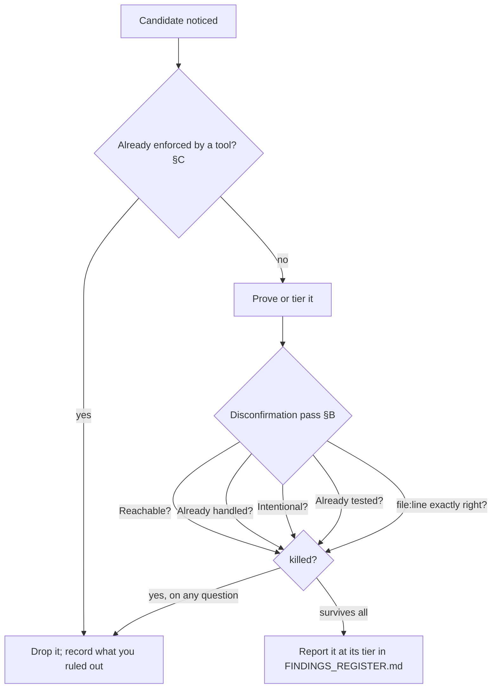

# Technique: The Disconfirmation Pass

> A reusable how-to for one move in the rigor methodology: before you report a
> candidate finding, actively try to **kill it**. Only survivors get written
> down. This is the single highest-leverage filter against false positives.

## Exec summary (stop here if that is all you need)

You have a candidate — a place in the code that *looks* like a bug or a real
quality defect. Do not report it yet. Run it through five questions, each of
which tries to disprove the finding:

1. **Reachable?** — Is the triggering path actually reached, shown by demonstrated
   impact, not theory?
2. **Already handled?** — Does a caller, wrapper, middleware, framework, or the
   type system already neutralize it?
3. **Intentional?** — Is this a deliberate choice (documented, commented, or
   contractually fine)?
4. **Already tested?** — Does an existing test already cover this exact behavior?
5. **`file:line` exactly right?** — Does the cited location still point at this
   code on the current tree, or has the line drifted / the code moved?

If the candidate dies on any question, drop it and record what you ruled out. If
it survives all five, report it — and the tier it survives at (`CONFIRMED` /
`PROBABLE` / `SPECULATIVE`) follows directly from *how* it survived.

Before any of this, one rule from **§C (ground truth first)** gates the whole
pass: **never re-flag what a deterministic tool already enforces.** Run the
linter, type-checker, test suite, and any SAST first and treat their output as
fact; if a tool already owns the class, the candidate adds zero signal. This is
not one of the five §B questions — it is the prior reconciliation step every
candidate clears before the pass even begins.

This pass is mandatory in rigor: the five questions are codified in
[`plugins/rigor/CONVENTIONS.md`](../../plugins/rigor/CONVENTIONS.md) **§B**, the
ground-truth rule in **§C**, and every hunting skill — `/rigor:bug-hunt`,
`/rigor:quality-scan`, `/rigor:deep-review` — runs them before anything reaches
the `FINDINGS_REGISTER.md`. The rest of this page is the depth: each question, why
it kills false positives, and two fully worked candidates (one killed, one
surviving to `CONFIRMED`).

---

## Where this sits

The disconfirmation pass is the gate between *noticing* something and *reporting*
it. In the flagship hunt it is its own phase — `/rigor:bug-hunt` calls **Phase 3
— Prove, then disconfirm** "the differentiator." The order matters: you prove a
candidate (or tier it down if you cannot), *then* you try to kill it. Proving
tells you how strong the evidence is; disconfirming tells you whether the finding
is real at all.

It is deliberately adversarial. A fire-hose audit *asserts* findings; rigor
*attacks its own candidates first* and only keeps what stands. The cost is that
you report fewer things. The payoff is that the things you report are real.



---

## The five questions in depth

Each question is a way the candidate can be a false positive. Run all five — a
candidate can survive four and die on the fifth.

### 1. Is it reachable — by demonstrated impact, not theory?

A bug on a path nothing reaches is not a bug. Ask: under what preconditions does
control actually arrive here, and can you show those preconditions occur? Rank by
**demonstrated blast radius**, not theoretical severity
([CONVENTIONS](../../plugins/rigor/CONVENTIONS.md) **§D**). A `CONFIRMED` crash on
a hot path outranks a `PROBABLE` edge case behind three feature flags; a defect
on genuinely dead code is downgraded or dropped. "It *could* happen if a caller
passed `null`" is theory — show a caller that does, or that one realistically
can.

### 2. Is it already handled by a caller, wrapper, framework, or type?

The defect may be real *in isolation* but neutralized one layer out. Before
reporting, look outward: does a caller validate the input first? Does a wrapper or
middleware catch the error? Does the framework guarantee the precondition? Does
the type system make the bad state unrepresentable? If any of these already
defends the code, the finding dies. This is the most common reason a plausible
candidate is a false positive.

### 3. Is it intentional?

Not every surprising thing is a bug. A documented edge case, a commented-on
trade-off, a contract that explicitly allows the behavior — these are decisions,
not defects. Read the surrounding comments, the docstring, the linked spec, and
the tests that pin the behavior. If the code does exactly what it is documented
to do, you have a design question (raise it as such), not a bug to report.

### 4. Is it already tested?

If an existing test already exercises and asserts this exact behavior, the
"finding" is either already known-and-accepted or it would already be failing. A
green test over the behavior is evidence *against* your candidate — reconcile with
it rather than reporting around it. (If the test is weak — it executes the code
but asserts nothing meaningful — that is a *separate* test-integrity finding, not
a reason to silently re-report the original.)

### 5. Is the `file:line` exactly right on the current code?

A finding that points at the wrong location is not actionable — and often is not
real. Re-resolve the cited `file:line` against the current tree: has the line
drifted since you first noticed it, has the function moved or been refactored,
does the snippet you are describing still live exactly there? If you cannot point
at the defect on the current code, you have not found it
([CONVENTIONS](../../plugins/rigor/CONVENTIONS.md) **§E**). A stale or
approximate location is a self-disconfirmation: fix the coordinate before
reporting, or drop the candidate.

---

## The prior step: ground truth first (§C)

Before the five questions run at all, one rule from
[CONVENTIONS](../../plugins/rigor/CONVENTIONS.md) **§C** gates every candidate:
**never re-flag what a deterministic tool already enforces.** Ground truth comes
first — the linter, type-checker, test suite, and any SAST are run and treated as
fact. If the type-checker would already reject this, or the linter rule already
bans it, the model adds zero signal by repeating it — and *padding the register
with tool-owned findings is exactly the noise rigor exists to eliminate*.
Reconcile every candidate against the tools: **agree, contradict, or extend.**
Never contradict a green tool without a repro that proves it wrong. This is a §C
reconciliation, not the §B disconfirmation pass — but it kills candidates before
they ever reach the five questions, so it belongs here.

---

## How disconfirmation feeds the evidence tier

Surviving the pass is necessary but not sufficient — it tells you the finding is
*real*, the tier tells you *how sure you are* (see
[`evidence-and-tiers`](../handbook/05-evidence-and-tiers.md) and
[CONVENTIONS](../../plugins/rigor/CONVENTIONS.md) **§A**):

- **CONFIRMED** — you reproduced it (a failing test, runnable repro, or executed
  trace on the current code) *and* it survived disconfirmation. Only `CONFIRMED`
  items may drive an automated fix.
- **PROBABLE** — it survived disconfirmation on **two independent lines of static
  evidence** but you have not executed a repro. Needs a repro or human
  confirmation before fixing.
- **SPECULATIVE** — a single weak signal that you could not kill outright but also
  could not strengthen. Explicitly low-confidence; never presented as fact.

When unsure between tiers, pick the lower one. Labeling a guess `CONFIRMED` is the
cardinal sin.

---

## Worked example A — a candidate that gets killed

**Candidate:** In `src/cart/discount.ts:42`, `applyCoupon(code)` indexes
`COUPONS[code]` and then reads `.percentOff` without a null check. If `code` is an
unknown coupon, `COUPONS[code]` is `undefined` and reading `.percentOff` throws —
a crash on checkout.

Run the pass:

| Question | Finding |
| --- | --- |
| **Reachable?** | The checkout route does call `applyCoupon`. So far, alive. |
| **Already handled?** | The route handler one layer out validates `code` against `Object.keys(COUPONS)` and returns a 400 *before* calling `applyCoupon`. An unknown code never reaches line 42. |
| Intentional? | (not reached) |
| Already tested? | (not reached) |
| `file:line` exactly right? | (not reached) |

**Verdict: killed on question 2.** The defect is neutralized by the caller's
validation; the unreachable branch has no demonstrated impact (**§D**). It is not
reported. The register records the disconfirmation — *"ruled out: caller validates
`code` against `COUPONS` keys and 400s before `applyCoupon`; line 42 unreachable
for unknown codes"* — so the next hunter does not re-derive and re-flag it.

---

## Worked example B — a candidate that survives to CONFIRMED

**Candidate:** In `src/billing/proration.ts:88`, `prorate(amount, days)` computes
`Math.floor(amount * days / period)`. When `period` is `0` (a same-day plan
change), this divides by zero and returns `NaN`, which is then written to the
invoice total.

Run the pass:

| Question | Finding |
| --- | --- |
| **Reachable?** | Same-day plan changes set `period = 0`; the upgrade flow calls `prorate` with that value. A trace from the upgrade endpoint reaches line 88 with `period === 0`. Alive. |
| **Already handled?** | No caller guards `period`; no wrapper sanitizes the result; the return type is `number`, which `NaN` satisfies, so the type system does not catch it. Alive. |
| **Intentional?** | No comment, docstring, or spec sanctions a `NaN` total. Same-day proration is a documented product feature, so a `NaN` is clearly a defect, not a choice. Alive. |
| **Already tested?** | The proration tests cover `period > 0` only; no test exercises `period === 0`. Alive. |
| **`file:line` exactly right?** | `prorate` still lives at `src/billing/proration.ts:88` on the current tree, and line 88 is the `Math.floor(amount * days / period)` expression. The coordinate resolves. Alive. |

(Ground truth was cleared first per **§C**: the linter and type-checker are green
and say nothing about division-by-zero here — `NaN` is a valid `number` — and no
SAST rule covers it, so there is no tool-owned finding to re-flag.)

It survives all five. Now strengthen it: write a test that calls `prorate(1000, 0)`
and asserts a finite total — it **fails on the current code** (returns `NaN`). That
failing repro on the current tree makes it **CONFIRMED** (**§A**).

**Verdict: reported as `CONFIRMED`.** It lands in `FINDINGS_REGISTER.md` with the
full schema (**§6**): tier, the repro test name as proof, `file:line`, root cause,
a sibling sweep for other unguarded divisors, reachability preconditions,
demonstrated impact, and the disconfirmation record above. Being `CONFIRMED`, it is
eligible for the fix–prove–guard loop (**§8**) under the chosen automation level.

---

## A reusable checklist

Copy this into your working notes for any candidate:

```
Candidate: <one line> @ <file:line>

§C gate first → already enforced by a tool? (linter/types/SAST): ______
  (if yes, stop — never re-flag a tool-owned finding)

§B five questions:
[ ] Reachable?      preconditions: ______  demonstrated by: ______
[ ] Already handled? caller / wrapper / middleware / framework / type: ______
[ ] Intentional?     comment / docstring / spec / contract says: ______
[ ] Already tested?  covering test (and is it a strong assertion?): ______
[ ] file:line right? re-resolved on current tree (line/func not drifted): ______

Outcome: [ killed on Q__ ]  /  [ survives ]
If survives → tier: CONFIRMED (repro: ______) / PROBABLE (2 evidence lines: ______) / SPECULATIVE
Ruled out (record even if killed): ______
```

Record the ruled-out reasoning **even when the candidate dies** — that note is what
stops the same false positive from being re-derived on the next pass.

---

## Related

- [`05-evidence-and-tiers.md`](../handbook/05-evidence-and-tiers.md) — the tier this
  pass assigns once a finding survives.
- [`reading-a-findings-register.md`](reading-a-findings-register.md) — where
  survivors are recorded and how to read them.
- [`choosing-an-automation-level.md`](choosing-an-automation-level.md) — what a
  `CONFIRMED` survivor is allowed to trigger automatically.
- [`plugins/rigor/CONVENTIONS.md`](../../plugins/rigor/CONVENTIONS.md) — **§A**
  tiers, **§B** the disconfirmation pass (the five questions), **§C** ground-truth /
  never re-flag a tool, **§D** reachability, **§E** evidence standard / `file:line`,
  **§6** finding schema, **§8** the fix–prove–guard loop.
- Skills that run this pass: `/rigor:bug-hunt`, `/rigor:quality-scan`,
  `/rigor:deep-review`.

*Verified-at: c2b37e9*
