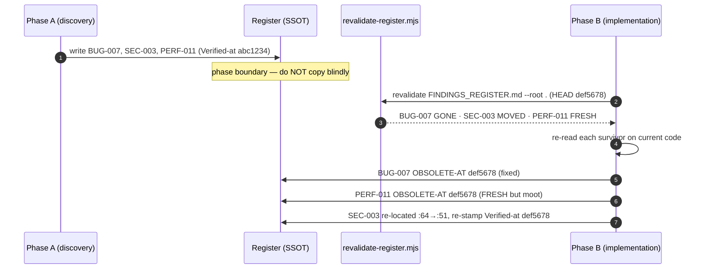

# Technique — Carrying a Register Across a Phase Boundary

> Companion to [Registers and freshness](../handbook/04-registers-and-freshness.md), which defines the register schema, the tracks, `Verified-at`, and `revalidate-register.mjs` in full. This page is the narrow how-to: what to *do* at the moment one phase hands a register to the next.

## Exec summary (stop here if you only need the move)

A **register** is a live backlog — one stable ID per item, every item cited at `file:line`, every item stamped `Verified-at: <sha>`. The dangerous moment is the **phase boundary**: when a discovery phase hands its register to an implementation phase, or when a later run picks up an older register. Copying an item forward unchanged is the bug this whole apparatus guards against — **a register re-listing an item already fixed in code** gets that item re-ranked, re-shown, and worked a second time.

So "carry forward" never means "copy." It means **re-validate, then carry forward what survives**:

1. **Run the mechanical pre-filter** — `node scripts/revalidate-register.mjs <register> --root <repo>`. It re-greps every cited `file:line` (and any delimited `Anchor:` substring) and labels each item `FRESH` / `MOVED` / `DRIFTED` / `GONE` / `AMBIGUOUS` / `NO-REF`.
2. **Re-read the survivors.** `FRESH` means the location still exists, **not** that the defect is still there. Confirm each by reading the current code.
3. **Re-triage the rest.** A `MOVED` item gets re-located and re-stamped; an item that was fixed gets stamped **`OBSOLETE-AT <sha>`** and is never re-ranked again.
4. **Re-stamp `Verified-at`** on every item you carried, with the sha you confirmed it on.

The IDs stay stable across all of this — that is what lets two phases talk about the same item, and lets a commit reference exactly what it closed.

---

## 1 · Why re-validation, not copy-paste

The failure mode is stated at the top of `scripts/revalidate-register.mjs` itself:

> registers are live backlogs … The proven field failure is a register that re-lists items already fixed in code — stale findings get re-ranked and re-shown.

A register written in phase A reflects the tree *at phase A's sha*. By the time phase B reads it, earlier fixes in the same run may have already resolved some items, code may have shifted, files may have moved or been deleted. An item carried forward blindly is an assertion about code that may no longer be true. The skills enforce this at every consuming boundary — `code-ops-suite:remediation`, `rigor:fix-verified`, `privacy-opsec-suite:opsec-hardening`, and the researcher publish steps all run the pre-filter and re-confirm before acting (see their `SKILL.md` files).

The rule, verbatim from code-ops [CONVENTIONS §12](../../plugins/code-ops-suite/CONVENTIONS.md): *re-validate before you write, carry forward, or act.*

---

## 2 · A synthetic register, evolving over two phases

Below is a small `FINDINGS_REGISTER.md` (neutral stack, values redacted per the secrets rail). Watch three items cross one phase boundary three different ways.

### Phase A — discovery writes the register (anchored at `abc1234`)

```markdown
# FINDINGS_REGISTER.md  ·  Verified-at: abc1234

## BUG-007 · Cart total ignores per-item discount on re-add
- Tier: CONFIRMED   Track: NOW-SAFE
- Location: src/checkout/cart.ts:142
- Verified-at: abc1234
- Evidence: failing test `cart.spec.ts › re-adding a discounted item double-counts price`

## SEC-003 · Session cookie missing SameSite on the legacy login route
- Tier: PROBABLE   Track: NEEDS-REVIEW
- Location: src/auth/legacy-login.ts:64
- Verified-at: abc1234
- Evidence: cookie set without `SameSite`; route reachable from the public router (router.ts:30)

## PERF-011 · N+1 query loading order history
- Tier: SPECULATIVE   Track: NEEDS-DESIGN
- Location: src/checkout/cart.ts:88
- Verified-at: abc1234
- Evidence: suspected from a slow-page report; no profile captured yet
```

Three items, three stable IDs, all stamped `Verified-at: abc1234` — the discovery sha.

### Between phases — the implementation phase fixes `BUG-007`

The fixer lands `BUG-007` at sha `def5678`. The fix recomputes the line total inside `addItem` and, as a side effect, replaces the order-history loop near `cart.ts:88` with an eager load — which incidentally moots `PERF-011`. The fix also grows `legacy-login.ts`, so the previously-cited line 64 is no longer the cookie line. **None of this has touched the register yet.** That is the trap: the register still says all three items are live at line numbers from `abc1234`.

### Phase B — re-validate at the boundary

Phase B does **not** read the register and act. It runs the pre-filter first.

```sh
node scripts/revalidate-register.mjs docs/code-ops-run/2026-06-22/FINDINGS_REGISTER.md --root .
```

Output (`HEAD` is now `def5678`):

```
# docs/code-ops-run/2026-06-22/FINDINGS_REGISTER.md  (HEAD def5678)
  !! GONE      BUG-007  — src/checkout/cart.ts missing; Verified-at abc1234 != HEAD def5678 — re-confirm
  !! MOVED     SEC-003  — src/auth/legacy-login.ts:64 > 51 lines; Verified-at abc1234 != HEAD def5678 — re-confirm
  ok FRESH     PERF-011  — Verified-at abc1234 != HEAD def5678 — re-confirm

3 item(s), 2 needing re-triage.
```

(Illustrative, given the edits above: `cart.ts` was renamed/relocated so its literal path is gone — reported `GONE`; `legacy-login.ts` shrank so line 64 is now out of range — `MOVED`; `PERF-011`'s cited `cart.ts:88` still exists and is in range — `FRESH`. The non-gating `Verified-at … != HEAD` advisory fires on all three because every item was last confirmed against `abc1234`.)

Read that report carefully — the statuses are a starting point, not a verdict:

- **`PERF-011` reports `FRESH`** even though the fix made it moot. This is the whole reason re-reading survivors is mandatory: `FRESH` is a *location* check, not a *defect* check. The cited line still exists; the N+1 it described does not. A blind carry-forward would re-rank a non-problem.
- **`BUG-007` reports `GONE`** — its cited file is gone from the tree (it was relocated and the eager-load fix landed). `GONE` is the signal to verify and, if resolved, retire it.
- **`SEC-003` reports `MOVED`** — the file exists but the code shifted, so the cited line no longer points at the cookie.

### Phase B — re-triage and re-stamp

Now act on the report, item by item:

- **`PERF-011` (FRESH but moot):** re-read `cart.ts:88` on `def5678` — the loop is gone, replaced by an eager load. Stamp it **`OBSOLETE-AT: def5678`** with the reason inline. It stays in the file for traceability but is permanently excluded from re-ranking.
- **`BUG-007` (GONE, resolved):** confirm the fix shipped (its failing test now passes). Stamp **`OBSOLETE-AT: def5678`**.
- **`SEC-003` (MOVED, still real):** re-locate the cookie line on the current tree, update `Location` to the new `file:line`, re-confirm the cookie still lacks `SameSite`, and re-stamp `Verified-at: def5678`. It survives carry-forward — now with an accurate citation.

The carried-forward register at the end of phase B:

```markdown
# FINDINGS_REGISTER.md  ·  Verified-at: def5678

## BUG-007 · Cart total ignores per-item discount on re-add
- Tier: CONFIRMED   Track: NOW-SAFE
- Location: src/checkout/cart.ts:142
- Verified-at: abc1234
- OBSOLETE-AT: def5678 — fixed; `cart.spec.ts › re-adding a discounted item double-counts price` now passes

## SEC-003 · Session cookie missing SameSite on the legacy login route
- Tier: PROBABLE   Track: NEEDS-REVIEW
- Location: src/auth/legacy-login.ts:51        # re-located from :64
- Verified-at: def5678                          # re-confirmed on current code
- Evidence: cookie set without `SameSite`; route reachable from the public router (router.ts:30)

## PERF-011 · N+1 query loading order history
- Tier: SPECULATIVE   Track: NEEDS-DESIGN
- Location: src/checkout/cart.ts:88
- Verified-at: abc1234
- OBSOLETE-AT: def5678 — superseded by the eager-load added in BUG-007's fix; re-profile if it recurs
```

The IDs never changed. Two items were retired (one fixed, one mooted), one survived with a corrected location and a fresh stamp. **That** is carry-forward.



---

## 3 · The six statuses, and what each means for carry-forward

`revalidate-register.mjs` assigns exactly one status per item (definitions from the script header):

| Status | Meaning | Carry-forward action |
|---|---|---|
| **FRESH** | Every cited `file:line` still exists and is in range. | Re-read to confirm the defect survives, then carry it. `FRESH` is a floor, not proof — `PERF-011` above was `FRESH` and already moot. |
| **MOVED** | The cited line is out of range — at the original path, or at a path found by name-search after the original was gone. | Re-locate on current code, update `Location`, re-stamp `Verified-at`. |
| **DRIFTED** | The cited line still exists but no longer contains the item's `Anchor:` substring (checked only when the item carries a backtick- or quote-delimited `Anchor:`). | The citation is stale or hallucinated — re-locate on the current tree and re-tier, or drop. |
| **GONE** | A cited file no longer exists anywhere in the tree. | Likely resolved or relocated — verify, then `OBSOLETE-AT <sha>` if fixed, or re-point if it merely moved with no single name match. |
| **AMBIGUOUS** | The literal path is gone but >1 file matches its bare name, or a reference escapes the repo root. | The script refuses to guess. Resolve by hand, then fix the `Location` so the next run is unambiguous. |
| **NO-REF** | The item cites no `file:line` — nothing to auto-check. | Add a citation or verify by hand; an uncited finding is not yet actionable. |

A non-gating **advisory** also fires when an item's `Verified-at` sha is present and differs from `HEAD`: the report appends `Verified-at <sha> != HEAD <sha> — re-confirm`. It does not change the status — the cited lines may be untouched — but it tells you the item was last confirmed against older code, which is exactly the carry-forward signal. A second advisory fires when an item's `Anchor:` value is not backtick- or quote-delimited: it is unparseable, so its `DRIFTED` check is skipped — fix the delimiter rather than trusting the plain line-existence result.

**Exit behavior, and the gate.** The script exits non-zero if any item is `MOVED` / `DRIFTED` / `GONE` / `AMBIGUOUS` / `NO-REF` — so it can gate a CI step or a skill's phase boundary. Pass `--report-only` to print the report and always exit zero (informational, no gate). The `--root <repo>` flag points it at the tree to check against (defaults to the current directory); a reference that escapes the root is reported `AMBIGUOUS` rather than stat-ed, by design.

> The script resolves moved files by name: if a finding cites `auth/session.ts:88`, that exact path is gone, and a single `session.ts` exists elsewhere, it reports against the relocated file instead of falsely declaring `GONE`. More than one match → `AMBIGUOUS`. This is why a renamed-but-shrunk file can surface as `MOVED` rather than `GONE`.

---

## 4 · The discipline in four lines

```sh
# 1. mechanical pre-filter at the boundary
node scripts/revalidate-register.mjs <register> --root <repo>
# 2. re-read every FRESH/MOVED survivor on the current code
# 3. drop fixed/mooted items: stamp `OBSOLETE-AT <sha>` (never delete — keeps history auditable)
# 4. re-stamp Verified-at <sha> on everything carried forward
```

`OBSOLETE-AT` is load-bearing: it permanently excludes an item from re-ranking and re-showing while leaving it in the file for traceability, so the same finding cannot resurface in a later phase. Deleting the entry would lose that guard.

For the full register schema, the three tracks (`NOW-SAFE` / `NEEDS-REVIEW` / `NEEDS-DESIGN`), the always-gated rails, and how all four plugins share this backbone, see [Registers and freshness](../handbook/04-registers-and-freshness.md). For reading and prioritizing a populated register, see [Reading a findings register](reading-a-findings-register.md).

*Verified-at: a181b36*
