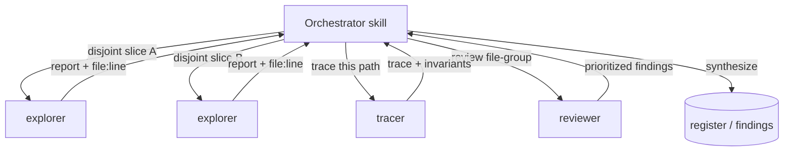

# Subagent trade-offs

The skills in this suite rarely do their work in a single thread. When a task has independent parts — several areas to map, several diffs to review, several claims to check — a skill *fans out*: it spawns scoped **subagents**, each with its own context window and its own narrow tools, and synthesizes their reports. This page is a short how-to: which subagents exist, when a skill fans out to them, and the trade-offs you are buying when it does.

## The short version

A subagent is a worker the orchestrator spawns with a precise question and a minimal toolset. It runs in an isolated context and hands back a tight, evidence-cited report; the orchestrator merges those reports. The suite ships eight of them, and they split cleanly into two kinds:

| Kind | Agents | Tools | Fan-out rule |
| --- | --- | --- | --- |
| **Read-only** — investigate, never change anything | code-ops `explorer`, rigor `tracer`, privacy-opsec `explorer`, researcher `gatherer`, researcher `claim-checker`, code-ops `reviewer`, privacy-opsec `privacy-reviewer` | `Read, Grep, Glob` (the two reviewers add `Bash` for read-only checks) | Parallelize freely over disjoint areas. |
| **Write / execute** — produce artifacts or run code | rigor `verifier` | `Read, Grep, Glob, Bash, Write` | Used carefully, on disjoint files, and never editing the source under evaluation. |

The single rule that governs all of them lives in code-ops-suite [`CONVENTIONS.md` §1](../../plugins/code-ops-suite/CONVENTIONS.md): **read-only analysis parallelizes freely; anything that edits code runs in parallel only on disjoint file sets, and work touching shared files or dependency edges is serialized.** Every subagent grounds its report in `file:line` evidence ([§9](../../plugins/code-ops-suite/CONVENTIONS.md)) and the orchestrator keeps developer-in-the-loop control — the subagents report, the orchestrator decides.

If you read nothing else: the suite uses *several* read-only agents in parallel over disjoint areas to move fast, and reserves the one writing/executing agent for careful, isolated use. The cost it pays for that parallelism is covered in [09 · Cost and scoping](../handbook/09-cost-and-scoping.md).

---

## Why fan out at all

Two reasons, both about getting a better answer for the same wall-clock time.

**Context isolation.** Each subagent gets a fresh, narrow context: one question, the files relevant to it, nothing else. A `tracer` chasing a single data-flow path is not distracted by the twelve other files in the run, and its findings do not crowd the orchestrator's context with raw search output. The orchestrator sees only the *report* — dense and skimmable, as every agent definition requires — not the hundred reads that produced it. That keeps the synthesizing thread clear-headed on large codebases.

**Parallel coverage.** Independent questions run at once. Mapping a 40-file subsystem is four explorers over four disjoint slices, not one explorer reading 40 files in series. Reviewing a large diff is several `reviewer`s over disjoint file-groups. The orchestrator runs an adaptive loop — *assess → plan units of work → fan out → collect → decide to deepen/broaden/converge → repeat* ([§1](../../plugins/code-ops-suite/CONVENTIONS.md)) — and fan-out is how each round covers breadth without going serial.

The trade-off is real: every subagent is a fresh context that must be primed with its scope, so it adds token cost and a little coordination overhead. Fan-out pays off when the parts are genuinely independent and each is substantial enough to be worth a dedicated worker. For one small question, a direct read in the main thread is cheaper. See [09 · Cost and scoping](../handbook/09-cost-and-scoping.md) for how the suite decides.

---

## The read-only agents — parallelize freely

These seven never edit and (with the noted exception) never execute. Because they cannot change the tree, two of them touching the same file is harmless — so the orchestrator spawns as many as the work warrants, over whatever slices it likes, all at once.

**Mappers and tracers** (`Read, Grep, Glob`, no `Bash`):

- **code-ops `explorer`** (model: `haiku`) — fast structural investigation: map structure, locate definitions and call-sites, trace flow, gather context. The definition explicitly says *"Use several in parallel to cover disjoint areas of a large codebase."*
- **rigor `tracer`** (model: `opus`) — bug-hunting investigator. Traces one control- or data-flow path end-to-end hop by hop, derives the invariants/contracts a piece of code must uphold, or finds every site of a concept. Distinguishes what it *verified by reading* from what it *infers*.
- **privacy-opsec `explorer`** (model: `haiku`) — leak-aware mapper. Finds egress paths, logging/telemetry, identifier/session handling, metadata sources, and proxy-bypass paths. Reports patterns, not values, and redacts identifiers/IPs.
- **researcher `gatherer`** (model: `haiku`) — sources evidence from the codebase, version-control history, and installed-dependency docs. It **never reaches the network** — web sourcing is orchestrated at the skill level under the egress manifest, so a gatherer that needs a web source hands the gap back rather than fetching it.

**Reviewers and checkers** — still read-only on the source, but doing judgment work:

- **code-ops `reviewer`** (model: `opus`, tools add `Bash`) — skeptical review of a specific diff/file/file-group, returning findings grouped **Blocking / Should-fix / Nit**. Its `Bash` is for *read-only verification only* (run the existing tests or a linter); it does not modify or commit.
- **privacy-opsec `privacy-reviewer`** (model: `opus`, tools add `Bash`) — the same shape, but against the anonymity & opsec model: a new egress path, a new identifier vector, a weakened default, and similar are flagged **Blocking**. `Bash` is likewise read-only.
- **researcher `claim-checker`** (model: `sonnet`) — adversarial verifier. Given one load-bearing claim, it tries to *kill* it against the actual code and the cited sources, then returns **SUPPORTED / PARTIAL / UNSUPPORTED** with an evidence tier. Used one per claim, in parallel.

Because none of these write, the orchestrator can run, say, four code-ops `explorer`s and two `reviewer`s concurrently with no conflict risk. The `reviewer`s' `Bash` is the only nuance: it runs read-only commands (a test suite, a linter), so two reviewers running tests at once is a resource question, not a correctness one.

---

## The write/execute agent — used carefully

One agent in the suite can write files and run arbitrary commands: **rigor `verifier`** (model: `opus`, tools `Read, Grep, Glob, Bash, Write`). It exists so that **CONFIRMED** means something — given one candidate finding, it writes the smallest repro/test that would fail if the bug is real, runs it, observes the actual output, and assigns the tier accordingly (covered in [the disconfirmation pass](disconfirmation-pass.md)).

Its extra power is fenced by hard rules in the agent definition:

- **It never edits the source under evaluation.** Repro and scratch files go to a temp or test location, kept clearly separate. `Bash` and `Write` are *for repros, tests, and benchmarks only*, and it does not commit.
- **It reports only what it actually ran** — the real command and real output, never a claimed result. A candidate it could not reproduce is reported as PROBABLE/SPECULATIVE, not quietly upgraded.

So even the one writing agent is, in practice, write-isolated from the code being judged. When a skill needs *multiple* verifiers, the fan-out rule from [§1](../../plugins/code-ops-suite/CONVENTIONS.md) applies in full: give each one a **disjoint** repro target so their artifacts cannot collide, and serialize anything that would touch a shared file. This is the same conflict-aware discipline the suite applies to any code-editing fan-out — read-only work parallelizes freely; writing/executing work is parallel only across disjoint files, serial otherwise.

---

## How a skill actually fans out

Putting it together, a typical pattern over a large area:

1. **Broaden, read-only.** Spawn several mappers in parallel over disjoint slices — code-ops `explorer`s for structure, a privacy-opsec `explorer` for leak surfaces, a rigor `tracer` for a suspect path. They run at once because none of them writes.
2. **Synthesize.** The orchestrator merges the reports into a candidate picture, all evidence carrying `file:line` ([§9](../../plugins/code-ops-suite/CONVENTIONS.md)).
3. **Deepen, carefully.** For each load-bearing candidate, dispatch the right judge: `reviewer`/`privacy-reviewer` for a diff slice, `claim-checker` for a research claim, or a `verifier` to prove-or-kill by execution — the verifier on a disjoint repro target.
4. **Decide.** The orchestrator, not the subagents, records the result and stays developer-in-the-loop.

The skill chooses *how many* and *over what slices* based on the size and independence of the work — which is a cost-and-scoping judgment, not a fixed recipe.

## Related

- [09 · Cost and scoping](../handbook/09-cost-and-scoping.md) — the token cost of fan-out and how the suite decides how wide to go.
- [The disconfirmation pass](disconfirmation-pass.md) — what the `verifier` and `claim-checker` do to earn (or kill) a tier.
- [05 · Evidence and tiers](../handbook/05-evidence-and-tiers.md) — the `file:line` evidence and CONFIRMED/PROBABLE/SPECULATIVE tiers every subagent reports against.
- [03 · Orchestrators](../handbook/03-orchestrators.md) — the full-sweep skills that drive the fan-out loop.

*Verified-at: c2b37e9*
